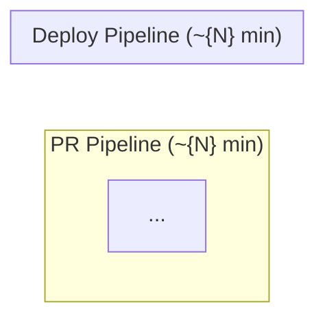

# CI/CD Pipeline Output Template

This is the expected structure for `cicd-pipeline-draft.md` output. Follow this exactly.

---

```markdown
# CI/CD Pipeline: {Project Name}

> **Project**: {Project Name}
> **Version**: {1.0}
> **Date Created**: {YYYY-MM-DD}
> **Last Updated**: {YYYY-MM-DD}
> **Status**: Draft
> **Author**: AI-Generated
> **Source**: Derived from `dev-workflow-final.md`, `test-strategy-final.md`, `tech-stack-final.md`

{If refine mode, include Change Log here}

---

## 1. Pipeline Overview

**CI/CD Platform**: {GitHub Actions / GitLab CI / Jenkins / etc.} {confidence marker}

**Trigger Strategy**:

| Trigger Event | Pipeline Type | Description |
|--------------|--------------|-------------|
| Pull request opened/updated | PR Pipeline | {description} |
| Merge to main | Deploy Pipeline | {description} |
| Release tag pushed | Release Pipeline | {description} |
| Scheduled (cron) | Scheduled Pipeline | {description} |

**Pipeline Architecture**:



---

## 2. Pipeline Stages

### STG-{NNN}: {Stage Name}

| Field | Value |
|-------|-------|
| **ID** | STG-{NNN} |
| **Stage Name** | {name} |
| **Pipeline** | PR / Deploy / Both |
| **Trigger** | {event that starts this stage} |
| **Steps** | {numbered list of commands/actions} |
| **Environment** | {runner OS, runtime version} |
| **Timeout** | {N} min |
| **Gate Type** | Blocking / Advisory |
| **Artifacts** | {outputs produced, if any} |
| **Failure Action** | {what happens on failure: block PR, notify, rollback} |
| **Confidence** | {marker + annotation} |

{Repeat for each stage}

### Stage Summary

| ID | Stage | Pipeline | Duration | Gate | Confidence |
|----|-------|----------|----------|------|------------|
| STG-001 | {name} | {type} | {N} min | {type} | {marker} |
| ... | ... | ... | ... | ... | ... |

---

## 3. Build Configuration

### Dockerfile

```dockerfile
{Multi-stage Dockerfile or build configuration}
```

**Confidence**: {marker + annotation}

### Build Caching

| Cache Type | Target | Key Strategy | Est. Savings |
|------------|--------|-------------|-------------|
| {type} | {what is cached} | {cache key} | {time saved} |

### Artifact Storage

| Artifact | Storage | Retention | Confidence |
|----------|---------|-----------|------------|
| {artifact type} | {registry/storage} | {retention policy} | {marker} |

### Version Tagging

| Tag Format | Example | When Applied |
|------------|---------|-------------|
| {format} | {example} | {trigger} |

---

## 4. Deployment Strategies

### {Environment Name}

| Field | Value |
|-------|-------|
| **Environment** | {Staging / Production / etc.} |
| **Strategy** | {Rolling / Blue-Green / Canary / Feature Flags} |
| **Justification** | {why this strategy for this environment} |
| **Health Check** | {endpoint, interval, threshold} |
| **Rollback Trigger** | {condition that triggers rollback} |
| **Rollback Action** | {automated/manual, steps} |
| **Confidence** | {marker + annotation} |

{Repeat for each environment}

### Deployment Summary

| Environment | Strategy | Rollback Speed | Cost Impact | Confidence |
|-------------|----------|---------------|-------------|------------|
| {env} | {strategy} | {instant/fast/slow} | {none/low/high} | {marker} |

---

## 5. Security Pipeline

### Scanning Tools

| Scan Type | Tool | Stage | Gate Type | Threshold | Confidence |
|-----------|------|-------|-----------|-----------|------------|
| Dependency Scan | {tool} | {stage ref} | {Blocking/Advisory} | {severity threshold} | {marker} |
| Container Scan | {tool} | {stage ref} | {Blocking/Advisory} | {severity threshold} | {marker} |
| Secret Detection | {tool} | {stage ref} | {Blocking/Advisory} | Any match | {marker} |
| SAST | {tool} | {stage ref} | {Blocking/Advisory} | {severity threshold} | {marker} |
| DAST | {tool} | {stage ref} | {Blocking/Advisory} | {severity threshold} | {marker} |

### Secret Management

| Secret | Provider | Injection Method | Rotation |
|--------|----------|-----------------|----------|
| {secret name/type} | {GitHub Secrets / Vault / etc.} | {env var / file mount} | {frequency} |

---

## 6. Pipeline Performance

### Duration Targets

| Pipeline Type | Target | Estimated Actual | Status |
|--------------|--------|-----------------|--------|
| PR Pipeline | < {N} min | ~{N} min | {Met / At Risk / Exceeded} |
| Deploy Pipeline | < {N} min | ~{N} min | {Met / At Risk / Exceeded} |

### Parallelization

| Parallel Group | Stages | Combined Duration |
|---------------|--------|------------------|
| {group name} | {stages that run in parallel} | {max of parallel durations} |

### Caching Strategy

| Cache | Implementation | Est. Time Saved | Confidence |
|-------|---------------|----------------|------------|
| {cache type} | {how implemented} | {minutes saved} | {marker} |

### Cost Estimation

| Item | Unit Cost | Monthly Usage | Monthly Cost | Confidence |
|------|-----------|--------------|-------------|------------|
| {CI/CD platform} | {per-minute cost} | {estimated minutes} | {total} | {marker} |
| {Artifact registry} | {storage cost} | {estimated storage} | {total} | {marker} |
| **Total** | | | **${total}** | |

---

## 7. Notification & Monitoring

### Build Notifications

| Event | Channel | Recipients | Confidence |
|-------|---------|------------|------------|
| {build failure / deploy success / etc.} | {Slack / email / etc.} | {team / individual} | {marker} |

### Pipeline Dashboards

| Dashboard | Platform | Metrics Tracked | Confidence |
|-----------|----------|----------------|------------|
| {dashboard name} | {tool} | {metrics} | {marker} |

---

## Q&A Log

### Pending

#### Q-{NNN} (related: STG-{NNN} or section)
- **Impact**: HIGH / MEDIUM / LOW
- **Question**: {specific question}
- **Context**: {why this matters}
- **Answer**:
- **Status**: Pending

### Answered -- refine mode only

---

## Readiness Assessment

| Metric | Value |
|--------|-------|
| Total items | {N} |
| ✅ CONFIRMED | {X} ({pct}%) |
| 🔶 ASSUMED | {Y} ({pct}%) |
| ❓ UNCLEAR | {Z} ({pct}%) |
| Q&A Pending | {P} (HIGH: {H}, MEDIUM: {M}, LOW: {L}) |

**Verdict**: {Ready / Partially Ready / Not Ready}
**Reasoning**: {1-2 sentences}

{If refine mode:}
**Comparison**: CONFIRMED {prev}% -> {current}% ({+/-}%), {N} Q&A resolved

---

{If refine mode, include Diff Summary here}

---

## Approval

| Role | Name | Date | Status |
|------|------|------|--------|
| DevOps Lead | | | Pending |
| Tech Lead | | | Pending |
| Engineering Manager | | | Pending |
```
