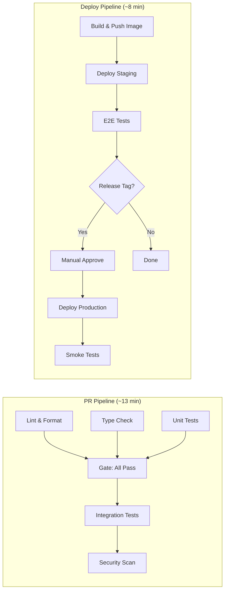

# CI/CD Pipeline: TaskFlow

> **Project**: TaskFlow
> **Version**: 1.0
> **Date Created**: 2026-04-06
> **Last Updated**: 2026-04-06
> **Status**: Draft
> **Author**: AI-Generated
> **Source**: Derived from `dev-workflow-final.md`, `test-strategy-final.md`, `tech-stack-final.md`

---

## 1. Pipeline Overview

**CI/CD Platform**: GitHub Actions ✅ CONFIRMED — Source: tech-stack-final.md specifies GitHub as source control and CI/CD platform.

**Trigger Strategy**:

| Trigger Event | Pipeline Type | Description |
|--------------|--------------|-------------|
| Pull request opened/updated | PR Pipeline | Run lint, typecheck, unit tests, integration tests, security scan (~13 min) |
| Merge to main | Deploy Pipeline | Build image, push to ECR, deploy staging, run E2E tests (~8 min) |
| Release tag pushed (`v*`) | Release Pipeline | Deploy to production with manual approval gate |
| Scheduled (daily 2 AM UTC) | Security Pipeline | Full DAST scan + dependency audit on staging |

**Pipeline Architecture**:



---

## 2. Pipeline Stages

### STG-001: Lint & Format

| Field | Value |
|-------|-------|
| **ID** | STG-001 |
| **Stage Name** | Lint & Format |
| **Pipeline** | PR |
| **Trigger** | Pull request opened or updated |
| **Steps** | 1. Checkout code 2. Install dependencies (cached) 3. Run `npx eslint . --max-warnings=0` 4. Run `npx prettier --check .` |
| **Environment** | Ubuntu 22.04, Node.js 20 |
| **Timeout** | 5 min |
| **Gate Type** | Blocking |
| **Artifacts** | None |
| **Failure Action** | Block PR merge, post lint errors as PR comment |
| **Confidence** | ✅ CONFIRMED — Source: dev-workflow-final.md specifies ESLint + Prettier as code quality tools |

### STG-002: Type Check

| Field | Value |
|-------|-------|
| **ID** | STG-002 |
| **Stage Name** | Type Check |
| **Pipeline** | PR |
| **Trigger** | Pull request opened or updated |
| **Steps** | 1. Checkout code 2. Install dependencies (cached) 3. Run `npx tsc --noEmit` |
| **Environment** | Ubuntu 22.04, Node.js 20 |
| **Timeout** | 5 min |
| **Gate Type** | Blocking |
| **Artifacts** | None |
| **Failure Action** | Block PR merge, post type errors as PR comment |
| **Confidence** | ✅ CONFIRMED — Source: tech-stack-final.md specifies TypeScript |

### STG-003: Unit Tests

| Field | Value |
|-------|-------|
| **ID** | STG-003 |
| **Stage Name** | Unit Tests |
| **Pipeline** | PR |
| **Trigger** | Pull request opened or updated |
| **Steps** | 1. Checkout code 2. Install dependencies (cached) 3. Run `npx jest --ci --coverage --testPathPattern=unit` 4. Upload coverage report to Codecov 5. Enforce coverage gate: lines >= 80% |
| **Environment** | Ubuntu 22.04, Node.js 20 |
| **Timeout** | 10 min |
| **Gate Type** | Blocking |
| **Artifacts** | Coverage report (HTML + lcov) |
| **Failure Action** | Block PR merge, post coverage summary as PR comment |
| **Confidence** | ✅ CONFIRMED — Source: test-strategy-final.md specifies Jest with 80% line coverage gate |

### STG-004: Integration Tests

| Field | Value |
|-------|-------|
| **ID** | STG-004 |
| **Stage Name** | Integration Tests |
| **Pipeline** | PR |
| **Trigger** | After lint, typecheck, and unit tests pass (gate) |
| **Steps** | 1. Checkout code 2. Install dependencies (cached) 3. Start test containers (PostgreSQL, Redis) via docker-compose 4. Run `npx jest --ci --testPathPattern=integration` 5. Tear down containers |
| **Environment** | Ubuntu 22.04, Node.js 20, Docker |
| **Timeout** | 15 min |
| **Gate Type** | Blocking |
| **Artifacts** | Test results (JUnit XML) |
| **Failure Action** | Block PR merge, post failure summary as PR comment |
| **Confidence** | ✅ CONFIRMED — Source: test-strategy-final.md specifies Jest + testcontainers for integration tests |

### STG-005: Security Scan

| Field | Value |
|-------|-------|
| **ID** | STG-005 |
| **Stage Name** | Security Scan |
| **Pipeline** | PR |
| **Trigger** | After integration tests pass |
| **Steps** | 1. Run `npm audit --audit-level=high` 2. Run `trivy fs --severity CRITICAL,HIGH .` 3. Run `gitleaks detect --source . --verbose` |
| **Environment** | Ubuntu 22.04, Node.js 20 |
| **Timeout** | 10 min |
| **Gate Type** | Blocking for CRITICAL/HIGH, Advisory for MEDIUM/LOW |
| **Artifacts** | Security scan reports (JSON) |
| **Failure Action** | Block PR merge for critical/high findings, warn on medium/low |
| **Confidence** | ✅ CONFIRMED — Source: test-strategy-final.md lists npm audit; 🔶 ASSUMED — Trivy and gitleaks inferred from security best practices |

### STG-006: Build & Push Image

| Field | Value |
|-------|-------|
| **ID** | STG-006 |
| **Stage Name** | Build & Push Image |
| **Pipeline** | Deploy |
| **Trigger** | Merge to main branch |
| **Steps** | 1. Checkout code 2. Configure AWS credentials (OIDC federation) 3. Login to Amazon ECR 4. Build Docker image (multi-stage, see Build Configuration) 5. Tag image with git SHA short + semver if release tag 6. Push image to ECR 7. Verify image in registry |
| **Environment** | Ubuntu 22.04, Docker BuildKit |
| **Timeout** | 10 min |
| **Gate Type** | Blocking |
| **Artifacts** | Docker image in ECR (`taskflow-api:{sha}`) |
| **Failure Action** | Fail pipeline, notify Slack #deployments channel |
| **Confidence** | ✅ CONFIRMED — Source: tech-stack-final.md specifies Docker + AWS ECR |

### STG-007: Deploy Staging

| Field | Value |
|-------|-------|
| **ID** | STG-007 |
| **Stage Name** | Deploy Staging |
| **Pipeline** | Deploy |
| **Trigger** | After successful image push (STG-006) |
| **Steps** | 1. Update ECS task definition with new image tag 2. Deploy ECS service (rolling update) 3. Wait for service stability (health check passes on all tasks) 4. Run smoke test against staging URL |
| **Environment** | AWS ECS Fargate (staging cluster) |
| **Timeout** | 10 min |
| **Gate Type** | Blocking |
| **Artifacts** | Deployment record (task definition revision, image tag) |
| **Failure Action** | Auto-rollback to previous task definition, notify Slack |
| **Confidence** | ✅ CONFIRMED — Source: tech-stack-final.md specifies AWS ECS Fargate; 🔶 ASSUMED — rolling update for staging inferred (simpler, lower risk) |

### STG-008: E2E Tests

| Field | Value |
|-------|-------|
| **ID** | STG-008 |
| **Stage Name** | E2E Tests |
| **Pipeline** | Deploy |
| **Trigger** | After successful staging deployment (STG-007) |
| **Steps** | 1. Run Cypress E2E suite against staging environment 2. Capture screenshots and videos for failed tests 3. Generate test report |
| **Environment** | Ubuntu 22.04, Node.js 20, Cypress |
| **Timeout** | 20 min |
| **Gate Type** | Blocking |
| **Artifacts** | E2E test report, screenshots, videos |
| **Failure Action** | Block production deployment, notify Slack with failure details |
| **Confidence** | 🔶 ASSUMED — E2E tool assumed as Cypress based on tech-stack frontend framework; test-strategy-final.md confirms E2E stage but tool TBD. Q&A ref: Q-001 |

### STG-009: Deploy Production

| Field | Value |
|-------|-------|
| **ID** | STG-009 |
| **Stage Name** | Deploy Production |
| **Pipeline** | Release |
| **Trigger** | Release tag pushed (`v*`) + manual approval in GitHub Actions |
| **Steps** | 1. Require manual approval from authorized deployer 2. Update ECS task definition with release image tag 3. Deploy ECS service (blue-green via CodeDeploy) 4. Wait for traffic shift to complete 5. Run smoke tests against production URL 6. If smoke tests fail, trigger automatic rollback |
| **Environment** | AWS ECS Fargate (production cluster) + AWS CodeDeploy |
| **Timeout** | 15 min |
| **Gate Type** | Blocking (manual approval required) |
| **Artifacts** | Deployment record, CodeDeploy deployment ID |
| **Failure Action** | Auto-rollback via CodeDeploy, notify Slack + PagerDuty |
| **Confidence** | ✅ CONFIRMED — Source: tech-stack-final.md specifies AWS ECS; 🔶 ASSUMED — blue-green via CodeDeploy inferred from QA-002 availability requirement (99.5%) |

### STG-010: Smoke Tests

| Field | Value |
|-------|-------|
| **ID** | STG-010 |
| **Stage Name** | Smoke Tests |
| **Pipeline** | Deploy / Release |
| **Trigger** | After deployment completes (staging or production) |
| **Steps** | 1. Health check endpoint: `GET /health` returns 200 2. API check: `GET /api/v1/status` returns valid response 3. Auth check: OAuth flow initiates correctly 4. Dashboard check: Main page loads within 2 seconds |
| **Environment** | CI runner targeting deployed environment URL |
| **Timeout** | 5 min |
| **Gate Type** | Blocking (triggers rollback on failure) |
| **Artifacts** | Smoke test results |
| **Failure Action** | Trigger rollback, notify Slack + PagerDuty (production only) |
| **Confidence** | 🔶 ASSUMED — Smoke test endpoints inferred from application architecture; specific endpoints need confirmation |

### Stage Summary

| ID | Stage | Pipeline | Duration | Gate | Confidence |
|----|-------|----------|----------|------|------------|
| STG-001 | Lint & Format | PR | ~2 min | Blocking | ✅ CONFIRMED |
| STG-002 | Type Check | PR | ~1 min | Blocking | ✅ CONFIRMED |
| STG-003 | Unit Tests | PR | ~3 min | Blocking | ✅ CONFIRMED |
| STG-004 | Integration Tests | PR | ~5 min | Blocking | ✅ CONFIRMED |
| STG-005 | Security Scan | PR | ~3 min | Blocking/Advisory | ✅/🔶 |
| STG-006 | Build & Push Image | Deploy | ~4 min | Blocking | ✅ CONFIRMED |
| STG-007 | Deploy Staging | Deploy | ~3 min | Blocking | ✅/🔶 |
| STG-008 | E2E Tests | Deploy | ~5 min | Blocking | 🔶 ASSUMED |
| STG-009 | Deploy Production | Release | ~5 min | Blocking | ✅/🔶 |
| STG-010 | Smoke Tests | Deploy/Release | ~1 min | Blocking | 🔶 ASSUMED |

---

## 3. Build Configuration

### Dockerfile

```dockerfile
# Stage 1: Build
FROM node:20-alpine AS builder
WORKDIR /app

# Install dependencies (cached layer)
COPY package.json package-lock.json ./
RUN npm ci --production=false

# Copy source and build
COPY tsconfig.json ./
COPY src/ ./src/
RUN npm run build

# Prune dev dependencies
RUN npm prune --production

# Stage 2: Runtime
FROM node:20-alpine
WORKDIR /app

# Security: non-root user
RUN addgroup -g 1001 appgroup && \
    adduser -u 1001 -G appgroup -s /bin/sh -D appuser

# Copy built artifacts and production dependencies
COPY --from=builder /app/dist ./dist
COPY --from=builder /app/node_modules ./node_modules
COPY --from=builder /app/package.json ./

# Security: run as non-root
USER appuser

EXPOSE 3000
HEALTHCHECK --interval=30s --timeout=3s --retries=3 \
  CMD wget --no-verbose --tries=1 --spider http://localhost:3000/health || exit 1

CMD ["node", "dist/main.js"]
```

**Confidence**: ✅ CONFIRMED — Multi-stage build based on tech-stack-final.md (Node.js 20, TypeScript). 🔶 ASSUMED — Alpine base image and specific HEALTHCHECK configuration inferred from best practices.

### Build Caching

| Cache Type | Target | Key Strategy | Est. Savings |
|------------|--------|-------------|-------------|
| npm dependency cache | `~/.npm` | `hashFiles('**/package-lock.json')` | ~2 min (60% of install time) |
| Docker layer cache | BuildKit layers | GitHub Actions cache (GHA) | ~3 min (50% of build time) |
| TypeScript build cache | `tsconfig.tsbuildinfo` | Branch name + source hash | ~30 sec (20% of compile time) |

**Confidence**: ✅ CONFIRMED — npm caching is standard GitHub Actions pattern; 🔶 ASSUMED — Docker BuildKit GHA cache and TS build cache inferred.

### Artifact Storage

| Artifact | Storage | Retention | Confidence |
|----------|---------|-----------|------------|
| Docker image | Amazon ECR (`taskflow-api`) | 90 days for untagged, forever for semver-tagged | ✅ CONFIRMED |
| Coverage reports | GitHub Actions artifacts | 30 days | 🔶 ASSUMED |
| Test results (JUnit) | GitHub Actions artifacts | 30 days | 🔶 ASSUMED |
| Security scan reports | GitHub Actions artifacts | 90 days | 🔶 ASSUMED |

### Version Tagging

| Tag Format | Example | When Applied |
|------------|---------|-------------|
| Git SHA short (7 chars) | `taskflow-api:a1b2c3d` | Every merge to main |
| Semver | `taskflow-api:v1.2.3` | On release tag push |
| Combined | `taskflow-api:v1.2.3-a1b2c3d` | On release tag push (most traceable) |

**Confidence**: 🔶 ASSUMED — Tagging strategy inferred from dev-workflow branching model and release process.

---

## 4. Deployment Strategies

### Staging

| Field | Value |
|-------|-------|
| **Environment** | Staging |
| **Strategy** | Rolling Update |
| **Justification** | Staging is a pre-production validation environment. Rolling update is simple, fast, and cost-effective. Instant rollback is less critical here because staging issues don't impact users. |
| **Health Check** | `GET /health` every 30s, 3 consecutive failures = unhealthy |
| **Rollback Trigger** | Health check failure during deployment, or E2E test failure after deployment |
| **Rollback Action** | Automated: ECS rolls back to previous task definition revision |
| **Confidence** | 🔶 ASSUMED — Rolling update for staging inferred; no staging strategy specified in source documents |

### Production

| Field | Value |
|-------|-------|
| **Environment** | Production |
| **Strategy** | Blue-Green (via AWS CodeDeploy) |
| **Justification** | Production requires instant rollback capability to meet QA-002 availability target (99.5% uptime). Blue-green provides zero-downtime deployment and instant traffic switch-back. Higher infrastructure cost is justified by availability requirement. |
| **Health Check** | `GET /health` every 10s, 2 consecutive failures = unhealthy. Application-level: response time < 2s (QA-001). |
| **Rollback Trigger** | Smoke test failure, error rate > 1% in first 5 minutes, health check failure, or manual trigger |
| **Rollback Action** | Automated: CodeDeploy shifts 100% traffic back to blue (previous) environment within 60 seconds |
| **Confidence** | 🔶 ASSUMED — Blue-green inferred from QA-002 availability requirement; CodeDeploy assumed as AWS-native solution. Q&A ref: Q-002 |

### Deployment Summary

| Environment | Strategy | Rollback Speed | Cost Impact | Confidence |
|-------------|----------|---------------|-------------|------------|
| Staging | Rolling Update | ~2 min (redeploy) | None (in-place) | 🔶 ASSUMED |
| Production | Blue-Green | Instant (~60 sec) | +50% infra during deploy | 🔶 ASSUMED |

---

## 5. Security Pipeline

### Scanning Tools

| Scan Type | Tool | Stage | Gate Type | Threshold | Confidence |
|-----------|------|-------|-----------|-----------|------------|
| Dependency Scan | `npm audit` | STG-005 | Blocking | High + Critical | ✅ CONFIRMED |
| Container Scan | Trivy | STG-005 | Blocking | High + Critical | 🔶 ASSUMED |
| Secret Detection | gitleaks | STG-005 + pre-commit hook | Blocking | Any match | 🔶 ASSUMED |
| Dependency Updates | GitHub Dependabot | Weekly scheduled | Advisory (auto-PR) | All severities | 🔶 ASSUMED |
| DAST | OWASP ZAP | Scheduled (weekly) | Advisory | Medium+ | 🔶 ASSUMED |

### Secret Management

| Secret | Provider | Injection Method | Rotation |
|--------|----------|-----------------|----------|
| AWS credentials | GitHub OIDC Federation | Short-lived token via `aws-actions/configure-aws-credentials` | Per-workflow (no long-lived keys) |
| ECR registry URL | GitHub Secrets | Environment variable `${{ secrets.ECR_REGISTRY }}` | On change |
| Database URL (staging) | AWS Secrets Manager | ECS task definition secret reference | 90 days |
| Database URL (production) | AWS Secrets Manager | ECS task definition secret reference | 90 days |
| Slack webhook URL | GitHub Secrets | Environment variable `${{ secrets.SLACK_WEBHOOK }}` | On change |
| Codecov token | GitHub Secrets | Environment variable `${{ secrets.CODECOV_TOKEN }}` | Annually |

**Confidence**: 🔶 ASSUMED — OIDC federation for AWS is best practice; specific secret names and rotation schedules inferred. Q&A ref: Q-003

---

## 6. Pipeline Performance

### Duration Targets

| Pipeline Type | Target | Estimated Actual | Status |
|--------------|--------|-----------------|--------|
| PR Pipeline | < 15 min | ~13 min | Met |
| Deploy Pipeline | < 10 min | ~8 min | Met |
| Release Pipeline (incl. approval) | < 15 min | ~12 min | Met |

### Parallelization

| Parallel Group | Stages | Combined Duration |
|---------------|--------|------------------|
| PR Quality Checks | STG-001 (Lint), STG-002 (TypeCheck), STG-003 (Unit Tests) | ~3 min (max of 2, 1, 3) |

**PR Pipeline Breakdown**:
- Parallel: Lint (2 min) + TypeCheck (1 min) + Unit Tests (3 min) = 3 min wall time
- Sequential: Integration Tests (5 min) + Security Scan (3 min) = 8 min
- Install + setup overhead: ~2 min
- **Total**: ~13 min

**Deploy Pipeline Breakdown**:
- Build & Push (4 min) + Deploy Staging (3 min) + Smoke (1 min) = 8 min

### Caching Strategy

| Cache | Implementation | Est. Time Saved | Confidence |
|-------|---------------|----------------|------------|
| npm dependencies | GitHub Actions cache, key = `package-lock.json` hash | ~2 min per run | ✅ CONFIRMED |
| Docker layers | BuildKit GHA cache backend | ~3 min per build | 🔶 ASSUMED |
| TypeScript build | `tsbuildinfo` cached between runs | ~30 sec per build | 🔶 ASSUMED |
| **Total estimated savings** | | **~5.5 min per pipeline** (~40%) | |

### Cost Estimation

| Item | Unit Cost | Monthly Usage | Monthly Cost | Confidence |
|------|-----------|--------------|-------------|------------|
| GitHub Actions (Linux) | $0.008/min | ~6,250 min (50 PRs x 13 min + 100 deploys x 8 min + overhead) | ~$50 | 🔶 ASSUMED |
| Amazon ECR | $0.10/GB/mo | ~5 GB (images) | ~$10 | 🔶 ASSUMED |
| AWS CodeDeploy | Free for ECS | N/A | $0 | ✅ CONFIRMED |
| Codecov | Free (open source) or $10/mo | 1 org | ~$10 | 🔶 ASSUMED |
| **Total** | | | **~$70/mo** | |

**Confidence**: 🔶 ASSUMED — Cost estimates based on typical small team usage (5 developers, ~10 PRs/week). Actual costs depend on team activity and pipeline frequency.

---

## 7. Notification & Monitoring

### Build Notifications

| Event | Channel | Recipients | Confidence |
|-------|---------|------------|------------|
| PR pipeline failure | GitHub PR check status | PR author | ✅ CONFIRMED |
| PR pipeline failure (> 2 consecutive) | Slack #ci-alerts | Team channel | 🔶 ASSUMED |
| Deploy to staging success | Slack #deployments | Team channel | 🔶 ASSUMED |
| Deploy to staging failure | Slack #deployments | Team channel + on-call | 🔶 ASSUMED |
| Deploy to production success | Slack #deployments | Team channel + stakeholders | 🔶 ASSUMED |
| Deploy to production failure | Slack #deployments + PagerDuty | On-call engineer | 🔶 ASSUMED |
| Security scan critical finding | Slack #security-alerts | Security lead + DevOps | 🔶 ASSUMED |

### Pipeline Dashboards

| Dashboard | Platform | Metrics Tracked | Confidence |
|-----------|----------|----------------|------------|
| GitHub Actions dashboard | GitHub (built-in) | Pipeline success rate, duration, failure trends | ✅ CONFIRMED |
| Deploy markers | Datadog | Deployment events overlaid on application metrics | 🔶 ASSUMED |
| Build metrics | GitHub Actions (custom) | Average build time, cache hit rate, cost per PR | 🔶 ASSUMED |

**Confidence**: 🔶 ASSUMED — Slack and Datadog inferred from common team tooling. Specific channel names and escalation paths need confirmation. Q&A ref: Q-004

---

## Q&A Log

### Pending

#### Q-001 (related: STG-008)
- **Impact**: MEDIUM
- **Question**: Which E2E testing tool should the pipeline use -- Cypress or Playwright?
- **Context**: test-strategy-final.md confirms an E2E testing stage but does not specify the tool. Cypress is assumed based on React frontend, but Playwright is gaining adoption and offers better cross-browser support. Tool choice affects pipeline configuration, Docker image, and timeout settings.
- **Answer**:
- **Status**: Pending

#### Q-002 (related: Production Deployment Strategy)
- **Impact**: HIGH
- **Question**: Is blue-green deployment via AWS CodeDeploy the preferred production deployment strategy, or should we use canary deployments?
- **Context**: Blue-green was chosen to meet the 99.5% availability requirement (QA-002) with instant rollback. Canary would provide gradual exposure but adds complexity (traffic splitting, metric comparison). For a team of 5, blue-green may be simpler. However, canary could be a future evolution.
- **Answer**:
- **Status**: Pending

#### Q-003 (related: Security Pipeline)
- **Impact**: MEDIUM
- **Question**: Should we use AWS OIDC federation for GitHub Actions credentials, or are long-lived IAM access keys acceptable?
- **Context**: OIDC federation is the recommended best practice (no long-lived secrets to rotate), but it requires initial setup in AWS IAM. If the team already has IAM access keys in use, they may prefer to continue that approach short-term.
- **Answer**:
- **Status**: Pending

#### Q-004 (related: Notifications)
- **Impact**: LOW
- **Question**: What notification channels and escalation paths does the team use? Is Slack the primary communication tool?
- **Context**: Pipeline assumes Slack for notifications and PagerDuty for production alerts. If the team uses different tools (Teams, Opsgenie, etc.), notification configuration needs updating.
- **Answer**:
- **Status**: Pending

---

## Readiness Assessment

| Metric | Value |
|--------|-------|
| Total items | 22 |
| ✅ CONFIRMED | 12 (55%) |
| 🔶 ASSUMED | 10 (45%) |
| ❓ UNCLEAR | 0 (0%) |
| Q&A Pending | 4 (HIGH: 1, MEDIUM: 2, LOW: 1) |

**Verdict**: Partially Ready

**Reasoning**: Core pipeline stages (lint, typecheck, unit test, integration test, build, deploy) are CONFIRMED from source documents. Deployment strategies, security scanning tools, and notification channels are ASSUMED and need stakeholder validation. The HIGH-impact Q&A on production deployment strategy (blue-green vs canary) should be resolved before finalizing. Pipeline is functional as defined but deployment and security sections need confirmation.

---

## Approval

| Role | Name | Date | Status |
|------|------|------|--------|
| DevOps Lead | [TBD] | | Pending |
| Tech Lead | [TBD] | | Pending |
| Engineering Manager | [TBD] | | Pending |
