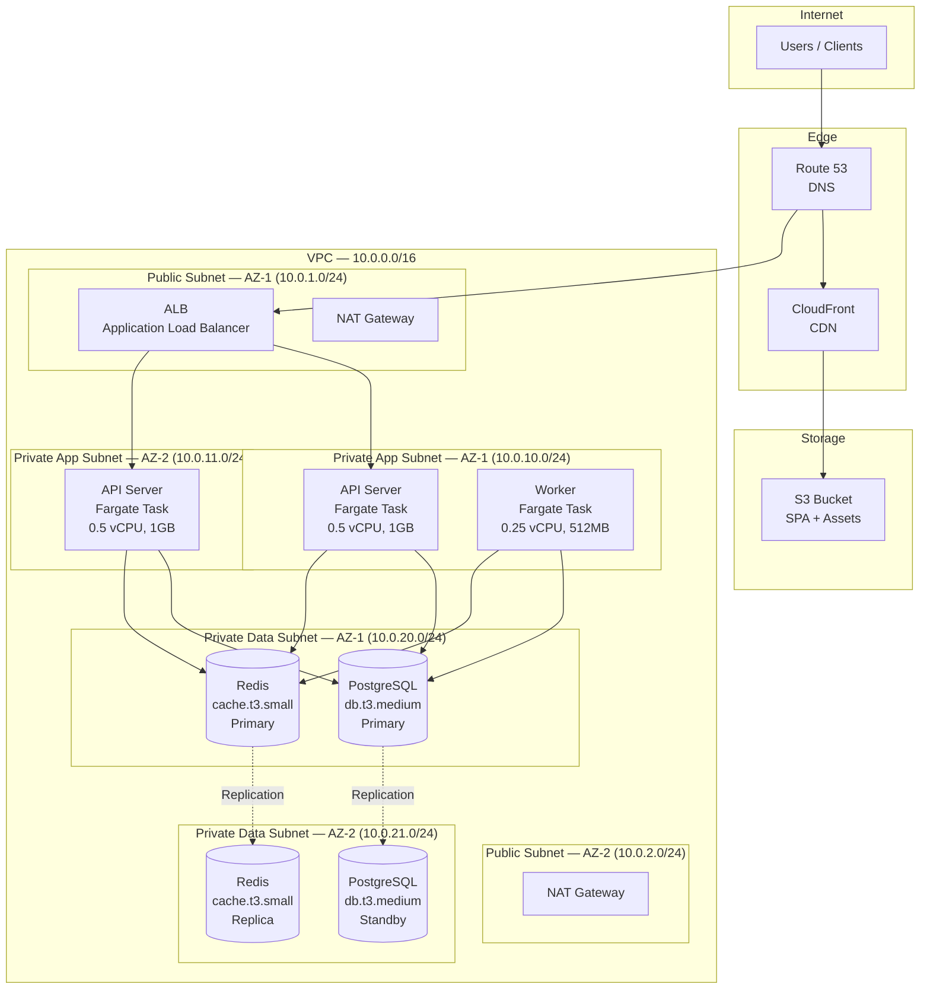

# Environment Specification — TaskFlow

> **Project**: TaskFlow
> **Version**: draft
> **Date Created**: 2026-04-06
> **Last Updated**: 2026-04-06
> **Status**: Draft
> **Author**: AI-Generated
> **Source**: Based on `architecture-final.md`, `tech-stack-final.md`, and `cicd-pipeline-final.md`

---

## 1. Environment Overview

TaskFlow uses a four-environment strategy designed for a small team (3-5 developers) shipping an MVP within 6 months. Development runs locally via Docker Compose at zero cost. Staging mirrors production architecture at reduced scale for integration testing and deploy rehearsal. A time-boxed performance environment validates scaling assumptions before launch. Production runs on AWS with high availability across two availability zones.

CI is handled by GitHub Actions runners and does not require dedicated infrastructure beyond what the CI/CD pipeline provides.

### Environment Comparison

| Attribute | Development | Staging | Performance | Production |
|-----------|-------------|---------|-------------|------------|
| **Purpose** | Local development, debugging | Integration testing, UAT, deploy rehearsal | Load testing, capacity validation | Serving real users |
| **Infrastructure** | Docker Compose (local) | AWS ECS Fargate | AWS ECS Fargate (prod-scale) | AWS ECS Fargate (HA) |
| **Scale** | 1 instance per service | 1 instance per service (50% prod sizing) | Production-scale | 2+ instances, Multi-AZ |
| **Data** | Seed data / fixtures | Anonymized subset | Synthetic prod-scale dataset | Real user data (encrypted) |
| **Access** | Individual developer | Dev team + QA | Perf engineering (time-boxed) | Ops team only |
| **Availability** | Best effort | Business hours | During test windows only | 99.5% (QA-002) |
| **Estimated Cost** | $0/mo | ~$250/mo | ~$400/mo (2 weeks = ~$200 actual) | ~$800/mo |

---

## 2. Infrastructure Topology

### 2.1 Production Topology



### 2.2 Per-Environment Infrastructure

#### Development (Docker Compose)

| Component | Service | Details | Confidence |
|-----------|---------|---------|------------|
| API Server | Docker container | Node.js, 1 container, shared host resources | ✅ CONFIRMED |
| Database | Docker PostgreSQL | PostgreSQL 16, 1 container, local volume | ✅ CONFIRMED |
| Cache | Docker Redis | Redis 7, 1 container, no persistence | ✅ CONFIRMED |
| SPA | Vite dev server | Hot reload, localhost:5173 | ✅ CONFIRMED |
| Worker | Docker container | 1 container, shared host resources | ✅ CONFIRMED |

#### Staging (AWS — 50% Production Scale)

| Component | Service | Details | Confidence |
|-----------|---------|---------|------------|
| API Server | ECS Fargate | 1 task, 0.5 vCPU, 1GB RAM | 🔶 ASSUMED |
| Database | RDS PostgreSQL | db.t3.micro (2 vCPU, 1GB), 20GB gp3, single-AZ | 🔶 ASSUMED |
| Cache | ElastiCache Redis | cache.t3.micro (2 vCPU, 0.5GB), single node | 🔶 ASSUMED |
| SPA / CDN | S3 + CloudFront | Staging distribution, short cache TTL (5 min) | 🔶 ASSUMED |
| Load Balancer | ALB | Single ALB, HTTP + HTTPS | 🔶 ASSUMED |
| Worker | ECS Fargate | 1 task, 0.25 vCPU, 512MB RAM | 🔶 ASSUMED |

#### Performance (AWS — Production Scale, Time-Boxed)

| Component | Service | Details | Confidence |
|-----------|---------|---------|------------|
| API Server | ECS Fargate | 2 tasks (min 2, max 6), 0.5 vCPU, 1GB RAM each | 🔶 ASSUMED |
| Database | RDS PostgreSQL | db.t3.medium (2 vCPU, 4GB), 50GB gp3, single-AZ | 🔶 ASSUMED |
| Cache | ElastiCache Redis | cache.t3.small (2 vCPU, 1.5GB), single node | 🔶 ASSUMED |
| Load Balancer | ALB | Single ALB, HTTPS only | 🔶 ASSUMED |
| Worker | ECS Fargate | 1 task (min 1, max 3), 0.25 vCPU, 512MB RAM | 🔶 ASSUMED |

#### Production (AWS — Full Scale, HA)

| Component | Service | Details | Confidence |
|-----------|---------|---------|------------|
| API Server | ECS Fargate | 2 tasks (min 2, max 6), 0.5 vCPU, 1GB RAM each, Multi-AZ | 🔶 ASSUMED |
| Database | RDS PostgreSQL | db.t3.medium (2 vCPU, 4GB), 50GB gp3, Multi-AZ standby | 🔶 ASSUMED |
| Cache | ElastiCache Redis | cache.t3.small (2 vCPU, 1.5GB), 2-node cluster (primary + replica) | 🔶 ASSUMED |
| SPA / CDN | S3 + CloudFront | Production distribution, 24hr cache TTL, invalidation on deploy | 🔶 ASSUMED |
| Load Balancer | ALB | Single ALB, HTTPS only, WAF enabled | 🔶 ASSUMED |
| Worker | ECS Fargate | 1 task (min 1, max 3), 0.25 vCPU, 512MB RAM | 🔶 ASSUMED |
| DNS | Route 53 | taskflow.example.com, health-check routing | 🔶 ASSUMED |
| SSL | ACM | Wildcard certificate *.taskflow.example.com, auto-renewal | 🔶 ASSUMED |

---

## 3. Service Specifications

### 3.1 API Server

| Attribute | Development | Staging | Production | Confidence |
|-----------|-------------|---------|------------|------------|
| **Platform** | Docker Compose | ECS Fargate | ECS Fargate | ✅ CONFIRMED |
| **Instances** | 1 | 1 | 2 (min 2, max 6) | 🔶 ASSUMED |
| **CPU** | Shared | 0.5 vCPU | 0.5 vCPU | 🔶 ASSUMED |
| **Memory** | Shared | 1 GB | 1 GB | 🔶 ASSUMED |
| **Storage** | Host volume | Ephemeral (20GB) | Ephemeral (20GB) | 🔶 ASSUMED |
| **Health Check** | None | /health, 30s interval | /health, 15s interval | 🔶 ASSUMED |
| **Scaling** | None | None | CPU >70%, cooldown 300s | 🔶 ASSUMED |
| **Port** | 3000 | 3000 | 3000 | ✅ CONFIRMED |

### 3.2 PostgreSQL Database

| Attribute | Development | Staging | Production | Confidence |
|-----------|-------------|---------|------------|------------|
| **Platform** | Docker PostgreSQL 16 | RDS PostgreSQL 16 | RDS PostgreSQL 16 Multi-AZ | ✅ CONFIRMED |
| **Instance Type** | N/A | db.t3.micro | db.t3.medium | 🔶 ASSUMED |
| **CPU** | Shared | 2 vCPU | 2 vCPU | 🔶 ASSUMED |
| **Memory** | Shared | 1 GB | 4 GB | 🔶 ASSUMED |
| **Storage** | Docker volume | 20 GB gp3 | 50 GB gp3 | 🔶 ASSUMED |
| **HA** | None | None (single-AZ) | Multi-AZ standby | 🔶 ASSUMED |
| **Backups** | None | Daily, 3-day retention | Daily, 7-day retention + PITR | 🔶 ASSUMED |
| **Max Connections** | Default | 50 | 200 | 🔶 ASSUMED |

### 3.3 Redis Cache

| Attribute | Development | Staging | Production | Confidence |
|-----------|-------------|---------|------------|------------|
| **Platform** | Docker Redis 7 | ElastiCache Redis 7 | ElastiCache Redis 7 | ✅ CONFIRMED |
| **Instance Type** | N/A | cache.t3.micro | cache.t3.small | 🔶 ASSUMED |
| **CPU** | Shared | 2 vCPU | 2 vCPU | 🔶 ASSUMED |
| **Memory** | Shared | 0.5 GB | 1.5 GB | 🔶 ASSUMED |
| **Nodes** | 1 | 1 (single) | 2 (primary + replica) | 🔶 ASSUMED |
| **Persistence** | None | None | AOF enabled | 🔶 ASSUMED |
| **Eviction Policy** | allkeys-lru | allkeys-lru | allkeys-lru | 🔶 ASSUMED |

### 3.4 SPA (Static Assets)

| Attribute | Development | Staging | Production | Confidence |
|-----------|-------------|---------|------------|------------|
| **Platform** | Vite dev server | S3 + CloudFront | S3 + CloudFront | ✅ CONFIRMED |
| **Cache TTL** | None (HMR) | 5 minutes | 24 hours | 🔶 ASSUMED |
| **Invalidation** | N/A | On deploy | On deploy | 🔶 ASSUMED |
| **Compression** | None | gzip | gzip + brotli | 🔶 ASSUMED |
| **Custom Domain** | localhost:5173 | staging.taskflow.example.com | app.taskflow.example.com | 🔶 ASSUMED |

### 3.5 Background Worker

| Attribute | Development | Staging | Production | Confidence |
|-----------|-------------|---------|------------|------------|
| **Platform** | Docker Compose | ECS Fargate | ECS Fargate | ✅ CONFIRMED |
| **Instances** | 1 | 1 | 1 (min 1, max 3) | 🔶 ASSUMED |
| **CPU** | Shared | 0.25 vCPU | 0.25 vCPU | 🔶 ASSUMED |
| **Memory** | Shared | 512 MB | 512 MB | 🔶 ASSUMED |
| **Scaling** | None | None | Queue depth >100, cooldown 300s | 🔶 ASSUMED |
| **Purpose** | Webhook processing, notifications | Same | Same | ✅ CONFIRMED |

---

## 4. Networking & Security

### 4.1 VPC Design

| Attribute | Value | Confidence |
|-----------|-------|------------|
| **VPC CIDR** | 10.0.0.0/16 | 🔶 ASSUMED |
| **Public Subnets** | 2 — 10.0.1.0/24 (AZ-1), 10.0.2.0/24 (AZ-2) | 🔶 ASSUMED |
| **Private App Subnets** | 2 — 10.0.10.0/24 (AZ-1), 10.0.11.0/24 (AZ-2) | 🔶 ASSUMED |
| **Private Data Subnets** | 2 — 10.0.20.0/24 (AZ-1), 10.0.21.0/24 (AZ-2) | 🔶 ASSUMED |
| **Availability Zones** | 2 (us-east-1a, us-east-1b) | 🔶 ASSUMED |
| **NAT Gateway** | 1 per AZ (2 total) for HA | 🔶 ASSUMED |

### 4.2 Security Groups

| Security Group | Inbound Rules | Outbound Rules | Purpose | Confidence |
|---------------|---------------|----------------|---------|------------|
| ALB-SG | TCP 80 from 0.0.0.0/0, TCP 443 from 0.0.0.0/0 | TCP 3000 to App-SG | Public traffic entry point | 🔶 ASSUMED |
| App-SG | TCP 3000 from ALB-SG | TCP 5432 to DB-SG, TCP 6379 to Cache-SG, TCP 443 to 0.0.0.0/0 (via NAT) | Application tier | 🔶 ASSUMED |
| DB-SG | TCP 5432 from App-SG | None | Database access (PostgreSQL) | 🔶 ASSUMED |
| Cache-SG | TCP 6379 from App-SG | None | Cache access (Redis) | 🔶 ASSUMED |

### 4.3 SSL/TLS Configuration

| Attribute | Value | Confidence |
|-----------|-------|------------|
| **Certificate Provider** | AWS ACM (free, auto-renewal) | 🔶 ASSUMED |
| **Certificate Scope** | *.taskflow.example.com | 🔶 ASSUMED |
| **Minimum TLS Version** | TLS 1.2 | ✅ CONFIRMED |
| **SSL Termination** | At ALB | 🔶 ASSUMED |
| **HSTS** | Enabled, max-age=31536000 (1 year) | 🔶 ASSUMED |
| **HTTP → HTTPS Redirect** | Enabled (ALB listener rule) | 🔶 ASSUMED |
| **WAF** | AWS WAF on ALB — rate limiting (1000 req/min per IP), SQL injection rules, XSS rules | 🔶 ASSUMED |

### 4.4 Access Control per Environment

| Environment | SSH/Shell | Database | Deploy | Logs | Confidence |
|-------------|-----------|----------|--------|------|------------|
| Development | Developer (local) | Developer (local) | Developer (local) | Developer (local) | ✅ CONFIRMED |
| Staging | Dev team (SSM Session Manager) | Dev team (read-only via SSM) | GitHub Actions pipeline | Dev team (CloudWatch) | 🔶 ASSUMED |
| Performance | Perf engineers (SSM) | Perf engineers (read-only) | Pipeline + Tech Lead | Perf engineers | 🔶 ASSUMED |
| Production | Ops only (SSM, audited) | Ops only (read-only, audited) | Pipeline only (requires approval) | Ops + on-call (CloudWatch + Datadog) | 🔶 ASSUMED |

---

## 5. Configuration Management

### 5.1 Environment Variable Inventory

| Variable | Category | Source | Dev | Staging | Production | Confidence |
|----------|----------|--------|-----|---------|------------|------------|
| `NODE_ENV` | Config | Env var | development | staging | production | ✅ CONFIRMED |
| `PORT` | Config | Env var | 3000 | 3000 | 3000 | ✅ CONFIRMED |
| `LOG_LEVEL` | Config | Parameter Store | debug | info | warn | 🔶 ASSUMED |
| `DATABASE_HOST` | Config | Parameter Store | localhost | {rds-endpoint} | {rds-endpoint} | ✅ CONFIRMED |
| `DATABASE_PORT` | Config | Parameter Store | 5432 | 5432 | 5432 | ✅ CONFIRMED |
| `DATABASE_NAME` | Config | Parameter Store | taskflow_dev | taskflow_staging | taskflow_prod | 🔶 ASSUMED |
| `DATABASE_PASSWORD` | Secret | Secrets Manager | localpassword | {rotated} | {rotated} | ✅ CONFIRMED |
| `REDIS_HOST` | Config | Parameter Store | localhost | {elasticache-endpoint} | {elasticache-endpoint} | ✅ CONFIRMED |
| `REDIS_PORT` | Config | Parameter Store | 6379 | 6379 | 6379 | ✅ CONFIRMED |
| `JWT_SECRET` | Secret | Secrets Manager | dev-secret | {rotated} | {rotated} | ✅ CONFIRMED |
| `AUTH0_DOMAIN` | Config | Parameter Store | dev-tenant.auth0.com | dev-tenant.auth0.com | prod-tenant.auth0.com | 🔶 ASSUMED |
| `AUTH0_CLIENT_ID` | Config | Parameter Store | {dev-id} | {dev-id} | {prod-id} | 🔶 ASSUMED |
| `AUTH0_CLIENT_SECRET` | Secret | Secrets Manager | {dev-secret} | {dev-secret} | {prod-secret} | 🔶 ASSUMED |
| `S3_BUCKET` | Config | Parameter Store | N/A | taskflow-staging-assets | taskflow-prod-assets | 🔶 ASSUMED |
| `CDN_URL` | Config | Parameter Store | N/A | staging-cdn.taskflow.example.com | cdn.taskflow.example.com | 🔶 ASSUMED |
| `SENTRY_DSN` | Config | Parameter Store | N/A | {staging-dsn} | {prod-dsn} | 🔶 ASSUMED |
| `FEATURE_DARK_MODE` | Flag | Env var | true | true | false | 🔶 ASSUMED |
| `FEATURE_EXPORT_CSV` | Flag | Env var | true | true | true | 🔶 ASSUMED |
| `FEATURE_WEBHOOK_GITLAB` | Flag | Env var | true | true | false | 🔶 ASSUMED |
| `RATE_LIMIT_RPM` | Config | Parameter Store | 0 (disabled) | 100 | 1000 | 🔶 ASSUMED |

### 5.2 Configuration Sources

| Source | Purpose | Environments | Tool/Service | Confidence |
|--------|---------|-------------|--------------|------------|
| `.env` file | Local development config | Development only | dotenv | ✅ CONFIRMED |
| AWS Parameter Store | Non-secret configuration | Staging, Production | SSM Parameter Store (Standard tier, free) | 🔶 ASSUMED |
| AWS Secrets Manager | Sensitive credentials | Staging, Production | Secrets Manager ($0.40/secret/mo) | 🔶 ASSUMED |
| Environment variables | Feature flags, runtime config | All | ECS task definition / Docker Compose | ✅ CONFIRMED |

### 5.3 Secret Management

| Secret | Service | Rotation Policy | Access | Confidence |
|--------|---------|----------------|--------|------------|
| DATABASE_PASSWORD | Secrets Manager | 90-day automatic rotation | App-SG ECS tasks only | 🔶 ASSUMED |
| JWT_SECRET | Secrets Manager | Manual rotation (on compromise) | App-SG ECS tasks only | 🔶 ASSUMED |
| AUTH0_CLIENT_SECRET | Secrets Manager | Manual rotation (on compromise) | App-SG ECS tasks only | 🔶 ASSUMED |

### 5.4 Feature Flags

| Flag | Purpose | Default (Dev) | Default (Staging) | Default (Prod) | Confidence |
|------|---------|---------------|-------------------|----------------|------------|
| `FEATURE_DARK_MODE` | Dark mode UI theme | true | true | false (until polished) | 🔶 ASSUMED |
| `FEATURE_EXPORT_CSV` | CSV export for sprint data | true | true | true | 🔶 ASSUMED |
| `FEATURE_WEBHOOK_GITLAB` | GitLab webhook integration | true | true | false (GitHub only for MVP) | 🔶 ASSUMED |

> **Future**: Migrate to LaunchDarkly or Unleash when A/B testing and gradual rollouts become necessary (post-MVP). — 🔶 ASSUMED

---

## 6. Scaling Policies

### 6.1 Compute Scaling

| Service | Metric | Threshold | Min | Max | Cooldown | Confidence |
|---------|--------|-----------|-----|-----|----------|------------|
| API Server | CPU Utilization | Scale out >70%, scale in <30% | 2 | 6 | 300s | 🔶 ASSUMED |
| Worker | SQS Queue Depth | Scale out >100 messages, scale in <10 | 1 | 3 | 300s | 🔶 ASSUMED |

### 6.2 Database Scaling

| Database | Current Sizing | Scale Trigger | Scale Action | Timeline | Confidence |
|----------|---------------|---------------|--------------|----------|------------|
| PostgreSQL | db.t3.medium (2 vCPU, 4GB) | CPU >70% sustained 1hr | Vertical: upgrade to db.t3.large (2 vCPU, 8GB) | When observed | 🔶 ASSUMED |
| PostgreSQL | db.t3.medium | Read IOPS >1000 sustained | Add read replica (db.t3.medium) | Post-MVP [FUTURE] | 🔶 ASSUMED |
| PostgreSQL | N/A | Connections >160 (80% of 200 max) | Enable PgBouncer connection pooling | When observed | 🔶 ASSUMED |

### 6.3 Cache Scaling

| Cache | Current Sizing | Scale Trigger | Scale Action | Confidence |
|-------|---------------|---------------|--------------|------------|
| Redis | cache.t3.small (1.5GB), 2-node | Memory >80% | Upgrade to cache.t3.medium (3GB) | 🔶 ASSUMED |
| Redis | cache.t3.small | Hit rate <90% | Review cache strategy, increase TTLs or memory | 🔶 ASSUMED |

---

## 7. Backup & Disaster Recovery

### 7.1 Backup Schedule

| Resource | Method | Frequency | Retention | Location | Confidence |
|----------|--------|-----------|-----------|----------|------------|
| PostgreSQL (prod) | RDS automated backup | Daily (02:00 UTC) | 7 days | AWS-managed (same region) | 🔶 ASSUMED |
| PostgreSQL (prod) | Manual snapshot | Before each release | 30 days | AWS-managed (same region) | 🔶 ASSUMED |
| PostgreSQL (prod) | Point-in-time recovery | Continuous (5-min granularity) | 7 days | AWS-managed | 🔶 ASSUMED |
| PostgreSQL (staging) | RDS automated backup | Daily (04:00 UTC) | 3 days | AWS-managed (same region) | 🔶 ASSUMED |
| Redis (prod) | AOF persistence | Continuous | Until restart | Local to node | 🔶 ASSUMED |
| Redis (prod) | Daily snapshot | Daily (03:00 UTC) | 3 days | S3 | 🔶 ASSUMED |
| S3 assets | Versioning enabled | Continuous | 30 days (noncurrent versions) | Same bucket | 🔶 ASSUMED |

### 7.2 Recovery Targets

| Metric | Target | Justification | Confidence |
|--------|--------|---------------|------------|
| **RPO** (Recovery Point Objective) | 1 hour | Aligned with QA-002 (99.5% availability). RDS PITR provides 5-min granularity, exceeding this target. Acceptable data loss for an MVP sprint tracking tool. | 🔶 ASSUMED |
| **RTO** (Recovery Time Objective) | 30 minutes | RDS Multi-AZ failover completes in ~2-5 minutes. ECS tasks restart in ~1-2 minutes. 30 minutes provides buffer for assessment and validation. | 🔶 ASSUMED |

### 7.3 Recovery Procedure

**Scenario: Production Database Failure**

1. **Detect**: CloudWatch alarm triggers on RDS availability metric or health check failures on API /health endpoint (checks DB connectivity). Alert sent to on-call via PagerDuty/Slack.
2. **Assess**: Check RDS console for failure type — is it an AZ failure (automatic failover) or data corruption (manual recovery)? Check if Multi-AZ failover has already engaged.
3. **Recover (AZ failure)**: RDS Multi-AZ automatically promotes standby to primary (~2-5 minutes). Verify application reconnects. No manual action needed.
4. **Recover (data corruption)**: Initiate point-in-time recovery to a new RDS instance at the last known good timestamp. Update Parameter Store with new endpoint. Redeploy ECS tasks to pick up new config.
5. **Validate**: Run `/health` endpoint. Verify recent data integrity by spot-checking recent records. Run integration test suite against production.
6. **Post-mortem**: Document incident — timeline, root cause, impact (data loss if any), preventive measures. Update runbook if procedure changed.

---

## 8. Monitoring & Observability

### 8.1 Health Checks

| Service | Endpoint | Interval | Timeout | Healthy Threshold | Confidence |
|---------|----------|----------|---------|-------------------|------------|
| API Server | GET /health | 15s | 5s | 3 consecutive | 🔶 ASSUMED |
| API Server | GET /health/ready | 15s | 5s | 3 consecutive | 🔶 ASSUMED |
| Worker | Process heartbeat (internal) | 30s | 10s | N/A | 🔶 ASSUMED |

The `/health` endpoint returns:
```json
{
  "status": "healthy",
  "version": "1.2.3",
  "dependencies": {
    "database": "connected",
    "cache": "connected",
    "queue": "connected"
  }
}
```

### 8.2 Key Metrics

| Metric | Source | Warning Threshold | Critical Threshold | Alert Channel | Confidence |
|--------|--------|-------------------|-------------------|---------------|------------|
| API response time (p95) | ALB | >500ms | >2000ms | Slack #ops | 🔶 ASSUMED |
| API error rate (5xx) | ALB | >1% | >5% | PagerDuty | 🔶 ASSUMED |
| ECS CPU utilization | CloudWatch | >70% | >90% | Slack #ops | 🔶 ASSUMED |
| ECS memory utilization | CloudWatch | >75% | >90% | Slack #ops | 🔶 ASSUMED |
| RDS CPU utilization | CloudWatch | >70% | >85% | Slack #ops | 🔶 ASSUMED |
| RDS free storage | CloudWatch | <10GB | <5GB | PagerDuty | 🔶 ASSUMED |
| RDS connections | CloudWatch | >160 | >180 | Slack #ops | 🔶 ASSUMED |
| Redis memory usage | CloudWatch | >80% | >90% | Slack #ops | 🔶 ASSUMED |
| Redis cache hit rate | CloudWatch | <90% | <80% | Slack #ops | 🔶 ASSUMED |
| SQS queue depth | CloudWatch | >100 | >500 | Slack #ops | 🔶 ASSUMED |
| ALB healthy host count | CloudWatch | <2 | <1 | PagerDuty | 🔶 ASSUMED |

### 8.3 Log Aggregation

| Source | Destination | Retention | Confidence |
|--------|------------|-----------|------------|
| API Server (stdout/stderr) | CloudWatch Logs → Datadog | 30 days (CW), 15 days (Datadog) | 🔶 ASSUMED |
| Worker (stdout/stderr) | CloudWatch Logs → Datadog | 30 days (CW), 15 days (Datadog) | 🔶 ASSUMED |
| ALB access logs | S3 bucket | 90 days | 🔶 ASSUMED |
| RDS slow query log | CloudWatch Logs | 30 days | 🔶 ASSUMED |

> **Note**: Detailed monitoring dashboards, alert escalation procedures, SLO definitions, and incident response workflows are defined in the ops phase. Run `/ops-monitor` after finalizing this environment specification.

---

## 9. Cost Estimation

### 9.1 Per-Environment Breakdown

#### Development

| Resource | Service | Monthly Cost | Notes |
|----------|---------|-------------|-------|
| All services | Docker Compose (local) | $0 | Runs on developer hardware |
| **Subtotal** | | **$0/mo** | |

#### Staging

| Resource | Service | Monthly Cost | Notes |
|----------|---------|-------------|-------|
| API Server | ECS Fargate (1 task, 0.5 vCPU, 1GB) | $18 | ~730 hrs/mo |
| Worker | ECS Fargate (1 task, 0.25 vCPU, 0.5GB) | $9 | ~730 hrs/mo |
| Database | RDS db.t3.micro (single-AZ) | $15 | On-demand |
| Cache | ElastiCache cache.t3.micro (single) | $12 | On-demand |
| Load Balancer | ALB | $22 | Base + LCU charges |
| CDN | CloudFront | $5 | Low traffic |
| Storage | S3 | $2 | Assets + logs |
| DNS | Route 53 | $1 | Hosted zone + queries |
| Secrets | Secrets Manager (3 secrets) | $1 | $0.40/secret/mo |
| Monitoring | CloudWatch | $10 | Logs + metrics + alarms |
| NAT Gateway | NAT Gateway (1) | $35 | $0.045/hr + data |
| Data transfer | Various | $10 | Estimated |
| Buffer (20%) | — | $28 | Contingency |
| **Subtotal** | | **~$168/mo** | |

#### Performance (Time-Boxed: 2 weeks per quarter)

| Resource | Service | Monthly Cost (if full month) | Notes |
|----------|---------|-------------|-------|
| API Server | ECS Fargate (2 tasks, 0.5 vCPU, 1GB) | $36 | Production scale |
| Worker | ECS Fargate (1 task, 0.25 vCPU, 0.5GB) | $9 | |
| Database | RDS db.t3.medium (single-AZ) | $60 | Prod-equivalent |
| Cache | ElastiCache cache.t3.small (single) | $25 | Prod-equivalent |
| Load Balancer | ALB | $25 | Base + higher LCU |
| NAT Gateway | NAT Gateway (1) | $35 | |
| Data transfer + misc | Various | $50 | Higher during load tests |
| Buffer (20%) | — | $48 | |
| **Subtotal (full month)** | | **~$288/mo** | |
| **Actual (2 weeks)** | | **~$144/quarter** | Provisioned only during test windows |

#### Production

| Resource | Service | Monthly Cost | Notes |
|----------|---------|-------------|-------|
| API Server | ECS Fargate (2 tasks, 0.5 vCPU, 1GB) | $36 | Baseline (scales to 6) |
| Worker | ECS Fargate (1 task, 0.25 vCPU, 0.5GB) | $9 | Baseline (scales to 3) |
| Database | RDS db.t3.medium (Multi-AZ) | $120 | Multi-AZ doubles cost |
| Cache | ElastiCache cache.t3.small (2-node) | $50 | Primary + replica |
| Load Balancer | ALB | $25 | Base + LCU charges |
| CDN | CloudFront | $15 | Production traffic |
| Storage | S3 | $5 | Assets + uploads + logs |
| DNS | Route 53 | $2 | Hosted zone + health checks |
| SSL | ACM | $0 | Free with AWS |
| WAF | AWS WAF | $10 | 3 rules + web ACL |
| Secrets | Secrets Manager (3 secrets) | $1 | $0.40/secret/mo |
| Monitoring | CloudWatch | $25 | Logs + metrics + alarms + dashboards |
| Datadog APM | Datadog (2 hosts) | $46 | Infrastructure + APM plan |
| NAT Gateway | NAT Gateway (2, HA) | $70 | $0.045/hr each + data |
| Data transfer | Various | $30 | Estimated |
| Buffer (20%) | — | $89 | Contingency |
| **Subtotal** | | **~$533/mo** | |

### 9.2 Total Cost Summary

| Environment | Monthly | Annual | % of Total |
|-------------|---------|--------|------------|
| Development | $0 | $0 | 0% |
| Staging | $168 | $2,016 | 24% |
| Performance | $48 (amortized) | $576 | 7% |
| Production | $533 | $6,396 | 69% |
| **Total** | **~$749** | **~$8,988** | **100%** |

### 9.3 Cost Optimization Recommendations

| # | Recommendation | Estimated Savings | When to Apply | Confidence |
|---|---------------|-------------------|---------------|------------|
| 1 | Reserved Instances for RDS (1-year, partial upfront) | ~$40/mo (33% on DB) | After 3 months of stable production | 🔶 ASSUMED |
| 2 | Single NAT Gateway for staging (accept AZ risk) | ~$35/mo | Immediate (staging only) | 🔶 ASSUMED |
| 3 | Savings Plan for Fargate (1-year compute) | ~$15/mo (20% on compute) | After 3 months of stable production | 🔶 ASSUMED |
| 4 | S3 Intelligent-Tiering for log archives | ~$3/mo | Immediate | 🔶 ASSUMED |
| 5 | Tear down performance env when not in use | ~$240/quarter saved | Already planned (time-boxed) | ✅ CONFIRMED |

### 9.4 Budget Alignment

Estimated annual cost of ~$8,988 is well within the CON-002 budget constraint (assumed $15,000/year for infrastructure). This leaves ~$6,000/year headroom for scaling, additional tooling, or reserved instance commitments. — 🔶 ASSUMED (CON-002 budget figure needs confirmation)

---

## 10. Environment Parity

### Staging vs Production Parity

| Aspect | Identical? | Staging | Production | Risk if Different |
|--------|-----------|---------|------------|-------------------|
| Docker images | Yes | Same ECR images | Same ECR images | None — identical artifacts |
| Config keys | Yes | Same variable names | Same variable names | None — same code paths |
| Config values | No | Staging-specific (dev Auth0 tenant, staging DB) | Production-specific (prod Auth0 tenant, prod DB) | Low — expected and necessary |
| Instance sizes | No | db.t3.micro, 1 API task | db.t3.medium, 2 API tasks | Medium — performance issues may not surface in staging |
| Replica count | No | Single instances | Multi-AZ, 2-node Redis | Medium — HA failover untested in staging |
| Database engine | Yes | PostgreSQL 16 | PostgreSQL 16 | None — same engine and version |
| Network topology | No | Single-AZ, 1 NAT GW | Multi-AZ, 2 NAT GW | Low — networking issues rare at this scale |
| SSL/TLS | Yes | ACM cert, TLS 1.2+ | ACM cert, TLS 1.2+ | None — same TLS config |
| Third-party integrations | No | Dev Auth0 tenant | Prod Auth0 tenant | Low — Auth0 behavior is consistent across tenants |
| WAF | No | Disabled (cost saving) | Enabled | Medium — WAF false positives only caught in production |

**Parity Gaps to Monitor**:
- Performance-related bugs may only appear in production due to smaller staging instances. Mitigated by time-boxed performance environment.
- HA failover (RDS Multi-AZ, Redis replica) is not tested in staging. Mitigated by documenting recovery procedures and testing in performance environment.
- WAF rules are production-only. Consider enabling WAF in staging before major releases to catch false positives.

---

## 11. Q&A Log

| ID | Question | Raised By | Priority | Answer | Status | Confidence |
|----|----------|-----------|----------|--------|--------|------------|
| Q-001 | Should we plan for Kubernetes (EKS) migration or stay with ECS Fargate long-term? | Architect | MED | ECS Fargate is sufficient for current scale (QA-003: 50 teams). Revisit if microservices extraction occurs or team exceeds 10 engineers. | Resolved | 🔶 ASSUMED |
| Q-002 | When should we commit to Reserved Instances for RDS? | DevOps | MED | After 3 months of stable production usage, evaluate 1-year partial-upfront RI for RDS. Expected savings ~33%. | Resolved | 🔶 ASSUMED |
| Q-003 | Is multi-region deployment needed for disaster recovery? | Architect | LOW | Not for MVP. Single-region (us-east-1) with Multi-AZ is sufficient for 99.5% availability target. Multi-region adds significant cost and complexity. Revisit if SLA increases to 99.9%+. | Resolved | 🔶 ASSUMED |
| Q-004 | What is the exact annual infrastructure budget (CON-002)? | PM | HIGH | Assumed $15,000/year based on charter. Needs confirmation from stakeholder. | Open | ❓ UNCLEAR |
| Q-005 | Should staging have WAF enabled to catch false positives before production? | Security | MED | Recommended before major releases. Cost impact: ~$10/mo additional. Pending decision. | Open | ❓ UNCLEAR |

---

## 12. Readiness Assessment

### Confidence Summary

| Level | Count | Percentage |
|-------|-------|------------|
| ✅ CONFIRMED | 22 | 24% |
| 🔶 ASSUMED | 67 | 73% |
| ❓ UNCLEAR | 3 | 3% |
| **Total Items** | 92 | 100% |

### Verdict: PARTIALLY READY

The environment specification covers all required sections with reasonable defaults based on the architecture and tech-stack decisions. However, the majority of sizing decisions are ASSUMED based on heuristics rather than confirmed by load testing or stakeholder review. This is expected for an initial draft.

**Critical gaps before approval**:
1. Budget confirmation needed (Q-004, HIGH priority)
2. All sizing decisions are ASSUMED — will be validated during performance testing phase
3. WAF staging decision pending (Q-005)

**Ready to proceed with**: Staging and development environment provisioning. Production provisioning should wait until sizing assumptions are validated in the performance environment.

### Key Risks

| # | Risk | Impact | Mitigation |
|---|------|--------|------------|
| 1 | Sizing assumptions are wrong — over or under-provisioned | Over: wasted budget. Under: performance issues | Start with assumed sizes, right-size after 2 weeks of monitoring |
| 2 | NAT Gateway costs higher than estimated (data transfer) | Budget overrun on networking | Monitor data transfer costs weekly in first month; consider VPC endpoints for AWS services |
| 3 | Multi-AZ failover not tested before production incident | Extended downtime during real failure | Test failover in performance environment during load test cycle |

---

## 13. Approval

| Role | Name | Decision | Date | Signature |
|------|------|----------|------|-----------|
| DevOps Lead | _________ | Approved / Rejected / Conditional | _________ | _________ |
| Technical Lead | _________ | Approved / Rejected / Conditional | _________ | _________ |
| Engineering Manager | _________ | Approved / Rejected / Conditional | _________ | _________ |

**Conditions / Comments:**
{Pending review. Budget confirmation (Q-004) required before production provisioning approval.}
