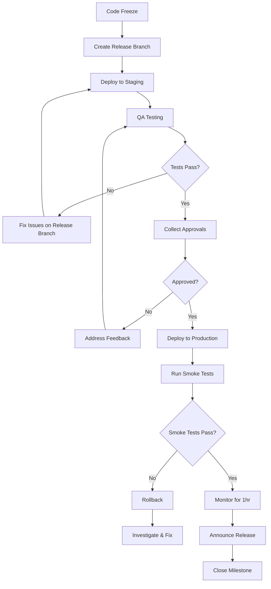

# Release Plan: TaskFlow

> **Project**: TaskFlow
> **Version**: 1.0
> **Date Created**: 2026-04-06
> **Last Updated**: 2026-04-06
> **Status**: Draft
> **Author**: AI-Generated
> **Source**: Derived from `cicd-pipeline-final.md` and `backlog-final.md`

---

## 1. Versioning Strategy

| Aspect | Value | Confidence |
|--------|-------|------------|
| Versioning scheme | Semantic Versioning (MAJOR.MINOR.PATCH) | ✅ CONFIRMED |
| Initial version | 0.1.0 (pre-production MVP) | 🔶 ASSUMED |
| First GA version | 1.0.0 (MVP GA release) | 🔶 ASSUMED |
| Pre-release format | -alpha.N, -beta.N, -rc.N | ✅ CONFIRMED |
| Build metadata format | +build.NNN (CI build number) | 🔶 ASSUMED |

### Version Bump Triggers

| Bump | Trigger | Example |
|------|---------|---------|
| MAJOR | Breaking API changes (webhook payload format, authentication flow changes) | 1.0.0 -> 2.0.0 |
| MINOR | New features (new integration, new dashboard widget, new notification type) | 1.0.0 -> 1.1.0 |
| PATCH | Bug fixes, performance improvements, dependency updates | 1.0.0 -> 1.0.1 |

### Pre-release Progression

{version}-alpha.N -> {version}-beta.N -> {version}-rc.N -> {version}

- **Alpha**: Internal testing only. Deployed to dev environment. Team validates core functionality. May be unstable. 🔶 ASSUMED
- **Beta**: Stakeholder preview. Deployed to staging. Feature-complete for the release scope. Known issues documented. 🔶 ASSUMED
- **Release Candidate**: Believed production-ready. Only critical bug fixes allowed. Full regression testing completed. 🔶 ASSUMED

---

## 2. Release Types

### Release Type Summary

| Type | Cadence | Process | Approval | Freeze Period | Timeline |
|------|---------|---------|----------|---------------|----------|
| Major | Per backlog milestone | Full (8 steps) | Tech Lead + PM + Stakeholders | 3 days | 5 days | 
| Minor | Bi-weekly (post-GA) | Standard (6 steps) | Tech Lead + PM | 2 days | 3 days |
| Patch | Weekly (if fixes accumulate) | Expedited (4 steps) | Tech Lead | None | 1 day |
| Hotfix | As needed | Emergency (4 steps) | Tech Lead (post-deploy PM review) | None | 2-4 hours |

🔶 ASSUMED — Release cadence based on team size (4 devs) and sprint length (2 weeks).

### Major Release Process

1. **Feature freeze** — 3 days before target date. No new feature merges.
2. **Release branch** — Create `release/vX.0.0` from `develop`.
3. **Staging deploy** — Deploy release branch to staging via CI/CD pipeline.
4. **QA & UAT** — QA runs full regression suite. Stakeholders perform acceptance testing.
5. **Approval round** — Collect sign-offs from Tech Lead, PM, and stakeholders (24hr SLA).
6. **Production deploy** — Deploy to production via CI/CD pipeline (blue/green).
7. **Smoke tests & monitoring** — Run production smoke tests. Monitor error rates for 1 hour.
8. **Announce** — Update changelog, notify stakeholders via email, close milestone in tracker.

### Minor Release Process

1. **Code freeze** — 2 days before target date. Only bug fixes allowed.
2. **Release branch** — Create `release/vX.Y.0` from `develop`.
3. **Staging deploy & QA** — Deploy to staging. QA runs regression suite.
4. **Approval** — Tech Lead + PM sign-off (4hr SLA).
5. **Production deploy** — Deploy via CI/CD pipeline.
6. **Verify & announce** — Smoke tests, update changelog, Slack announcement.

### Patch Release Process

1. **Collect fixes** — Accumulate bug fix PRs on `develop` during the week.
2. **Release branch** — Create `release/vX.Y.Z` from `develop` on release day.
3. **Approval** — Tech Lead sign-off (1hr SLA). CI pipeline must be green.
4. **Production deploy & verify** — Deploy, run smoke tests, update changelog.

### Hotfix Release Process

1. **Branch** — Create `hotfix/vX.Y.Z` from the production tag (not `develop`).
2. **Fix & review** — Apply minimal fix. Expedited code review (1 reviewer minimum).
3. **Deploy** — Deploy directly to production after CI passes. Tech Lead approves (30min SLA).
4. **Backport & post-mortem** — Merge fix to `develop`. Document incident and root cause.

---

## 3. Release Process

### Workflow Diagram



### Process Steps

| Step | Action | Owner | SLA | Entry Criteria | Exit Criteria |
|------|--------|-------|-----|---------------|---------------|
| 1 | Code freeze | Tech Lead | — | Sprint goals met | No more feature merges |
| 2 | Create release branch | DevOps / Tech Lead | 30 min | Code freeze in effect | Branch created, CI green |
| 3 | Deploy to staging | CI/CD Pipeline (auto) | 15 min | Release branch exists | Staging deployment healthy |
| 4 | QA testing | QA / Team | 1-2 days | Staging deployment healthy | All tests pass, no Critical bugs |
| 5 | Collect approvals | Release Manager / PM | 1-24 hr (by type) | QA sign-off | All required approvers signed off |
| 6 | Deploy to production | CI/CD Pipeline | 15 min | Approvals collected | Production deployment healthy |
| 7 | Smoke tests | DevOps / On-call | 15 min | Production deployment | All smoke tests pass |
| 8 | Monitor & announce | DevOps / PM | 1 hr + 30 min | Smoke tests pass | No anomalies, stakeholders notified |

🔶 ASSUMED — SLA targets based on team size and CI/CD pipeline from cicd-pipeline-final.md.

### Code Freeze Rules

| Rule | Detail | Confidence |
|------|--------|------------|
| Freeze duration | 2 days before minor/patch, 3 days before major | 🔶 ASSUMED |
| Allowed during freeze | Bug fixes, documentation, test improvements only | 🔶 ASSUMED |
| Freeze exception process | Tech Lead can approve exceptions for critical fixes | 🔶 ASSUMED |

---

## 4. Changelog Management

### Format

Keep a Changelog (keepachangelog.com) format with sections: Added, Changed, Deprecated, Removed, Fixed, Security.

### Commit-to-Changelog Mapping

| Commit Prefix | Changelog Section |
|--------------|-------------------|
| `feat:` | Added |
| `fix:` | Fixed |
| `perf:` | Changed |
| `BREAKING CHANGE:` | Added (with breaking notice) |
| `deprecate:` | Deprecated |
| `security:` | Security |
| `docs:`, `style:`, `refactor:`, `test:`, `ci:`, `chore:` | (omit from user-facing changelog) |

✅ CONFIRMED — Mapping follows conventional commits standard.

### Automation Tool

**standard-version** (or **release-please**): Auto-generates changelog from conventional commits during the release branch creation step. Configured in CI/CD pipeline. 🔶 ASSUMED

### Example Changelog Entry

```markdown
## [0.1.0] - 2026-07-15

### Added
- Webhook endpoint for GitHub push events (US-001, US-002)
- GitLab push event parsing (US-006)
- Branch-to-ticket mapping with auto-status updates (US-003, US-004)
- Sprint board with real-time updates (US-010, US-013)
- Sprint selector for switching between sprints (US-011)
- OAuth authentication for GitHub and GitLab (US-030, US-031)

### Security
- TLS encryption for all API endpoints (US-032)
- System availability monitoring (US-033)
```

### Story Traceability

Every user-facing changelog entry references the user story ID (US-xxx) from the backlog. PR links are included in the detailed changelog for developer audience. The diff link between versions is appended at the bottom of each release entry. ✅ CONFIRMED

---

## 5. Release Approval

### Approval Criteria

| Criterion | Required For | Evidence | Confidence |
|-----------|-------------|----------|------------|
| All CI tests pass | All releases | Green pipeline in GitHub Actions | ✅ CONFIRMED |
| Code coverage >= 80% | All releases | Coverage report from CI | 🔶 ASSUMED |
| No Critical/High bugs | All releases | GitHub Issues query (label: bug, priority: critical/high) | 🔶 ASSUMED |
| Performance benchmarks met | Minor, Major | Load test results (k6/Artillery) | 🔶 ASSUMED |
| Security scan clean | All releases | Snyk/Trivy scan report, no critical findings | 🔶 ASSUMED |
| Stakeholder demo completed | Major | Demo meeting sign-off | 🔶 ASSUMED |
| Changelog reviewed | Minor, Major | Changelog PR approved | ✅ CONFIRMED |
| Rollback plan confirmed | Minor, Major | Rollback section reviewed and verified | 🔶 ASSUMED |

### Approvers Matrix

| Release Type | Approvers | Turnaround SLA | Confidence |
|-------------|-----------|----------------|------------|
| Patch | Tech Lead | 1 hour | 🔶 ASSUMED |
| Minor | Tech Lead + Product Manager | 4 hours | 🔶 ASSUMED |
| Major | Tech Lead + PM + Stakeholders | 24 hours | 🔶 ASSUMED |
| Hotfix | Tech Lead (post-deploy review by PM within 24hr) | 30 minutes | 🔶 ASSUMED |

---

## 6. Rollback Procedures

### Application Rollback

| Aspect | Detail | Confidence |
|--------|--------|------------|
| Method | Deploy previous ECS task definition revision (previous Docker image) | 🔶 ASSUMED |
| Target time | < 5 minutes | 🔶 ASSUMED |
| Steps | 1. Identify previous stable task definition revision. 2. Update ECS service to previous revision. 3. Wait for health check to pass. 4. Run smoke tests. 5. Confirm rollback successful. | 🔶 ASSUMED |
| Verification | Health check endpoint returns 200, smoke tests pass, error rate returns to baseline | 🔶 ASSUMED |
| Artifact retention | Keep last 10 Docker image tags in ECR | 🔶 ASSUMED |

### Database Rollback

| Aspect | Detail | Confidence |
|--------|--------|------------|
| Preferred approach | Forward-fix: write a new migration to correct the issue | ✅ CONFIRMED |
| Rollback migration | Pre-written and tested in CI for every migration. Only used when forward-fix is not feasible. | 🔶 ASSUMED |
| Target time | < 15 minutes (including verification) | 🔶 ASSUMED |
| Constraints | Cannot drop columns that received production data. Rollback migrations must be additive-safe. | ✅ CONFIRMED |
| Testing | Every migration's rollback script runs in CI against a test database | 🔶 ASSUMED |

### Configuration Rollback

| Aspect | Detail | Confidence |
|--------|--------|------------|
| Method | Revert parameter in AWS Parameter Store to previous version, restart ECS tasks | 🔶 ASSUMED |
| Target time | < 5 minutes | 🔶 ASSUMED |
| Config management | AWS Parameter Store with version history enabled | 🔶 ASSUMED |
| Audit trail | All config changes logged via CloudTrail | 🔶 ASSUMED |

### Rollback Communication

| Audience | Channel | Timing | Message Template |
|----------|---------|--------|-----------------|
| Engineering team | Slack #taskflow-deployments | Immediately | "Rolling back TaskFlow vX.Y.Z due to [issue]. ETA: [time]. Incident lead: [name]." |
| On-call team | PagerDuty alert | Immediately | Incident details with severity, affected services, rollback status |
| Status page | Public status page (Statuspage.io) | Within 5 minutes | "We are aware of an issue affecting [feature]. Our team is working on a resolution." |
| Stakeholders | Email to stakeholder list | Within 30 minutes | Summary of impact, rollback confirmation, timeline for fix, next steps |
| End users | In-app banner (for major incidents only) | As needed | "We experienced a brief service disruption. Service has been restored." |

🔶 ASSUMED — Communication channels based on typical SaaS team setup.

---

## 7. Release Calendar

### Planned Releases

| Release | Version | Target Date | Scope | Stories | Points | Confidence |
|---------|---------|-------------|-------|---------|--------|------------|
| MVP Alpha | 0.1.0-alpha.1 | June 2026 | Core webhook + sprint board (internal testing) | 15 | 55 | 🔶 ASSUMED |
| MVP Beta | 0.1.0-beta.1 | Late June 2026 | MVP features (stakeholder preview) | 15 | 55 | 🔶 ASSUMED |
| MVP RC | 0.1.0-rc.1 | Early July 2026 | MVP release candidate | 15 | 55 | 🔶 ASSUMED |
| MVP GA | 0.1.0 | Mid July 2026 | All Must Have stories (first production release) | 15 | 55 | 🔶 ASSUMED |
| R2 | 0.2.0 | August 2026 | Enhanced: overrides, filters, CI sync, alerts | 8 | 25 | 🔶 ASSUMED |
| R3 | 0.3.0 | September 2026 | Analytics: velocity, burndown, predictions | 4 | 18 | 🔶 ASSUMED |
| GA | 1.0.0 | October 2026 | Stable production release, all features | 27 | 96 | 🔶 ASSUMED |

🔶 ASSUMED — Dates derived from charter Q3 2026 deadline and backlog sprint estimates (3 sprints for MVP, 2 for R2, 1 for R3).

### Release Cadence (Post-GA)

| Type | Cadence | Day of Week | Confidence |
|------|---------|-------------|------------|
| Minor | Bi-weekly | Tuesday | 🔶 ASSUMED |
| Patch | Weekly (if fixes accumulate) | Thursday | 🔶 ASSUMED |
| Hotfix | As needed | Any day | ✅ CONFIRMED |

### Code Freeze Schedule

| Release | Freeze Start | Freeze End | Duration |
|---------|-------------|------------|----------|
| MVP GA (0.1.0) | July 11, 2026 | July 15, 2026 | 2 business days |
| R2 (0.2.0) | Aug 14, 2026 | Aug 18, 2026 | 2 business days |
| R3 (0.3.0) | Sep 11, 2026 | Sep 15, 2026 | 2 business days |
| GA (1.0.0) | Oct 9, 2026 | Oct 14, 2026 | 3 business days |

🔶 ASSUMED — Freeze dates estimated from target release dates.

### Blackout Periods

| Period | Dates | Reason |
|--------|-------|--------|
| Independence Day | July 3-5, 2026 | US holiday — reduced team availability |
| Labor Day | Sep 4-7, 2026 | US holiday — no deployments |

🔶 ASSUMED — Blackout periods based on US holiday calendar.

---

## 8. Release Metrics (DORA)

### Metric Definitions

| Metric | Definition | Measurement Method | Confidence |
|--------|-----------|-------------------|------------|
| Deployment Frequency | How often code is deployed to production | Count production deploys from GitHub Actions workflow runs | 🔶 ASSUMED |
| Lead Time for Changes | Time from first commit to production deployment | GitHub Actions: commit timestamp to deploy-production job completion | 🔶 ASSUMED |
| Change Failure Rate | Percentage of production deployments causing a failure | Failed deploys (rollback triggered) / total deploys, tracked in Datadog | 🔶 ASSUMED |
| MTTR | Time from failure detection to service restoration | PagerDuty incident duration (trigger to resolve) | 🔶 ASSUMED |

### Initial Targets

| Metric | Target | Maturity Level | Confidence |
|--------|--------|---------------|------------|
| Deployment Frequency | Weekly (post-GA) | High | 🔶 ASSUMED |
| Lead Time for Changes | < 1 week | High | 🔶 ASSUMED |
| Change Failure Rate | < 20% | High | 🔶 ASSUMED |
| MTTR | < 4 hours | High | 🔶 ASSUMED |

🔶 ASSUMED — Targets set at "High" maturity level, appropriate for a new team of 4 developers. Elite targets are aspirational for 6+ months post-GA.

### Improvement Plan

| Quarter | Focus Metric | Current | Target | Actions |
|---------|-------------|---------|--------|---------|
| Q3 2026 (MVP) | Deployment Frequency | Manual | Weekly | Automate CI/CD pipeline, establish release cadence |
| Q4 2026 (GA) | Lead Time | Unknown | < 1 week | Reduce PR review cycle, automate staging deploys |
| Q1 2027 | Change Failure Rate | Unknown | < 15% | Expand test coverage, add canary deployments |
| Q2 2027 | MTTR | Unknown | < 1 hour | Improve monitoring, runbook automation |

---

## Q&A Log

### Pending

#### Q-001 (related: Release Types)
- **Impact**: MEDIUM
- **Question**: Should TaskFlow use feature flags for dark launches (deploying code to production before enabling it for users)?
- **Context**: Feature flags decouple deployment from release, enabling safer rollouts and A/B testing. This would add a "feature release" type that flips flags without code deployment. Requires a feature flag service (LaunchDarkly, Unleash, or custom).
- **Answer**:
- **Status**: Pending

#### Q-002 (related: Database Rollback)
- **Impact**: HIGH
- **Question**: What is the database migration strategy for TaskFlow? Will migrations run automatically during deployment, or be triggered manually?
- **Context**: Automatic migrations are convenient but risky for rollback scenarios. If a migration runs during deploy and the deploy fails, the database may be in an inconsistent state. Manual migration with a separate approval step is safer but slower. This directly affects rollback procedure feasibility.
- **Answer**:
- **Status**: Pending

#### Q-003 (related: Release Cadence)
- **Impact**: MEDIUM
- **Question**: Should TaskFlow adopt a release train model (fixed schedule, features that are ready ship) or continuous delivery (each merged PR deploys automatically)?
- **Context**: Release trains provide predictability for stakeholders but may delay features. Continuous delivery is faster but requires mature CI/CD, feature flags, and monitoring. Current plan assumes bi-weekly release train post-GA, which is a pragmatic middle ground for a team of 4.
- **Answer**:
- **Status**: Pending

---

## Readiness Assessment

| Metric | Value |
|--------|-------|
| Total items | 30 |
| ✅ CONFIRMED | 7 (23%) |
| 🔶 ASSUMED | 23 (77%) |
| ❓ UNCLEAR | 0 (0%) |
| Q&A Pending | 3 (HIGH: 1, MEDIUM: 2, LOW: 0) |

**Verdict**: Partially Ready

**Reasoning**: The release plan covers all required sections with consistent versioning, clear release types, and a well-structured process. However, most decisions are ASSUMED because CI/CD pipeline details, team preferences for feature flags, and database migration strategy have not been confirmed. The high-impact Q-002 (database migration approach) directly affects rollback feasibility and should be resolved before finalizing. The plan is sufficient to proceed to environment management (`/deploy-env`) but should be refined once CI/CD and team feedback are available.

---

## Approval

| Role | Name | Date | Status |
|------|------|------|--------|
| Tech Lead | [TBD] | | Pending |
| Product Manager | [TBD] | | Pending |
| Release Manager | [TBD] | | Pending |
