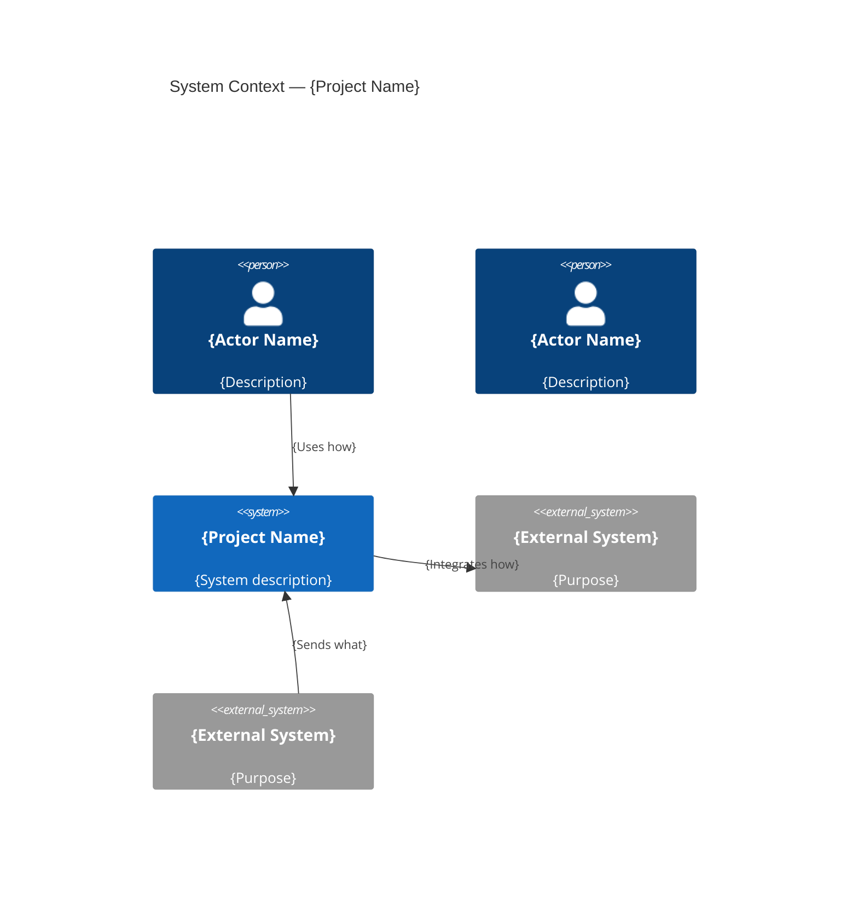
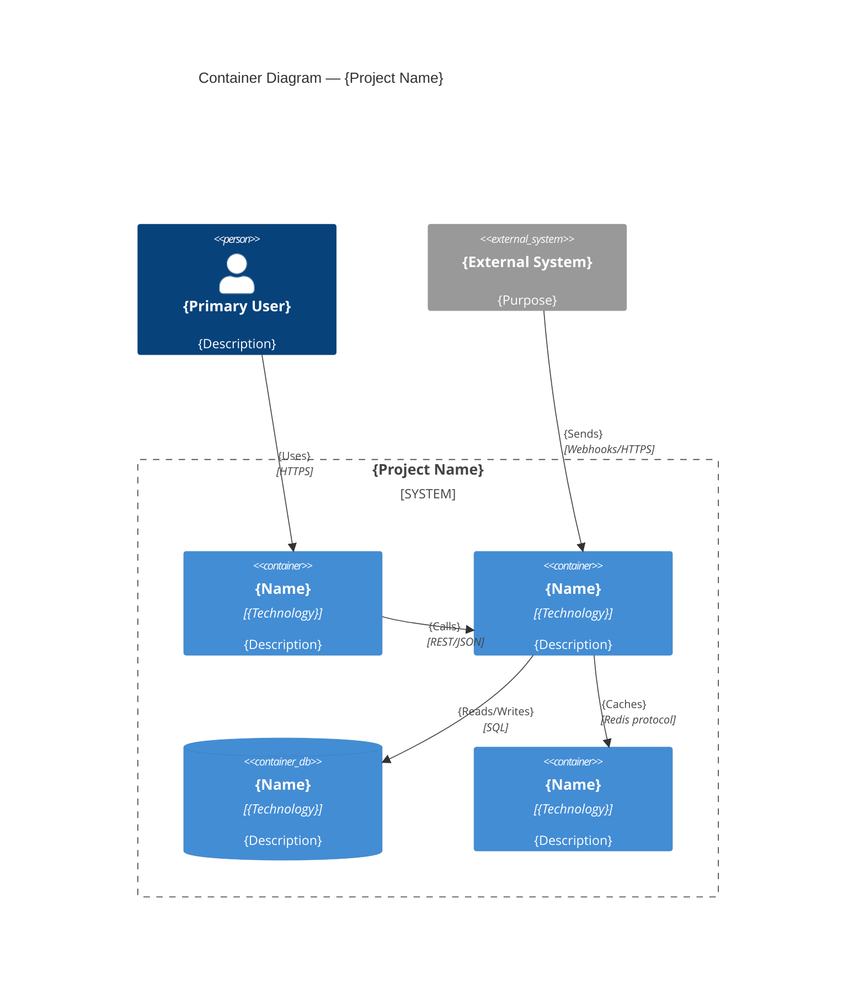
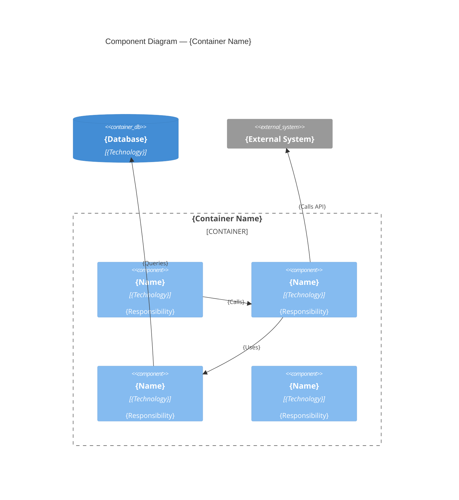
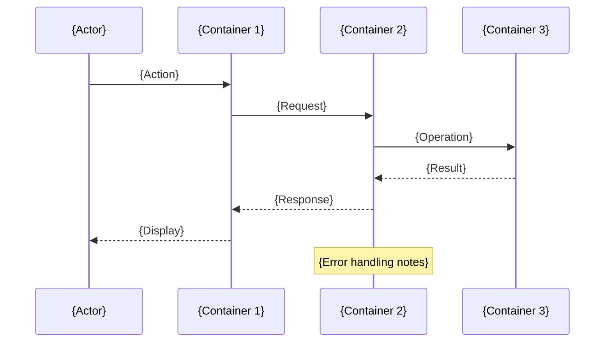

# Architecture Output Template

This is the expected structure for `architecture-draft.md` output. Follow this exactly.

---

```markdown
# System Architecture — {Project Name}

> **Project**: {Project Name}
> **Version**: draft | v{N}
> **Date Created**: {YYYY-MM-DD}
> **Last Updated**: {YYYY-MM-DD}
> **Status**: Draft | Under Review | Approved
> **Author**: AI-Generated
> **Source**: Based on `tech-stack-final.md` and `scope-final.md`

{If refine mode, include Change Log here}

---

## 1. Architecture Overview

{2-3 paragraph summary of architectural approach and key decisions. Explain the chosen
architecture style and why it fits this project's requirements and constraints.}

**Architecture Style**: {Monolith / Modular Monolith / Microservices / Serverless / Hybrid} — ✅/🔶
**Justification**: {Why this style fits the project requirements, team size, timeline, and scalability targets. Reference specific constraints CON-xxx and quality attributes QA-xxx.}

---

## 2. System Context (C4 Level 1)

{Mermaid C4Context diagram showing all actors, the system, and external systems}



**Actors**:

| Actor | Type | Description | Source | Confidence |
|-------|------|-------------|--------|------------|
| {name} | Person / External System | {description} | {persona ID or INT-xxx} | ✅/🔶/❓ |

---

## 3. Container Diagram (C4 Level 2)

{Mermaid C4Container diagram showing all deployable units}



**Containers**:

| Container | Technology | Purpose | Communicates With | Confidence |
|-----------|-----------|---------|-------------------|------------|
| {name} | {from tech stack} | {description} | {list of connections} | ✅/🔶/❓ |

---

## 4. Component Diagrams (C4 Level 3)

{Only for containers with >3 internal modules}

### 4.1 {Container Name} Components

{Mermaid C4Component diagram}



**Components**:

| Component | Responsibility | Pattern | Epics Served |
|-----------|---------------|---------|-------------|
| {name} | {description} | Controller / Service / Repository / Gateway / etc. | EP-xxx |

---

## 5. Key Workflow Sequences

### 5.1 {Workflow Name}

**Stories**: US-xxx, US-xxx
**Trigger**: {what initiates this workflow}



### 5.2 {Workflow Name}

{Repeat for each key workflow — minimum 2 for MVP}

---

## 6. Quality Attribute Mapping

| QA ID | Attribute | Target | Architectural Response | Components | Confidence |
|-------|-----------|--------|----------------------|------------|------------|
| QA-001 | {attribute} | {specific target} | {pattern/strategy used} | {which containers/components} | ✅/🔶/❓ |
| QA-002 | {attribute} | {specific target} | {pattern/strategy used} | {which containers/components} | ✅/🔶/❓ |

---

## 7. Deployment Overview

{High-level deployment topology — NOT full deployment design}

{Optional Mermaid deployment diagram or textual description}

| Environment | Purpose | Key Differences |
|-------------|---------|-----------------|
| Development | Local development | Single instance, local DB, mock externals |
| Staging | Pre-production testing | Mirrors prod topology, smaller scale |
| Production | Live system | Full scale, HA, monitoring, backups |

**Scaling Approach**: {horizontal / vertical / auto-scaling — brief description}
**Infrastructure**: {cloud provider, key services} — ✅/🔶/❓

---

## 8. Architecture Principles

| # | Principle | Rationale | Implications | Confidence |
|---|-----------|-----------|-------------|------------|
| 1 | {principle name} | {why this principle} | {what it means for implementation} | ✅/🔶/❓ |
| 2 | {principle name} | {why this principle} | {what it means for implementation} | ✅/🔶/❓ |

---

## 9. Q&A Log

| ID | Section | Question | Priority | Status |
|----|---------|----------|----------|--------|
| Q-001 | {section} | {question about assumed/unclear item} | HIGH/MED/LOW | Open/Resolved |

---

## 10. Readiness Assessment

### Confidence Summary

| Level | Count | Percentage |
|-------|-------|------------|
| ✅ CONFIRMED | {n} |  |
| ❓ UNCLEAR | {n} | {%} |

### Verdict: {Ready / Partially Ready / Not Ready}

{Explanation of verdict — what needs to happen before this architecture is ready for implementation}

---

## 11. Approval

| Role | Name | Decision | Date | Notes |
|------|------|----------|------|-------|
| Technical Lead | {name} | Pending | | |
| Architect | {name} | Pending | | |
| Product Owner | {name} | Pending | | |
```

---

## Section Checklist (ARC-10)

Use this to verify all required sections are present:

- [ ] Architecture Overview with style and justification
- [ ] System Context (C4 Level 1) with diagram and actor table
- [ ] Container Diagram (C4 Level 2) with diagram and container table
- [ ] Component Diagrams (C4 Level 3) for complex containers
- [ ] Key Workflow Sequences (minimum 2)
- [ ] Quality Attribute Mapping (all QA-xxx covered)
- [ ] Deployment Overview
- [ ] Architecture Principles
- [ ] Q&A Log
- [ ] Readiness Assessment
- [ ] Approval
