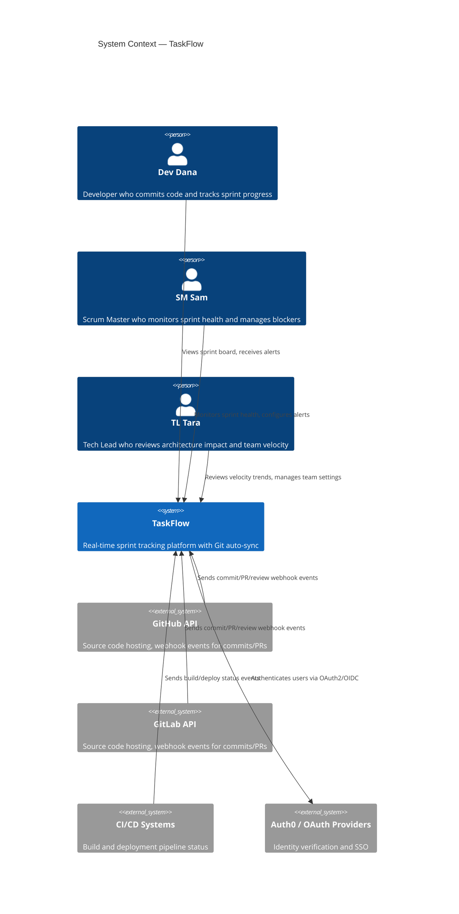
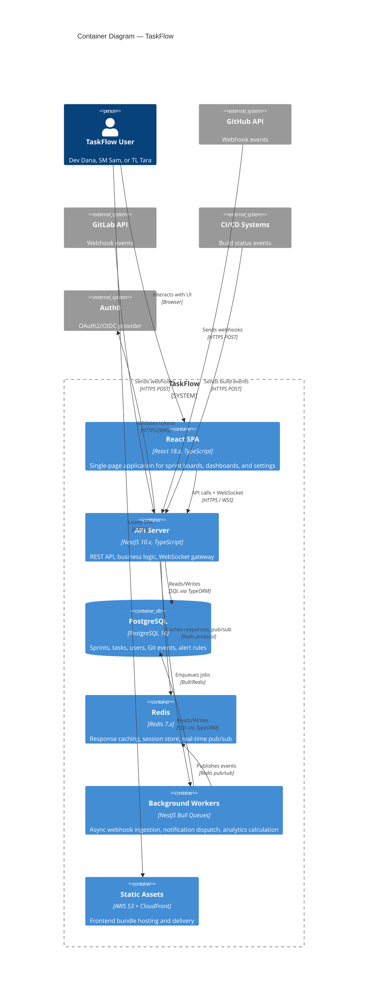
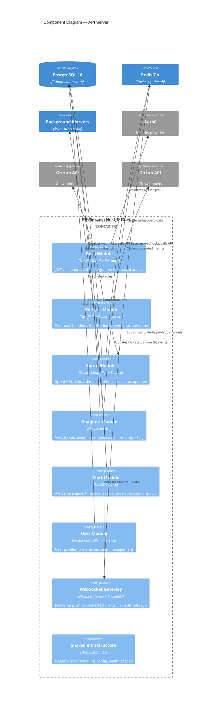
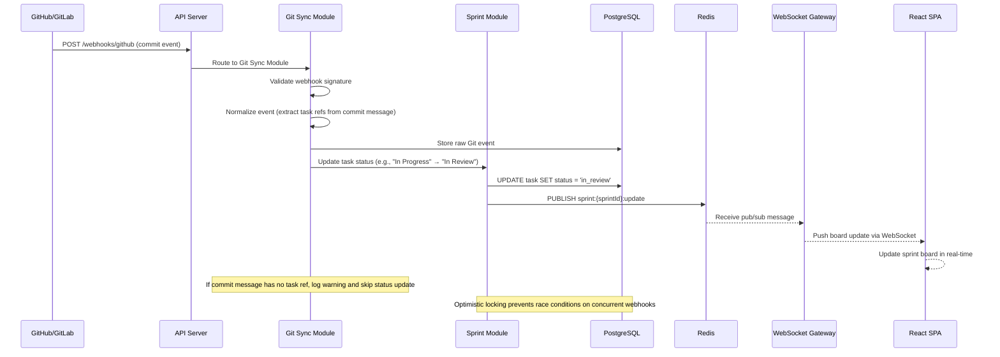
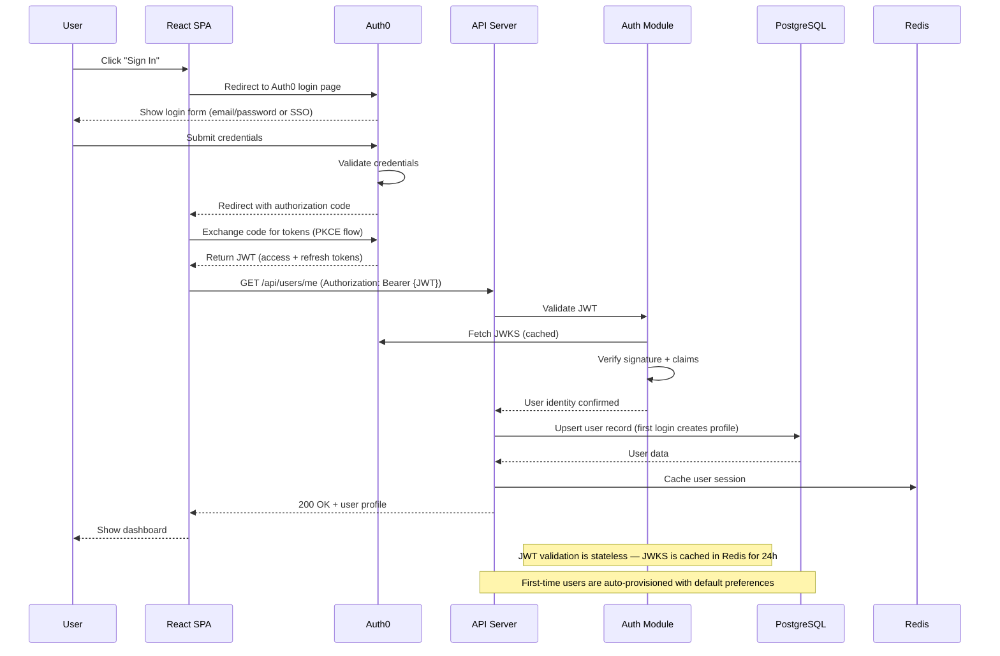

# System Architecture — TaskFlow

> **Project**: TaskFlow
> **Version**: 1.0
> **Date Created**: 2026-04-06
> **Last Updated**: 2026-04-06
> **Status**: Draft
> **Author**: AI-Generated
> **Source**: Based on `tech-stack-final.md` and `scope-final.md`

---

## 1. Architecture Overview

TaskFlow is a real-time sprint tracking platform that auto-syncs with Git and CI/CD systems to eliminate manual status updates. The architecture must support real-time updates via WebSocket, webhook ingestion from multiple Git providers, and a responsive dashboard for distributed teams.

The system follows a **Modular Monolith** architecture style. Given the small team (CON-003: 3-5 developers), aggressive MVP timeline (CON-001: 6-month delivery), and moderate scalability targets (QA-003: 50 teams), a modular monolith provides the right balance of simplicity and maintainability. The codebase is organized into feature modules with clear boundaries, enabling future extraction to microservices if scaling demands it.

Key architectural decisions include: NestJS as the API framework with module-per-feature organization, PostgreSQL for relational data with Redis for caching and real-time pub/sub, and a separate background worker process for async webhook processing and notifications.

**Architecture Style**: Modular Monolith — 🔶 ASSUMED
**Justification**: Small team size (CON-003: 3-5 devs) makes microservices overhead unjustifiable. MVP timeline (CON-001: 6 months) favors single deployable unit. Scalability target (QA-003: 50 teams) is achievable with horizontal scaling of a monolith. Module boundaries allow future service extraction without upfront distributed-systems complexity. Q&A ref: Q-001

---

## 2. System Context (C4 Level 1)



**Actors**:

| Actor | Type | Description | Source | Confidence |
|-------|------|-------------|--------|------------|
| Dev Dana | Person | Developer who commits code and tracks sprint progress | Persona P-001 | ✅ CONFIRMED |
| SM Sam | Person | Scrum Master who monitors sprint health and manages blockers | Persona P-002 | ✅ CONFIRMED |
| TL Tara | Person | Tech Lead who reviews architecture impact and team velocity | Persona P-003 | ✅ CONFIRMED |
| GitHub API | External System | Source code hosting, webhook events | INT-001 | ✅ CONFIRMED |
| GitLab API | External System | Source code hosting, webhook events | INT-002 | ✅ CONFIRMED |
| CI/CD Systems | External System | Build and deployment pipeline status | INT-003 | ✅ CONFIRMED |
| Auth0 / OAuth Providers | External System | Identity verification and SSO | INT-004 | 🔶 ASSUMED |

---

## 3. Container Diagram (C4 Level 2)



**Containers**:

| Container | Technology | Purpose | Communicates With | Confidence |
|-----------|-----------|---------|-------------------|------------|
| React SPA | React 18.x, TypeScript | User interface — sprint boards, dashboards, settings | API Server (REST + WebSocket), CDN (asset loading) | ✅ CONFIRMED |
| API Server | NestJS 10.x, TypeScript | Business logic, REST API, WebSocket gateway | PostgreSQL, Redis, Background Workers, Auth0, Git providers | ✅ CONFIRMED |
| PostgreSQL | PostgreSQL 16 | Primary data store — sprints, tasks, users, events, rules | API Server, Background Workers | ✅ CONFIRMED |
| Redis | Redis 7.x | Response caching, session store, real-time pub/sub channel | API Server, Background Workers | ✅ CONFIRMED |
| Background Workers | NestJS Bull Queues | Async webhook processing, notifications, analytics | PostgreSQL, Redis | 🔶 ASSUMED |
| Static Assets | AWS S3 + CloudFront | Frontend bundle hosting and CDN delivery | React SPA (serves assets) | 🔶 ASSUMED |

---

## 4. Component Diagrams (C4 Level 3)

### 4.1 API Server Components

The API Server has 8 internal modules, warranting a component diagram.



**Components**:

| Component | Responsibility | Pattern | Epics Served |
|-----------|---------------|---------|-------------|
| Auth Module | JWT validation, Auth0 integration, role-based access control | Guard / Middleware | EP-001 (all authenticated features) |
| Git Sync Module | Webhook receipt, event normalization, Git API client | Controller-Service | EP-002 (Git Integration) |
| Sprint Module | Sprint CRUD, board management, task status updates | Controller-Service-Repository | EP-003 (Sprint Dashboard) |
| Analytics Module | Velocity metrics, burndown calculation, trend reporting | Service-Repository | EP-004 (Analytics) |
| Alert Module | Rule engine, threshold evaluation, notification dispatch | Service (event-driven) | EP-005 (Alerts & Notifications) |
| User Module | User profiles, preferences, team management | Controller-Service-Repository | EP-001 (User Management) |
| WebSocket Gateway | Real-time push to clients, Redis pub/sub subscription | Gateway (Socket.IO) | EP-003 (Real-time updates) |
| Shared Infrastructure | Logging, error handling, config management, health checks | Cross-cutting module | All epics |

---

## 5. Key Workflow Sequences

### 5.1 Git Commit to Sprint Board Update

**Stories**: US-201, US-202, US-301
**Trigger**: Developer pushes a commit to GitHub/GitLab



### 5.2 User Authentication Flow

**Stories**: US-101, US-102
**Trigger**: User clicks "Sign In" on the TaskFlow SPA



### 5.3 Sprint Board Load with Caching

**Stories**: US-301, US-302
**Trigger**: User navigates to a sprint board page

```mermaid
sequenceDiagram
    participant U as User
    participant SPA as React SPA
    participant API as API Server
    participant SM as Sprint Module
    participant RD as Redis
    participant DB as PostgreSQL
    participant WS as WebSocket Gateway

    U->>SPA: Navigate to /sprints/{id}/board
    SPA->>API: GET /api/sprints/{id}/board
    API->>SM: Load sprint board data
    SM->>RD: GET sprint:{id}:board (check cache)

    alt Cache HIT
        RD-->>SM: Cached board data
    else Cache MISS
        SM->>DB: SELECT tasks, assignees, statuses WHERE sprint_id = {id}
        DB-->>SM: Task data
        SM->>RD: SET sprint:{id}:board (cache for 60s)
    end

    SM-->>API: Board data
    API-->>SPA: 200 OK + sprint board JSON
    SPA-->>U: Render sprint board

    SPA->>WS: Subscribe to sprint:{id}:updates (WebSocket)
    WS-->>SPA: Acknowledge subscription

    Note over RD: Cache TTL is 60s; invalidated immediately on task status change
    Note over WS: WebSocket keeps board in sync after initial load
```

---

## 6. Quality Attribute Mapping

| QA ID | Attribute | Target | Architectural Response | Components | Confidence |
|-------|-----------|--------|----------------------|------------|------------|
| QA-001 | Performance | Dashboard loads <2s | Redis caching (60s TTL) for sprint board data; CDN for static assets via CloudFront; PostgreSQL connection pooling via TypeORM; paginated API responses for large datasets | Redis, CDN, API Server, PostgreSQL | ✅ CONFIRMED |
| QA-002 | Availability | 99.5% uptime | Health check endpoints on API Server (/health); Redis configured with persistence (AOF); graceful degradation — if Redis down, bypass cache and serve from DB; PM2/container restart on crash | API Server (Shared Infra), Redis, Background Workers | 🔶 ASSUMED |
| QA-003 | Scalability | Support 50 teams | Stateless API Server enables horizontal scaling behind load balancer; Redis pub/sub scales with multiple API instances; database read replicas [FUTURE] for analytics queries; connection pooling limits per-instance DB load | API Server, Redis, PostgreSQL | 🔶 ASSUMED |
| QA-004 | Security | Auth + data protection | Auth0 for identity (OAuth2/OIDC); JWT validation on every API request; HTTPS everywhere (TLS termination at load balancer); input validation middleware (class-validator); webhook signature verification; rate limiting on public endpoints | Auth Module, API Server (Shared Infra), Git Sync Module | ✅ CONFIRMED |
| QA-005 | Usability | Real-time feedback | WebSocket Gateway pushes sprint board updates instantly via Redis pub/sub; optimistic UI updates in React SPA; loading states and error boundaries in frontend | WebSocket Gateway, Redis, React SPA | 🔶 ASSUMED |
| QA-006 | Maintainability | Easy to extend | Modular monolith with NestJS module-per-feature; dependency injection via NestJS IoC container; TypeScript for type safety; structured logging with correlation IDs; clear module boundaries enable future service extraction | All API Server components | ✅ CONFIRMED |

---

## 7. Deployment Overview

| Environment | Purpose | Key Differences |
|-------------|---------|-----------------|
| Development | Local development | Single instance, local PostgreSQL (Docker), local Redis (Docker), mock Auth0, hot-reload enabled |
| Staging | Pre-production testing | AWS ECS (1 task), RDS PostgreSQL (db.t3.small), ElastiCache Redis (cache.t3.micro), Auth0 dev tenant |
| Production | Live system | AWS ECS (2+ tasks, auto-scaling), RDS PostgreSQL (db.r6g.large, Multi-AZ), ElastiCache Redis (cache.r6g.large, cluster mode), Auth0 production tenant, CloudFront CDN |

**Scaling Approach**: Horizontal scaling of API Server containers behind AWS ALB. Auto-scaling based on CPU/memory thresholds. Redis handles pub/sub across multiple API instances. Database scales vertically initially; read replicas added [FUTURE] when analytics load increases. — 🔶 ASSUMED

**Infrastructure**: AWS (ECS, RDS, ElastiCache, S3, CloudFront, ALB) — 🔶 ASSUMED — Cloud provider not explicitly confirmed in constraints. Q&A ref: Q-002

---

## 8. Architecture Principles

| # | Principle | Rationale | Implications | Confidence |
|---|-----------|-----------|-------------|------------|
| 1 | API-First Design | Frontend (React SPA) and backend (NestJS API) are separate deployables communicating via REST. Enables future mobile clients without backend changes. | All features must be exposed as API endpoints before building UI. API contracts defined before implementation. | ✅ CONFIRMED |
| 2 | Modular Monolith | Small team (3-5 devs) cannot sustain microservices operational overhead. Module boundaries allow future extraction. | Each feature is a NestJS module with own controller, service, repository. Modules communicate via dependency injection, not HTTP. Cross-module imports must be explicit. | 🔶 ASSUMED |
| 3 | Event-Driven for Real-Time | Core value proposition is real-time sprint updates. Push model via WebSocket is more responsive than polling. | All state changes publish events to Redis pub/sub. WebSocket Gateway subscribes and pushes to clients. Frontend must handle WebSocket reconnection. | ✅ CONFIRMED |
| 4 | Cache-First Reads | Dashboard performance target (QA-001: <2s) requires avoiding database round-trips for frequently accessed data. | Sprint board data cached in Redis with 60s TTL. Cache invalidated on write operations. Fallback to database on cache miss. Cache warming not needed for MVP. | 🔶 ASSUMED |
| 5 | Progressive Enhancement | MVP ships with core features; architecture supports adding capabilities without refactoring. | Extension points documented for: read replicas, microservice extraction, additional Git providers, mobile clients. [FUTURE] items tagged but not implemented. | ✅ CONFIRMED |

---

## 9. Q&A Log

| ID | Section | Question | Priority | Status |
|----|---------|----------|----------|--------|
| Q-001 | Architecture Overview | Is modular monolith the right choice, or does the team have experience with microservices that would change this decision? | HIGH | Open |
| Q-002 | Deployment Overview | Is AWS the confirmed cloud provider? Are there organizational constraints on cloud provider choice? | MED | Open |
| Q-003 | Containers | Should background workers be a separate deployable, or can they run as a thread pool within the API Server for MVP simplicity? | MED | Open |

---

## 10. Readiness Assessment

### Confidence Summary

| Level | Count | Percentage |
|-------|-------|------------|
| ✅ CONFIRMED | 16 | 55% |
| 🔶 ASSUMED | 11 | 38% |
| ❓ UNCLEAR | 2 | 7% |

### Diagram Coverage

| Diagram Type | Required | Present | Status |
|-------------|----------|---------|--------|
| C4 Level 1 (System Context) | Yes | Yes | PASS |
| C4 Level 2 (Container) | Yes | Yes | PASS |
| C4 Level 3 (API Server Components) | Yes (>3 modules) | Yes | PASS |
| Sequence: Git Commit Flow | Yes (>3 participants) | Yes | PASS |
| Sequence: Auth Flow | Yes (>3 participants) | Yes | PASS |
| Sequence: Board Load | Yes (>3 participants) | Yes | PASS |

### QA Coverage

| QA ID | Mapped | Pattern Identified | Components Listed |
|-------|--------|--------------------|-------------------|
| QA-001 (Performance) | Yes | Yes | Yes |
| QA-002 (Availability) | Yes | Yes | Yes |
| QA-003 (Scalability) | Yes | Yes | Yes |
| QA-004 (Security) | Yes | Yes | Yes |
| QA-005 (Usability) | Yes | Yes | Yes |
| QA-006 (Maintainability) | Yes | Yes | Yes |

### Verdict: Partially Ready

The architecture document covers all required C4 levels, includes 3 sequence diagrams for MVP workflows, and maps all quality attributes to specific patterns and components. However, 38% of decisions are ASSUMED (particularly the modular monolith choice and AWS infrastructure) and 3 Q&A items remain open. The architecture is ready for team review but needs stakeholder confirmation on architecture style (Q-001) and cloud provider (Q-002) before finalizing.

**To reach Ready**: Resolve Q-001, Q-002, Q-003 and upgrade at least 5 ASSUMED items to CONFIRMED.

---

## 11. Approval

| Role | Name | Decision | Date | Notes |
|------|------|----------|------|-------|
| Technical Lead | {TL Name} | Pending | | Review architecture style and component design |
| Architect | {Architect Name} | Pending | | Validate C4 diagrams and QA mapping |
| Product Owner | {PO Name} | Pending | | Confirm MVP scope boundaries |
