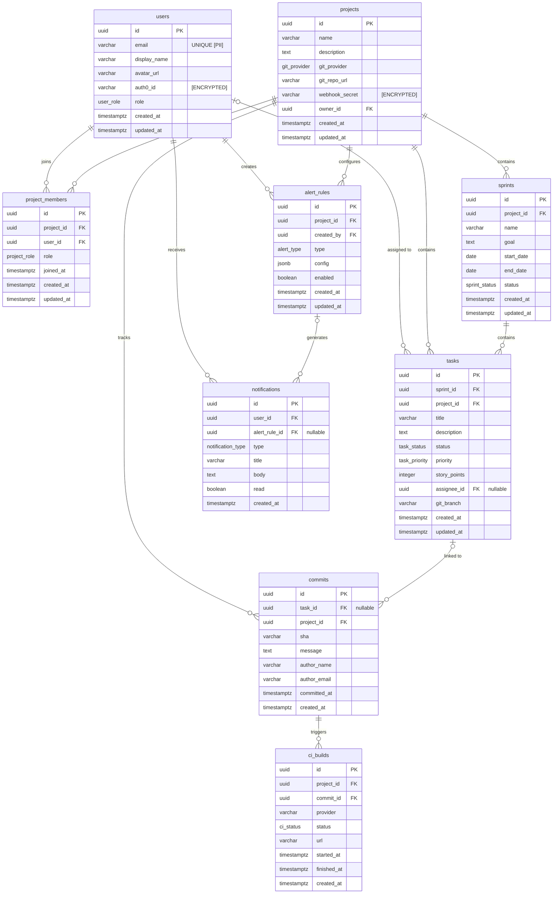

# Database Schema Design — TaskFlow

**Version**: draft
**Date**: 2026-04-06
**Database**: PostgreSQL 16
**ORM**: Prisma
**Status**: Draft

---

## 1. ERD Overview

---

## 2. Table Specifications

### 2.1 users

**Source Stories**: US-001 (user registration), US-002 (user authentication), US-010 (team management)
**MVP**: Yes
**Confidence**: ✅ CONFIRMED

| Column | Type | Constraints | Default | Description | Source |
|--------|------|-------------|---------|-------------|--------|
| id | UUID | PK, NOT NULL | gen_random_uuid() | Primary key | — |
| email | VARCHAR(255) | UNIQUE, NOT NULL | — | User email address [PII] | US-001 |
| display_name | VARCHAR(100) | NOT NULL | — | Display name shown in UI | US-001 |
| avatar_url | VARCHAR(500) | — | NULL | Profile avatar URL | US-001 |
| auth0_id | VARCHAR(255) | UNIQUE, NOT NULL | — | Auth0 subject identifier [ENCRYPTED] | US-002 |
| role | user_role | NOT NULL | 'member' | Global platform role | US-010 |
| created_at | TIMESTAMPTZ | NOT NULL | NOW() | Record creation time | — |
| updated_at | TIMESTAMPTZ | NOT NULL | NOW() | Last modification time | — |

**Indexes**:

| Name | Columns | Type | Justification |
|------|---------|------|---------------|
| users_pkey | id | B-tree (PK) | Primary key lookup |
| idx_users_email | email | B-tree, UNIQUE | Login lookup, duplicate prevention |
| idx_users_auth0_id | auth0_id | B-tree, UNIQUE | Auth0 callback lookup |

**Relationships**: None (referenced by other tables)

---

### 2.2 projects

**Source Stories**: US-003 (project creation), US-004 (Git integration), US-011 (webhook setup)
**MVP**: Yes
**Confidence**: ✅ CONFIRMED

| Column | Type | Constraints | Default | Description | Source |
|--------|------|-------------|---------|-------------|--------|
| id | UUID | PK, NOT NULL | gen_random_uuid() | Primary key | — |
| name | VARCHAR(200) | NOT NULL | — | Project name | US-003 |
| description | TEXT | — | NULL | Project description | US-003 |
| git_provider | git_provider | NOT NULL | — | Git platform type | US-004 |
| git_repo_url | VARCHAR(500) | NOT NULL | — | Repository URL for integration | US-004 |
| webhook_secret | VARCHAR(255) | NOT NULL | — | Webhook verification secret [ENCRYPTED] | US-011 |
| owner_id | UUID | FK → users.id, NOT NULL | — | Project owner | US-003 |
| created_at | TIMESTAMPTZ | NOT NULL | NOW() | Record creation time | — |
| updated_at | TIMESTAMPTZ | NOT NULL | NOW() | Last modification time | — |

**Indexes**:

| Name | Columns | Type | Justification |
|------|---------|------|---------------|
| projects_pkey | id | B-tree (PK) | Primary key lookup |
| idx_projects_owner_id | owner_id | B-tree | List projects owned by a user |
| idx_projects_name | name | B-tree | Search/filter projects by name |

**Relationships**:

| Column | References | ON DELETE | Description |
|--------|-----------|-----------|-------------|
| owner_id | users.id | RESTRICT | Prevent deleting user who owns projects |

---

### 2.3 project_members

**Source Stories**: US-010 (team management), US-012 (role-based access)
**MVP**: Yes
**Confidence**: ✅ CONFIRMED

| Column | Type | Constraints | Default | Description | Source |
|--------|------|-------------|---------|-------------|--------|
| id | UUID | PK, NOT NULL | gen_random_uuid() | Primary key | — |
| project_id | UUID | FK → projects.id, NOT NULL | — | Parent project | US-010 |
| user_id | UUID | FK → users.id, NOT NULL | — | Team member | US-010 |
| role | project_role | NOT NULL | 'member' | Role within this project | US-012 |
| joined_at | TIMESTAMPTZ | NOT NULL | NOW() | When the member joined | US-010 |
| created_at | TIMESTAMPTZ | NOT NULL | NOW() | Record creation time | — |
| updated_at | TIMESTAMPTZ | NOT NULL | NOW() | Last modification time | — |

**Indexes**:

| Name | Columns | Type | Justification |
|------|---------|------|---------------|
| project_members_pkey | id | B-tree (PK) | Primary key lookup |
| idx_pm_project_id | project_id | B-tree | List members of a project |
| idx_pm_user_id | user_id | B-tree | List projects for a user |
| idx_pm_project_user | project_id, user_id | B-tree, UNIQUE | Prevent duplicate memberships |

**Relationships**:

| Column | References | ON DELETE | Description |
|--------|-----------|-----------|-------------|
| project_id | projects.id | CASCADE | Remove memberships when project deleted |
| user_id | users.id | CASCADE | Remove memberships when user deleted |

---

### 2.4 sprints

**Source Stories**: US-005 (sprint planning), US-006 (sprint tracking), US-007 (sprint completion)
**MVP**: Yes
**Confidence**: ✅ CONFIRMED

| Column | Type | Constraints | Default | Description | Source |
|--------|------|-------------|---------|-------------|--------|
| id | UUID | PK, NOT NULL | gen_random_uuid() | Primary key | — |
| project_id | UUID | FK → projects.id, NOT NULL | — | Parent project | US-005 |
| name | VARCHAR(200) | NOT NULL | — | Sprint name (e.g., "Sprint 3") | US-005 |
| goal | TEXT | — | NULL | Sprint goal statement | US-005 |
| start_date | DATE | NOT NULL | — | Sprint start date | US-005 |
| end_date | DATE | NOT NULL | — | Sprint end date | US-005 |
| status | sprint_status | NOT NULL | 'planning' | Current sprint lifecycle status | US-006 |
| created_at | TIMESTAMPTZ | NOT NULL | NOW() | Record creation time | — |
| updated_at | TIMESTAMPTZ | NOT NULL | NOW() | Last modification time | — |

**Indexes**:

| Name | Columns | Type | Justification |
|------|---------|------|---------------|
| sprints_pkey | id | B-tree (PK) | Primary key lookup |
| idx_sprints_project_id | project_id | B-tree | List sprints for a project |
| idx_sprints_project_status | project_id, status | B-tree | Filter active sprint for a project |

**Relationships**:

| Column | References | ON DELETE | Description |
|--------|-----------|-----------|-------------|
| project_id | projects.id | CASCADE | Remove sprints when project deleted |

---

### 2.5 tasks

**Source Stories**: US-008 (task management), US-009 (task assignment), US-006 (sprint board)
**MVP**: Yes
**Confidence**: ✅ CONFIRMED

| Column | Type | Constraints | Default | Description | Source |
|--------|------|-------------|---------|-------------|--------|
| id | UUID | PK, NOT NULL | gen_random_uuid() | Primary key | — |
| sprint_id | UUID | FK → sprints.id, NOT NULL | — | Parent sprint | US-008 |
| project_id | UUID | FK → projects.id, NOT NULL | — | Parent project (denormalized for query performance) | US-008 |
| title | VARCHAR(300) | NOT NULL | — | Task title | US-008 |
| description | TEXT | — | NULL | Detailed task description | US-008 |
| status | task_status | NOT NULL | 'todo' | Current task workflow status | US-006 |
| priority | task_priority | NOT NULL | 'medium' | Task priority level | US-008 |
| story_points | INTEGER | CHECK (story_points > 0) | NULL | Estimated effort in story points | US-005 |
| assignee_id | UUID | FK → users.id, NULL | NULL | Assigned team member (nullable) | US-009 |
| git_branch | VARCHAR(255) | — | NULL | Associated Git branch name | US-004 |
| created_at | TIMESTAMPTZ | NOT NULL | NOW() | Record creation time | — |
| updated_at | TIMESTAMPTZ | NOT NULL | NOW() | Last modification time | — |

**Indexes**:

| Name | Columns | Type | Justification |
|------|---------|------|---------------|
| tasks_pkey | id | B-tree (PK) | Primary key lookup |
| idx_tasks_sprint_id | sprint_id | B-tree | Sprint board loads all tasks for a sprint |
| idx_tasks_project_id | project_id | B-tree | Project-level task queries |
| idx_tasks_assignee_id | assignee_id | B-tree | "My tasks" page filters by assignee |
| idx_tasks_sprint_status | sprint_id, status | B-tree | Sprint board groups tasks by status |
| idx_tasks_assignee_status | assignee_id, status | B-tree | "My tasks" filtered by status |

**Relationships**:

| Column | References | ON DELETE | Description |
|--------|-----------|-----------|-------------|
| sprint_id | sprints.id | CASCADE | Remove tasks when sprint deleted |
| project_id | projects.id | CASCADE | Remove tasks when project deleted |
| assignee_id | users.id | SET NULL | Unassign task when user deleted |

---

### 2.6 commits

**Source Stories**: US-004 (Git integration), US-013 (commit tracking)
**MVP**: Yes
**Confidence**: 🔶 ASSUMED — commit schema depends on webhook payload format from Git providers

| Column | Type | Constraints | Default | Description | Source |
|--------|------|-------------|---------|-------------|--------|
| id | UUID | PK, NOT NULL | gen_random_uuid() | Primary key | — |
| task_id | UUID | FK → tasks.id, NULL | NULL | Linked task (nullable, resolved from branch/message) | US-004 |
| project_id | UUID | FK → projects.id, NOT NULL | — | Parent project | US-004 |
| sha | VARCHAR(40) | NOT NULL | — | Git commit SHA hash | US-013 |
| message | TEXT | NOT NULL | — | Commit message | US-013 |
| author_name | VARCHAR(200) | NOT NULL | — | Commit author display name | US-013 |
| author_email | VARCHAR(255) | NOT NULL | — | Commit author email | US-013 |
| committed_at | TIMESTAMPTZ | NOT NULL | — | When the commit was made in Git | US-013 |
| created_at | TIMESTAMPTZ | NOT NULL | NOW() | Record creation time | — |

**Indexes**:

| Name | Columns | Type | Justification |
|------|---------|------|---------------|
| commits_pkey | id | B-tree (PK) | Primary key lookup |
| idx_commits_project_id | project_id | B-tree | List commits for a project |
| idx_commits_task_id | task_id | B-tree | List commits linked to a task |
| idx_commits_sha | project_id, sha | B-tree, UNIQUE | Deduplication on webhook replay |
| idx_commits_committed_at | project_id, committed_at | B-tree | Time-range queries for analytics |

**Relationships**:

| Column | References | ON DELETE | Description |
|--------|-----------|-----------|-------------|
| task_id | tasks.id | SET NULL | Preserve commit record if task deleted |
| project_id | projects.id | CASCADE | Remove commits when project deleted |

---

### 2.7 ci_builds

**Source Stories**: US-014 (CI/CD visibility), US-015 (build status tracking)
**MVP**: Yes
**Confidence**: 🔶 ASSUMED — CI provider integration details TBD

| Column | Type | Constraints | Default | Description | Source |
|--------|------|-------------|---------|-------------|--------|
| id | UUID | PK, NOT NULL | gen_random_uuid() | Primary key | — |
| project_id | UUID | FK → projects.id, NOT NULL | — | Parent project | US-014 |
| commit_id | UUID | FK → commits.id, NOT NULL | — | Associated commit | US-014 |
| provider | VARCHAR(50) | NOT NULL | — | CI provider name (e.g., "github_actions") | US-014 |
| status | ci_status | NOT NULL | 'pending' | Build execution status | US-015 |
| url | VARCHAR(500) | — | NULL | URL to build details in CI provider | US-015 |
| started_at | TIMESTAMPTZ | — | NULL | Build start time | US-015 |
| finished_at | TIMESTAMPTZ | — | NULL | Build finish time | US-015 |
| created_at | TIMESTAMPTZ | NOT NULL | NOW() | Record creation time | — |

**Indexes**:

| Name | Columns | Type | Justification |
|------|---------|------|---------------|
| ci_builds_pkey | id | B-tree (PK) | Primary key lookup |
| idx_ci_builds_project_id | project_id | B-tree | List builds for a project |
| idx_ci_builds_commit_id | commit_id | B-tree | Find builds for a specific commit |
| idx_ci_builds_project_status | project_id, status | B-tree | Dashboard filters builds by status |

**Relationships**:

| Column | References | ON DELETE | Description |
|--------|-----------|-----------|-------------|
| project_id | projects.id | CASCADE | Remove builds when project deleted |
| commit_id | commits.id | CASCADE | Remove builds when commit record deleted |

---

### 2.8 alert_rules

**Source Stories**: US-016 (alert configuration), US-017 (blocker detection)
**MVP**: Yes
**Confidence**: 🔶 ASSUMED — alert rule config schema depends on implementation

| Column | Type | Constraints | Default | Description | Source |
|--------|------|-------------|---------|-------------|--------|
| id | UUID | PK, NOT NULL | gen_random_uuid() | Primary key | — |
| project_id | UUID | FK → projects.id, NOT NULL | — | Parent project | US-016 |
| created_by | UUID | FK → users.id, NOT NULL | — | User who created the rule | US-016 |
| type | alert_type | NOT NULL | — | Type of alert rule | US-017 |
| config | JSONB | NOT NULL | '{}' | Rule-specific configuration (thresholds, filters) | US-016 |
| enabled | BOOLEAN | NOT NULL | true | Whether the rule is active | US-016 |
| created_at | TIMESTAMPTZ | NOT NULL | NOW() | Record creation time | — |
| updated_at | TIMESTAMPTZ | NOT NULL | NOW() | Last modification time | — |

**Indexes**:

| Name | Columns | Type | Justification |
|------|---------|------|---------------|
| alert_rules_pkey | id | B-tree (PK) | Primary key lookup |
| idx_alert_rules_project_id | project_id | B-tree | List alert rules for a project |
| idx_alert_rules_created_by | created_by | B-tree | List rules created by a user |
| idx_alert_rules_config | config | GIN | JSONB containment queries on config |
| idx_alert_rules_project_enabled | project_id, enabled | B-tree | Query active rules for a project |

**Relationships**:

| Column | References | ON DELETE | Description |
|--------|-----------|-----------|-------------|
| project_id | projects.id | CASCADE | Remove rules when project deleted |
| created_by | users.id | RESTRICT | Prevent deleting user who owns alert rules |

---

### 2.9 notifications

**Source Stories**: US-018 (notification delivery), US-019 (notification preferences)
**MVP**: Yes
**Confidence**: 🔶 ASSUMED — notification delivery mechanism TBD (in-app only vs email/push)

| Column | Type | Constraints | Default | Description | Source |
|--------|------|-------------|---------|-------------|--------|
| id | UUID | PK, NOT NULL | gen_random_uuid() | Primary key | — |
| user_id | UUID | FK → users.id, NOT NULL | — | Notification recipient | US-018 |
| alert_rule_id | UUID | FK → alert_rules.id, NULL | NULL | Source alert rule (nullable for system notifications) | US-018 |
| type | notification_type | NOT NULL | — | Notification category | US-018 |
| title | VARCHAR(300) | NOT NULL | — | Notification headline | US-018 |
| body | TEXT | — | NULL | Notification detail text | US-018 |
| read | BOOLEAN | NOT NULL | false | Whether the user has read it | US-019 |
| created_at | TIMESTAMPTZ | NOT NULL | NOW() | Record creation time | — |

**Indexes**:

| Name | Columns | Type | Justification |
|------|---------|------|---------------|
| notifications_pkey | id | B-tree (PK) | Primary key lookup |
| idx_notifications_user_id | user_id | B-tree | List notifications for a user |
| idx_notifications_user_read | user_id, read | B-tree | Unread notification count/list |
| idx_notifications_user_created | user_id, created_at DESC | B-tree | Notification feed ordered by time |
| idx_notifications_alert_rule_id | alert_rule_id | B-tree | Find notifications from a specific rule |

**Relationships**:

| Column | References | ON DELETE | Description |
|--------|-----------|-----------|-------------|
| user_id | users.id | CASCADE | Remove notifications when user deleted |
| alert_rule_id | alert_rules.id | SET NULL | Preserve notification if alert rule deleted |

---

## 3. Enum Definitions

| Enum Name | Values | Used By |
|-----------|--------|---------|
| user_role | admin, manager, member, viewer | users.role |
| project_role | admin, manager, member, viewer | project_members.role |
| git_provider | github, gitlab | projects.git_provider |
| sprint_status | planning, active, completed, cancelled | sprints.status |
| task_status | todo, in_progress, in_review, done | tasks.status |
| task_priority | critical, high, medium, low | tasks.priority |
| alert_type | blocker, stale_task, sprint_risk, ci_failure | alert_rules.type |
| notification_type | alert, mention, assignment, system | notifications.type |
| ci_status | pending, running, success, failure, cancelled | ci_builds.status |

---

## 4. Migration Strategy

**Migration Tool**: Prisma Migrate

**Ordering** (topological sort by FK dependencies):

| Order | Table | Dependencies | Notes |
|-------|-------|-------------|-------|
| 1 | users | — | Base table, no dependencies |
| 2 | projects | users | FK: owner_id → users.id |
| 3 | project_members | users, projects | FK: user_id, project_id |
| 4 | sprints | projects | FK: project_id → projects.id |
| 5 | tasks | sprints, projects, users | FK: sprint_id, project_id, assignee_id |
| 6 | commits | tasks, projects | FK: task_id (nullable), project_id |
| 7 | ci_builds | projects, commits | FK: project_id, commit_id |
| 8 | alert_rules | projects, users | FK: project_id, created_by |
| 9 | notifications | users, alert_rules | FK: user_id, alert_rule_id (nullable) |

**Seed Data**:

| Table | Seed Data | Purpose | Environment |
|-------|-----------|---------|-------------|
| users | Admin user (admin@taskflow.io) | Initial platform admin for first login | All |
| users | Demo users (3 team members) | Demo project walkthrough | Dev only |
| projects | Demo project ("TaskFlow Demo") | Onboarding experience | Dev only |
| sprints | Demo sprint with sample tasks | Show sprint board functionality | Dev only |

---

## 5. Data Security

| Table | Column | Classification | Protection | Notes |
|-------|--------|---------------|------------|-------|
| users | email | PII | Application-level access control | Visible to project teammates only |
| users | auth0_id | Sensitive | Encryption at rest | Auth provider subject ID, never exposed in API |
| projects | webhook_secret | Sensitive | Encryption at rest | Used to verify incoming webhook signatures |
| commits | author_email | PII | Application-level access control | Sourced from Git, visible in commit history |

---

## 6. Performance Considerations

| Concern | Table(s) | Strategy | Trigger | MVP |
|---------|----------|----------|---------|-----|
| Connection pooling | All | PgBouncer in transaction mode | From day one — Prisma + serverless needs pooling | Yes |
| High-volume inserts | commits | Batch inserts for webhook payloads with multiple commits | When webhook processing shows latency | Yes |
| Notification feed | notifications | Pagination with cursor-based approach (created_at + id) | From day one — unbounded feed | Yes |
| Read replica for analytics | commits, tasks | Read replica for dashboard aggregation queries | When analytics queries impact write performance | [FUTURE] |
| Table partitioning | commits | Range partition by committed_at (monthly) | When commits table exceeds 10M rows | [FUTURE] |
| Full-text search | tasks | GIN index on title + description with tsvector | When task search becomes a key feature | [FUTURE] |

---

## 7. Q&A Log

| ID | Question | Context | Answer | Impact | Status |
|----|----------|---------|--------|--------|--------|
| Q-001 | Should we use soft delete for users and projects? | Users and projects may need recovery. Soft delete adds complexity to all queries. | 🔶 ASSUMED: No soft delete for MVP. Use CASCADE deletes. Add soft delete in v2 if user recovery is needed. | MEDIUM | Open |
| Q-002 | Should tasks support JSONB metadata for custom fields? | Some teams want custom task fields. JSONB would allow flexibility without schema changes. | 🔶 ASSUMED: Not in MVP. Custom fields are a [FUTURE] feature. If added, use a separate task_metadata JSONB column. | LOW | Open |
| Q-003 | Should we use a time-series extension for commit/build metrics? | TimescaleDB or pg_partman could improve analytics queries on time-series data. | 🔶 ASSUMED: Standard PostgreSQL for MVP. Evaluate TimescaleDB when analytics queries show performance issues. | LOW | Open |

---

## 8. Readiness Assessment

### Item Counts

| Confidence | Count | Percentage |
|------------|-------|------------|
| ✅ CONFIRMED | 5 | 36% |
| 🔶 ASSUMED | 9 | 64% |
| ❓ UNCLEAR | 0 | 0% |
| **Total** | 14 | 100% |

Items counted: 9 tables (users ✅, projects ✅, project_members ✅, sprints ✅, tasks ✅, commits 🔶, ci_builds 🔶, alert_rules 🔶, notifications 🔶) + 5 key relationships (project→user 🔶, task→sprint 🔶, commit→task 🔶, notification→alert_rule 🔶, ci_build→commit 🔶).

### Verdict: PARTIALLY READY

Core tables (users, projects, project_members, sprints, tasks) are confirmed and ready for implementation. Supporting tables (commits, ci_builds, alert_rules, notifications) are assumed and depend on finalizing external integration details (Git webhook payloads, CI provider APIs, notification delivery mechanism). Recommend proceeding with core table implementation while resolving Q&A items for supporting tables.

---

## 9. Approval

| Role | Name | Date | Verdict |
|------|------|------|---------|
| Tech Lead | | | |
| Backend Lead | | | |
| DBA / Data Engineer | | | |
