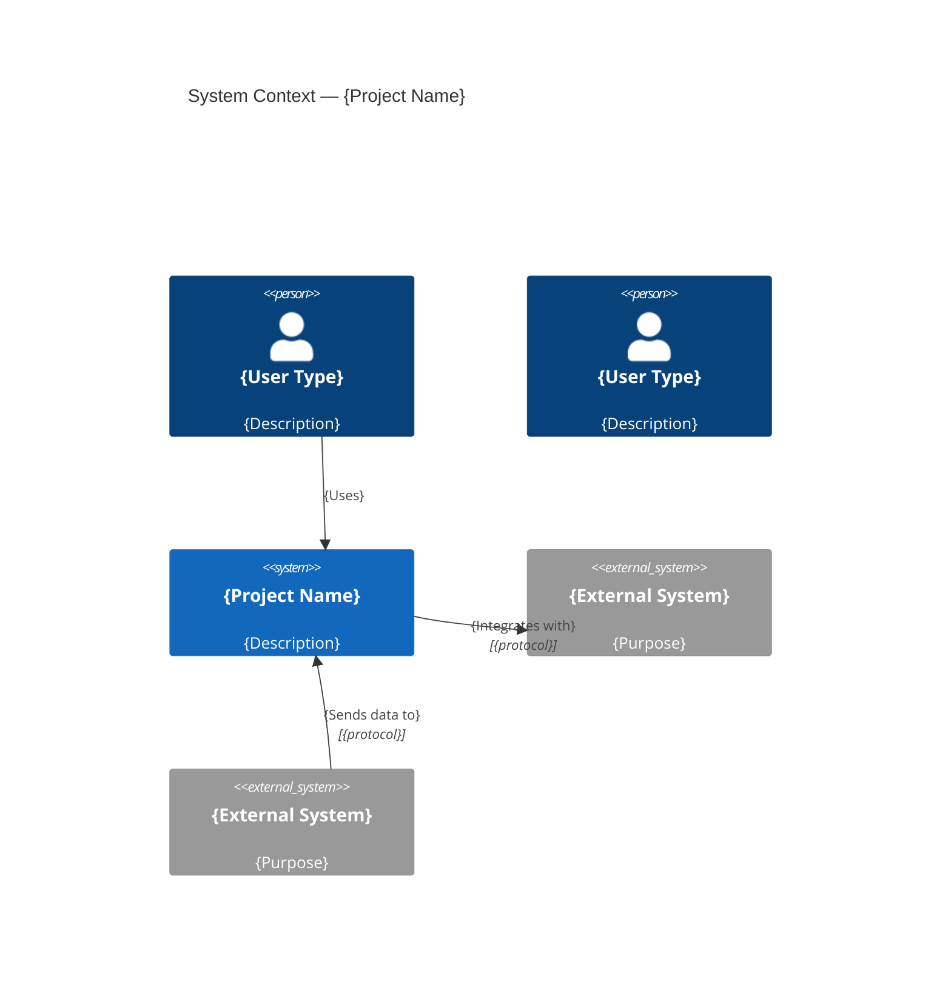
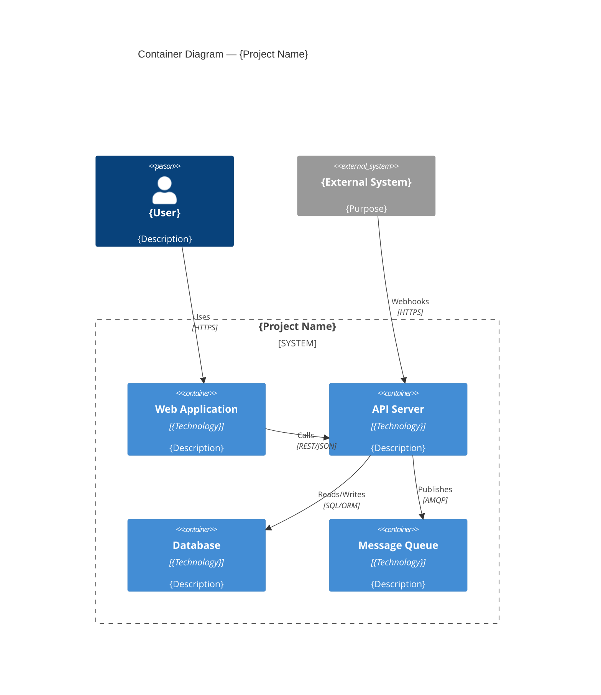
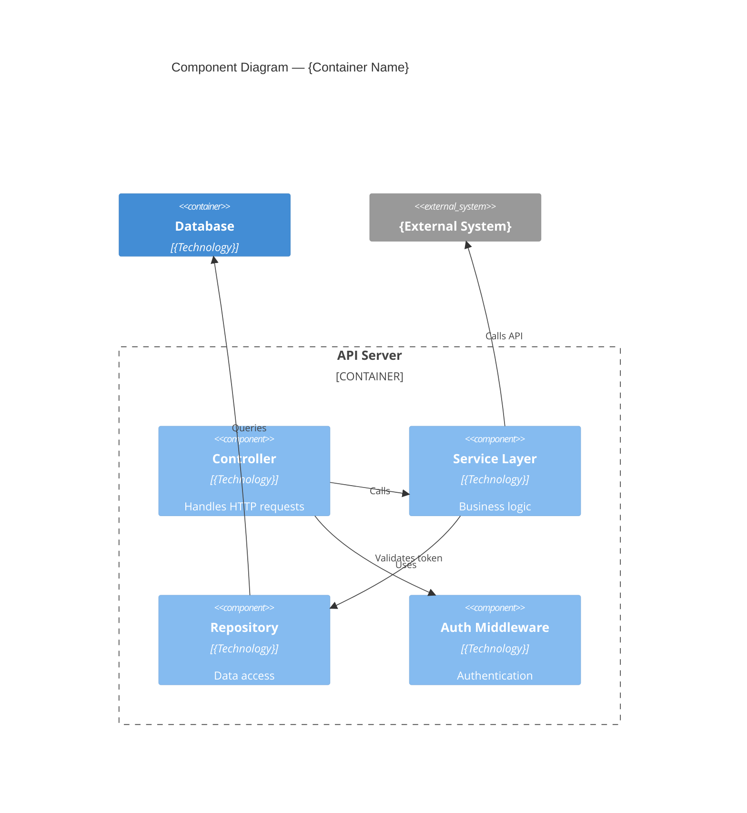
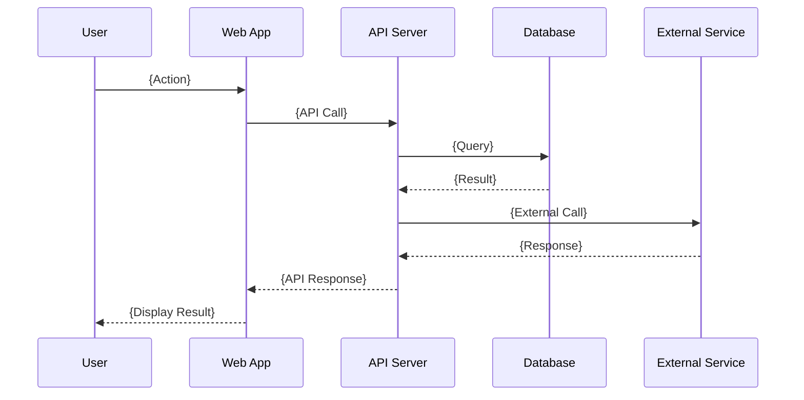

# C4 Architecture Diagram Templates

Standard C4 model diagrams using Mermaid syntax.

---

## Level 1: System Context

Shows the system and its relationships with users and external systems.

---

## Level 2: Container Diagram

Shows the high-level technology choices and how containers communicate.

---

## Level 3: Component Diagram

Shows the internals of a container — modules, services, controllers.

---

## Sequence Diagram (for key workflows)

---

## Rules

- Level 1 (Context) is REQUIRED for every project
- Level 2 (Container) is REQUIRED — shows technology choices
- Level 3 (Component) is REQUIRED for containers with >3 internal modules
- Sequence diagrams are REQUIRED for complex workflows (>3 participants)
- Every diagram must have a title
- Labels on relationships describe WHAT is communicated, not HOW
- Include technology names in container descriptions
