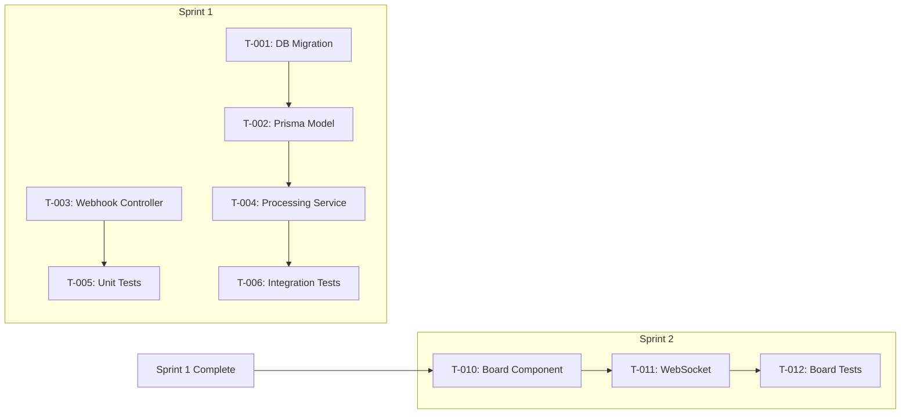

# Sprint Planning Guide

Techniques for planning sprints, decomposing stories into tasks, managing capacity, and avoiding common planning pitfalls.

---

## Technique 1: Sprint Goal Setting

### What Makes a Good Sprint Goal

A sprint goal is a single sentence that describes what the team will achieve by the end of the sprint. It drives story selection and keeps the team focused.

**Format**: "By end of Sprint N, [who] can [do what]."

| Quality | Example | Why |
|---------|---------|-----|
| Good | "Dev Dana can connect a GitHub repo and see commits on the sprint board" | Specific, measurable, tied to a persona |
| Good | "The platform foundation is in place with auth, DB schema, and CI pipeline" | Clear deliverable, foundational |
| Good | "Scrum Master Sam can view real-time sprint board updates and filter by assignee" | User-centric, testable |
| Bad | "Work on various tasks" | No focus, no measurable outcome |
| Bad | "Make progress on the backlog" | Vague, applies to any sprint |
| Bad | "Fix bugs and do some refactoring" | No cohesive theme |

### Goal-Driven Story Selection

The sprint goal determines which stories to pull — not the other way around:

1. Define the sprint goal based on the next release milestone or epic theme
2. Select stories that contribute to the goal
3. Only add stories outside the goal theme if capacity remains AND they have no dependencies on future work
4. If a story doesn't fit the goal, defer it to the next sprint — don't dilute the goal

### Goal Alignment with Releases

| Release Stage | Sprint Goal Focus |
|---------------|-------------------|
| MVP Sprint 1 | Foundation: auth, DB setup, core infrastructure |
| MVP Sprint 2-3 | Core features: primary user workflows |
| MVP Final Sprint | Integration, polish, deployment readiness |
| Post-MVP | Enhancement themes: notifications, analytics, integrations |

---

## Technique 2: Story-to-Task Decomposition

### Layer Walk-Through Method

For each user story, walk through the architecture layers to identify implementation tasks:

| Layer | Task Types | Examples |
|-------|-----------|---------|
| **Database** | Migration, seed data, model/entity definition | Create `commits` table migration, define Prisma model |
| **Service** | Business logic, validation, error handling | Implement webhook validation service, commit processing service |
| **API** | Controller/route, DTO/validation, middleware | Create POST `/webhooks/github` endpoint, add HMAC middleware |
| **Frontend** | Components, state management, API integration | Build sprint board component, add WebSocket connection |
| **Test** | Unit tests, integration tests, API tests | Write unit tests for webhook validation, integration test for webhook-to-DB pipeline |
| **Infrastructure** | Configuration, environment variables, deployment | Configure webhook secret in env, add health check endpoint |

### Task Sizing Rules

| Size | Hours | Action |
|------|-------|--------|
| Too small | < 2 hours | Combine with a related task |
| Right size | 2-8 hours | Keep as-is |
| Too large | > 8 hours | Split into smaller tasks |
| Way too large | > 16 hours | This is a story, not a task — decompose further |

### Decomposition Checklist

For each story, verify the task list includes:

- [ ] All database changes (migrations, seeds, models)
- [ ] All service/business logic
- [ ] All API endpoints and middleware
- [ ] All frontend components and state
- [ ] Unit tests for each service/component
- [ ] Integration tests for cross-layer flows
- [ ] API tests for each endpoint
- [ ] Configuration and environment setup
- [ ] Documentation updates (API docs, README)

### Task ID Convention

Tasks use the format `T-NNN` with sequential numbering across the entire sprint plan:
- T-001 through T-NNN for Sprint 1
- Continue numbering into Sprint 2 (T-NNN+1, ...)
- This ensures globally unique task IDs

---

## Technique 3: Capacity Planning

### Capacity Formula

```
Available Capacity = Team Members x Sprint Days x Focus Factor
```

| Variable | Typical Value | Notes |
|----------|--------------|-------|
| Sprint Days | 10 (2-week sprint) | Subtract holidays, planned leave |
| Focus Factor | 0.6 - 0.8 | Accounts for meetings, reviews, stand-ups, context switching |
| New team | 0.6 | More overhead, learning curve |
| Established team | 0.7 - 0.8 | Settled processes, less overhead |

### Story Point to Hours Mapping

This is a rough guide for capacity validation — not for estimation:

| Story Points | Approximate Hours | Team Days |
|-------------|-------------------|-----------|
| 1 | 2-4 hours | 0.5 day |
| 2 | 4-8 hours | 1 day |
| 3 | 8-12 hours | 1.5 days |
| 5 | 16-24 hours | 2-3 days |
| 8 | 32-40 hours | 4-5 days |
| 13 | 40-60 hours | Full sprint (1 person) |

### Utilization Targets

| Utilization | Status | Action |
|-------------|--------|--------|
| < 60% | Under-committed | Consider pulling more stories |
| 60-80% | Healthy | Ideal range with buffer |
| 80-90% | Full | Acceptable for experienced teams |
| > 90% | Over-committed | Remove stories or reduce scope — no buffer for surprises |

### Buffer Allocation

Reserve 10-20% of capacity for:
- Bug fixes discovered during the sprint
- Technical debt items
- Unplanned production issues
- Sprint review / retrospective action items
- Estimation errors (stories taking longer than expected)

---

## Technique 4: Dependency Management

### Dependency Types

| Type | Example | Mitigation |
|------|---------|------------|
| **Task-to-task** | DB migration before API endpoint | Order tasks within sprint |
| **Story-to-story** | Auth before protected features | Order stories within sprint or across sprints |
| **Sprint-to-sprint** | Sprint 1 foundation before Sprint 2 features | Plan sprints sequentially |
| **External** | Third-party API access, design assets | Identify early, track as risks |

### Dependency Rules

1. **Same-sprint dependencies**: Order tasks so dependencies complete first. Assign dependent tasks to start after dependency is done.
2. **Cross-sprint dependencies**: If Story B depends on Story A, either put both in the same sprint (A first) or put A in an earlier sprint.
3. **Minimize cross-sprint deps**: The fewer dependencies between sprints, the more flexibility the team has.
4. **External dependencies**: Identify in Sprint 0 or Sprint 1. Assign an owner to track and resolve.

### Dependency Visualization

Use Mermaid to show both sprint-level and task-level dependencies:



---

## Technique 5: DoR Validation Checklist

Before including a story in a sprint, verify it meets the Definition of Ready:

| DoR Criterion | Check | If Missing |
|---------------|-------|------------|
| Story format | Written as "As a [persona], I want [action], so that [benefit]" | Return to `/req-userstory` |
| Acceptance criteria | Defined in Given/When/Then (Gherkin) format | Return to `/req-userstory` |
| Story points | Estimated with story points | Estimate during sprint planning |
| Dependencies | Identified and resolved (or planned in earlier sprint) | Map dependencies, reorder backlog |
| Design artifacts | Architecture/API/DB design exists for this story's scope | Run relevant `/design-*` skill |
| Test cases | Test cases exist for this story's acceptance criteria | Run `/test-cases` |
| No open blockers | No unresolved questions blocking implementation | Resolve via Q&A or stakeholder input |

### DoR Validation Outcomes

| Outcome | Action |
|---------|--------|
| All criteria met | Include in sprint, mark as Ready |
| Minor gaps (1-2 non-critical) | Include with remediation tasks in sprint |
| Major gaps (missing design, no ACs) | Defer to later sprint, flag in Q&A |
| Blocked | Do not include, document blocker |

---

## Technique 6: Sprint Anti-patterns

Common sprint planning mistakes and how to avoid them:

| Anti-pattern | Problem | Fix |
|-------------|---------|-----|
| **Over-commitment** | Planning >90% capacity, no buffer | Target 70-80% utilization, leave room for surprises |
| **Scope creep** | Adding stories mid-sprint | Protect the sprint backlog; new items go to product backlog |
| **No sprint goal** | Just a pile of unrelated stories | Define goal first, select stories that support it |
| **Big stories** | Stories spanning the entire sprint | Split stories to <=8 points before sprint planning |
| **Consistent carry-over** | Stories regularly carry across sprints | Velocity estimate is wrong — recalibrate downward |
| **Ignoring dependencies** | Pulling a story whose dependency isn't done | Map dependencies before committing stories |
| **Hero culture** | One person assigned 60% of tasks | Balance workload, cross-train team members |
| **Missing test tasks** | Tests treated as afterthought | Include test tasks in breakdown, allocate 30-40% of effort |
| **No buffer** | Every hour allocated to feature work | Reserve 10-20% for unplanned work |
| **Sprint 0 neglect** | Jumping into features without infrastructure | First sprint should include project setup, CI/CD, auth foundation |
