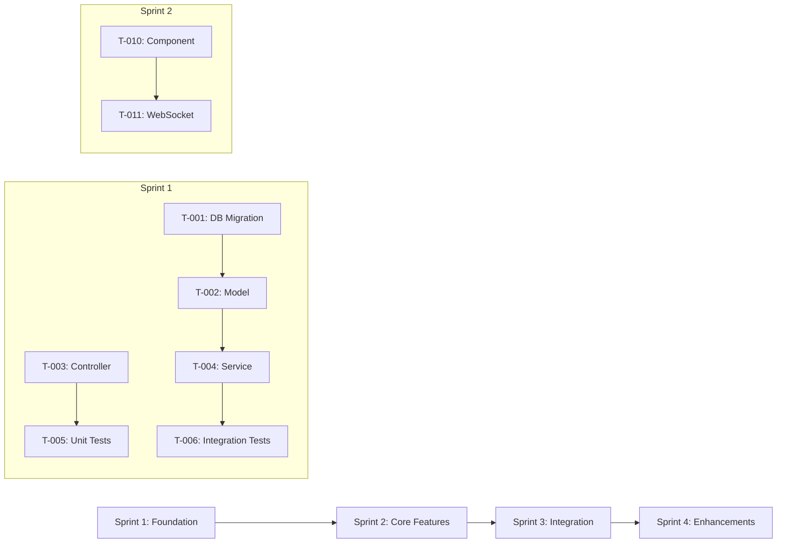

# Sprint Plan Output Template

This is the expected structure for `sprint-plan-draft.md` output. Follow this exactly.

---

```markdown
# Sprint Execution Plan — {Project Name}

> **Project**: {Project Name}
> **Version**: draft | v{N}
> **Date Created**: {YYYY-MM-DD}
> **Last Updated**: {YYYY-MM-DD}
> **Velocity**: {N} points/sprint
> **Sprint Duration**: {N} weeks
> **Team Size**: {N}
> **Status**: Draft | Under Review | Approved
> **Author**: AI-Generated
> **Source**: Derived from `backlog-final.md`, `userstories-final.md`, `dor-dod-final.md`

{If refine mode, include Change Log here}

---

## 1. Sprint Overview

| Sprint | Goal | Stories | Points | Release | Status |
|--------|------|---------|--------|---------|--------|
| Sprint 1 | {1-sentence goal} | {N} | {N} | MVP | Planned |
| Sprint 2 | {1-sentence goal} | {N} | {N} | MVP | Planned |
| Sprint 3 | {1-sentence goal} | {N} | {N} | MVP | Planned |
| Sprint 4 | {1-sentence goal} | {N} | {N} | R2 | High-level |
| ... | | | | | |

**Capacity Summary**:

| Sprint | Available Days | Focus Factor | Capacity (pts) | Committed (pts) | Buffer (pts) | Utilization |
|--------|---------------|-------------|----------------|-----------------|-------------|-------------|
| Sprint 1 | {days} | {factor} | {pts} | {pts} | {pts} |  |
| ... | | | | | | |

---

## 2. DoR Validation

| Story | DoR Criteria | Status | Gaps | Remediation |
|-------|-------------|--------|------|-------------|
| US-xxx | DOR-01, DOR-02, DOR-03, DOR-04, DOR-05 | ✅ Ready | — | — |
| US-yyy | DOR-01, DOR-02, DOR-04 | ⚠️ Not Ready | DOR-03: No test cases, DOR-05: Missing API design | Run `/test-cases`, run `/design-api` |

---

## 3. Sprint {N} Plan

### Sprint Goal

{1-sentence goal aligned with epic theme or release milestone}

### Committed Stories

| Story | Title | Points | Priority | Epic | Owner |
|-------|-------|--------|----------|------|-------|
| US-xxx | {title} | {pts} | Must Have | EPIC-xxx | {name} |
| US-yyy | {title} | {pts} | Must Have | EPIC-xxx | {name} |

### Capacity

| Member | Role | Available Days | Capacity (pts) | Allocated (pts) | Utilization |
|--------|------|---------------|----------------|-----------------|-------------|
| {name} | Backend | {days} | {pts} | {pts} |  |
| Buffer | — | — | — | {pts} | — |
| **Total** | | {days} | {pts} | {pts} | {%} |

### Task Breakdown

#### US-xxx: {Story Title} ({N} pts)

| Task ID | Description | Hours | Owner | Depends On | DoD | Layer |
|---------|-------------|-------|-------|-----------|-----|-------|
| T-001 | Create database migration for {table} | {hrs} | {name} | — | DOD-01, DOD-03 | Database |
| T-002 | Implement {model} entity/model | {hrs} | {name} | T-001 | DOD-01, DOD-03 | Database |
| T-003 | Implement {service} business logic | {hrs} | {name} | T-002 | DOD-01, DOD-03 | Service |
| T-004 | Create {endpoint} API endpoint | {hrs} | {name} | T-003 | DOD-01, DOD-03 | API |
| T-005 | Write unit tests for {service} | {hrs} | {name} | T-003 | DOD-02, DOD-04 | Test |
| T-006 | Write integration test for {flow} | {hrs} | {name} | T-004 | DOD-02, DOD-04 | Test |

#### US-yyy: {Story Title} ({N} pts)

{Same format as above}

{Repeat for each story in this sprint}

---

{Repeat Section 3 for each detailed sprint (MVP sprints)}

---

## {N}. Post-MVP Sprints (High-Level)

### Sprint {M}: {Goal}

| Story | Title | Points | Priority | Release |
|-------|-------|--------|----------|---------|
| US-xxx | {title} | {pts} | Should Have | R2 |

**Estimated capacity**: {pts} available, {pts} committed ({%} utilization)

{Repeat for each post-MVP sprint}

---

## {N+1}. Sprint Dependencies



**External Dependencies**:

| Dependency | Sprint | Owner | Status | Risk |
|-----------|--------|-------|--------|------|
| {external dep description} | Sprint {N} | {owner} | {Pending/Resolved} | {HIGH/MEDIUM/LOW} |

**Cross-Sprint Risks**:

| Risk | Sprints Affected | Mitigation |
|------|-----------------|------------|
| {risk description} | Sprint {N}, Sprint {M} | {mitigation plan} |

---

## {N+2}. Definition of Done Checklist

| DOD ID | Criterion | Applies To | Verification |
|--------|-----------|-----------|-------------|
| DOD-01 | Code complete and compiles | All feature tasks | CI build passes |
| DOD-02 | Unit tests pass with ≥{N}% coverage | All feature tasks | Coverage report |
| DOD-03 | Code reviewed and approved | All tasks | PR approval |
| DOD-04 | Acceptance criteria verified | All story tasks | QA sign-off |
| DOD-05 | Deployed to staging | All stories | Staging environment check |
| DOD-06 | Documentation updated | API/DB tasks | Docs review |

---

## Q&A Log

### Pending

#### Q-001 (related: {section or topic})
- **Impact**: {HIGH / MEDIUM / LOW}
- **Question**: {question}
- **Context**: {why this matters}
- **Answer**:
- **Status**: Pending

### Answered {refine mode only}

---

## Readiness Assessment

| Metric | Value |
|--------|-------|
| Total items | {N} |
| ✅ CONFIRMED | {X} ({pct}%) |
| 🔶 ASSUMED | {Y} ({pct}%) |
| ❓ UNCLEAR | {Z} ({pct}%) |
| Q&A Pending | {P} (HIGH: {H}, MEDIUM: {M}, LOW: {L}) |

**Verdict**: {Ready / Partially Ready / Not Ready}
**Reasoning**: {1-2 sentences}

---

## Approval

| Role | Name | Date | Status |
|------|------|------|--------|
| Scrum Master | | | ☐ Pending |
| Tech Lead | | | ☐ Pending |
```
