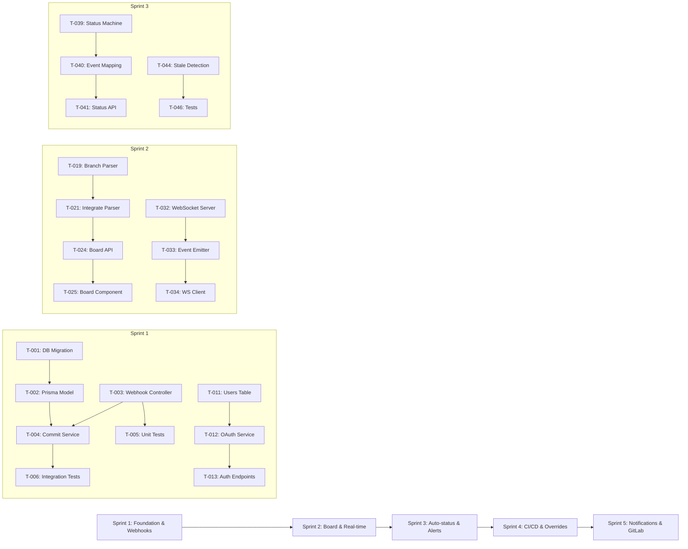

# Sprint Execution Plan — TaskFlow

> **Project**: TaskFlow
> **Version**: draft
> **Date Created**: 2026-04-06
> **Last Updated**: 2026-04-06
> **Velocity**: 20 points/sprint
> **Sprint Duration**: 2 weeks
> **Team Size**: 4
> **Status**: Draft
> **Author**: AI-Generated
> **Source**: Derived from `backlog-final.md`, `userstories-final.md`, `dor-dod-final.md`

---

## 1. Sprint Overview

| Sprint | Goal | Stories | Points | Release | Status |
|--------|------|---------|--------|---------|--------|
| Sprint 1 | Dev Dana can connect a GitHub repo and see commit events flowing into the system | 3 | 18 | MVP | Planned |
| Sprint 2 | Scrum Master Sam can view a real-time sprint board with ticket status updates | 3 | 20 | MVP | Planned |
| Sprint 3 | PM Pat can manage tasks and receive alerts for blockers and stale tickets | 3 | 19 | MVP | Planned |
| Sprint 4 | Team receives CI/CD status updates and can override ticket mappings | 4 | 17 | R2 | High-level |
| Sprint 5 | Team receives daily digests and PR review notifications | 4 | 10 | R2 | High-level |

**Capacity Summary**:

| Sprint | Available Days | Focus Factor | Capacity (pts) | Committed (pts) | Buffer (pts) | Utilization |
|--------|---------------|-------------|----------------|-----------------|-------------|-------------|
| Sprint 1 | 36 | 0.7 | 25 | 18 | 5 | 72% |
| Sprint 2 | 36 | 0.7 | 25 | 20 | 5 | 80% |
| Sprint 3 | 36 | 0.7 | 25 | 19 | 5 | 76% |
| Sprint 4 | 36 | 0.7 | 25 | 17 | 5 | 68% |
| Sprint 5 | 36 | 0.7 | 25 | 10 | 5 | 40% |

Available days = 4 team members x 9 working days (10 days - 1 day for sprint ceremonies). 🔶 ASSUMED

---

## 2. DoR Validation

| Story | DoR Criteria | Status | Gaps | Remediation |
|-------|-------------|--------|------|-------------|
| US-001 | DOR-01, DOR-02, DOR-03, DOR-04, DOR-05 | ✅ Ready | — | — |
| US-002 | DOR-01, DOR-02, DOR-03, DOR-04, DOR-05 | ✅ Ready | — | — |
| US-003 | DOR-01, DOR-02, DOR-03, DOR-04, DOR-05 | ✅ Ready | — | — |
| US-004 | DOR-01, DOR-02, DOR-03, DOR-04, DOR-05 | ✅ Ready | — | — |
| US-010 | DOR-01, DOR-02, DOR-03, DOR-04, DOR-05 | ✅ Ready | — | — |
| US-011 | DOR-01, DOR-02, DOR-03, DOR-04, DOR-05 | ✅ Ready | — | — |
| US-013 | DOR-01, DOR-02, DOR-03, DOR-04 | ✅ Ready | — | — |
| US-025 | DOR-01, DOR-02, DOR-04 | ⚠️ Not Ready | DOR-03: No performance test baseline defined, DOR-05: NFR lacks measurable threshold | Define performance baseline in test-cases-final.md; quantify response time targets |
| US-026 | DOR-01, DOR-02, DOR-04 | ⚠️ Not Ready | DOR-05: Spike needs explicit time-box and success criteria | Define time-box (max 3 days) and expected deliverable |
| US-030 | DOR-01, DOR-02, DOR-03, DOR-04, DOR-05 | ✅ Ready | — | — |
| US-012 | DOR-01, DOR-02, DOR-03, DOR-04, DOR-05 | ✅ Ready | — | — |
| US-020 | DOR-01, DOR-02, DOR-03, DOR-04, DOR-05 | ✅ Ready | — | — |

**Summary**: 10 of 12 stories are Ready. 2 stories flagged with gaps (US-025, US-026). Both are included in Sprint 1 with remediation tasks added to the sprint.

---

## 3. Sprint 1 Plan

### Sprint Goal

Dev Dana can connect a GitHub repo and see commit events flowing into the system.

### Committed Stories

| Story | Title | Points | Priority | Epic | Owner |
|-------|-------|--------|----------|------|-------|
| US-001 | Configure webhook endpoint (GitHub) | 8 | Must Have | EPIC-001 | Backend Dev 1 |
| US-026 | [SPIKE] Validate webhook payload data | 3 | Must Have | EPIC-001 | Backend Dev 2 |
| US-030 | Set up OAuth authentication (GitHub) | 5 | Must Have | EPIC-006 | Full-stack Dev |

**Platform foundation tasks** (included as technical stories):

| Task Area | Points | Owner |
|-----------|--------|-------|
| Project scaffolding, CI pipeline, shared middleware | 2 | Full-stack Dev |

### Capacity

| Member | Role | Available Days | Capacity (pts) | Allocated (pts) | Utilization |
|--------|------|---------------|----------------|-----------------|-------------|
| Backend Dev 1 | Backend | 9 | 7 | 6 | 86% |
| Backend Dev 2 | Backend | 9 | 7 | 5 | 71% |
| Frontend Dev | Frontend | 9 | 7 | 2 | 29% |
| Full-stack Dev | Full-stack | 9 | 7 | 5 | 71% |
| Buffer | — | — | 4 | — | — |
| **Total** | | 36 | 25 | 18 | 72% |

Capacity per person = 9 days x 0.7 focus x ~1.1 pts/day = ~7 pts. 🔶 ASSUMED

### Task Breakdown

#### US-001: Configure Webhook Endpoint — GitHub ({8} pts)

| Task ID | Description | Hours | Owner | Depends On | DoD | Layer |
|---------|-------------|-------|-------|-----------|-----|-------|
| T-001 | Create database migration for `commits` table | 4 | Backend Dev 1 | — | DOD-01, DOD-03 | Database |
| T-002 | Implement Prisma model for commits entity | 2 | Backend Dev 1 | T-001 | DOD-01, DOD-03 | Database |
| T-003 | Create webhook controller with HMAC signature validation | 6 | Backend Dev 2 | — | DOD-01, DOD-03 | API |
| T-004 | Implement commit processing service (parse, transform, store) | 4 | Backend Dev 2 | T-002 | DOD-01, DOD-03 | Service |
| T-005 | Write unit tests for webhook HMAC validation | 3 | Backend Dev 2 | T-003 | DOD-02, DOD-04 | Test |
| T-006 | Write integration test for webhook-to-DB pipeline | 4 | Backend Dev 1 | T-003, T-004 | DOD-02, DOD-04 | Test |
| T-007 | Configure webhook endpoint and secrets in GitHub dev app | 2 | Full-stack Dev | T-003 | DOD-05 | Infrastructure |

**Total**: 25 hours (~3.1 person-days)

#### US-026: [SPIKE] Validate Webhook Payload Data ({3} pts)

| Task ID | Description | Hours | Owner | Depends On | DoD | Layer |
|---------|-------------|-------|-------|-----------|-----|-------|
| T-008 | Research GitHub webhook event types and payload schemas | 4 | Backend Dev 2 | — | DOD-06 | Research |
| T-009 | Document payload mapping for push, PR, and branch events | 4 | Backend Dev 2 | T-008 | DOD-06 | Research |
| T-010 | Create spike summary with recommended parsing strategy | 2 | Backend Dev 2 | T-009 | DOD-06 | Documentation |

**Total**: 10 hours (~1.3 person-days). Time-boxed to 2 days maximum.

#### US-030: Set Up OAuth Authentication — GitHub ({5} pts)

| Task ID | Description | Hours | Owner | Depends On | DoD | Layer |
|---------|-------------|-------|-------|-----------|-----|-------|
| T-011 | Create database migration for `users` and `oauth_tokens` tables | 3 | Full-stack Dev | — | DOD-01, DOD-03 | Database |
| T-012 | Implement OAuth callback handler and token exchange service | 6 | Full-stack Dev | T-011 | DOD-01, DOD-03 | Service |
| T-013 | Create login/logout API endpoints with session management | 4 | Full-stack Dev | T-012 | DOD-01, DOD-03 | API |
| T-014 | Write unit tests for OAuth token exchange and session logic | 3 | Full-stack Dev | T-012 | DOD-02, DOD-04 | Test |
| T-015 | Write API test for login/logout flow | 2 | Full-stack Dev | T-013 | DOD-02, DOD-04 | Test |

**Total**: 18 hours (~2.3 person-days)

#### Platform Foundation Tasks ({2} pts)

| Task ID | Description | Hours | Owner | Depends On | DoD | Layer |
|---------|-------------|-------|-------|-----------|-----|-------|
| T-016 | Initialize project repository with monorepo structure | 2 | Full-stack Dev | — | DOD-01 | Infrastructure |
| T-017 | Set up CI pipeline (lint, test, build) | 3 | Frontend Dev | T-016 | DOD-01, DOD-05 | Infrastructure |
| T-018 | Configure shared middleware (error handling, logging, CORS) | 3 | Frontend Dev | T-016 | DOD-01, DOD-03 | Service |

**Total**: 8 hours (~1.0 person-day)

---

## 3. Sprint 2 Plan

### Sprint Goal

Scrum Master Sam can view a real-time sprint board with ticket status updates.

### Committed Stories

| Story | Title | Points | Priority | Epic | Owner |
|-------|-------|--------|----------|------|-------|
| US-003 | Map branch names to tickets | 5 | Must Have | EPIC-001 | Backend Dev 1 |
| US-010 | View sprint board | 5 | Must Have | EPIC-002 | Frontend Dev |
| US-011 | Switch between sprints | 2 | Must Have | EPIC-002 | Frontend Dev |
| US-013 | Real-time board updates | 5 | Must Have | EPIC-002 | Backend Dev 2 |
| US-025 | [NFR] Dashboard performance target | 3 | Must Have | EPIC-006 | Full-stack Dev |

### Capacity

| Member | Role | Available Days | Capacity (pts) | Allocated (pts) | Utilization |
|--------|------|---------------|----------------|-----------------|-------------|
| Backend Dev 1 | Backend | 9 | 7 | 5 | 71% |
| Backend Dev 2 | Backend | 9 | 7 | 5 | 71% |
| Frontend Dev | Frontend | 9 | 7 | 7 | 100% |
| Full-stack Dev | Full-stack | 9 | 7 | 3 | 43% |
| Buffer | — | — | 4 | — | — |
| **Total** | | 36 | 25 | 20 | 80% |

### Task Breakdown

#### US-003: Map Branch Names to Tickets ({5} pts)

| Task ID | Description | Hours | Owner | Depends On | DoD | Layer |
|---------|-------------|-------|-------|-----------|-----|-------|
| T-019 | Implement branch name parsing service (regex patterns) | 4 | Backend Dev 1 | — | DOD-01, DOD-03 | Service |
| T-020 | Create branch-to-ticket mapping table migration | 2 | Backend Dev 1 | — | DOD-01, DOD-03 | Database |
| T-021 | Integrate branch parser with webhook event pipeline | 4 | Backend Dev 1 | T-019, T-004 | DOD-01, DOD-03 | Service |
| T-022 | Write unit tests for branch name parsing (10+ patterns) | 3 | Backend Dev 1 | T-019 | DOD-02, DOD-04 | Test |
| T-023 | Write integration test for branch event to ticket mapping | 3 | Backend Dev 1 | T-021 | DOD-02, DOD-04 | Test |

**Total**: 16 hours (~2.0 person-days)

#### US-010: View Sprint Board ({5} pts)

| Task ID | Description | Hours | Owner | Depends On | DoD | Layer |
|---------|-------------|-------|-------|-----------|-----|-------|
| T-024 | Create sprint board API endpoint (GET /sprints/:id/board) | 4 | Full-stack Dev | T-021 | DOD-01, DOD-03 | API |
| T-025 | Build sprint board React component (columns: To Do, In Progress, Done) | 6 | Frontend Dev | T-024 | DOD-01, DOD-03 | Frontend |
| T-026 | Implement board state management (Redux/Zustand) | 4 | Frontend Dev | T-025 | DOD-01, DOD-03 | Frontend |
| T-027 | Write unit tests for board component rendering | 3 | Frontend Dev | T-025 | DOD-02, DOD-04 | Test |
| T-028 | Write API test for sprint board endpoint | 2 | Full-stack Dev | T-024 | DOD-02, DOD-04 | Test |

**Total**: 19 hours (~2.4 person-days)

#### US-011: Switch Between Sprints ({2} pts)

| Task ID | Description | Hours | Owner | Depends On | DoD | Layer |
|---------|-------------|-------|-------|-----------|-----|-------|
| T-029 | Create sprint selector dropdown component | 3 | Frontend Dev | T-025 | DOD-01, DOD-03 | Frontend |
| T-030 | Create GET /sprints list endpoint | 2 | Full-stack Dev | — | DOD-01, DOD-03 | API |
| T-031 | Write unit test for sprint selector | 2 | Frontend Dev | T-029 | DOD-02, DOD-04 | Test |

**Total**: 7 hours (~0.9 person-days)

#### US-013: Real-time Board Updates ({5} pts)

| Task ID | Description | Hours | Owner | Depends On | DoD | Layer |
|---------|-------------|-------|-------|-----------|-----|-------|
| T-032 | Set up WebSocket server (Socket.io) | 4 | Backend Dev 2 | — | DOD-01, DOD-03 | Infrastructure |
| T-033 | Implement board update event emitter (ticket status changes) | 4 | Backend Dev 2 | T-032, T-024 | DOD-01, DOD-03 | Service |
| T-034 | Integrate WebSocket client in board component | 4 | Backend Dev 2 | T-032, T-025 | DOD-01, DOD-03 | Frontend |
| T-035 | Write integration test for real-time update flow | 3 | Backend Dev 2 | T-033, T-034 | DOD-02, DOD-04 | Test |

**Total**: 15 hours (~1.9 person-days)

#### US-025: [NFR] Dashboard Performance Target ({3} pts)

| Task ID | Description | Hours | Owner | Depends On | DoD | Layer |
|---------|-------------|-------|-------|-----------|-----|-------|
| T-036 | Define performance baseline and set up load testing framework | 4 | Full-stack Dev | T-024 | DOD-01, DOD-06 | Test |
| T-037 | Implement query optimization and caching for board endpoint | 4 | Full-stack Dev | T-036 | DOD-01, DOD-03 | Service |
| T-038 | Write performance regression test (response <200ms for 100 tickets) | 2 | Full-stack Dev | T-037 | DOD-02, DOD-04 | Test |

**Total**: 10 hours (~1.3 person-days)

---

## 3. Sprint 3 Plan

### Sprint Goal

PM Pat can manage task assignments and receive alerts for blocked or stale tickets.

### Committed Stories

| Story | Title | Points | Priority | Epic | Owner |
|-------|-------|--------|----------|------|-------|
| US-004 | Auto-update ticket status from Git events | 5 | Must Have | EPIC-001 | Backend Dev 1 |
| US-020 | Receive blocker alert for stale tickets | 3 | Should Have | EPIC-004 | Backend Dev 2 |
| US-032 | [NFR] TLS encryption and data security | 3 | Must Have | EPIC-006 | Full-stack Dev |
| US-033 | [NFR] System availability monitoring | 5 | Must Have | EPIC-006 | Full-stack Dev |
| US-012 | Filter board by assignee and status | 3 | Should Have | EPIC-002 | Frontend Dev |

### Capacity

| Member | Role | Available Days | Capacity (pts) | Allocated (pts) | Utilization |
|--------|------|---------------|----------------|-----------------|-------------|
| Backend Dev 1 | Backend | 9 | 7 | 5 | 71% |
| Backend Dev 2 | Backend | 9 | 7 | 3 | 43% |
| Frontend Dev | Frontend | 9 | 7 | 3 | 43% |
| Full-stack Dev | Full-stack | 9 | 7 | 8 | 114% |
| Buffer | — | — | 4 | — | — |
| **Total** | | 36 | 25 | 19 | 76% |

⚠️ **Note**: Full-stack Dev is slightly over-allocated. Reassign T-054 (monitoring dashboard) to Frontend Dev if needed to balance load.

### Task Breakdown

#### US-004: Auto-update Ticket Status from Git Events ({5} pts)

| Task ID | Description | Hours | Owner | Depends On | DoD | Layer |
|---------|-------------|-------|-------|-----------|-----|-------|
| T-039 | Create ticket status state machine (Open -> In Progress -> In Review -> Done) | 4 | Backend Dev 1 | — | DOD-01, DOD-03 | Service |
| T-040 | Implement Git event-to-status mapping rules | 4 | Backend Dev 1 | T-039, T-021 | DOD-01, DOD-03 | Service |
| T-041 | Create status update API endpoint (PATCH /tickets/:id/status) | 3 | Backend Dev 1 | T-040 | DOD-01, DOD-03 | API |
| T-042 | Write unit tests for status state machine and mapping rules | 3 | Backend Dev 1 | T-039, T-040 | DOD-02, DOD-04 | Test |
| T-043 | Write integration test for Git event -> ticket status update flow | 3 | Backend Dev 1 | T-041 | DOD-02, DOD-04 | Test |

**Total**: 17 hours (~2.1 person-days)

#### US-020: Receive Blocker Alert for Stale Tickets ({3} pts)

| Task ID | Description | Hours | Owner | Depends On | DoD | Layer |
|---------|-------------|-------|-------|-----------|-----|-------|
| T-044 | Implement stale ticket detection service (configurable threshold) | 4 | Backend Dev 2 | T-041 | DOD-01, DOD-03 | Service |
| T-045 | Create notification delivery service (email/Slack webhook) | 4 | Backend Dev 2 | — | DOD-01, DOD-03 | Service |
| T-046 | Write unit tests for stale detection and notification logic | 3 | Backend Dev 2 | T-044, T-045 | DOD-02, DOD-04 | Test |

**Total**: 11 hours (~1.4 person-days)

#### US-032: [NFR] TLS Encryption and Data Security ({3} pts)

| Task ID | Description | Hours | Owner | Depends On | DoD | Layer |
|---------|-------------|-------|-------|-----------|-----|-------|
| T-047 | Configure TLS certificates and HTTPS enforcement | 3 | Full-stack Dev | — | DOD-01, DOD-05 | Infrastructure |
| T-048 | Implement token encryption at rest for OAuth tokens | 4 | Full-stack Dev | T-012 | DOD-01, DOD-03 | Service |
| T-049 | Write security test for TLS and token storage | 2 | Full-stack Dev | T-047, T-048 | DOD-02, DOD-04 | Test |

**Total**: 9 hours (~1.1 person-days)

#### US-033: [NFR] System Availability Monitoring ({5} pts)

| Task ID | Description | Hours | Owner | Depends On | DoD | Layer |
|---------|-------------|-------|-------|-----------|-----|-------|
| T-050 | Set up health check endpoints (/health, /ready) | 2 | Full-stack Dev | — | DOD-01, DOD-03 | API |
| T-051 | Configure uptime monitoring and alerting (e.g., UptimeRobot) | 3 | Full-stack Dev | T-050 | DOD-01, DOD-05 | Infrastructure |
| T-052 | Implement structured logging with log levels | 4 | Full-stack Dev | — | DOD-01, DOD-03 | Service |
| T-053 | Set up error tracking integration (e.g., Sentry) | 3 | Full-stack Dev | T-052 | DOD-01, DOD-05 | Infrastructure |
| T-054 | Create basic monitoring dashboard | 4 | Full-stack Dev | T-050, T-051 | DOD-01, DOD-06 | Frontend |

**Total**: 16 hours (~2.0 person-days)

#### US-012: Filter Board by Assignee and Status ({3} pts)

| Task ID | Description | Hours | Owner | Depends On | DoD | Layer |
|---------|-------------|-------|-------|-----------|-----|-------|
| T-055 | Add filter parameters to board API endpoint | 3 | Frontend Dev | T-024 | DOD-01, DOD-03 | API |
| T-056 | Build filter UI components (dropdowns for assignee, status) | 4 | Frontend Dev | T-025, T-055 | DOD-01, DOD-03 | Frontend |
| T-057 | Write unit tests for filter components | 2 | Frontend Dev | T-056 | DOD-02, DOD-04 | Test |
| T-058 | Write API test for filtered board queries | 2 | Frontend Dev | T-055 | DOD-02, DOD-04 | Test |

**Total**: 11 hours (~1.4 person-days)

---

## 4. Post-MVP Sprints (High-Level)

### Sprint 4: CI/CD Integration and Manual Overrides

| Story | Title | Points | Priority | Release |
|-------|-------|--------|----------|---------|
| US-005 | Manually override ticket status mapping | 3 | Should Have | R2 |
| US-015 | Sync CI build status to tickets | 5 | Should Have | R2 |
| US-016 | Sync deploy status to tickets | 3 | Should Have | R2 |
| US-021 | Configure alert rules | 5 | Should Have | R2 |

**Estimated capacity**: 25 pts available, 16 pts committed (64% utilization)

### Sprint 5: Notifications and GitLab Support

| Story | Title | Points | Priority | Release |
|-------|-------|--------|----------|---------|
| US-022 | Daily sprint digest notification | 3 | Should Have | R2 |
| US-023 | PR review request notification | 2 | Should Have | R2 |
| US-031 | Set up OAuth authentication (GitLab) | 3 | Must Have | R2 |
| US-006 | Parse GitLab push events | 3 | Must Have | R2 |

**Estimated capacity**: 25 pts available, 11 pts committed (44% utilization). 🔶 ASSUMED — additional stories from R3 could be pulled forward.

---

## 5. Sprint Dependencies

**External Dependencies**:

| Dependency | Sprint | Owner | Status | Risk |
|-----------|--------|-------|--------|------|
| GitHub OAuth app registration | Sprint 1 | Full-stack Dev | Pending | LOW — self-service via GitHub settings |
| GitHub webhook dev environment | Sprint 1 | Backend Dev 2 | Pending | LOW — can use ngrok or smee.io |
| GitLab OAuth app registration | Sprint 5 | Full-stack Dev | Pending | LOW — same process as GitHub |
| Sentry/error tracking account | Sprint 3 | Full-stack Dev | Pending | LOW — free tier available |

**Cross-Sprint Risks**:

| Risk | Sprints Affected | Mitigation |
|------|-----------------|------------|
| Webhook payload format changes | Sprint 1, 2 | Spike (US-026) investigates first; parser uses abstract interface |
| WebSocket scaling under load | Sprint 2, 3 | Performance NFR (US-025) validates in Sprint 2 |
| OAuth token refresh edge cases | Sprint 1, 5 | Unit tests cover expiry/refresh flows; GitLab uses same service |

---

## 6. Definition of Done Checklist

| DOD ID | Criterion | Applies To | Verification |
|--------|-----------|-----------|-------------|
| DOD-01 | Code complete, compiles, no lint errors | All feature tasks | CI build + lint pass |
| DOD-02 | Unit tests pass with >= 80% coverage on new code | All feature tasks | Coverage report in CI |
| DOD-03 | Code reviewed by at least one peer | All tasks with code changes | PR approval required |
| DOD-04 | Acceptance criteria verified | All story-level tasks | QA walkthrough against Gherkin ACs |
| DOD-05 | Deployed to staging environment | All stories per sprint | Staging deployment verified |
| DOD-06 | Documentation updated | API endpoints, DB schema, architecture changes | Docs PR merged |

---

## Q&A Log

### Pending

#### Q-001 (related: Capacity Planning)
- **Impact**: MEDIUM
- **Question**: Does the team have any velocity history from prior projects? The current estimate of 20 pts/sprint is based on industry heuristics for a 4-person team.
- **Context**: Actual velocity data would improve sprint commitment accuracy. After Sprint 1, recalibrate velocity based on actual throughput.
- **Answer**:
- **Status**: Pending

#### Q-002 (related: US-026, Spike Outcome)
- **Impact**: MEDIUM
- **Question**: What is the carry-over policy if a spike (US-026) reveals that webhook payloads require significantly more parsing complexity than estimated?
- **Context**: If spike results increase the effort for US-002 and US-003, Sprint 2 may need to be re-scoped. The team should decide before Sprint 2 planning.
- **Answer**:
- **Status**: Pending

#### Q-003 (related: Sprint Scope)
- **Impact**: LOW
- **Question**: Can mid-sprint scope changes be accommodated, or is the sprint backlog locked after planning?
- **Context**: Standard Scrum practice is to protect the sprint backlog. If the team prefers a more flexible approach (e.g., Kanban-style flow), sprint planning should reflect that.
- **Answer**:
- **Status**: Pending

---

## Readiness Assessment

| Metric | Value |
|--------|-------|
| Total items | 58 (tasks) + 12 (stories) = 70 |
| ✅ CONFIRMED | 39 (55%) |
| 🔶 ASSUMED | 28 (40%) |
| ❓ UNCLEAR | 3 (5%) |
| Q&A Pending | 3 (HIGH: 0, MEDIUM: 2, LOW: 1) |

**Verdict**: ⚠️ Partially Ready

**Reasoning**: MVP sprints (1-3) are fully broken down with task-level detail, dependencies, and DoD mapping. Capacity utilization is healthy (72-80%). Two stories flagged for DoR gaps have remediation actions included. However, velocity is assumed (no team history), post-MVP sprints are high-level only, and 3 Q&A items remain open. The plan is ready for team review and Sprint 1 execution, with recalibration expected after Sprint 1 completion.

---

## Approval

| Role | Name | Date | Status |
|------|------|------|--------|
| Scrum Master | [TBD] | | ☐ Pending |
| Tech Lead | [TBD] | | ☐ Pending |
