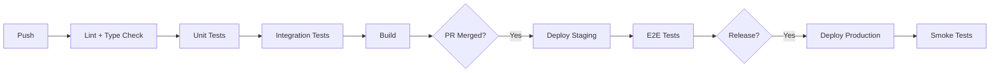
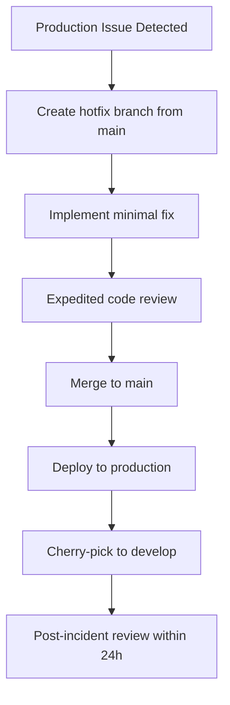

# Development Workflow Output Template

Use this template structure when generating `dev-workflow-draft.md`.

---

```markdown
# Development Workflow — {Project Name}

**Version**: draft | v{N}
**Date**: {date}
**Branching Model**: {model name}
**CI/CD Platform**: {platform}
**Status**: Draft | Under Review | Approved

---

## 1. Branching Strategy

**Model**: {GitHub Flow / Git Flow / Trunk-Based} {confidence}
**Justification**: {why this model fits the team — reference team size, release cadence, CI maturity}

### Branch Types

| Branch | Pattern | Purpose | Lifetime | Merges To | Protected |
|--------|---------|---------|----------|-----------|-----------|
| main | `main` | Production code | Permanent | — | Yes |
| develop | `develop` | Integration (Git Flow only) | Permanent | main | Yes |
| feature | `feature/{ticket}-{desc}` | New features | Sprint | main/develop | No |
| bugfix | `bugfix/{ticket}-{desc}` | Bug fixes | Days | main/develop | No |
| hotfix | `hotfix/{ticket}-{desc}` | Production fixes | Hours | main + develop | No |
| release | `release/v{N}` | Release stabilization | Days | main + develop | Yes |
| chore | `chore/{desc}` | Maintenance | Days | main/develop | No |

### Branch Naming Rules

- {rule 1} {confidence}
- {rule 2} {confidence}
- ...

### Branch Protection Rules

| Branch | Rule | Enforcement |
|--------|------|-------------|
| main | Require PR with {N} approval(s) | GitHub branch protection |
| main | Require CI pass | Status checks required |
| main | No force push | Branch protection |
| main | No direct commits | Branch protection |
| {other branches...} | | |

---

## 2. Pull Request Process

### PR Template

```markdown
## Description
{what changed and why}

## Related Tickets
- {ticket ID}: {title}

## Changes
- {change 1}
- {change 2}

## Screenshots
{required for UI changes, N/A otherwise}

## Testing
- [ ] Unit tests added/updated
- [ ] Integration tests added/updated
- [ ] Manual testing performed

## Checklist
- [ ] Code follows project conventions
- [ ] Tests pass locally
- [ ] No unresolved TODOs
- [ ] Documentation updated
- [ ] {DoD item from dor-dod-final.md}
- [ ] {DoD item from dor-dod-final.md}
```

### PR Guidelines

| Guideline | Requirement | Confidence |
|-----------|-------------|------------|
| Max size | {N} lines changed | {confidence} |
| Flag threshold | {N} lines — suggest splitting | {confidence} |
| Required reviewers | {N} | {confidence} |
| Merge strategy | {Squash merge / Merge commit / Rebase} | {confidence} |
| Auto-merge | {conditions — e.g., approved + CI green} | {confidence} |
| Stale PR policy | {action after N days} | {confidence} |

---

## 3. Code Review Standards

### Review Checklist

| Category | Check | Required |
|----------|-------|----------|
| Correctness | Logic is correct, edge cases handled | Yes |
| Design | Fits architecture, appropriate abstractions | Yes |
| Security | Input validated, auth checked, no injection | Yes |
| Testing | Adequate coverage, right test types | Yes |
| Readability | Clear naming, appropriate comments | Yes |
| Performance | No N+1 queries, efficient algorithms | Yes |
| Error handling | Failures handled, appropriate logging | Yes |
| No TODOs | No unresolved TODO/FIXME/HACK comments | Yes |

### Review SLA

| PR Type | Turnaround | Min Reviewers | Confidence |
|---------|-----------|---------------|------------|
| Feature | {N} hours (business hours) | {N} | {confidence} |
| Bugfix | {N} hours (business hours) | {N} | {confidence} |
| Hotfix | {N} hour (any time) | {N} | {confidence} |
| Chore/Docs | {N} hours (business hours) | {N} | {confidence} |

### Review Etiquette

- Use `nit:` prefix for non-blocking style comments
- Use `BLOCKER:` prefix for must-fix issues
- Suggest alternatives — do not just point out problems
- Approve with comments for minor issues
- {additional etiquette rules}

---

## 4. CI/CD Pipeline



### Pre-commit (Local)

| Check | Tool | Confidence |
|-------|------|------------|
| {check} | {tool} | {confidence} |

**Duration target**: < {N} seconds

### PR Pipeline

| Stage | Steps | Gate | Est. Duration | Confidence |
|-------|-------|------|---------------|------------|
| Lint | {steps} | Blocking | {N} min | {confidence} |
| Type Check | {steps} | Blocking | {N} min | {confidence} |
| Unit Tests | {steps} | Blocking | {N} min | {confidence} |
| Integration Tests | {steps} | Blocking | {N} min | {confidence} |
| Build | {steps} | Blocking | {N} min | {confidence} |
| Coverage Report | {steps} | Advisory | {N} min | {confidence} |

**Total estimated duration**: ~{N} minutes

### Post-merge Pipeline

| Stage | Steps | Gate | Est. Duration | Confidence |
|-------|-------|------|---------------|------------|
| Deploy Staging | {steps} | Blocking | {N} min | {confidence} |
| E2E Tests | {steps} | Blocking | {N} min | {confidence} |
| Performance Check | {steps} | Advisory | {N} min | {confidence} |

### Release Pipeline

| Stage | Steps | Gate | Est. Duration | Confidence |
|-------|-------|------|---------------|------------|
| Deploy Production | {steps} | Blocking | {N} min | {confidence} |
| Smoke Tests | {steps} | Blocking | {N} min | {confidence} |
| Monitoring Check | {steps} | Blocking | {N} min | {confidence} |

### Cache Strategy

| Cache | What | Invalidation |
|-------|------|-------------|
| {cache name} | {what is cached} | {when invalidated} |

---

## 5. Coding Standards

### Naming Conventions

| Aspect | Convention | Example | Confidence |
|--------|-----------|---------|------------|
| Files | {convention} | {example} | {confidence} |
| Classes | {convention} | {example} | {confidence} |
| Functions | {convention} | {example} | {confidence} |
| Variables | {convention} | {example} | {confidence} |
| Constants | {convention} | {example} | {confidence} |

### Formatting

| Setting | Value | Tool | Confidence |
|---------|-------|------|------------|
| {setting} | {value} | {tool} | {confidence} |

### Linting

| Rule Set | Tool | Config | Confidence |
|----------|------|--------|------------|
| {rule set} | {tool} | {config file} | {confidence} |

### Import Ordering

```
{ordering rules — e.g.:}
1. Node built-in modules
2. External packages
3. Internal modules (absolute paths)
4. Relative imports
5. Style imports
```

### Commit Message Format

```
{type}({scope}): {description}

{body}

{footer}
```

| Type | Usage |
|------|-------|
| feat | New feature |
| fix | Bug fix |
| chore | Maintenance |
| docs | Documentation |
| test | Test changes |
| refactor | Code restructuring |
| perf | Performance improvement |
| ci | CI/CD changes |

**Enforcement**: {tool — e.g., commitlint + husky} {confidence}

---

## 6. Hotfix Process



| Step | Action | SLA | Owner | Confidence |
|------|--------|-----|-------|------------|
| 1 | Create `hotfix/PROD-xxx-desc` from main | {time} | {owner} | {confidence} |
| 2 | Implement minimal fix (no refactoring) | {time} | {owner} | {confidence} |
| 3 | Expedited review ({N} reviewer) | {time} | {owner} | {confidence} |
| 4 | Merge to main | {time} | {owner} | {confidence} |
| 5 | Deploy to production | {time} | {owner} | {confidence} |
| 6 | Cherry-pick to develop (if applicable) | {time} | {owner} | {confidence} |
| 7 | Post-incident review | {time} | {owner} | {confidence} |

### Hotfix Rules

- Hotfix ONLY fixes the reported issue — no scope creep
- If fix exceeds {N} hours, consider rollback instead
- Full CI pipeline still runs (no skipping tests)
- Document in incident log

---

## 7. Release Process

| Step | Action | Tool | Owner | Confidence |
|------|--------|------|-------|------------|
| 1 | {action} | {tool} | {owner} | {confidence} |
| 2 | {action} | {tool} | {owner} | {confidence} |
| ... | | | | |

**Versioning**: Semantic Versioning (MAJOR.MINOR.PATCH) {confidence}
- MAJOR: {what triggers it}
- MINOR: {what triggers it}
- PATCH: {what triggers it}

**Changelog**: {auto-generated from conventional commits / manual} {confidence}
**Tag format**: `v{MAJOR}.{MINOR}.{PATCH}` {confidence}

---

## 8. Environment Promotion

| Environment | Deploy Method | Trigger | Rollback Procedure | Health Check | Confidence |
|-------------|-------------|---------|-------------------|-------------|------------|
| Development | {method} | {trigger} | {rollback} | {check} | {confidence} |
| Staging | {method} | {trigger} | {rollback} | {check} | {confidence} |
| Production | {method} | {trigger} | {rollback} | {check} | {confidence} |

### Rollback Details

**Staging rollback:**
- Trigger: {when to rollback}
- Method: {how — revert commit, redeploy tag, etc.}
- Verification: {how to verify rollback succeeded}
- Communication: {who to notify}

**Production rollback:**
- Trigger: {when to rollback}
- Method: {how — redeploy previous tag, blue-green switch, etc.}
- Verification: {how to verify rollback succeeded}
- Communication: {who to notify — team, stakeholders, users}

---

## 9. Q&A Log

| # | Question | Context | Priority | Answer | Status |
|---|----------|---------|----------|--------|--------|
| Q1 | {question} | {context} | HIGH/MED/LOW | {answer or "Pending"} | Open/Resolved |
| Q2 | {question} | {context} | HIGH/MED/LOW | {answer or "Pending"} | Open/Resolved |

---

## 10. Readiness Assessment

### Confidence Distribution

| Level | Count | Percentage |
|-------|-------|------------|
| ✅ CONFIRMED | {N} |  |
| ❓ UNCLEAR | {N} | {%} |
| **Total** | {N} | 100% |

### Verdict: {Ready / Partially Ready / Not Ready}

{Justification for the verdict based on confidence levels and open questions.}

### Key Risks

| Risk | Impact | Mitigation |
|------|--------|-----------|
| {risk} | {impact} | {mitigation} |

---

## 11. Approval

| Role | Name | Decision | Date |
|------|------|----------|------|
| Tech Lead | | Pending | |
| Scrum Master | | Pending | |

---

**Document History**

| Version | Date | Author | Changes |
|---------|------|--------|---------|
| draft | {date} | AI-assisted | Initial creation |
```
