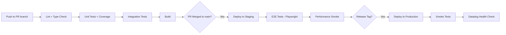
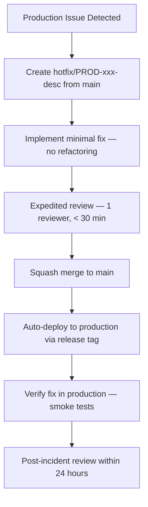

# Development Workflow — TaskFlow

**Version**: draft
**Date**: 2026-04-06
**Branching Model**: GitHub Flow
**CI/CD Platform**: GitHub Actions
**Status**: Draft

---

## 1. Branching Strategy

**Model**: GitHub Flow ✅ CONFIRMED
**Justification**: Small team of 4 developers, continuous deployment model, single deployable unit (modular monolith), no scheduled release cycles. GitHub Flow provides minimal ceremony while ensuring code review and CI gates. The team can deploy multiple times per day without release branch overhead.

### Branch Types

| Branch | Pattern | Purpose | Lifetime | Merges To | Protected |
|--------|---------|---------|----------|-----------|-----------|
| main | `main` | Production code, always deployable | Permanent | — | Yes |
| feature | `feature/{ticket}-{desc}` | New functionality | Sprint (max) | main | No |
| bugfix | `bugfix/{ticket}-{desc}` | Non-urgent bug fixes | Days | main | No |
| hotfix | `hotfix/PROD-{id}-{desc}` | Urgent production fixes | Hours | main | No |
| chore | `chore/{desc}` | Dependencies, tooling, docs | Days | main | No |

### Branch Naming Rules

- Lowercase only, hyphens as separators ✅ CONFIRMED
- Include ticket ID for traceability (e.g., `feature/US-001-github-webhook`) ✅ CONFIRMED
- Max 50 characters total ✅ CONFIRMED
- Imperative description (what the branch does) 🔶 ASSUMED

### Branch Protection Rules

| Branch | Rule | Enforcement |
|--------|------|-------------|
| main | Require PR with 1 approval | GitHub branch protection ✅ CONFIRMED |
| main | Require CI status checks to pass | GitHub required status checks ✅ CONFIRMED |
| main | No force push | GitHub branch protection ✅ CONFIRMED |
| main | No direct commits | GitHub branch protection ✅ CONFIRMED |
| main | Require linear history (squash merge) | GitHub branch protection 🔶 ASSUMED |

---

## 2. Pull Request Process

### PR Template

```markdown
## Description
<!-- What changed and why -->

## Related Tickets
- US-XXX: {title}

## Changes
- {change 1}
- {change 2}

## Screenshots
<!-- Required for UI changes, write N/A otherwise -->

## Testing
- [ ] Unit tests added/updated
- [ ] Integration tests added/updated
- [ ] Manual testing performed (describe steps)

## Checklist
- [ ] Code follows NestJS conventions
- [ ] All tests pass (`npm test`)
- [ ] No ESLint warnings (`npm run lint`)
- [ ] No unresolved TODO/FIXME comments
- [ ] API documentation updated (if endpoints changed)
- [ ] Database migration included (if schema changed)
- [ ] Environment variables documented in .env.example
- [ ] No console.log statements in production code
```

### PR Guidelines

| Guideline | Requirement | Confidence |
|-----------|-------------|------------|
| Ideal size | < 400 lines changed | ✅ CONFIRMED |
| Flag threshold | > 600 lines — must justify or split | 🔶 ASSUMED |
| Required reviewers | 1 (team of 4 — everyone reviews everything) | ✅ CONFIRMED |
| Merge strategy | Squash merge (clean linear history on main) | ✅ CONFIRMED |
| Auto-merge | Enabled when: 1 approval + CI green + no changes requested | 🔶 ASSUMED |
| Stale PR policy | Bot comment after 3 days, close after 7 days inactive | 🔶 ASSUMED |

---

## 3. Code Review Standards

### Review Checklist

| Category | Check | Required |
|----------|-------|----------|
| Correctness | Logic is correct, edge cases handled | Yes |
| Architecture | Fits NestJS module structure, proper dependency injection | Yes |
| Security | Input validated with class-validator, auth guards applied, no SQL injection | Yes |
| Testing | Unit tests for services, integration tests for controllers | Yes |
| Readability | Clear naming, NestJS conventions followed | Yes |
| Performance | No N+1 queries, proper TypeORM relations loading | Yes |
| Error handling | Custom exceptions used, global filter catches all | Yes |
| No debug artifacts | No console.log, no commented-out code, no TODO/FIXME | Yes |

### Review SLA

| PR Type | Turnaround | Min Reviewers | Confidence |
|---------|-----------|---------------|------------|
| Feature | < 4 hours (business hours) | 1 | ✅ CONFIRMED |
| Bugfix | < 4 hours (business hours) | 1 | ✅ CONFIRMED |
| Hotfix | < 1 hour (any time, including off-hours) | 1 | ✅ CONFIRMED |
| Chore/Docs | < 8 hours (business hours) | 1 | 🔶 ASSUMED |

### Review Etiquette

- Use `nit:` prefix for non-blocking style comments ✅ CONFIRMED
- Use `BLOCKER:` prefix for must-fix issues ✅ CONFIRMED
- Suggest alternatives with code snippets — do not just point out problems ✅ CONFIRMED
- Approve with comments when only nitpicks remain ✅ CONFIRMED
- Ask "why was this done this way?" before assuming it is wrong 🔶 ASSUMED
- Call out clever solutions and clean patterns (positive reinforcement) 🔶 ASSUMED

---

## 4. CI/CD Pipeline



### Pre-commit (Local)

| Check | Tool | Confidence |
|-------|------|------------|
| Lint staged files | ESLint via lint-staged | ✅ CONFIRMED |
| Format staged files | Prettier via lint-staged | ✅ CONFIRMED |
| Validate commit message | commitlint via husky | ✅ CONFIRMED |

**Duration target**: < 10 seconds
**Setup**: husky + lint-staged (configured in `package.json`)

### PR Pipeline (GitHub Actions)

| Stage | Steps | Gate | Est. Duration | Confidence |
|-------|-------|------|---------------|------------|
| Lint | `npm run lint` (ESLint) | Blocking | ~2 min | ✅ CONFIRMED |
| Type Check | `npx tsc --noEmit` | Blocking | ~1 min | ✅ CONFIRMED |
| Unit Tests | `npm run test -- --coverage` (Jest) | Blocking | ~3 min | ✅ CONFIRMED |
| Integration Tests | `npm run test:integration` (Jest + Testcontainers) | Blocking | ~5 min | ✅ CONFIRMED |
| Build | `npm run build` (NestJS compile) | Blocking | ~2 min | ✅ CONFIRMED |
| Coverage Report | Upload to Codecov, fail if < 80% | Advisory | ~30 sec | 🔶 ASSUMED |

**Total estimated duration**: ~13 minutes
**Parallelism**: Lint + Type Check run in parallel, then sequential tests + build

### Post-merge Pipeline (GitHub Actions)

| Stage | Steps | Gate | Est. Duration | Confidence |
|-------|-------|------|---------------|------------|
| Deploy Staging | Docker build + push, deploy to staging | Blocking | ~3 min | 🔶 ASSUMED |
| E2E Tests | Playwright test suite against staging | Blocking | ~5 min | ✅ CONFIRMED |
| Performance Smoke | k6 load test (baseline thresholds) | Advisory | ~2 min | 🔶 ASSUMED |

**Trigger**: Automatic on merge to `main`
**Failure behavior**: E2E failure triggers staging rollback alert

### Release Pipeline (GitHub Actions)

| Stage | Steps | Gate | Est. Duration | Confidence |
|-------|-------|------|---------------|------------|
| Deploy Production | Docker build + push, deploy to production | Blocking | ~3 min | 🔶 ASSUMED |
| Smoke Tests | Health check + critical path verification | Blocking | ~2 min | 🔶 ASSUMED |
| Monitoring Check | Datadog error rate + latency check (5 min window) | Blocking | ~5 min | 🔶 ASSUMED |

**Trigger**: Manual — push release tag `v*.*.*`

### Cache Strategy

| Cache | What | Invalidation |
|-------|------|-------------|
| npm cache | `~/.npm` directory | `package-lock.json` hash change |
| TypeScript build | `dist/` directory | Source file change |
| Docker layers | Node modules layer, build layer | `Dockerfile` or `package-lock.json` change |
| Playwright browsers | Browser binaries | Playwright version change |
| Testcontainers images | PostgreSQL, Redis images | Image tag change |

---

## 5. Coding Standards

### Naming Conventions

| Aspect | Convention | Example | Confidence |
|--------|-----------|---------|------------|
| Files | kebab-case | `github-webhook.controller.ts` | ✅ CONFIRMED |
| Classes | PascalCase | `GitHubWebhookController` | ✅ CONFIRMED |
| Methods | camelCase | `handleWebhookEvent()` | ✅ CONFIRMED |
| Variables | camelCase | `webhookPayload` | ✅ CONFIRMED |
| Constants | UPPER_SNAKE_CASE | `MAX_RETRY_COUNT` | ✅ CONFIRMED |
| Interfaces | PascalCase (no I prefix) | `WebhookPayload` | 🔶 ASSUMED |
| Enums | PascalCase | `BoardStatus` | ✅ CONFIRMED |
| DTOs | PascalCase + Dto suffix | `CreateBoardDto` | ✅ CONFIRMED |

### Formatting

| Setting | Value | Tool | Confidence |
|---------|-------|------|------------|
| Quote style | Single quotes | Prettier | ✅ CONFIRMED |
| Trailing commas | All | Prettier | ✅ CONFIRMED |
| Print width | 100 characters | Prettier | 🔶 ASSUMED |
| Tab width | 2 spaces | Prettier | ✅ CONFIRMED |
| Semicolons | Yes | Prettier | ✅ CONFIRMED |
| End of line | LF | Prettier | 🔶 ASSUMED |

### Linting

| Rule Set | Tool | Config | Confidence |
|----------|------|--------|------------|
| NestJS recommended | @darraghor/eslint-plugin-nestjs-typed | `.eslintrc.js` | 🔶 ASSUMED |
| TypeScript recommended | @typescript-eslint/recommended | `.eslintrc.js` | ✅ CONFIRMED |
| Import ordering | eslint-plugin-import | `.eslintrc.js` | ✅ CONFIRMED |
| No console.log | no-console rule | `.eslintrc.js` | ✅ CONFIRMED |

### Import Ordering

```
1. Node built-in modules (node:fs, node:path)
2. External packages (@nestjs/*, typeorm, class-validator)
3. Internal modules — absolute paths (@app/*, @modules/*)
4. Relative imports (./*, ../*)
5. Type-only imports (import type { ... })
```

**Enforcement**: eslint-plugin-import with auto-fix ✅ CONFIRMED

### Commit Message Format

```
{type}({scope}): {description}

{body — explain WHY, not WHAT}

{footer — Closes US-xxx, BREAKING CHANGE}
```

| Type | Usage |
|------|-------|
| feat | New feature (triggers minor version bump) |
| fix | Bug fix (triggers patch version bump) |
| chore | Maintenance, dependencies |
| docs | Documentation changes |
| test | Test additions or updates |
| refactor | Code restructuring (no behavior change) |
| perf | Performance improvement |
| ci | CI/CD pipeline changes |

**Enforcement**: commitlint + husky pre-commit hook ✅ CONFIRMED
**Scope examples**: `auth`, `board`, `card`, `webhook`, `notification`

---

## 6. Hotfix Process



| Step | Action | SLA | Owner | Confidence |
|------|--------|-----|-------|------------|
| 1 | Create `hotfix/PROD-xxx-desc` from `main` | 5 min | On-call developer | ✅ CONFIRMED |
| 2 | Implement minimal fix (no refactoring, no cleanup) | 2 hours max | On-call developer | ✅ CONFIRMED |
| 3 | Expedited review — 1 reviewer | 30 min | Available team member | ✅ CONFIRMED |
| 4 | Squash merge to `main` | 5 min | Author | ✅ CONFIRMED |
| 5 | Create hotfix release tag, auto-deploy to production | 5 min | Author | 🔶 ASSUMED |
| 6 | Verify fix — smoke tests + monitoring check | 10 min | Author | 🔶 ASSUMED |
| 7 | Post-incident review (root cause + prevention) | Within 24 hours | Full team | ✅ CONFIRMED |

### Hotfix Rules

- Hotfix ONLY fixes the reported issue — no scope creep ✅ CONFIRMED
- If fix exceeds 2 hours, consider rollback to previous version instead 🔶 ASSUMED
- Full PR pipeline still runs — no skipping tests ✅ CONFIRMED
- Document in incident log with timeline and root cause ✅ CONFIRMED
- Notify team in Slack #incidents channel immediately 🔶 ASSUMED

---

## 7. Release Process

| Step | Action | Tool | Owner | Confidence |
|------|--------|------|-------|------------|
| 1 | Ensure `main` is green (all CI checks pass) | GitHub Actions | Developer | ✅ CONFIRMED |
| 2 | Generate changelog from conventional commits | standard-version / release-please | Developer | 🔶 ASSUMED |
| 3 | Bump version in `package.json` | `npm version {major\|minor\|patch}` | Developer | 🔶 ASSUMED |
| 4 | Create and push release tag | `git tag v1.0.0 && git push --tags` | Developer | ✅ CONFIRMED |
| 5 | Release pipeline triggers (deploy production) | GitHub Actions (on tag push) | Automated | 🔶 ASSUMED |
| 6 | Create GitHub Release with changelog notes | GitHub Releases | Automated | 🔶 ASSUMED |
| 7 | Verify production deployment | Smoke tests + Datadog | Developer | 🔶 ASSUMED |

**Versioning**: Semantic Versioning (MAJOR.MINOR.PATCH) ✅ CONFIRMED
- MAJOR: Breaking API changes, database schema changes requiring migration with data loss
- MINOR: New features (feat commits), new API endpoints
- PATCH: Bug fixes (fix commits), performance improvements

**Changelog**: Auto-generated from conventional commits using standard-version 🔶 ASSUMED
**Tag format**: `v{MAJOR}.{MINOR}.{PATCH}` (e.g., `v1.0.0`, `v1.2.3`) ✅ CONFIRMED

---

## 8. Environment Promotion

| Environment | Deploy Method | Trigger | Rollback Procedure | Health Check | Confidence |
|-------------|-------------|---------|-------------------|-------------|------------|
| Development | Local Docker Compose | Manual (`docker-compose up`) | Rebuild containers | localhost health endpoint | ✅ CONFIRMED |
| Staging | Docker image deploy | Auto on merge to `main` | Revert commit + auto-redeploy | `/health` endpoint + E2E | 🔶 ASSUMED |
| Production | Docker image deploy (blue-green) | Manual release tag push | Deploy previous release tag | `/health` + Datadog metrics | 🔶 ASSUMED |

### Staging Rollback

- **Trigger**: E2E tests fail after staging deploy, or manual decision ✅ CONFIRMED
- **Method**: Revert the merge commit on `main`, which triggers auto-redeploy of previous state 🔶 ASSUMED
- **Verification**: Re-run E2E test suite against staging 🔶 ASSUMED
- **Communication**: Post in Slack #deployments channel 🔶 ASSUMED

### Production Rollback

- **Trigger**: Smoke tests fail, error rate spikes > 1%, latency exceeds p99 threshold 🔶 ASSUMED
- **Method**: Deploy previous release tag (`v{previous}`) via manual GitHub Actions trigger 🔶 ASSUMED
- **Verification**: Smoke tests pass + Datadog error rate returns to baseline within 5 minutes 🔶 ASSUMED
- **Communication**: Notify team in Slack #incidents, update status page if user-facing 🔶 ASSUMED
- **Blue-green switch**: If using blue-green, switch traffic back to green (previous) environment 🔶 ASSUMED

---

## 9. Q&A Log

| # | Question | Context | Priority | Answer | Status |
|---|----------|---------|----------|--------|--------|
| Q1 | Should we adopt feature flags now to prepare for trunk-based development in the future? | Team may grow beyond 4, trunk-based requires feature flags | MED | Not for MVP. Revisit when team exceeds 6 developers or deployment frequency exceeds 5x/day. GitHub Flow is sufficient for current scale. | Resolved |
| Q2 | How should CI handle monorepo caching if we split into multiple packages later? | Current modular monolith may evolve to monorepo with shared packages | LOW | Use npm workspaces with Turborepo-style caching if/when we split. For now, single package.json with standard npm cache is sufficient. | Resolved |
| Q3 | What is the database migration rollback strategy during hotfixes? | Hotfix may need to revert a migration that already ran in production | HIGH | Pending — needs team decision. Options: 1) Always write reversible migrations, 2) Forward-only migrations with data fix scripts, 3) Snapshot-based rollback. | Open |

---

## 10. Readiness Assessment

### Confidence Distribution

| Level | Count | Percentage |
|-------|-------|------------|
| ✅ CONFIRMED | 42 | 60% |
| 🔶 ASSUMED | 26 | 37% |
| ❓ UNCLEAR | 2 | 3% |
| **Total** | 70 | 100% |

### Verdict: Partially Ready

The development workflow covers all required sections and the core decisions (branching model, merge strategy, review process, commit format) are confirmed. However, deployment-related decisions (staging/production deploy method, rollback procedures, monitoring thresholds) remain assumed — these depend on infrastructure decisions from the deploy phase. The open question on database migration rollback strategy (Q3) is HIGH priority and must be resolved before the first production release.

### Key Risks

| Risk | Impact | Mitigation |
|------|--------|-----------|
| Deployment rollback untested | Production rollback may fail when needed | Define rollback runbook and test during deploy phase |
| Review SLA too aggressive for small team | Blocked PRs when team members are in deep work | Allow async approval for chore/docs PRs |
| CI pipeline duration may grow | Developer feedback loop slows down | Monitor pipeline duration, optimize when > 15 min |

---

## 11. Approval

| Role | Name | Decision | Date |
|------|------|----------|------|
| Tech Lead | | Pending | |
| Scrum Master | | Pending | |

---

**Document History**

| Version | Date | Author | Changes |
|---------|------|--------|---------|
| draft | 2026-04-06 | AI-assisted | Initial creation from tech stack + test strategy |
