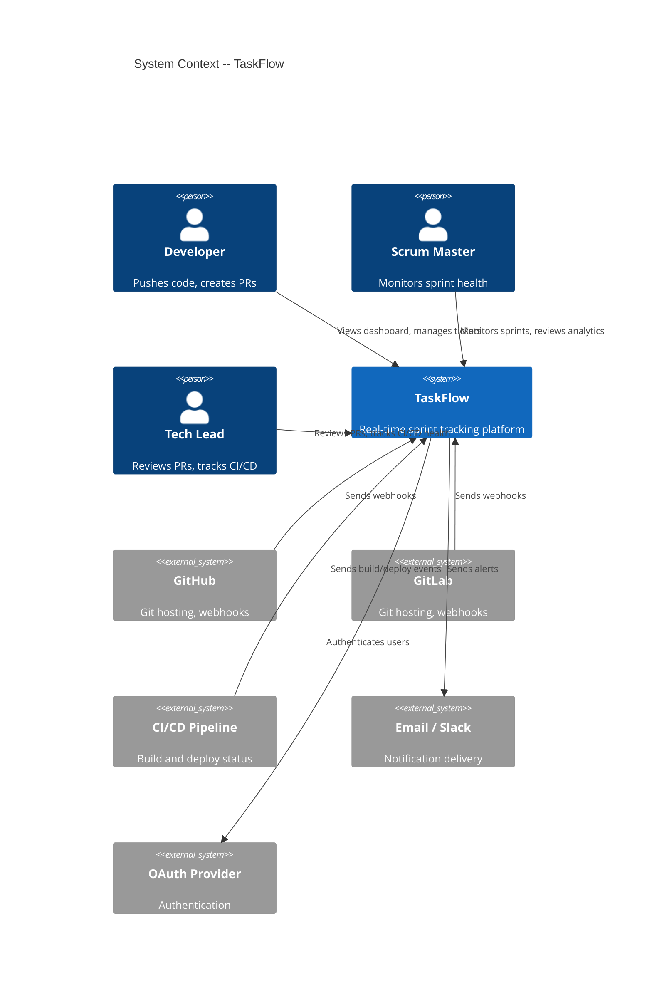

# Project Scope: TaskFlow

> **Project**: TaskFlow
> **Version**: 1.0
> **Date Created**: 2026-04-06
> **Last Updated**: 2026-04-06
> **Status**: Draft
> **Author**: AI-Generated
> **Source**: Expands scope section from `charter-final.md`

---

## 1. Project Boundaries

```
+-------------------------------------------------------------+
|                         IN SCOPE                             |
|                                                              |
|  +-------------------+  +-------------------+                |
|  | Git Integration   |  | Sprint Dashboard  |                |
|  | - Webhook recv    |  | - Real-time board |                |
|  | - Event parsing   |  | - Status overview |                |
|  | - Ticket mapping  |  | - Filter/search   |                |
|  | - Status update   |  +-------------------+                |
|  | - Manual override |                                       |
|  +-------------------+  +-------------------+                |
|                          | CI/CD Integration |                |
|  +-------------------+  | - Build status    |                |
|  | Alerts & Notifs   |  | - Deploy status   |                |
|  | - Blocker alerts  |  +-------------------+                |
|  | - Stale tickets   |                                       |
|  | - Daily digest    |  +-------------------+                |
|  +-------------------+  | Sprint Analytics  |                |
|                          | - Velocity        |                |
|                          | - Burndown        |                |
|                          | - Predictions     |                |
|                          +-------------------+                |
|                                                              |
+--------------------------------------------------------------+
|                       OUT OF SCOPE                           |
|  - Full project management (epics, roadmaps, resource mgmt) |
|  - Non-dev workflow tracking (marketing, HR, sales)          |
|  - On-premise deployment (cloud-only for v1)                 |
|  - Mobile native apps (web responsive only)                  |
|  - Time tracking / timesheets                                |
+--------------------------------------------------------------+
```

---

## 2. Feature Inventory

| ID | Feature | Description | Priority | Complexity | Dependencies | Confidence |
|----|---------|-------------|----------|-----------|-------------|------------|
| SCP-001 | Git Integration | Auto-detect commits, PR status, branch activity from GitHub/GitLab | Must Have | L | None | ✅ CONFIRMED |
| SCP-002 | Sprint Dashboard | Real-time board showing ticket status derived from Git data | Must Have | L | SCP-001 | ✅ CONFIRMED |
| SCP-003 | CI/CD Integration | Sync build and deploy status to sprint tickets | Should Have | M | SCP-001 | 🔶 ASSUMED |
| SCP-004 | Alerts & Notifications | Push alerts for blockers, stale tickets, and daily summaries | Should Have | M | SCP-002 | ✅ CONFIRMED |
| SCP-005 | Sprint Analytics | Velocity charts, burndown, sprint completion predictions | Could Have | L | SCP-002 | 🔶 ASSUMED |

### Feature Breakdown (for M/L/XL features)

#### SCP-001: Git Integration

| Sub-feature | Description | Priority | Confidence |
|-------------|-------------|----------|------------|
| SCP-001.1 | Webhook receiver — accept and validate GitHub/GitLab webhook payloads | Must Have | ✅ CONFIRMED |
| SCP-001.2 | Event parser — extract commit, PR, and branch data from webhook payloads | Must Have | 🔶 ASSUMED |
| SCP-001.3 | Ticket mapper — match Git events to tickets via branch naming conventions | Must Have | 🔶 ASSUMED |
| SCP-001.4 | Status updater — change ticket status based on Git event mapping rules | Must Have | 🔶 ASSUMED |
| SCP-001.5 | Manual override — allow users to correct auto-mapped ticket status | Should Have | 🔶 ASSUMED |

#### SCP-002: Sprint Dashboard

| Sub-feature | Description | Priority | Confidence |
|-------------|-------------|----------|------------|
| SCP-002.1 | Board view — Kanban-style board showing all tickets grouped by status | Must Have | ✅ CONFIRMED |
| SCP-002.2 | Real-time updates — live refresh when Git events change ticket status | Must Have | 🔶 ASSUMED |
| SCP-002.3 | Filter and search — filter tickets by assignee, label, status, date range | Should Have | 🔶 ASSUMED |
| SCP-002.4 | Sprint selector — switch between current and past sprints | Must Have | ✅ CONFIRMED |

#### SCP-003: CI/CD Integration

| Sub-feature | Description | Priority | Confidence |
|-------------|-------------|----------|------------|
| SCP-003.1 | Build status sync — show pass/fail status from CI pipeline on tickets | Should Have | 🔶 ASSUMED |
| SCP-003.2 | Deploy status sync — show deployment stage (staging, production) on tickets | Should Have | 🔶 ASSUMED |

#### SCP-005: Sprint Analytics

| Sub-feature | Description | Priority | Confidence |
|-------------|-------------|----------|------------|
| SCP-005.1 | Velocity chart — story points completed per sprint over time | Could Have | 🔶 ASSUMED |
| SCP-005.2 | Burndown chart — remaining work vs ideal trend for current sprint | Could Have | 🔶 ASSUMED |
| SCP-005.3 | Prediction engine — ML-based sprint completion probability | Could Have | ❓ UNCLEAR |

---

## 3. User Roles / Personas

### Persona: Dev Dana (Developer)

| Field | Description |
|-------|-------------|
| **Role** | Software developer on a remote team |
| **Goals** | 1. See what tickets are assigned to me without checking multiple tools 2. Have ticket status update automatically when I push code 3. Know if my PR is blocking someone |
| **Pain Points** | 1. Forgets to update Jira after pushing code 2. Doesn't know when CI fails until someone pings on Slack 3. Spends 10 min/day on status meetings that could be async |
| **Technical Proficiency** | High |
| **Usage Frequency** | Daily |
| **Estimated Volume** | ~200 developers initially, ~1000 by year 2 |
| **Key Scenarios** | 1. Pushes code and ticket auto-moves to "In Review" 2. Opens dashboard to see sprint progress before standup 3. Gets notified when their PR blocks a teammate |
| **Primary / Secondary** | Primary |
| **Confidence** | 🔶 ASSUMED — Reasoning: inferred from charter's target audience "remote development teams (5-50 people)". Q&A ref: Q-001 |

### Persona: SM Sam (Scrum Master)

| Field | Description |
|-------|-------------|
| **Role** | Scrum master managing 1-3 remote teams |
| **Goals** | 1. See sprint health at a glance without chasing updates 2. Identify blockers before they become critical 3. Generate sprint reports automatically |
| **Pain Points** | 1. Spends 30-60 min/day chasing developers for status updates 2. Sprint board is always stale — doesn't reflect reality 3. Manual velocity calculations are error-prone |
| **Technical Proficiency** | Medium |
| **Usage Frequency** | Daily |
| **Estimated Volume** | ~40 scrum masters initially, ~200 by year 2 |
| **Key Scenarios** | 1. Opens dashboard and sees accurate sprint progress without asking anyone 2. Receives alert when a ticket has been "In Progress" for 3+ days 3. Pulls velocity and burndown charts for sprint retrospective |
| **Primary / Secondary** | Primary |
| **Confidence** | ✅ CONFIRMED — Source: charter problem statement and user interviews |

### Persona: TL Tara (Tech Lead)

| Field | Description |
|-------|-------------|
| **Role** | Technical lead overseeing architecture and code quality |
| **Goals** | 1. See which PRs are open and need review 2. Track how CI/CD failures correlate with sprint delays 3. Identify team members who are overloaded or blocked |
| **Pain Points** | 1. No single view of PR status across multiple repos 2. CI failures aren't visible on the sprint board 3. Capacity issues surface too late in the sprint |
| **Technical Proficiency** | High |
| **Usage Frequency** | Daily |
| **Estimated Volume** | ~50 tech leads initially, ~250 by year 2 |
| **Key Scenarios** | 1. Reviews dashboard to see all open PRs across team repos 2. Checks CI/CD integration to spot recurring build failures 3. Uses analytics to argue for more capacity in sprint planning |
| **Primary / Secondary** | Secondary |
| **Confidence** | 🔶 ASSUMED — Reasoning: common role in target team size, not explicitly mentioned in charter. Q&A ref: Q-002 |

### Persona-to-Feature Map

| Feature | Dev Dana | SM Sam | TL Tara |
|---------|----------|--------|---------|
| SCP-001: Git Integration | Primary user (auto-status) | Views results | Views results |
| SCP-002: Sprint Dashboard | Views own tickets | Primary user (sprint health) | Views team overview |
| SCP-003: CI/CD Integration | Views build status | — | Primary user (build health) |
| SCP-004: Alerts & Notifications | Receives PR alerts | Primary user (blocker alerts) | Receives review requests |
| SCP-005: Sprint Analytics | — | Primary user (velocity/burndown) | Uses for capacity planning |

---

## 4. System Context

### External Systems & Integrations

| ID | External System | Direction | Data Exchanged | Purpose | Confidence |
|----|----------------|-----------|---------------|---------|------------|
| INT-001 | GitHub | IN | Webhooks: push, PR, branch events | Primary Git data source | ✅ CONFIRMED |
| INT-002 | GitLab | IN | Webhooks: push, MR, branch events | Secondary Git data source | ✅ CONFIRMED |
| INT-003 | CI/CD Pipeline (GitHub Actions, GitLab CI) | IN | Build/deploy status events | CI/CD status sync | 🔶 ASSUMED |
| INT-004 | Email / Slack | OUT | Alert notifications, daily digests | User notifications | 🔶 ASSUMED |
| INT-005 | OAuth Provider (GitHub/GitLab) | BI | Auth tokens, user identity | User authentication | 🔶 ASSUMED |

### System Context Diagram



---

## 5. Quality Attributes (Non-Functional Requirements)

| ID | Attribute | Requirement | Measurement | Priority | Confidence |
|----|-----------|------------|-------------|----------|------------|
| QA-001 | Performance | Dashboard loads in < 2 seconds; webhook processing < 500ms | APM monitoring (P95 latency) | Must Have | 🔶 ASSUMED |
| QA-002 | Availability | 99.5% uptime (4.38 hours downtime/year) | Uptime monitoring (e.g., Pingdom) | Must Have | 🔶 ASSUMED |
| QA-003 | Scalability | Support 50 teams (500 developers) at launch; 200 teams (2000 devs) by year 2 | Load testing, auto-scaling metrics | Should Have | 🔶 ASSUMED |
| QA-004 | Security | OAuth 2.0 auth; data encrypted in transit (TLS 1.2+) and at rest; no PII stored beyond name/email | Security audit, pen test | Must Have | 🔶 ASSUMED |
| QA-005 | Real-time | Dashboard updates within 5 seconds of Git event | End-to-end latency measurement | Must Have | ❓ UNCLEAR |
| QA-006 | Maintainability | 80% test coverage; CI/CD for TaskFlow itself; documented API | Coverage reports, API docs | Should Have | 🔶 ASSUMED |

---

## 6. Scope Change Control

### Change Request Process

1. Requestor submits scope change with: description, justification, impact assessment
2. Product Owner evaluates: does it align with charter objectives?
3. Impact analysis: effect on budget, timeline, risk, and existing scope
4. Decision: Approve (add to In-Scope) / Defer (add to Won't Have) / Reject
5. Update scope document version if approved

### Change Request Template

| Field | Value |
|-------|-------|
| Requested by | {name} |
| Date | {date} |
| Description | {what to add/change} |
| Justification | {why needed} |
| Impact on timeline | {estimate} |
| Impact on budget | {estimate} |
| Impact on risk | {new risks introduced} |
| Decision | Approved / Deferred / Rejected |
| Decided by | {name, date} |

---

## Q&A Log

### Pending

#### Q-001 (related: Persona "Dev Dana", SCP-001.3)
- **Impact**: HIGH
- **Question**: What branch naming conventions do target teams actually use? Do most teams use `feature/TASK-123` format, or are there other common patterns?
- **Context**: The ticket mapper (SCP-001.3) relies on extracting ticket IDs from branch names. If conventions vary widely, we may need configurable parsing rules instead of a fixed pattern.
- **Answer**:
- **Status**: Pending

#### Q-002 (related: Persona "TL Tara")
- **Impact**: MEDIUM
- **Question**: Is the Tech Lead a distinct persona, or do their needs overlap sufficiently with Developer and Scrum Master?
- **Context**: TL Tara was inferred from common team structures but not explicitly mentioned in the charter. If not a distinct persona, we can simplify the persona set.
- **Answer**:
- **Status**: Pending

#### Q-003 (related: QA-005, SCP-001, SCP-002)
- **Impact**: HIGH
- **Question**: What is the acceptable latency between a Git event and the dashboard reflecting that change? Is 5 seconds acceptable, or does it need to be near-instant (< 1 second)?
- **Context**: Near-instant updates require WebSocket infrastructure and increase complexity significantly. 5-second polling is simpler but may feel "laggy" to users.
- **Answer**:
- **Status**: Pending

#### Q-004 (related: SCP-005.3)
- **Impact**: LOW
- **Question**: Is the ML-based sprint prediction feature realistic for v1, or should it be deferred to v2?
- **Context**: ML prediction requires historical data that won't exist at launch. May need 3-6 months of data before predictions are useful.
- **Answer**:
- **Status**: Pending

#### Q-005 (related: INT-004, SCP-004)
- **Impact**: MEDIUM
- **Question**: Which notification channels are required for v1? Email only, Slack only, or both?
- **Context**: Supporting multiple notification channels increases integration scope. Slack is most common for dev teams but email has broader reach.
- **Answer**:
- **Status**: Pending

---

## Readiness Assessment

| Metric | Value |
|--------|-------|
| Total items | 32 |
| ✅ CONFIRMED | 10 (31%) |
| 🔶 ASSUMED | 19 (59%) |
| ❓ UNCLEAR | 3 (9%) |
| Q&A Pending | 5 (HIGH: 2, MEDIUM: 2, LOW: 1) |
| Q&A Answered | 0 |

**Verdict**: ⚠️ Partially Ready

**Reasoning**: Feature inventory is well-structured and traces to charter, but most sub-features and all quality attributes are ASSUMED. Two HIGH-impact Q&A items (branch naming conventions, real-time latency requirements) must be resolved before requirements phase to avoid rework.

---

## Approval

| Role | Name | Date | Status |
|------|------|------|--------|
| Project Sponsor | Sarah Chen | | ☐ Pending |
| Product Owner | [TBD] | | ☐ Pending |
