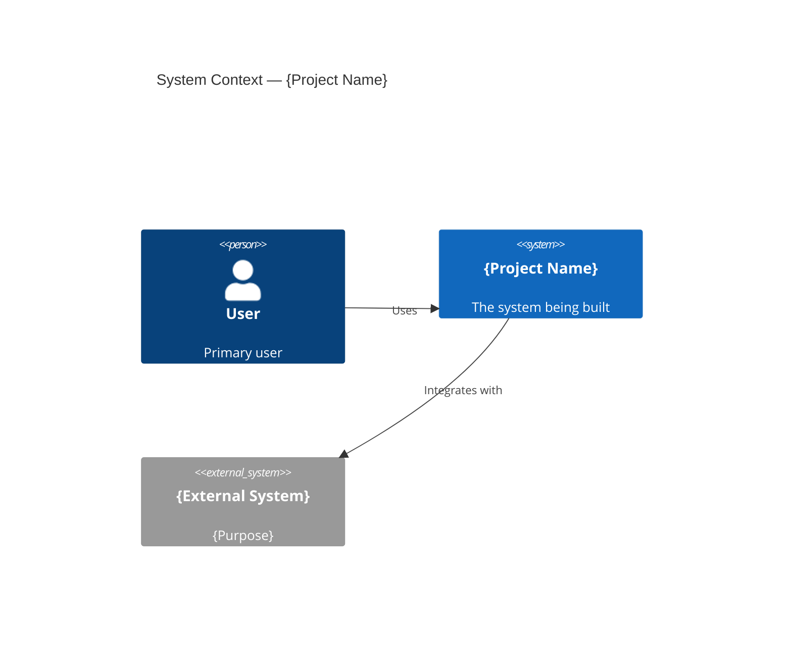

# Project Scope: {Project Name}

> **Project**: {Project Name}
> **Version**: 1.0
> **Date Created**: {YYYY-MM-DD}
> **Last Updated**: {YYYY-MM-DD}
> **Status**: Draft
> **Author**: AI-Generated
> **Source**: Expands scope section from `charter-final.md`

---

## 1. Project Boundaries

```
┌─────────────────────────────────────────────────┐
│                  IN SCOPE                        │
│                                                  │
│  ┌──────────────┐  ┌──────────────┐             │
│  │  Feature A   │  │  Feature B   │             │
│  │  - Sub A.1   │  │  - Sub B.1   │             │
│  │  - Sub A.2   │  │  - Sub B.2   │             │
│  └──────────────┘  └──────────────┘             │
│                                                  │
├──────────────────────────────────────────────────┤
│                  OUT OF SCOPE                    │
│  - Feature X (deferred to Phase 2)              │
│  - Feature Y (handled by existing system)       │
└──────────────────────────────────────────────────┘
```

---

## 2. Feature Inventory

| ID | Feature | Description | Priority | Complexity | Dependencies | Confidence |
|----|---------|-------------|----------|-----------|-------------|------------|
| SCP-001 | {feature name} | {what it does, 1-2 sentences} | Must/Should/Could/Won't | XS/S/M/L/XL | {other feature IDs or "None"} | {✅/🔶/❓} |

### Feature Breakdown (for M/L/XL features)

#### SCP-001: {Feature Name}

| Sub-feature | Description | Priority | Confidence |
|-------------|-------------|----------|------------|
| SCP-001.1 | {sub-feature} | Must/Should/Could | {✅/🔶/❓} |
| SCP-001.2 | {sub-feature} | | |

---

## 3. User Roles / Personas

### Persona: {Name} ({Role})

| Field | Description |
|-------|-------------|
| **Role** | {Their role in the system} |
| **Goals** | {What they want to accomplish — top 3} |
| **Pain Points** | {Current frustrations — top 3} |
| **Technical Proficiency** | Low / Medium / High |
| **Usage Frequency** | Daily / Weekly / Occasional |
| **Estimated Volume** | {How many users of this type} |
| **Key Scenarios** | {Top 3-5 things they do with the system} |
| **Primary / Secondary** | Primary = core user, Secondary = important but not main focus |
| **Confidence** | {✅/🔶/❓} |

{Repeat for each persona}

### Persona-to-Feature Map

| Feature | {Persona 1} | {Persona 2} | {Persona 3} |
|---------|------------|------------|------------|
| SCP-001 | Primary user | — | Views only |
| SCP-002 | — | Primary user | Primary user |

---

## 4. System Context

### External Systems & Integrations

| ID | External System | Direction | Data Exchanged | Purpose | Confidence |
|----|----------------|-----------|---------------|---------|------------|
| INT-001 | {system name} | IN / OUT / BI | {what data} | {why needed} | {✅/🔶/❓} |

### System Context Diagram



---

## 5. Quality Attributes (Non-Functional Requirements)

| ID | Attribute | Requirement | Measurement | Priority | Confidence |
|----|-----------|------------|-------------|----------|------------|
| QA-001 | Performance | {e.g., API response < 200ms at P95} | {how measured} | Must/Should/Could | {✅/🔶/❓} |
| QA-002 | Availability | {e.g., 99.9% uptime} | {monitoring tool} | | |
| QA-003 | Scalability | {e.g., 10,000 concurrent users} | {load testing} | | |
| QA-004 | Security | {e.g., SOC 2 Type II, encryption at rest} | {audit/scan} | | |
| QA-005 | Accessibility | {e.g., WCAG 2.1 AA} | {a11y testing} | | |
| QA-006 | Maintainability | {e.g., 80% test coverage, CI/CD} | {coverage tool} | | |

---

## 6. Scope Change Control

### Change Request Process

1. Requestor submits scope change with: description, justification, impact assessment
2. Product Owner evaluates: does it align with charter objectives?
3. Impact analysis: effect on budget, timeline, risk, and existing scope
4. Decision: Approve (add to In-Scope) / Defer (add to Won't Have) / Reject
5. Update scope document version if approved

### Change Request Template

| Field | Value |
|-------|-------|
| Requested by | {name} |
| Date | {date} |
| Description | {what to add/change} |
| Justification | {why needed} |
| Impact on timeline | {estimate} |
| Impact on budget | {estimate} |
| Impact on risk | {new risks introduced} |
| Decision | Approved / Deferred / Rejected |
| Decided by | {name, date} |

---

## Approval

| Role | Name | Date | Status |
|------|------|------|--------|
| Project Sponsor | | | ☐ Pending |
| Product Owner | | | ☐ Pending |
