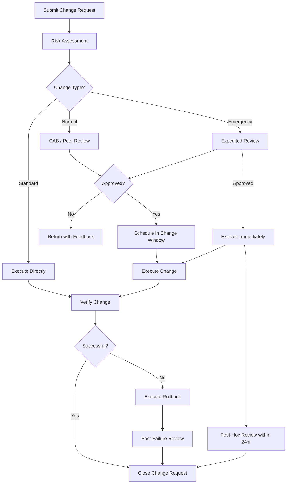
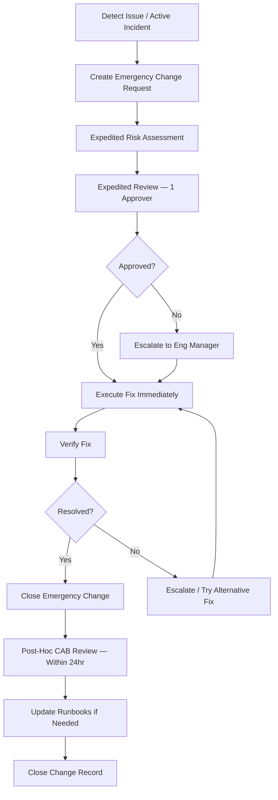

# Change Management Output Template

This is the expected structure for `change-mgmt-draft.md` output. Follow this exactly.

---

```markdown
# Change Management: {Project Name}

> **Project**: {Project Name}
> **Version**: {1.0}
> **Date Created**: {YYYY-MM-DD}
> **Last Updated**: {YYYY-MM-DD}
> **Status**: Draft
> **Author**: AI-Generated
> **Source**: Derived from `release-plan-final.md` and `cicd-pipeline-final.md`

{If refine mode, include Change Log here}

---

## 1. Change Types

### Change Type Summary

| Type | Risk Level | Approval | Scheduling | Rollback | Examples |
|------|-----------|----------|------------|----------|----------|
| Standard | Low | Pre-approved | Anytime | Automatic/simple | {examples} |
| Normal | Medium-High | CAB/peer review | Change window only | Required, documented | {examples} |
| Emergency | Critical | Expedited (1 reviewer) | Immediate | Required, post-hoc review | {examples} |

{marker} — Classification criteria based on {source}.

### Standard Changes (Pre-approved)

**Criteria**: {What makes a change "standard"}

| Change | Procedure | Rollback | Confidence |
|--------|-----------|----------|------------|
| {Config change via parameter store} | {Update value, verify} | {Revert value} | {marker} |
| {Dependency patch update} | {Merge Dependabot PR, auto-deploy} | {Revert PR} | {marker} |
| {Feature flag toggle} | {Toggle in dashboard/config} | {Toggle back} | {marker} |
| {Documentation update} | {Merge PR, auto-deploy} | {Revert PR} | {marker} |

### Normal Changes (Requires Review)

**Criteria**: {What makes a change "normal"}

| Change | Review Required | Testing Required | Rollback Plan | Confidence |
|--------|----------------|-----------------|---------------|------------|
| {Feature release} | {PR review + tech lead} | {Full test suite + staging} | {Blue/green switch} | {marker} |
| {Database migration} | {PR review + DBA/tech lead} | {Staging migration test} | {Down migration script} | {marker} |
| {Infrastructure change} | {PR review + platform lead} | {Terraform plan review} | {Terraform rollback} | {marker} |
| {New integration} | {PR review + tech lead} | {Integration test suite} | {Feature flag disable} | {marker} |

### Emergency Changes

**Criteria**: {What qualifies as an emergency change}

| Change | Expedited Approval | Max Time to Deploy | Post-Hoc Review | Confidence |
|--------|-------------------|-------------------|-----------------|------------|
| {Production hotfix} | {1 reviewer} | {< 2hr} | {Within 24hr} | {marker} |
| {Security patch} | {1 reviewer + security} | {< 4hr} | {Within 24hr} | {marker} |
| {Data fix} | {1 reviewer + DBA} | {< 2hr} | {Within 24hr} | {marker} |
| {Failed change rollback} | {Change owner} | {< 15min} | {Within 24hr} | {marker} |

---

## 2. Change Request Process

### Process Flowchart



### Process Steps

| Step | Owner | SLA | Input | Output | Confidence |
|------|-------|-----|-------|--------|------------|
| 1. Submit request | {Requester} | {N/A} | {Change description, risk factors} | {Change request ticket} | {marker} |
| 2. Risk assessment | {Requester + reviewer} | {< Xhr} | {Change request} | {Risk score} | {marker} |
| 3. Route by type | {Automated / change manager} | {< Xhr} | {Risk score} | {Review assignment} | {marker} |
| 4. Review & approve | {CAB / peer / expedited} | {Xhr per type} | {Change request + risk score} | {Approval / rejection} | {marker} |
| 5. Schedule | {Change owner} | {< Xhr} | {Approval} | {Scheduled time in change window} | {marker} |
| 6. Execute | {Change owner} | {Per change type} | {Approved change, runbook} | {Change applied} | {marker} |
| 7. Verify | {Change owner + on-call} | {< Xhr} | {Change applied} | {Verification result} | {marker} |
| 8. Close | {Change owner} | {< Xhr} | {Verification result} | {Change log entry} | {marker} |

---

## 3. Change Advisory Board

### CAB Model

{Describe the CAB model — lightweight async for small teams, formal for larger teams}

{marker} — CAB model based on {team size / organizational context}.

### Membership

| Role | Responsibility | Required/Advisory | Confidence |
|------|---------------|-------------------|------------|
| {Tech Lead} | {Final approval for normal changes} | Required | {marker} |
| {Engineering Manager} | {Escalation, emergency approval} | Required | {marker} |
| {QA Lead} | {Test evidence review} | Advisory | {marker} |
| {Platform/SRE Lead} | {Infrastructure impact review} | Advisory | {marker} |

### Meeting Cadence

| Meeting | Frequency | Duration | Purpose | Confidence |
|---------|-----------|----------|---------|------------|
| {Async review} | {Daily} | {N/A} | {Review standard and normal change requests} | {marker} |
| {Weekly sync} | {Weekly} | {30 min} | {Review upcoming changes, discuss patterns} | {marker} |
| {Emergency} | {As needed} | {15 min} | {Expedited approval for emergency changes} | {marker} |

### Decision Criteria

| Criterion | Must Pass? | What Reviewers Check |
|-----------|-----------|---------------------|
| Risk score acceptable | Yes | {Risk score within threshold for change type} |
| Rollback plan documented | Yes (normal/emergency) | {Rollback steps, target time, tested?} |
| Test evidence provided | Yes (normal) | {Test results, coverage, staging validation} |
| Impact analysis complete | Yes | {Services affected, users affected, data risk} |
| No scheduling conflicts | Yes | {No conflicting changes, not in blackout} |
| Communication plan | Advisory | {Stakeholders notified if high-impact} |

---

## 4. Change Windows

### Regular Change Windows

| Window | Days | Time | Timezone | Change Types Allowed | Confidence |
|--------|------|------|----------|---------------------|------------|
| {Primary} | {Tue-Thu} | {10:00-16:00} | {team TZ} | {All} | {marker} |
| {Extended} | {Mon, Fri} | {10:00-14:00} | {team TZ} | {Standard only} | {marker} |

### Blackout Periods

| Blackout | Duration | Applies To | Exemptions | Confidence |
|----------|----------|-----------|------------|------------|
| {Release day} | {Release day +/- 1 day} | {Normal changes} | {Emergency} | {marker} |
| {Holidays} | {Holiday + 1 day buffer} | {All non-emergency} | {Emergency} | {marker} |
| {Active incidents} | {Until resolved} | {All non-emergency} | {Incident-related emergency} | {marker} |
| {Major events} | {Event period + buffer} | {All non-emergency} | {Emergency} | {marker} |

### Timezone Considerations

{Document timezone policy for change windows — especially for distributed teams}

---

## 5. Risk Assessment

### Impact x Likelihood Matrix

|  | Low Likelihood (1) | Medium Likelihood (2) | High Likelihood (3) |
|--|-------------------|----------------------|---------------------|
| **High Impact (3)** | 3 — Medium | 6 — High | 9 — Critical |
| **Medium Impact (2)** | 2 — Low | 4 — Medium | 6 — High |
| **Low Impact (1)** | 1 — Low | 2 — Low | 3 — Medium |

{marker} — Risk matrix dimensions based on {source / team maturity}.

### Impact Factors

| Factor | Low (1) | Medium (2) | High (3) | Confidence |
|--------|---------|------------|----------|------------|
| Services affected | {1 service, non-critical} | {2-3 services or 1 critical} | {4+ services or core path} | {marker} |
| Users affected | {Internal only} | {Subset of users} | {All users} | {marker} |
| Data risk | {No data changes} | {Read-only data changes} | {Data mutations, schema changes} | {marker} |
| Reversibility | {Instant rollback} | {Rollback < 15 min} | {Difficult rollback} | {marker} |

### Likelihood Factors

| Factor | Low (1) | Medium (2) | High (3) | Confidence |
|--------|---------|------------|----------|------------|
| Test coverage | {Full suite passing} | {Partial coverage} | {Minimal testing} | {marker} |
| Change familiarity | {Done many times} | {Done a few times} | {First time} | {marker} |
| Failure history | {No recent failures} | {Occasional issues} | {Recent failures} | {marker} |
| Complexity | {Single config change} | {Multi-service change} | {DB + code + config} | {marker} |

### Risk Score Thresholds

| Score | Risk Level | Review Requirements | Confidence |
|-------|-----------|-------------------|------------|
| 1-2 | Low | {May be standard (pre-approved)} | {marker} |
| 3-4 | Medium | {Normal review by tech lead or peer} | {marker} |
| 5-6 | High | {CAB review required, additional testing} | {marker} |
| 7-9 | Critical | {Full CAB, stakeholder notification, extended monitoring} | {marker} |

---

## 6. Change Execution

### Pre-Change Checklist

| # | Check | Required For | Owner | Confidence |
|---|-------|-------------|-------|------------|
| 1 | {Rollback plan documented and tested} | {Normal, Emergency} | {Change owner} | {marker} |
| 2 | {Team notified of upcoming change} | {Normal, Emergency} | {Change owner} | {marker} |
| 3 | {Monitoring baseline captured} | {Normal, Emergency} | {Change owner} | {marker} |
| 4 | {Change window confirmed, no conflicts} | {Normal} | {Change owner} | {marker} |
| 5 | {Approval obtained} | {Normal, Emergency} | {Change owner} | {marker} |
| 6 | {Runbook/deployment procedure reviewed} | {All} | {Change owner} | {marker} |

### During Change

| # | Step | Owner | Verification | Confidence |
|---|------|-------|-------------|------------|
| 1 | {Follow deployment runbook / CI/CD pipeline} | {Change owner} | {Pipeline success} | {marker} |
| 2 | {Monitor real-time metrics during deployment} | {Change owner / on-call} | {No anomalies} | {marker} |
| 3 | {Run smoke tests / health checks} | {Automated / change owner} | {All passing} | {marker} |
| 4 | {Check error rates and latency} | {Change owner} | {Within baseline} | {marker} |

### Post-Change Verification

| # | Check | Soak Period | Success Criteria | Confidence |
|---|-------|------------|-----------------|------------|
| 1 | {Health check endpoints} | {Immediate} | {All returning 200} | {marker} |
| 2 | {Error rate monitoring} | {X min} | {Below threshold} | {marker} |
| 3 | {Latency monitoring} | {X min} | {Within baseline p99} | {marker} |
| 4 | {Business metric verification} | {X min} | {No anomalies} | {marker} |
| 5 | {User-facing functionality spot-check} | {X min} | {Key flows working} | {marker} |

### Rollback Criteria

| Trigger | Threshold | Action | Target Time | Confidence |
|---------|-----------|--------|-------------|------------|
| {Error rate spike} | {> X% above baseline} | {Automatic/manual rollback} | {< X min} | {marker} |
| {Health check failure} | {> X consecutive failures} | {Automatic rollback} | {< X min} | {marker} |
| {Latency spike} | {p99 > Xms} | {Manual rollback decision} | {< X min} | {marker} |
| {Customer reports} | {> X reports in X min} | {Manual rollback decision} | {< X min} | {marker} |

---

## 7. Change Tracking

### Change Log Format

| Field | Description | Example |
|-------|------------|---------|
| Change ID | {Unique identifier} | {CHG-001} |
| Date | {Execution date} | {YYYY-MM-DD HH:MM} |
| Type | {Standard / Normal / Emergency} | {Normal} |
| Description | {What changed} | {Deploy feature X to production} |
| Risk Score | {Impact x Likelihood} | {4 (Medium)} |
| Requester | {Who requested} | {Engineer name} |
| Approver | {Who approved} | {Tech Lead name} |
| Outcome | {Success / Failed / Rolled Back} | {Success} |
| Duration | {Start to close time} | {25 min} |
| Notes | {Additional context} | {No issues observed} |

### Sample Change Log

| ID | Date | Type | Description | Risk | Outcome | Duration |
|----|------|------|-------------|------|---------|----------|
| {CHG-001} | {date} | {type} | {description} | {score} | {outcome} | {duration} |
| {CHG-002} | {date} | {type} | {description} | {score} | {outcome} | {duration} |

### Change Metrics

| Metric | Definition | Target | Current | Confidence |
|--------|-----------|--------|---------|------------|
| Change success rate | Successful / total changes | {>95%} | {N/A — tracking starts at launch} | {marker} |
| Failed change rate | Failed / total changes | {<5%} | {N/A} | {marker} |
| Emergency change ratio | Emergency / total changes | {<5%} | {N/A} | {marker} |
| Mean change duration | Avg time from start to close | {<30 min standard, <2hr normal} | {N/A} | {marker} |
| MTTR for failed changes | Mean time to restore after failure | {<15 min} | {N/A} | {marker} |
| Change-related incidents | Incidents caused by changes | {Track and reduce} | {N/A} | {marker} |

### Improvement Process

{Describe how change metrics drive process improvement — regular reviews, correlation analysis, promotion of standard changes, etc.}

---

## 8. Emergency Change Process

### Emergency Change Flowchart



### Emergency Approval Matrix

| Scenario | Approver | Backup Approver | Max Response Time | Confidence |
|----------|----------|----------------|-------------------|------------|
| {Production hotfix} | {Tech Lead} | {Eng Manager} | {< X min} | {marker} |
| {Security patch} | {Tech Lead + Security} | {Eng Manager} | {< X min} | {marker} |
| {Data fix} | {Tech Lead + DBA} | {Eng Manager} | {< X min} | {marker} |
| {Failed change rollback} | {Change owner (self-approve)} | {Tech Lead} | {Immediate} | {marker} |

### Post-Hoc Review Requirements

| Item | Required | Notes |
|------|---------|-------|
| Root cause documented | Yes | {Why was the emergency change needed?} |
| Change formally logged | Yes | {Retroactive change log entry with full details} |
| Runbook update needed? | Assess | {Should a new runbook be created or existing one updated?} |
| Standard change candidate? | Assess | {If this happens regularly, should it be pre-approved?} |
| Process improvement? | Assess | {Could this have been prevented or handled as a normal change?} |

---

## 9. Q&A Log

| ID | Question | Priority | Answer | Status | Confidence |
|----|----------|----------|--------|--------|------------|
| Q1 | {question} | {HIGH/MED/LOW} | {answer or "Pending"} | {Open/Resolved} | {marker} |
| Q2 | {question} | {HIGH/MED/LOW} | {answer or "Pending"} | {Open/Resolved} | {marker} |
| Q3 | {question} | {HIGH/MED/LOW} | {answer or "Pending"} | {Open/Resolved} | {marker} |

---

## 10. Readiness Assessment

### Confidence Summary

| Level | Count | Percentage |
|-------|-------|------------|
| ✅ CONFIRMED | {n} | {x%} |
| 🔶 ASSUMED | {n} | {x%} |
| ❓ UNCLEAR | {n} | {x%} |
| **Total** | {n} | 100% |

### Readiness Verdict

**{READY / PARTIALLY READY / NOT READY}**

{Justification based on confidence distribution and open Q&A items}

### Key Risks

| Risk | Impact | Mitigation |
|------|--------|------------|
| {risk} | {impact} | {mitigation} |

---

## 11. Approval

| Role | Name | Date | Signature |
|------|------|------|-----------|
| {Tech Lead} | __________ | __________ | __________ |
| {Engineering Manager} | __________ | __________ | __________ |
| {Product Manager} | __________ | __________ | __________ |
```
