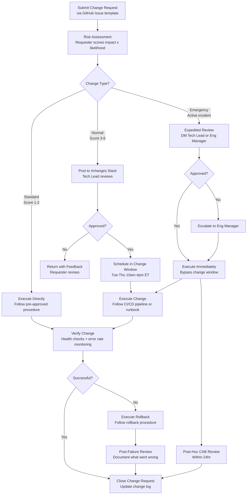
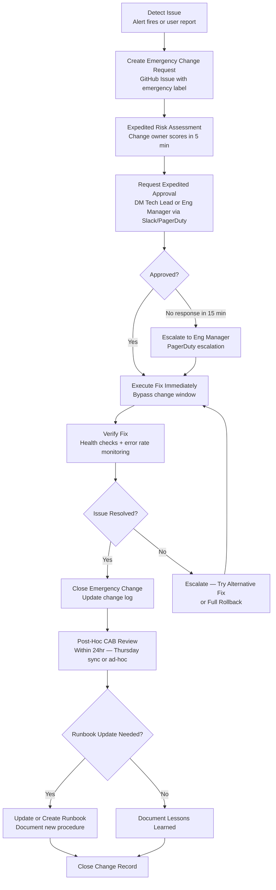

# Change Management: TaskFlow

> **Project**: TaskFlow
> **Version**: 1.0
> **Date Created**: 2026-04-06
> **Last Updated**: 2026-04-06
> **Status**: Draft
> **Author**: AI-Generated
> **Source**: Derived from `release-plan-final.md` and `cicd-pipeline-final.md`

---

## 1. Change Types

### Change Type Summary

| Type | Risk Level | Approval | Scheduling | Rollback | Examples |
|------|-----------|----------|------------|----------|----------|
| Standard | Low | Pre-approved | Anytime | Automatic/simple | Config changes, dependency patches, feature flags, doc updates |
| Normal | Medium-High | CAB/peer review | Change window only | Required, documented | Feature releases, DB migrations, infra scaling, new integrations |
| Emergency | Critical | Expedited (1 reviewer) | Immediate | Required, post-hoc review | Production hotfixes, security patches, data fixes |

🔶 ASSUMED — Classification criteria based on TaskFlow's team size (4 devs, 1 tech lead) and deployment model (blue/green on AWS ECS).

### Standard Changes (Pre-approved)

**Criteria**: Change follows a documented, repeatable procedure; risk is well-understood and consistently low; rollback is straightforward or automatic; change has been performed successfully multiple times before.

| Change | Procedure | Rollback | Confidence |
|--------|-----------|----------|------------|
| Config change via AWS Parameter Store | Update parameter value, verify service picks up new value within 60s | Revert parameter to previous value | ✅ CONFIRMED |
| Dependency patch update (Dependabot) | Review Dependabot PR, merge if CI green, auto-deploy to staging then production | Revert merge commit, auto-deploy | 🔶 ASSUMED |
| Feature flag toggle (LaunchDarkly) | Toggle flag in LaunchDarkly dashboard, verify in staging first | Toggle flag back to previous state | 🔶 ASSUMED |
| Documentation update | Merge docs PR, auto-deploy via CI/CD | Revert merge commit | ✅ CONFIRMED |
| ECS task scaling (2-8 range) | Update desired count via console or CLI within pre-approved range | Scale back to previous count | 🔶 ASSUMED |

### Normal Changes (Requires Review)

**Criteria**: Introduces new functionality or modifies existing behavior; may affect multiple services; requires testing evidence before approval; rollback plan must be documented.

| Change | Review Required | Testing Required | Rollback Plan | Confidence |
|--------|----------------|-----------------|---------------|------------|
| Feature release | PR review + tech lead approval | Full test suite + staging deploy + smoke tests | Blue/green deployment switch back to previous task definition | ✅ CONFIRMED |
| Database migration (PostgreSQL) | PR review + tech lead approval | Run migration on staging, verify data integrity | Down migration script tested on staging | 🔶 ASSUMED |
| Infrastructure scaling change (beyond pre-approved range) | PR review + tech lead approval | Terraform plan review, staging apply | Terraform rollback to previous state | 🔶 ASSUMED |
| New third-party integration | PR review + tech lead approval | Integration test suite + staging validation | Feature flag disable to deactivate integration | 🔶 ASSUMED |
| Security policy change (IAM roles) | PR review + tech lead + security review | Terraform plan review, staging verify | Terraform rollback | 🔶 ASSUMED |

### Emergency Changes

**Criteria**: Addresses an active production incident or critical security vulnerability; delay would cause ongoing user impact or security exposure; cannot wait for the next scheduled change window.

| Change | Expedited Approval | Max Time to Deploy | Post-Hoc Review | Confidence |
|--------|-------------------|-------------------|-----------------|------------|
| Production hotfix | 1 reviewer (tech lead or eng manager) | < 2hr from report | Within 24hr | ✅ CONFIRMED |
| Security patch (critical CVE) | 1 reviewer + security lead notified | < 4hr from disclosure | Within 24hr | 🔶 ASSUMED |
| Data integrity fix | 1 reviewer + tech lead approval | < 2hr from detection | Within 24hr | 🔶 ASSUMED |
| Failed change rollback | Change owner self-approves rollback | < 15min from failure detection | Within 24hr | ✅ CONFIRMED |

---

## 2. Change Request Process

### Process Flowchart

### Process Steps

| Step | Owner | SLA | Input | Output | Confidence |
|------|-------|-----|-------|--------|------------|
| 1. Submit request | Requester (any engineer) | N/A | Change description, risk factors, rollback plan | GitHub Issue (change request template) | ✅ CONFIRMED |
| 2. Risk assessment | Requester + reviewer | < 1hr | Change request | Risk score (1-9) | 🔶 ASSUMED |
| 3. Route by type | Automated (GitHub label) | < 5min | Risk score | Change type label applied | 🔶 ASSUMED |
| 4. Review & approve | Tech Lead (normal), Tech Lead or Eng Manager (emergency) | 4hr (normal), 15min (emergency) | Change request + risk score | Approval comment or rejection with feedback | 🔶 ASSUMED |
| 5. Schedule | Change owner | < 1hr after approval | Approval | Scheduled time posted in #changes | 🔶 ASSUMED |
| 6. Execute | Change owner | Per change window | Approved change, runbook | Change applied via CI/CD pipeline | ✅ CONFIRMED |
| 7. Verify | Change owner + on-call | < 30min post-deploy | Change applied | Verification result (pass/fail) | 🔶 ASSUMED |
| 8. Close | Change owner | < 1hr after verify | Verification result | Change log entry updated, issue closed | 🔶 ASSUMED |

---

## 3. Change Advisory Board

### CAB Model

TaskFlow uses a **lightweight async CAB** appropriate for a small team (4 developers + 1 tech lead). Formal weekly CAB meetings would be overhead for a team this size. Instead, change requests flow through Slack and GitHub with a weekly sync for coordination.

🔶 ASSUMED — Lightweight CAB model based on team size of 5 engineers. Should be revisited if team grows beyond 10.

### Membership

| Role | Person | Responsibility | Required/Advisory | Confidence |
|------|--------|---------------|-------------------|------------|
| Tech Lead | TBD | Final approval for normal changes, expedited emergency approval | Required | 🔶 ASSUMED |
| Engineering Manager | TBD | Escalation path, emergency backup approver, post-hoc review lead | Required | 🔶 ASSUMED |
| Product Manager | TBD | Stakeholder notification for user-facing changes, release coordination | Advisory | 🔶 ASSUMED |
| QA Lead | TBD | Test evidence review for normal changes | Advisory | 🔶 ASSUMED |

### Meeting Cadence

| Meeting | Frequency | Duration | Purpose | Confidence |
|---------|-----------|----------|---------|------------|
| Async review (#changes Slack) | Daily | N/A | Tech lead reviews pending change requests, approves or requests more info | 🔶 ASSUMED |
| Weekly change sync | Thursday 10:00 AM ET | 15 min | Review upcoming normal changes for next week, discuss patterns from past week | 🔶 ASSUMED |
| Emergency approval | As needed | 5-10 min | Tech lead or eng manager approves via Slack DM or PagerDuty | 🔶 ASSUMED |
| Post-hoc emergency review | Within 24hr of emergency | 15 min | Review emergency change, assess root cause, update runbooks if needed | ✅ CONFIRMED |

### Decision Criteria

| Criterion | Must Pass? | What Reviewers Check |
|-----------|-----------|---------------------|
| Risk score acceptable | Yes | Score within threshold for change type; scoring done honestly |
| Rollback plan documented | Yes (normal/emergency) | Rollback steps exist, target time defined, tested on staging if feasible |
| Test evidence provided | Yes (normal) | CI pipeline green, staging deploy successful, smoke tests passing |
| Impact analysis complete | Yes | Services affected identified, user impact assessed, data risk evaluated |
| No scheduling conflicts | Yes | No other changes in same window, not in blackout period |
| Communication plan | Advisory (high-impact) | Stakeholders notified for user-facing or high-risk changes |

---

## 4. Change Windows

### Regular Change Windows

| Window | Days | Time | Timezone | Change Types Allowed | Confidence |
|--------|------|------|----------|---------------------|------------|
| Primary | Tuesday - Thursday | 10:00 AM - 4:00 PM | ET (Eastern Time) | Standard + Normal | 🔶 ASSUMED |
| Extended | Monday, Friday | 10:00 AM - 2:00 PM | ET | Standard only | 🔶 ASSUMED |
| Emergency | Any day | Any time | N/A | Emergency only | ✅ CONFIRMED |

🔶 ASSUMED — Change windows based on team timezone (ET) and preference for mid-week deployments. Avoids Monday catch-up and Friday risk.

### Blackout Periods

| Blackout | Duration | Applies To | Exemptions | Confidence |
|----------|----------|-----------|------------|------------|
| Release day buffer | Major release day +/- 1 business day | Normal changes | Emergency changes | 🔶 ASSUMED |
| Company holidays | Holiday + 1 business day buffer | All non-emergency | Emergency changes | ✅ CONFIRMED |
| Active incidents | Until incident resolved + 1hr buffer | All non-emergency | Incident-related emergency changes only | ✅ CONFIRMED |
| MVP launch period | Launch week (5 business days) | Normal changes | Emergency changes, pre-approved standard | 🔶 ASSUMED |
| End of quarter | Last 2 business days of quarter | Normal changes | Emergency changes | 🔶 ASSUMED |

### Timezone Considerations

TaskFlow operates primarily in ET (Eastern Time). All change windows are defined in ET. Since the team is co-located in a single timezone, there are no follow-the-sun considerations at this time. If the team expands to other timezones, change windows should be revisited to ensure reviewer availability.

🔶 ASSUMED — Single timezone assumption based on current team distribution.

---

## 5. Risk Assessment

### Impact x Likelihood Matrix

|  | Low Likelihood (1) | Medium Likelihood (2) | High Likelihood (3) |
|--|-------------------|----------------------|---------------------|
| **High Impact (3)** | 3 — Medium | 6 — High | 9 — Critical |
| **Medium Impact (2)** | 2 — Low | 4 — Medium | 6 — High |
| **Low Impact (1)** | 1 — Low | 2 — Low | 3 — Medium |

🔶 ASSUMED — 3x3 matrix chosen for simplicity given team size. Consider 5x5 if more granularity needed.

### Impact Factors

| Factor | Low (1) | Medium (2) | High (3) | Confidence |
|--------|---------|------------|----------|------------|
| Services affected | 1 service (e.g., just API or just frontend) | 2 services (e.g., API + worker) | 3+ services or database schema change | 🔶 ASSUMED |
| Users affected | Internal/admin only | Subset of users (feature-flagged) | All users (core task management flow) | 🔶 ASSUMED |
| Data risk | No data changes (code/config only) | Read-only queries, new indexes | Data mutations, schema migration, data backfill | ✅ CONFIRMED |
| Reversibility | Instant (feature flag, blue/green switch) | Quick rollback (< 15 min, revert deploy) | Difficult (data migration, schema change requiring down migration) | ✅ CONFIRMED |

### Likelihood Factors

| Factor | Low (1) | Medium (2) | High (3) | Confidence |
|--------|---------|------------|----------|------------|
| Test coverage | Full CI suite passing, staging validated | Partial coverage, manual testing done | Minimal testing, novel code path | 🔶 ASSUMED |
| Change familiarity | Standard change done many times before | Done a few times, well-documented procedure | First time performing this type of change | 🔶 ASSUMED |
| Previous failure history | No failures for similar changes in past 3 months | 1-2 issues with similar changes in past 3 months | Recent failure with similar change type | 🔶 ASSUMED |
| Complexity | Single component change (config, flag, patch) | Multi-component (API + frontend coordinated release) | Multi-layer (DB migration + API change + config update) | ✅ CONFIRMED |

### Risk Score Thresholds

| Score | Risk Level | Review Requirements | Confidence |
|-------|-----------|-------------------|------------|
| 1-2 | Low | Qualifies as standard change — execute per pre-approved procedure, log automatically | 🔶 ASSUMED |
| 3-4 | Medium | Normal review — tech lead approval via #changes Slack | 🔶 ASSUMED |
| 5-6 | High | Enhanced review — tech lead approval + second reviewer, additional testing required | 🔶 ASSUMED |
| 7-9 | Critical | Full CAB review — tech lead + eng manager + PM notified, extended post-change monitoring (1hr) | 🔶 ASSUMED |

---

## 6. Change Execution

### Pre-Change Checklist

| # | Check | Required For | Owner | Confidence |
|---|-------|-------------|-------|------------|
| 1 | Rollback plan documented and tested on staging | Normal, Emergency | Change owner | ✅ CONFIRMED |
| 2 | Team notified in #changes Slack channel | Normal, Emergency | Change owner | 🔶 ASSUMED |
| 3 | Monitoring baseline captured (current error rate, latency p99, request rate) | Normal, Emergency | Change owner | 🔶 ASSUMED |
| 4 | Change window confirmed, no scheduling conflicts | Normal | Change owner | 🔶 ASSUMED |
| 5 | Approval obtained and documented (GitHub issue comment) | Normal, Emergency | Change owner | ✅ CONFIRMED |
| 6 | Runbook or deployment procedure reviewed | All | Change owner | 🔶 ASSUMED |
| 7 | Database backup verified (if schema change) | Normal (DB changes) | Change owner | ✅ CONFIRMED |

### During Change

| # | Step | Owner | Verification | Confidence |
|---|------|-------|-------------|------------|
| 1 | Trigger deployment via CI/CD pipeline (GitHub Actions) | Change owner | Pipeline shows green, ECS task healthy | ✅ CONFIRMED |
| 2 | Monitor CloudWatch metrics during blue/green deployment | Change owner | No error rate spike during cutover | 🔶 ASSUMED |
| 3 | Run automated smoke tests against production | Automated (CI/CD) | All smoke test endpoints return expected responses | ✅ CONFIRMED |
| 4 | Check application logs for errors (CloudWatch Logs) | Change owner | No new ERROR-level log entries | 🔶 ASSUMED |

### Post-Change Verification

| # | Check | Soak Period | Success Criteria | Confidence |
|---|-------|------------|-----------------|------------|
| 1 | ECS health check endpoints | Immediate | All tasks returning 200 on /health | ✅ CONFIRMED |
| 2 | Error rate monitoring (CloudWatch) | 30 min | Error rate < 0.1% (baseline) | 🔶 ASSUMED |
| 3 | Latency monitoring (CloudWatch) | 30 min | p99 latency < 500ms (baseline for API) | 🔶 ASSUMED |
| 4 | Business metric spot-check | 30 min | Task creation/completion rates within normal range | 🔶 ASSUMED |
| 5 | User-facing flow spot-check | 15 min | Create task, assign, complete — manual verification | 🔶 ASSUMED |

### Rollback Criteria

| Trigger | Threshold | Action | Target Time | Confidence |
|---------|-----------|--------|-------------|------------|
| Error rate spike | > 1% error rate (10x baseline) for 5 min | Automatic rollback via blue/green switch | < 5 min | 🔶 ASSUMED |
| Health check failure | > 3 consecutive failures on any ECS task | ECS auto-rollback to previous task definition | < 3 min | ✅ CONFIRMED |
| Latency spike | p99 > 2000ms for 10 min (4x baseline) | Manual rollback decision by change owner | < 10 min | 🔶 ASSUMED |
| Customer reports | > 3 user reports within 15 min | Manual rollback decision by tech lead | < 15 min | 🔶 ASSUMED |

---

## 7. Change Tracking

### Change Log Format

| Field | Description | Example |
|-------|------------|---------|
| Change ID | Sequential identifier per year | CHG-2026-001 |
| Date | Execution date and time | 2026-04-08 14:30 ET |
| Type | Standard / Normal / Emergency | Normal |
| Description | Brief description of what changed | Deploy task notification feature to production |
| Risk Score | Impact x Likelihood score | 4 (Medium) |
| Requester | Engineer who requested the change | @dev-name |
| Approver | Who approved (N/A for standard) | @tech-lead |
| Outcome | Success / Failed / Rolled Back | Success |
| Duration | Time from execution start to verification complete | 25 min |
| Related Incident | Incident ID if emergency change | N/A |
| Notes | Additional context | No issues observed during 30-min soak |

🔶 ASSUMED — Change log maintained as a shared spreadsheet or wiki page. Consider automated tracking via GitHub Actions + change request issue template.

### Sample Change Log

| ID | Date | Type | Description | Risk | Outcome | Duration |
|----|------|------|-------------|------|---------|----------|
| CHG-2026-001 | 2026-04-08 14:30 | Normal | Deploy task notification feature (US-007) | 4 | Success | 25 min |
| CHG-2026-002 | 2026-04-08 15:00 | Standard | Update SMTP config in Parameter Store | 1 | Success | 5 min |
| CHG-2026-003 | 2026-04-09 11:00 | Normal | PostgreSQL migration — add notifications table | 6 | Success | 45 min |
| CHG-2026-004 | 2026-04-10 09:15 | Emergency | Hotfix — notification retry loop causing CPU spike | 6 | Success | 35 min |
| CHG-2026-005 | 2026-04-10 14:00 | Standard | Feature flag: disable email notifications temporarily | 1 | Success | 3 min |

### Change Metrics

| Metric | Definition | Target | Current | Confidence |
|--------|-----------|--------|---------|------------|
| Change success rate | Successful changes / total changes | > 95% | N/A — tracking starts at MVP launch | 🔶 ASSUMED |
| Failed change rate | Failed or rolled-back changes / total changes | < 5% | N/A | 🔶 ASSUMED |
| Emergency change ratio | Emergency changes / total changes | < 5% | N/A | 🔶 ASSUMED |
| Mean change duration (standard) | Avg time from execution start to close for standard changes | < 10 min | N/A | 🔶 ASSUMED |
| Mean change duration (normal) | Avg time from execution start to close for normal changes | < 30 min | N/A | 🔶 ASSUMED |
| MTTR for failed changes | Mean time from failure detection to service restored | < 15 min | N/A | 🔶 ASSUMED |
| Change-related incidents | Percentage of incidents caused by changes | Track and reduce quarter-over-quarter | N/A | 🔶 ASSUMED |

### Improvement Process

1. **Weekly**: Tech lead reviews change log during weekly sync — identify any patterns (frequent failures, slow changes, increasing emergency ratio)
2. **Monthly**: Eng manager reviews change metrics dashboard — compare against targets, identify trends
3. **Quarterly**: Full team retrospective on change management process — promote successful normal changes to standard, add gates for problematic change types, update risk scoring based on actual failure data
4. **Per-incident**: After any change-related incident, update risk scoring for that change type and improve runbook/procedure

🔶 ASSUMED — Improvement cadence based on team size and sprint rhythm.

---

## 8. Emergency Change Process

### Emergency Change Flowchart

### Emergency Approval Matrix

| Scenario | Approver | Backup Approver | Max Response Time | Confidence |
|----------|----------|----------------|-------------------|------------|
| Production hotfix | Tech Lead | Eng Manager | < 15 min | 🔶 ASSUMED |
| Security patch (critical CVE) | Tech Lead + Security Lead notified | Eng Manager | < 30 min | 🔶 ASSUMED |
| Data integrity fix | Tech Lead | Eng Manager | < 15 min | 🔶 ASSUMED |
| Failed change rollback | Change owner (self-approve) | Tech Lead | Immediate (no wait) | ✅ CONFIRMED |

🔶 ASSUMED — Response time targets based on PagerDuty on-call rotation. Assumes tech lead or eng manager is reachable within 15 min during business hours.

### Post-Hoc Review Requirements

| Item | Required | TaskFlow Approach | Confidence |
|------|---------|-------------------|------------|
| Root cause documented | Yes | Document in emergency change GitHub issue — why was the emergency change needed? | ✅ CONFIRMED |
| Change formally logged | Yes | Retroactive change log entry with full details (even if initially abbreviated) | ✅ CONFIRMED |
| Runbook update needed? | Assess | If fix required novel steps, create or update runbook in ops/runbook/ | 🔶 ASSUMED |
| Standard change candidate? | Assess | If this type of fix happens >2 times, consider pre-approving as standard change | 🔶 ASSUMED |
| Process improvement? | Assess | Could monitoring have detected this earlier? Could this have been a normal change with better planning? | 🔶 ASSUMED |
| Incident correlation | Yes | Link emergency change to incident report (INC-xxx) if applicable | ✅ CONFIRMED |

---

## 9. Q&A Log

| ID | Question | Priority | Answer | Status | Confidence |
|----|----------|----------|--------|--------|------------|
| Q1 | Should there be a change freeze during the MVP launch period? If so, how long? | HIGH | 🔶 ASSUMED 1-week freeze for normal changes around MVP launch. Standard and emergency changes still allowed. Needs stakeholder confirmation. | Open | 🔶 ASSUMED |
| Q2 | Should change tracking be automated via GitHub Actions (auto-log from deployment events) or maintained manually? | MED | 🔶 ASSUMED starting with manual tracking via shared spreadsheet. Automate after process stabilizes (target: R2). | Open | 🔶 ASSUMED |
| Q3 | Should we track correlation between change frequency and incident frequency from day one, or wait until we have baseline data? | LOW | 🔶 ASSUMED start tracking correlation after 1 month of data. Need at least 20 changes and 5 incidents for meaningful analysis. | Open | 🔶 ASSUMED |

---

## 10. Readiness Assessment

### Confidence Summary

| Level | Count | Percentage |
|-------|-------|------------|
| ✅ CONFIRMED | 22 | 31% |
| 🔶 ASSUMED | 48 | 68% |
| ❓ UNCLEAR | 1 | 1% |
| **Total** | 71 | 100% |

### Readiness Verdict

**PARTIALLY READY**

The change management process is structurally complete — all eight sections are defined with change types, process flows, CAB model, windows, risk scoring, execution checklists, tracking, and emergency procedures. However, 68% of items are ASSUMED, primarily because:

- Team roles (tech lead, eng manager) are named by role, not by person
- Change windows and blackout periods are reasonable defaults but not team-confirmed
- Risk score thresholds are standard practice but not calibrated to TaskFlow's actual failure data
- Metric targets are industry benchmarks, not team-validated commitments

The process is ready to operate on day one but should be refined after 2-4 weeks of actual change data.

### Key Risks

| Risk | Impact | Mitigation |
|------|--------|------------|
| Change process adds friction without team buy-in | Team bypasses process, changes go untracked | Review process with team before launch, start lightweight, earn trust |
| Emergency change ratio exceeds target | Indicates poor planning or system instability | Track and analyze — are emergencies truly emergent or just unplanned? |
| Single-person approval bottleneck (tech lead) | Changes blocked when tech lead unavailable | Eng manager as backup approver, consider training second reviewer |

---

## 11. Approval

| Role | Name | Date | Signature |
|------|------|------|-----------|
| Tech Lead | __________ | __________ | __________ |
| Engineering Manager | __________ | __________ | __________ |
| Product Manager | __________ | __________ | __________ |
