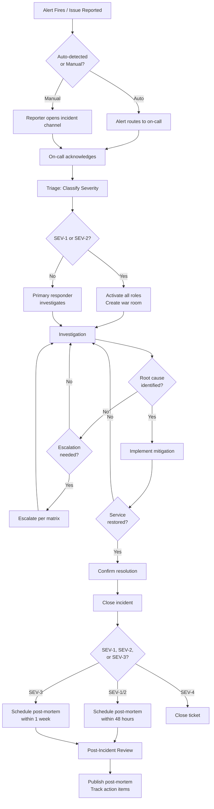

# Incident Response Output Template

This is the expected structure for `incident-response-draft.md` output. Follow this exactly.

---

```markdown
# Incident Response Plan -- {Project Name}

> **Project**: {Project Name}
> **Version**: draft | v{N}
> **Date Created**: {YYYY-MM-DD}
> **Last Updated**: {YYYY-MM-DD}
> **Status**: Draft | Under Review | Approved
> **Author**: AI-Generated
> **Source**: Based on `monitoring-plan-final.md` and `env-spec-final.md`

{If refine mode, include Change Log here}

---

## 1. Severity Definitions

{Brief statement of severity philosophy -- classify by user impact, not internal metrics.}

| Severity | Criteria | Examples | Response Time | Who is Paged | Confidence |
|----------|----------|----------|---------------|--------------|------------|
| **SEV-1** Critical | {user impact criteria} | {example 1}, {example 2} | {time} | {roles/people} | ✅/🔶/❓ |
| **SEV-2** Major | {user impact criteria} | {example 1}, {example 2} | {time} | {roles/people} | ✅/🔶/❓ |
| **SEV-3** Minor | {user impact criteria} | {example 1}, {example 2} | {time} | {roles/people} | ✅/🔶/❓ |
| **SEV-4** Informational | {user impact criteria} | {example 1}, {example 2} | {time} | {roles/people} | ✅/🔶/❓ |

### Alert-to-Severity Mapping

| Alert (from Monitoring Plan) | Severity | Rationale |
|------------------------------|----------|-----------|
| {alert name} | SEV-{N} | {why this severity} |

---

## 2. Incident Roles

| Role | Filled By | Responsibilities | Decision Authority | Confidence |
|------|-----------|------------------|--------------------|------------|
| **Incident Commander** | {who} | {responsibilities} | {authority} | ✅/🔶/❓ |
| **Communications Lead** | {who} | {responsibilities} | {authority} | ✅/🔶/❓ |
| **Technical Responder** | {who} | {responsibilities} | {authority} | ✅/🔶/❓ |
| **Scribe** | {who} | {responsibilities} | {authority} | ✅/🔶/❓ |

### Role Activation by Severity

| Role | SEV-1 | SEV-2 | SEV-3 | SEV-4 |
|------|-------|-------|-------|-------|
| Incident Commander | {active/combined} | {active/combined} | {active/combined} | {N/A} |
| Communications Lead | {active/combined} | {active/combined} | {active/combined} | {N/A} |
| Technical Responder | {active} | {active} | {active} | {ticket owner} |
| Scribe | {active/combined} | {active/combined} | {optional} | {N/A} |

### On-Call Rotation

| Rotation | Schedule | Primary | Secondary | Handoff Time | Confidence |
|----------|----------|---------|-----------|--------------|------------|
| {rotation name} | {weekly/biweekly} | {role/person} | {role/person} | {day and time} | ✅/🔶/❓ |

---

## 3. Response Process

### 3.1 Response Flowchart



### 3.2 Phase Details

#### Detection
- **Entry**: Alert fires or user/team member reports an issue
- **Actions**: {how issues are detected -- monitoring alerts, user reports, health checks}
- **Exit**: Incident acknowledged by on-call responder
- **Time Target**: {target time from issue start to detection} | Confidence: ✅/🔶/❓

#### Triage
- **Entry**: Incident acknowledged
- **Actions**: {assess scope, classify severity, activate roles if needed}
- **Exit**: Severity assigned, appropriate roles activated
- **Time Target**: {target time for triage} | Confidence: ✅/🔶/❓

#### Investigation
- **Entry**: Severity assigned, responder(s) engaged
- **Actions**: {check dashboards, review logs, consult runbooks, test hypotheses}
- **Exit**: Root cause or contributing factor identified
- **Time Target**: {varies by severity} | Confidence: ✅/🔶/❓

#### Mitigation
- **Entry**: Root cause identified or sufficient information to act
- **Actions**: {rollback, config change, scaling, hotfix, failover}
- **Exit**: User impact eliminated or reduced to acceptable level
- **Time Target**: {target time from identification to mitigation} | Confidence: ✅/🔶/❓

#### Resolution
- **Entry**: Mitigation applied, service appears restored
- **Actions**: {validate metrics, confirm user reports stopped, monitor for recurrence}
- **Exit**: Service confirmed stable for {monitoring window}
- **Time Target**: {monitoring window duration} | Confidence: ✅/🔶/❓

#### Post-Mortem
- **Entry**: Incident resolved and closed
- **Actions**: {write post-mortem, schedule review meeting, assign action items}
- **Exit**: Post-mortem published, action items tracked
- **Time Target**: {deadline per severity} | Confidence: ✅/🔶/❓

---

## 4. Escalation Matrix

### SEV-1 Escalation

| Tier | Contact | Trigger | Response Time | Method | Confidence |
|------|---------|---------|---------------|--------|------------|
| 1 | {on-call engineer} | Alert fires | {time} | {page/call} | ✅/🔶/❓ |
| 2 | {tech lead / senior engineer} | No ack in {time} or unresolved in {time} | {time} | {page/call} | ✅/🔶/❓ |
| 3 | {engineering manager} | Unresolved in {time} | {time} | {page/call} | ✅/🔶/❓ |
| 4 | {VP/CTO} | Unresolved in {time} or business impact exceeds {threshold} | {time} | {call} | ✅/🔶/❓ |

### SEV-2 Escalation

| Tier | Contact | Trigger | Response Time | Method | Confidence |
|------|---------|---------|---------------|--------|------------|
| 1 | {on-call engineer} | Alert fires | {time} | {page} | ✅/🔶/❓ |
| 2 | {tech lead} | No ack in {time} or unresolved in {time} | {time} | {page/Slack} | ✅/🔶/❓ |
| 3 | {engineering manager} | Unresolved in {time} | {time} | {Slack/call} | ✅/🔶/❓ |

### SEV-3 Escalation

| Tier | Contact | Trigger | Response Time | Method | Confidence |
|------|---------|---------|---------------|--------|------------|
| 1 | {on-call engineer} | Alert fires | {time} | {Slack} | ✅/🔶/❓ |
| 2 | {tech lead} | Unresolved in {time} | {time} | {Slack} | ✅/🔶/❓ |

### SEV-4 Escalation

No escalation -- handled through normal ticket workflow.

### Automatic Escalation Rules

| Rule | Condition | Action | Confidence |
|------|-----------|--------|------------|
| {rule name} | {condition -- e.g., no ack in 10 min} | {action -- e.g., page secondary on-call} | ✅/🔶/❓ |

---

## 5. Communication Plan

### 5.1 Internal Communication

#### Channels

| Channel | Purpose | Severity | Who Joins | Confidence |
|---------|---------|----------|-----------|------------|
| {e.g., #incidents} | {all incident coordination} | {all} | {who} | ✅/🔶/❓ |
| {e.g., #inc-YYYY-MM-DD-title} | {war room for specific incident} | {SEV-1/2} | {who} | ✅/🔶/❓ |

#### Update Frequency

| Severity | Internal Updates | Status Page | Customer Comms | Confidence |
|----------|-----------------|-------------|----------------|------------|
| SEV-1 | Every {X} minutes | Every {X} minutes | {frequency} | ✅/🔶/❓ |
| SEV-2 | Every {X} minutes | Every {X} minutes | {frequency} | ✅/🔶/❓ |
| SEV-3 | Every {X} hours | {if customer-facing} | {if reported} | ✅/🔶/❓ |
| SEV-4 | Ticket updates | Not needed | Not needed | ✅/🔶/❓ |

#### Internal Update Template

```
[TIMESTAMP] Incident Update -- [TITLE]
Status: Investigating / Identified / Mitigating / Resolved
Severity: SEV-X
Impact: [brief user impact]
Current Action: [what is happening now]
Next Step: [what happens next]
ETA: [estimate or "unknown"]
Commander: [name]
```

### 5.2 External Communication

#### Status Page

| Attribute | Value | Confidence |
|-----------|-------|------------|
| **Tool** | {e.g., Statuspage, Instatus, Cachet} | ✅/🔶/❓ |
| **URL** | {status page URL} | ✅/🔶/❓ |
| **Update Permission** | {who can update} | ✅/🔶/❓ |
| **Components Tracked** | {list of components} | ✅/🔶/❓ |
| **Link from Product** | {where status is linked in the product} | ✅/🔶/❓ |

#### Customer Communication Template (SEV-1)

```
Subject: [Service Name] -- Service Disruption

We are aware of an issue affecting [impact description].
Our engineering team is actively working on a resolution.

What you may experience:
- [symptom 1]
- [symptom 2]

What we are doing:
- [remediation action]

We will provide updates every [frequency].
For urgent inquiries, contact [support channel].

Next update: [time]
```

#### Customer Communication Template (SEV-2)

```
Subject: [Service Name] -- Degraded Performance

We are experiencing [brief description] that may affect [scope].

Impact: [what users may notice]
Status: [current status]

We expect to resolve this within [ETA].
We will update this notice when the issue is resolved.
```

#### Post-Resolution Communication Template

```
Subject: [Service Name] -- Issue Resolved

The issue affecting [impact description] has been resolved
as of [timestamp].

Duration: [start time] to [end time] ([total duration])
Impact: [summary of user impact]
Root Cause: [brief, non-technical explanation]

We apologize for the inconvenience and are taking steps
to prevent recurrence.

A detailed post-incident review will be published within [timeframe].
```

### 5.3 Stakeholder Notification Matrix

| Stakeholder | SEV-1 | SEV-2 | SEV-3 | SEV-4 | Confidence |
|-------------|-------|-------|-------|-------|------------|
| {stakeholder role} | {method + timing} | {method + timing} | {method + timing} | {method + timing} | ✅/🔶/❓ |

---

## 6. Post-Incident Review

### 6.1 Blameless Culture Principles

{Explicitly state the blameless culture principles adopted by the team:}

1. {Principle 1 -- e.g., Focus on systems and processes, not individuals}
2. {Principle 2 -- e.g., Action items fix systems, not people}
3. {Principle 3 -- e.g., Reward transparency and early reporting}
4. {Principle 4 -- e.g., Assume positive intent}
5. {Principle 5 -- e.g., No punitive action for honest mistakes}

### 6.2 Review Timeline

| Severity | Review Deadline | Meeting Duration | Attendees | Confidence |
|----------|----------------|------------------|-----------|------------|
| SEV-1 | {e.g., within 48 hours} | {duration} | {who} | ✅/🔶/❓ |
| SEV-2 | {e.g., within 48 hours} | {duration} | {who} | ✅/🔶/❓ |
| SEV-3 | {e.g., within 1 week} | {duration} | {who} | ✅/🔶/❓ |
| SEV-4 | Not required | N/A | N/A | ✅/🔶/❓ |

### 6.3 Post-Mortem Template

```markdown
# Post-Mortem: [Incident Title]

**Date**: [YYYY-MM-DD]
**Severity**: SEV-[N]
**Duration**: [start] to [end] ([total])
**Commander**: [name]
**Author**: [name]

## Summary
[1-2 paragraph summary: what happened, who was affected, how it was resolved]

## Timeline
| Time | Event |
|------|-------|
| HH:MM | [event -- e.g., Alert fired: API error rate >5%] |
| HH:MM | [event -- e.g., On-call acknowledged, began investigation] |
| HH:MM | [event -- e.g., Root cause identified: bad config deploy] |
| HH:MM | [event -- e.g., Rollback initiated] |
| HH:MM | [event -- e.g., Service restored, monitoring confirmed] |

## Impact
- **Users Affected**: [number or percentage]
- **Duration**: [total downtime or degradation time]
- **Revenue Impact**: [estimated or "none"]
- **SLA Impact**: [did this breach SLA? how much error budget consumed?]

## Root Cause Analysis (5 Whys)
1. Why? [first why]
2. Why? [second why]
3. Why? [third why]
4. Why? [fourth why]
5. Why? [root cause -- systemic issue]

## Contributing Factors
- [factor 1 -- things that made the incident worse or delayed resolution]
- [factor 2]

## What Went Well
- [positive 1 -- e.g., alert fired within 2 minutes]
- [positive 2 -- e.g., runbook was accurate and helpful]

## What Went Poorly
- [gap 1 -- e.g., rollback took 20 minutes instead of 5]
- [gap 2 -- e.g., no runbook for this specific failure mode]

## Action Items
| # | Action | Owner | Deadline | Category | Status |
|---|--------|-------|----------|----------|--------|
| 1 | [action] | [name] | [date] | Prevent / Detect / Respond | Open |
| 2 | [action] | [name] | [date] | Prevent / Detect / Respond | Open |

## Lessons Learned
- [key takeaway for the broader team]
```

### 6.4 Action Item Tracking

| Attribute | Value | Confidence |
|-----------|-------|------------|
| **Tracking Tool** | {e.g., Jira, Linear, GitHub Issues} | ✅/🔶/❓ |
| **Label/Tag** | {e.g., "post-mortem-action"} | ✅/🔶/❓ |
| **Review Cadence** | {e.g., weekly in team standup} | ✅/🔶/❓ |
| **Escalation if Overdue** | {what happens if deadline passes} | ✅/🔶/❓ |

---

## 7. Incident Metrics

### 7.1 Key Metrics

| Metric | Definition | Measurement Method | Target | Confidence |
|--------|------------|-------------------|--------|------------|
| **MTTD** (Mean Time to Detect) | {definition} | {how measured} | {target} | ✅/🔶/❓ |
| **MTTR** (Mean Time to Resolve) | {definition} | {how measured} | {target per severity} | ✅/🔶/❓ |
| **MTTA** (Mean Time to Acknowledge) | {definition} | {how measured} | {target} | ✅/🔶/❓ |
| **Incident Frequency** | {definition} | {how measured} | {target trend} | ✅/🔶/❓ |
| **Repeat Incident Rate** | {definition} | {how measured} | {target} | ✅/🔶/❓ |

### 7.2 Metric Targets by Severity

| Metric | SEV-1 | SEV-2 | SEV-3 | SEV-4 | Confidence |
|--------|-------|-------|-------|-------|------------|
| MTTD | {target} | {target} | {target} | N/A | ✅/🔶/❓ |
| MTTA | {target} | {target} | {target} | N/A | ✅/🔶/❓ |
| MTTR | {target} | {target} | {target} | N/A | ✅/🔶/❓ |

### 7.3 Review Cadence

| Review | Frequency | Attendees | Focus | Confidence |
|--------|-----------|-----------|-------|------------|
| {e.g., Monthly incident review} | {frequency} | {who} | {what is reviewed} | ✅/🔶/❓ |
| {e.g., Quarterly trend analysis} | {frequency} | {who} | {what is reviewed} | ✅/🔶/❓ |

---

## 8. Q&A Log

| ID | Question | Raised By | Priority | Answer | Status | Confidence |
|----|----------|-----------|----------|--------|--------|------------|
| Q-001 | {question} | {source} | HIGH/MED/LOW | {answer or "Pending"} | Open/Resolved | ✅/🔶/❓ |

---

## 9. Readiness Assessment

### Confidence Summary

| Level | Count | Percentage |
|-------|-------|------------|
| ✅ CONFIRMED | {n} |  |
| ❓ UNCLEAR | {n} | {%} |
| **Total Items** | {n} | 100% |

### Verdict: {READY / PARTIALLY READY / NOT READY}

{Justification for verdict. List critical gaps if not ready.}

### Key Risks

| # | Risk | Impact | Mitigation |
|---|------|--------|------------|
| 1 | {risk description} | {impact} | {mitigation} |

---

## 10. Approval

| Role | Name | Decision | Date | Signature |
|------|------|----------|------|-----------|
| DevOps Lead | {name} | Approved / Rejected / Conditional | {date} | _________ |
| Engineering Manager | {name} | Approved / Rejected / Conditional | {date} | _________ |

**Conditions / Comments:**
{Any conditions for approval or comments from reviewers.}
```
