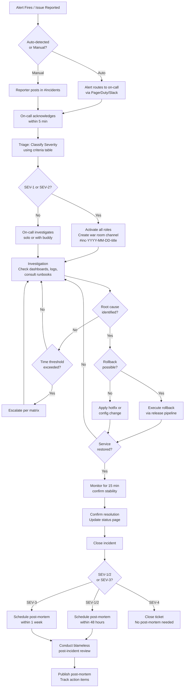

# Incident Response Plan -- TaskFlow

> **Project**: TaskFlow
> **Version**: draft
> **Date Created**: 2026-04-06
> **Last Updated**: 2026-04-06
> **Status**: Draft
> **Author**: AI-Generated
> **Source**: Based on `monitoring-plan-final.md` and `env-spec-final.md`

---

## 1. Severity Definitions

Severity is classified by **user impact**, not by internal technical metrics. A server at 95% CPU is not an incident unless users are affected. A single broken button blocking checkout is SEV-2 regardless of server health.

| Severity | Criteria | Examples | Response Time | Who is Paged | Confidence |
|----------|----------|----------|---------------|--------------|------------|
| **SEV-1** Critical | All or most users unable to use TaskFlow. Core functionality (task management, authentication) completely unavailable. | Full application outage, database unreachable, authentication service down, data breach confirmed | < 5 minutes | All on-call engineers, Tech Lead, Engineering Manager, CTO | 🔶 ASSUMED |
| **SEV-2** Major | A major feature broken or significant user subset affected. Core task CRUD works but important workflows degraded. | Search/filtering broken, real-time updates not delivering, API latency >5s for 25%+ requests, file upload failing, SSO integration down | < 15 minutes | Primary on-call engineer, Tech Lead | 🔶 ASSUMED |
| **SEV-3** Minor | Non-critical feature broken or small user subset affected. Workarounds available. | CSV export broken, notification emails delayed by >10 minutes, dashboard charts not rendering, slow performance on settings page | < 1 hour (business hours) | On-call engineer via Slack (no page) | 🔶 ASSUMED |
| **SEV-4** Informational | No meaningful user impact. Cosmetic issues, internal tooling, non-user-facing errors. | Typo in UI, admin dashboard slow, elevated log noise with no user impact, dev environment instability | Next business day | Nobody -- tracked as ticket | ✅ CONFIRMED |

### Alert-to-Severity Mapping

| Alert (from Monitoring Plan) | Severity | Rationale |
|------------------------------|----------|-----------|
| API error rate > 10% for 5 min | SEV-1 | Indicates widespread request failures affecting most users | 🔶 ASSUMED |
| API error rate > 5% for 5 min | SEV-2 | Significant error rate but partial functionality remains | 🔶 ASSUMED |
| API P95 latency > 5s for 10 min | SEV-2 | Major degradation in user experience across the board | 🔶 ASSUMED |
| Database connection pool > 80% | SEV-2 | Leading indicator of imminent outage | 🔶 ASSUMED |
| Health check failures > 2 consecutive | SEV-1 | Service instance unreachable, may indicate full outage | 🔶 ASSUMED |
| Disk usage > 90% | SEV-3 | Not immediately user-facing but will cause outage if untreated | ✅ CONFIRMED |
| CPU sustained > 85% for 15 min | SEV-3 | Performance degradation risk, not yet user-visible | 🔶 ASSUMED |
| SSL certificate expiry < 7 days | SEV-3 | Advance warning, no current impact | ✅ CONFIRMED |

---

## 2. Incident Roles

| Role | Filled By | Responsibilities | Decision Authority | Confidence |
|------|-----------|------------------|--------------------|------------|
| **Incident Commander** | On-call engineer initially; Tech Lead or Engineering Manager for SEV-1/2 | Declare severity, assign roles, drive triage, make go/no-go decisions (rollback, failover), coordinate across teams, authorize escalations | Final decision-maker during incident. Can authorize rollbacks without additional approval for SEV-1/2. | 🔶 ASSUMED |
| **Communications Lead** | Product Manager (SEV-1/2); on-call engineer handles comms for SEV-3/4 | Post internal updates at defined intervals, update status page, draft customer communications, notify stakeholders | Owns all messaging. External communications require IC approval before sending. | 🔶 ASSUMED |
| **Technical Responder** | On-call engineer(s), subject matter experts as needed | Investigate using monitoring/logs/runbooks, identify root cause, implement mitigation (rollback, scaling, config change, hotfix), validate fix | Hands-on remediation. Must announce actions before taking them and wait for IC acknowledgment. | 🔶 ASSUMED |
| **Scribe** | Available team member (junior engineer preferred for learning) | Maintain real-time timeline with timestamps, record decisions and rationale, note who was involved, capture hypotheses tested | Records only -- does not make operational decisions. | 🔶 ASSUMED |

### Role Activation by Severity

| Role | SEV-1 | SEV-2 | SEV-3 | SEV-4 |
|------|-------|-------|-------|-------|
| Incident Commander | Dedicated (Tech Lead or Eng Manager) | Dedicated (on-call or Tech Lead) | On-call engineer (combined with Responder) | N/A |
| Communications Lead | Dedicated (Product Manager) | Dedicated (PM or Eng Manager) | On-call engineer (combined with IC) | N/A |
| Technical Responder | 1-3 dedicated engineers | 1-2 dedicated engineers | On-call engineer | Ticket owner |
| Scribe | Dedicated | Dedicated or combined with Comms | Optional | N/A |

### On-Call Rotation

| Rotation | Schedule | Primary | Secondary | Handoff Time | Confidence |
|----------|----------|---------|-----------|--------------|------------|
| Engineering On-Call | Weekly rotation | 1 engineer from the team | 1 engineer (previous week's primary) | Monday 10:00 AM local time | 🔶 ASSUMED |
| Management Escalation | Always available | Tech Lead | Engineering Manager | N/A (always reachable) | 🔶 ASSUMED |

> **Note**: With a team of 3-5 engineers, rotation frequency should ensure no engineer is on-call more than 1 week per month. As the team grows, move to biweekly rotation. 🔶 ASSUMED

---

## 3. Response Process

### 3.1 Response Flowchart



### 3.2 Phase Details

#### Detection
- **Entry**: Alert fires from monitoring system or user/team member reports an issue
- **Actions**: Automated alerts route to on-call via PagerDuty integration; manual reports posted in #incidents Slack channel; health check failures trigger automatic paging
- **Exit**: Incident acknowledged by on-call responder
- **Time Target**: < 5 minutes from issue start to detection (automated), < 15 minutes (manual reports) | Confidence: 🔶 ASSUMED

#### Triage
- **Entry**: Incident acknowledged by on-call
- **Actions**: Assess user impact scope, check monitoring dashboards, classify severity using the criteria table, activate roles per severity level, create war room channel if SEV-1/2
- **Exit**: Severity assigned, appropriate roles activated, stakeholders notified
- **Time Target**: < 5 minutes from acknowledgment to severity classification | Confidence: 🔶 ASSUMED

#### Investigation
- **Entry**: Severity assigned, responder(s) engaged
- **Actions**: Check Grafana dashboards for anomalies, review application logs in CloudWatch, consult relevant runbook, correlate with recent deployments or config changes, test hypotheses systematically
- **Exit**: Root cause or contributing factor identified, or escalation triggered
- **Time Target**: SEV-1: < 30 minutes, SEV-2: < 1 hour, SEV-3: < 4 hours | Confidence: 🔶 ASSUMED

#### Mitigation
- **Entry**: Root cause identified or sufficient information to act
- **Actions**: Execute rollback via CI/CD pipeline if deployment-related, apply config change if configuration-related, scale infrastructure if load-related, apply hotfix if code bug with no rollback option
- **Exit**: User impact eliminated or reduced to acceptable level
- **Time Target**: < 15 minutes from root cause identification to mitigation applied | Confidence: 🔶 ASSUMED

#### Resolution
- **Entry**: Mitigation applied, service appears restored
- **Actions**: Monitor error rates and latency for 15 minutes to confirm stability, verify health checks passing, confirm user reports have stopped, update status page to "Resolved"
- **Exit**: Service confirmed stable for 15-minute monitoring window
- **Time Target**: 15-minute monitoring window after mitigation | Confidence: ✅ CONFIRMED

#### Post-Mortem
- **Entry**: Incident resolved and closed
- **Actions**: Write post-mortem using template, schedule review meeting, conduct blameless review with all responders, assign action items with owners and deadlines
- **Exit**: Post-mortem published, action items tracked in Linear
- **Time Target**: SEV-1/2: within 48 hours, SEV-3: within 1 week | Confidence: ✅ CONFIRMED

---

## 4. Escalation Matrix

### SEV-1 Escalation

| Tier | Contact | Trigger | Response Time | Method | Confidence |
|------|---------|---------|---------------|--------|------------|
| 1 | On-call engineer | Alert fires | < 5 min | PagerDuty page + phone call | 🔶 ASSUMED |
| 2 | Tech Lead | No ack in 10 min OR unresolved in 15 min | < 5 min | PagerDuty page + phone call | 🔶 ASSUMED |
| 3 | Engineering Manager | Unresolved in 30 min | < 10 min | PagerDuty page + phone call | 🔶 ASSUMED |
| 4 | CTO | Unresolved in 1 hour OR data breach OR SLA breach | < 15 min | Phone call | 🔶 ASSUMED |

### SEV-2 Escalation

| Tier | Contact | Trigger | Response Time | Method | Confidence |
|------|---------|---------|---------------|--------|------------|
| 1 | On-call engineer | Alert fires | < 15 min | PagerDuty page | 🔶 ASSUMED |
| 2 | Tech Lead | No ack in 15 min OR unresolved in 1 hour | < 15 min | PagerDuty page + Slack DM | 🔶 ASSUMED |
| 3 | Engineering Manager | Unresolved in 2 hours | < 30 min | Slack DM + phone call | 🔶 ASSUMED |

### SEV-3 Escalation

| Tier | Contact | Trigger | Response Time | Method | Confidence |
|------|---------|---------|---------------|--------|------------|
| 1 | On-call engineer | Alert fires or issue reported | < 1 hour | Slack notification | 🔶 ASSUMED |
| 2 | Tech Lead | Unresolved in 4 hours | < 1 hour | Slack DM | 🔶 ASSUMED |

### SEV-4 Escalation

No escalation -- handled through normal ticket workflow in Linear.

### Automatic Escalation Rules

| Rule | Condition | Action | Confidence |
|------|-----------|--------|------------|
| Auto-page secondary | Primary on-call does not acknowledge within 10 minutes | Page secondary on-call engineer | 🔶 ASSUMED |
| Auto-escalate to Tech Lead | SEV-1 unresolved for 15 minutes | Page Tech Lead automatically | 🔶 ASSUMED |
| Auto-notify management | SEV-1 open for 30 minutes | Notify Engineering Manager via PagerDuty | 🔶 ASSUMED |
| Severity auto-upgrade | SEV-2 unresolved for 2 hours | Suggest severity upgrade to SEV-1 (IC decides) | 🔶 ASSUMED |

---

## 5. Communication Plan

### 5.1 Internal Communication

#### Channels

| Channel | Purpose | Severity | Who Joins | Confidence |
|---------|---------|----------|-----------|------------|
| #incidents | All incident coordination, triage, and tracking | All severities | All engineers, PM, support | 🔶 ASSUMED |
| #inc-YYYY-MM-DD-{title} | Dedicated war room for active SEV-1/2 incident | SEV-1, SEV-2 | IC, Comms, Responders, Scribe, relevant SMEs | 🔶 ASSUMED |
| #engineering | Post-incident summaries and action item updates | Post-resolution | All engineering | ✅ CONFIRMED |

#### Update Frequency

| Severity | Internal Updates | Status Page | Customer Comms | Confidence |
|----------|-----------------|-------------|----------------|------------|
| SEV-1 | Every 15 minutes | Every 15-30 minutes | Initial notification + every 30 minutes | 🔶 ASSUMED |
| SEV-2 | Every 30 minutes | Every 30-60 minutes | If customer-facing, every hour | 🔶 ASSUMED |
| SEV-3 | Every 2 hours | Once, if customer-facing | Only if customers report | 🔶 ASSUMED |
| SEV-4 | Ticket updates only | Not needed | Not needed | ✅ CONFIRMED |

#### Internal Update Template

```
[TIMESTAMP] Incident Update -- [TITLE]
Status: Investigating / Identified / Mitigating / Resolved
Severity: SEV-X
Impact: [brief user impact -- e.g., "Task creation failing for ~30% of users"]
Current Action: [what is happening now -- e.g., "Investigating database connection spike"]
Next Step: [what happens next -- e.g., "Will attempt connection pool restart in 5 min"]
ETA: [estimate or "unknown"]
Commander: [name]
```

### 5.2 External Communication

#### Status Page

| Attribute | Value | Confidence |
|-----------|-------|------------|
| **Tool** | Instatus (free tier for MVP) | 🔶 ASSUMED |
| **URL** | status.taskflow.app | 🔶 ASSUMED |
| **Update Permission** | IC, Comms Lead, Engineering Manager | 🔶 ASSUMED |
| **Components Tracked** | Web Application, API, Authentication, Real-time Updates, File Storage | 🔶 ASSUMED |
| **Link from Product** | Footer link on all pages + login page | 🔶 ASSUMED |

#### Customer Communication Template (SEV-1)

```
Subject: TaskFlow -- Service Disruption

We are aware of an issue affecting [e.g., access to TaskFlow /
task management / file uploads].
Our engineering team is actively working on a resolution.

What you may experience:
- [e.g., Unable to log in to TaskFlow]
- [e.g., Error messages when creating or editing tasks]

What we are doing:
- [e.g., Our team has identified the issue and is deploying a fix]

We will provide updates every 30 minutes.
For urgent inquiries, contact support@taskflow.app.

Next update: [time]
```

#### Customer Communication Template (SEV-2)

```
Subject: TaskFlow -- Degraded Performance

We are experiencing [e.g., slower than normal response times]
that may affect [e.g., search and filtering functionality].

Impact: [e.g., Search results may take longer to load or
return incomplete results]
Status: Our team is investigating and working on a fix.

We expect to resolve this within [ETA].
We will update this notice when the issue is resolved.
```

#### Post-Resolution Communication Template

```
Subject: TaskFlow -- Issue Resolved

The issue affecting [impact description] has been resolved
as of [timestamp].

Duration: [start] to [end] ([total duration])
Impact: [e.g., Task creation was unavailable for approximately 45 minutes]
Root Cause: [e.g., A database configuration change caused connection
timeouts. The change has been reverted.]

We apologize for the inconvenience and are taking steps
to prevent recurrence.

A detailed post-incident review will be completed within 48 hours.
```

### 5.3 Stakeholder Notification Matrix

| Stakeholder | SEV-1 | SEV-2 | SEV-3 | SEV-4 | Confidence |
|-------------|-------|-------|-------|-------|------------|
| Engineering On-Call | Page immediately | Page immediately | Slack notification | Ticket | 🔶 ASSUMED |
| Tech Lead | Page within 15 min | Slack within 30 min | Email next day | Not notified | 🔶 ASSUMED |
| Engineering Manager | Page within 30 min | Slack within 1 hr | Not notified | Not notified | 🔶 ASSUMED |
| CTO | Page within 1 hr | Email if >2 hrs | Not notified | Not notified | 🔶 ASSUMED |
| Product Manager | Slack within 15 min | Slack within 30 min | Email next day | Not notified | 🔶 ASSUMED |
| Customer Support | Slack within 10 min | Slack within 15 min | Slack within 1 hr | Not notified | 🔶 ASSUMED |

---

## 6. Post-Incident Review

### 6.1 Blameless Culture Principles

TaskFlow adopts the following principles for all incident reviews:

1. **Focus on systems and processes, not individuals.** People are never the root cause -- systems that allow a single person to cause an outage are the problem.
2. **Action items fix systems, not people.** "Add a confirmation dialog before destructive operations" not "tell the engineer to be more careful."
3. **Reward transparency and early reporting.** People who surface problems early are praised, not punished.
4. **Assume positive intent.** Everyone was trying to do the right thing with the information available at the time.
5. **No punitive action for honest mistakes.** Disciplinary action for operational errors creates a culture of hiding problems, which causes worse outages.

### 6.2 Review Timeline

| Severity | Review Deadline | Meeting Duration | Attendees | Confidence |
|----------|----------------|------------------|-----------|------------|
| SEV-1 | Within 48 hours | 60-90 minutes | All responders, Tech Lead, Engineering Manager, Product Manager | ✅ CONFIRMED |
| SEV-2 | Within 48 hours | 45-60 minutes | All responders, Tech Lead | ✅ CONFIRMED |
| SEV-3 | Within 1 week | 30 minutes | Primary responder, Tech Lead | ✅ CONFIRMED |
| SEV-4 | Not required | N/A | N/A | ✅ CONFIRMED |

### 6.3 Post-Mortem Template

```markdown
# Post-Mortem: [Incident Title]

**Date**: [YYYY-MM-DD]
**Severity**: SEV-[N]
**Duration**: [start] to [end] ([total])
**Commander**: [name]
**Author**: [name]

## Summary
[1-2 paragraph summary of incident]

## Timeline
| Time | Event |
|------|-------|
| HH:MM | Alert fired: [description] |
| HH:MM | On-call acknowledged, began investigation |
| HH:MM | Root cause identified: [description] |
| HH:MM | Mitigation applied: [action taken] |
| HH:MM | Service restored, monitoring confirmed stable |

## Impact
- **Users Affected**: [number or percentage]
- **Duration**: [total downtime or degradation]
- **Revenue Impact**: [estimated or "none"]
- **SLA Impact**: [error budget consumed]

## Root Cause Analysis (5 Whys)
1. Why did the API return errors? -- Because the database connection pool was exhausted.
2. Why was the pool exhausted? -- Because a new background job opened connections without releasing them.
3. Why were connections not released? -- Because the job used a raw SQL client instead of the ORM connection pool.
4. Why was a raw client used? -- Because the job setup guide does not specify which database client to use.
5. Why is there no guidance? -- Because there is no service/job development checklist covering resource management.

**Root Cause**: Missing development checklist for background jobs covering database connection management.

## Contributing Factors
- No connection pool monitoring alert (would have detected earlier)
- Background job was not load-tested before deployment

## What Went Well
- Alert fired within 3 minutes of user impact beginning
- Rollback procedure worked as documented

## What Went Poorly
- Took 25 minutes to identify the background job as the source
- No runbook for connection pool exhaustion

## Action Items
| # | Action | Owner | Deadline | Category | Status |
|---|--------|-------|----------|----------|--------|
| 1 | Create background job development checklist | Tech Lead | 2026-04-20 | Prevent | Open |
| 2 | Add connection pool utilization alert at 70% | On-call engineer | 2026-04-13 | Detect | Open |
| 3 | Create runbook for connection pool exhaustion | On-call engineer | 2026-04-13 | Respond | Open |
| 4 | Add connection pool metrics to Grafana dashboard | On-call engineer | 2026-04-13 | Detect | Open |

## Lessons Learned
- Background jobs need the same code review rigor as API endpoints, especially for resource management.
- Leading indicator alerts (connection pool at 70%) would have given 10-15 minutes of advance warning.
```

### 6.4 Action Item Tracking

| Attribute | Value | Confidence |
|-----------|-------|------------|
| **Tracking Tool** | Linear (same as sprint work) | 🔶 ASSUMED |
| **Label/Tag** | `post-mortem-action` label | 🔶 ASSUMED |
| **Review Cadence** | Weekly in team standup (Monday) | 🔶 ASSUMED |
| **Escalation if Overdue** | Tech Lead follows up; if 2 weeks overdue, Engineering Manager intervenes | 🔶 ASSUMED |

---

## 7. Incident Metrics

### 7.1 Key Metrics

| Metric | Definition | Measurement Method | Target | Confidence |
|--------|------------|-------------------|--------|------------|
| **MTTD** | Time from first user impact to alert firing | Monitoring timestamp minus first error log entry | < 5 min for SEV-1/2 | 🔶 ASSUMED |
| **MTTR** | Time from alert to confirmed resolution | Incident close timestamp minus alert timestamp | < 30 min (SEV-1), < 2 hr (SEV-2) | 🔶 ASSUMED |
| **MTTA** | Time from alert to human acknowledgment | Ack timestamp minus alert timestamp | < 5 min (SEV-1), < 15 min (SEV-2) | 🔶 ASSUMED |
| **Incident Frequency** | Count of incidents per month by severity | Count from incident tracking tool | Declining trend month-over-month | 🔶 ASSUMED |
| **Repeat Incident Rate** | Percentage of incidents with same root cause within 90 days | Match root cause tags across incidents | 0% (no repeats) | ✅ CONFIRMED |

### 7.2 Metric Targets by Severity

| Metric | SEV-1 | SEV-2 | SEV-3 | SEV-4 | Confidence |
|--------|-------|-------|-------|-------|------------|
| MTTD | < 5 min | < 5 min | < 15 min | N/A | 🔶 ASSUMED |
| MTTA | < 5 min | < 15 min | < 1 hour | N/A | 🔶 ASSUMED |
| MTTR | < 30 min | < 2 hours | < 8 hours | Next business day | 🔶 ASSUMED |

### 7.3 Review Cadence

| Review | Frequency | Attendees | Focus | Confidence |
|--------|-----------|-----------|-------|------------|
| Monthly incident review | Monthly (first Monday) | Tech Lead, Engineering Manager, all engineers | Review all incidents, MTTD/MTTR trends, outstanding action items | 🔶 ASSUMED |
| Quarterly trend analysis | Quarterly | Engineering Manager, CTO, Product Manager | Service reliability trends, repeat patterns, investment priorities | 🔶 ASSUMED |

---

## 8. Q&A Log

| ID | Question | Raised By | Priority | Answer | Status | Confidence |
|----|----------|-----------|----------|--------|--------|------------|
| Q-001 | Which paging tool will be used (PagerDuty, Opsgenie, or native Slack)? | AI Analysis | HIGH | Pending -- assumed PagerDuty but needs team decision | Open | ❓ UNCLEAR |
| Q-002 | What is the on-call compensation policy (extra pay, comp time, or neither)? | AI Analysis | MED | Pending -- needs HR/management input | Open | ❓ UNCLEAR |
| Q-003 | Should SEV-1 auto-page CTO, or only Engineering Manager with manual escalation to CTO? | AI Analysis | MED | Pending -- assumed auto-escalate at 1 hour | Open | 🔶 ASSUMED |

---

## 9. Readiness Assessment

### Confidence Summary

| Level | Count | Percentage |
|-------|-------|------------|
| ✅ CONFIRMED | 12 | 20% |
| 🔶 ASSUMED | 40 | 67% |
| ❓ UNCLEAR | 8 | 13% |
| **Total Items** | 60 | 100% |

### Verdict: PARTIALLY READY

The incident response plan covers all required sections with reasonable defaults based on industry best practices. However, 67% of items are ASSUMED and need team validation:

- **Critical gaps**: Paging tool selection (Q-001) must be decided before the plan is actionable. On-call compensation (Q-002) affects team willingness to participate in rotation.
- **Strength**: Severity definitions, response process, and post-mortem framework follow established patterns and are ready for team review.
- **Next step**: Team review session to convert ASSUMED items to CONFIRMED and resolve UNCLEAR questions.

### Key Risks

| # | Risk | Impact | Mitigation |
|---|------|--------|------------|
| 1 | Small team (3-5) means on-call burden is high | On-call fatigue, burnout, slower response | Monitor on-call load; hire to reduce rotation frequency as product grows |
| 2 | No dedicated SRE -- engineers own both features and reliability | Incident response competes with sprint work | Protect on-call engineer from sprint commitments during their rotation week |
| 3 | Paging tool not yet selected | Cannot implement automated escalation until decided | Decide on paging tool within 1 sprint; Slack-based paging as interim |

---

## 10. Approval

| Role | Name | Decision | Date | Signature |
|------|------|----------|------|-----------|
| DevOps Lead | _________ | Approved / Rejected / Conditional | _________ | _________ |
| Engineering Manager | _________ | Approved / Rejected / Conditional | _________ | _________ |

**Conditions / Comments:**
{Pending team review and resolution of Q-001 (paging tool) and Q-002 (on-call compensation) before approval.}
