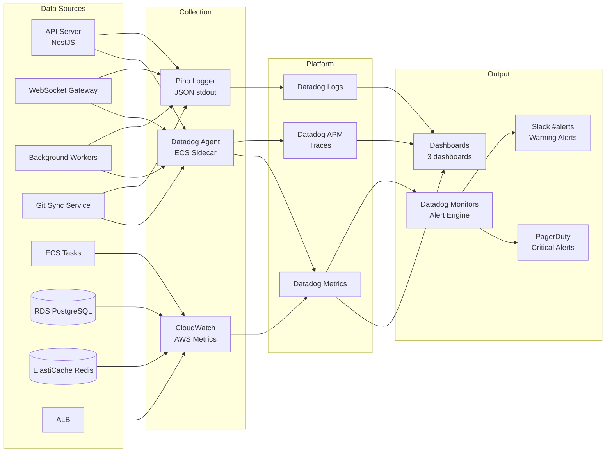

# Monitoring Plan — TaskFlow

> **Project**: TaskFlow
> **Version**: draft
> **Date Created**: 2026-04-06
> **Last Updated**: 2026-04-06
> **Status**: Draft
> **Author**: AI-Generated
> **Source**: Based on `env-spec-final.md` and `architecture-final.md`

---

## 1. Monitoring Strategy

### 1.1 Approach

TaskFlow adopts a proactive, observability-first monitoring strategy aligned with the 99.5% availability target (QA-002). The strategy follows the RED method for application services and the USE method for infrastructure resources. Every alert is symptom-based and actionable — no alert fires without a runbook. The goal is early detection of degradation before users are impacted, with fewer than 5 critical alerts per on-call shift to prevent alert fatigue.

### 1.2 Three Pillars

| Pillar | Tool/Platform | Purpose | Coverage |
|--------|-------------|---------|----------|
| **Metrics** | Datadog + AWS CloudWatch | Real-time performance metrics, SLO tracking, alerting | All services + infrastructure |
| **Logs** | Datadog Log Management | Structured log aggregation, search, correlation | All services via Pino (JSON) |
| **Traces** | Datadog APM (dd-trace-js) | Distributed request tracing, latency analysis | API Server, WebSocket Gateway, Workers |

### 1.3 Monitoring Architecture



---

## 2. Infrastructure Monitoring

### 2.1 ECS Tasks (Compute)

| Metric | Method | Threshold (Warning) | Threshold (Critical) | Confidence |
|--------|--------|---------------------|----------------------|------------|
| CPU Utilization | CloudWatch ECS metrics | >70% for 10min | >90% for 5min | 🔶 ASSUMED |
| Memory Utilization | CloudWatch ECS metrics | >75% for 10min | >90% for 5min | 🔶 ASSUMED |
| Running Task Count | CloudWatch ECS metrics | <desired count for 5min | =0 for 1min | ✅ CONFIRMED |
| Task Restart Count | CloudWatch ECS metrics | >3 in 15min | >5 in 10min | 🔶 ASSUMED |

### 2.2 RDS PostgreSQL (Database)

| Metric | Method | Threshold (Warning) | Threshold (Critical) | Confidence |
|--------|--------|---------------------|----------------------|------------|
| CPU Utilization | CloudWatch RDS metrics | >70% for 10min | >90% for 5min | 🔶 ASSUMED |
| Database Connections | CloudWatch RDS metrics | >80% of max for 10min | >95% of max for 5min | 🔶 ASSUMED |
| Read IOPS | CloudWatch RDS metrics | >80% provisioned for 10min | >95% provisioned for 5min | 🔶 ASSUMED |
| Write IOPS | CloudWatch RDS metrics | >80% provisioned for 10min | >95% provisioned for 5min | 🔶 ASSUMED |
| Replication Lag | CloudWatch RDS metrics | >5s for 5min | >30s for 5min | 🔶 ASSUMED |
| Free Storage Space | CloudWatch RDS metrics | <20% remaining | <10% remaining | ✅ CONFIRMED |

### 2.3 ElastiCache Redis (Cache)

| Metric | Method | Threshold (Warning) | Threshold (Critical) | Confidence |
|--------|--------|---------------------|----------------------|------------|
| Memory Utilization | CloudWatch ElastiCache | >80% used_memory | >90% used_memory | 🔶 ASSUMED |
| Cache Hit Rate | CloudWatch ElastiCache | <80% for 15min | <50% for 10min | 🔶 ASSUMED |
| Evictions | CloudWatch ElastiCache | >100/min for 10min | >500/min for 5min | 🔶 ASSUMED |
| Current Connections | CloudWatch ElastiCache | >80% of max for 10min | >95% of max for 5min | 🔶 ASSUMED |

### 2.4 ALB (Load Balancer)

| Metric | Method | Threshold (Warning) | Threshold (Critical) | Confidence |
|--------|--------|---------------------|----------------------|------------|
| Request Count | CloudWatch ALB metrics | N/A (baseline) | Drop >50% from baseline | 🔶 ASSUMED |
| HTTP 5xx Rate | CloudWatch ALB metrics | >1% for 5min | >5% for 5min | ✅ CONFIRMED |
| HTTP 4xx Rate | CloudWatch ALB metrics | >10% for 10min | >25% for 5min | 🔶 ASSUMED |
| Target Response Time | CloudWatch ALB metrics | p95 >1s for 5min | p95 >3s for 5min | 🔶 ASSUMED |
| Healthy Host Count | CloudWatch ALB metrics | <desired for 5min | =0 for 1min | ✅ CONFIRMED |

### 2.5 S3 / CloudFront (Storage & CDN)

| Metric | Method | Threshold (Warning) | Threshold (Critical) | Confidence |
|--------|--------|---------------------|----------------------|------------|
| S3 Request Count | CloudWatch S3 metrics | N/A (baseline) | >10x baseline sustained | 🔶 ASSUMED |
| S3 4xx Errors | CloudWatch S3 metrics | >5% for 10min | >20% for 5min | 🔶 ASSUMED |
| CloudFront Error Rate | CloudWatch CF metrics | >1% for 10min | >5% for 5min | 🔶 ASSUMED |
| CloudFront Cache Hit Ratio | CloudWatch CF metrics | <80% for 30min | <50% for 15min | 🔶 ASSUMED |

---

## 3. Application Monitoring

### 3.1 API Server — RED Metrics

| Metric | Measurement | SLO Target | Alert Threshold | Confidence |
|--------|------------|------------|-----------------|------------|
| **Rate** | requests/sec via Datadog APM | N/A (baseline) | Drop >50% from 1h baseline | 🔶 ASSUMED |
| **Errors** | 5xx rate % via Datadog APM | <1% (QA-002) | >1% for 5min (W), >5% for 5min (C) | ✅ CONFIRMED |
| **Duration (p50)** | ms via Datadog APM | <100ms | >200ms for 10min | 🔶 ASSUMED |
| **Duration (p95)** | ms via Datadog APM | <200ms (QA-003) | >500ms for 5min (W), >2s for 5min (C) | ✅ CONFIRMED |
| **Duration (p99)** | ms via Datadog APM | <500ms | >1s for 5min | 🔶 ASSUMED |

### 3.2 WebSocket Gateway — RED Metrics

| Metric | Measurement | SLO Target | Alert Threshold | Confidence |
|--------|------------|------------|-----------------|------------|
| **Rate** | connections/sec, messages/sec | N/A (baseline) | Connection drop >30% in 5min | 🔶 ASSUMED |
| **Errors** | Connection error rate % | <1% | >2% for 5min (W), >10% for 5min (C) | 🔶 ASSUMED |
| **Duration (p95)** | Message delivery latency ms | <100ms | >500ms for 5min | 🔶 ASSUMED |
| **Active Connections** | Gauge (concurrent) | N/A | >80% capacity for 10min | 🔶 ASSUMED |

### 3.3 Background Workers — RED Metrics

| Metric | Measurement | SLO Target | Alert Threshold | Confidence |
|--------|------------|------------|-----------------|------------|
| **Rate** | Jobs completed/min | N/A (baseline) | Drop >50% from baseline for 10min | 🔶 ASSUMED |
| **Errors** | Job failure rate % | <5% | >5% for 10min (W), >20% for 5min (C) | 🔶 ASSUMED |
| **Duration (p95)** | Job processing time ms | <30s | >60s for 10min (W), >120s for 5min (C) | 🔶 ASSUMED |
| **Queue Depth** | Pending jobs count | <100 | >500 for 10min (W), >2000 for 5min (C) | 🔶 ASSUMED |

### 3.4 Git Sync Service — RED Metrics

| Metric | Measurement | SLO Target | Alert Threshold | Confidence |
|--------|------------|------------|-----------------|------------|
| **Rate** | Webhooks processed/min | N/A (baseline) | Drop to 0 for 10min | 🔶 ASSUMED |
| **Errors** | Webhook processing failure rate % | <2% | >5% for 10min (W), >20% for 5min (C) | 🔶 ASSUMED |
| **Duration (p95)** | Webhook processing time ms | <5s | >10s for 5min (W), >30s for 5min (C) | 🔶 ASSUMED |

### 3.5 Business Metrics

| Metric | Description | Source | Expected Range | Alert Condition | Confidence |
|--------|------------|--------|----------------|-----------------|------------|
| Active Users (DAU) | Daily active users | Datadog custom metric | 10-1000 (MVP) | Drop >50% day-over-day | 🔶 ASSUMED |
| Sprints Created | New sprints created per day | Application event log | 1-50/day | 0 for 24h (may indicate outage) | 🔶 ASSUMED |
| Commits Synced | Git commits synced per hour | Git Sync metrics | 5-500/hour | 0 for 1h during business hours | 🔶 ASSUMED |
| Task Completions | Tasks moved to done per day | Application event log | 10-500/day | Drop >80% day-over-day | 🔶 ASSUMED |

---

## 4. Alert Definitions

### 4.1 Alert Summary

| # | Alert Name | Metric | Condition | Severity | Channel | Runbook | Confidence |
|---|-----------|--------|-----------|----------|---------|---------|------------|
| 1 | API Error Rate Critical | HTTP 5xx rate | >5% for 5min | Critical | PagerDuty | RUN-001 | ✅ CONFIRMED |
| 2 | API Latency Warning | p95 response time | >2s for 5min | Warning | Slack #alerts | RUN-002 | ✅ CONFIRMED |
| 3 | RDS Connections High | Active connections % | >80% of max for 10min | Warning | Slack #alerts | RUN-003 | 🔶 ASSUMED |
| 4 | Redis Memory High | Memory utilization | >80% for 10min | Warning | Slack #alerts | RUN-004 | 🔶 ASSUMED |
| 5 | ECS Task Count Zero | Running task count | =0 for 1min | Critical | PagerDuty | RUN-005 | ✅ CONFIRMED |
| 6 | Webhook Processing Failures | Failure rate | >10/min for 5min | Warning | Slack #alerts | RUN-006 | 🔶 ASSUMED |
| 7 | SSL Certificate Expiry | Days to expiry | <14 days | Warning | Slack #alerts | RUN-007 | ✅ CONFIRMED |
| 8 | Disk Usage High | Disk space used | >85% | Warning | Slack #alerts | RUN-008 | 🔶 ASSUMED |
| 9 | Deploy Failed | CI/CD pipeline status | Failure event | Critical | Slack #deploys + PagerDuty | RUN-009 | ✅ CONFIRMED |
| 10 | Error Budget Low | SLO error budget | <20% remaining | Warning | Slack #alerts | RUN-010 | 🔶 ASSUMED |

### 4.2 Alert Details

#### Alert 1: API Error Rate Critical

| Attribute | Value |
|-----------|-------|
| **Metric** | `sum:http.requests{service:api-server,status:5xx}.as_rate() / sum:http.requests{service:api-server}.as_rate() * 100` |
| **Condition** | >5% for 5 minutes |
| **Severity** | Critical (SEV-1) |
| **Channel** | PagerDuty -> on-call primary |
| **Runbook** | RUN-001: API Error Rate Investigation |
| **Recommended Action** | Check recent deployments, review error logs for stack traces, verify downstream dependencies (RDS, Redis) |
| **SLO Basis** | QA-002: 99.5% availability target implies <0.5% error budget; 5% is a clear SLO breach |
| **Confidence** | ✅ CONFIRMED |

#### Alert 2: API Latency Warning

| Attribute | Value |
|-----------|-------|
| **Metric** | `p95:http.request.duration{service:api-server}` |
| **Condition** | >2s for 5 minutes |
| **Severity** | Warning (SEV-2) |
| **Channel** | Slack #alerts |
| **Runbook** | RUN-002: API Latency Investigation |
| **Recommended Action** | Check slow query logs, review trace samples for bottlenecks, verify cache hit rate |
| **SLO Basis** | QA-003: p95 <200ms target; 2s indicates 10x degradation |
| **Confidence** | ✅ CONFIRMED |

#### Alert 3: RDS Connections High

| Attribute | Value |
|-----------|-------|
| **Metric** | `aws.rds.database_connections / max_connections * 100` |
| **Condition** | >80% of max connections for 10 minutes |
| **Severity** | Warning (SEV-2) |
| **Channel** | Slack #alerts |
| **Runbook** | RUN-003: Database Connection Pool Exhaustion |
| **Recommended Action** | Check for connection leaks, review connection pool settings, verify no long-running queries holding connections |
| **SLO Basis** | Industry best practice — connection exhaustion causes cascading failures |
| **Confidence** | 🔶 ASSUMED |

#### Alert 4: Redis Memory High

| Attribute | Value |
|-----------|-------|
| **Metric** | `aws.elasticache.used_memory / aws.elasticache.max_memory * 100` |
| **Condition** | >80% for 10 minutes |
| **Severity** | Warning (SEV-2) |
| **Channel** | Slack #alerts |
| **Runbook** | RUN-004: Redis Memory Pressure |
| **Recommended Action** | Review eviction policy, check for large keys, verify TTL settings on cached data |
| **SLO Basis** | Industry best practice — memory pressure leads to evictions and cache misses |
| **Confidence** | 🔶 ASSUMED |

#### Alert 5: ECS Task Count Zero

| Attribute | Value |
|-----------|-------|
| **Metric** | `aws.ecs.service.running_task_count{service:api-server}` |
| **Condition** | =0 for 1 minute |
| **Severity** | Critical (SEV-1) |
| **Channel** | PagerDuty -> on-call primary |
| **Runbook** | RUN-005: ECS Service Down |
| **Recommended Action** | Check ECS events for task failure reason, review container logs, verify ECR image availability, check health check configuration |
| **SLO Basis** | Zero tasks = complete outage, immediate user impact |
| **Confidence** | ✅ CONFIRMED |

#### Alert 6: Webhook Processing Failures

| Attribute | Value |
|-----------|-------|
| **Metric** | `sum:git_sync.webhook.failures{service:git-sync}.as_count()` |
| **Condition** | >10 failures/min for 5 minutes |
| **Severity** | Warning (SEV-2) |
| **Channel** | Slack #alerts |
| **Runbook** | RUN-006: Git Webhook Processing Failures |
| **Recommended Action** | Check GitHub API status, verify webhook secrets, review git-sync service logs for error patterns |
| **SLO Basis** | Industry best practice — sustained webhook failures indicate integration breakdown |
| **Confidence** | 🔶 ASSUMED |

#### Alert 7: SSL Certificate Expiry

| Attribute | Value |
|-----------|-------|
| **Metric** | `ssl.days_to_expiry{service:api.taskflow.io}` |
| **Condition** | <14 days remaining |
| **Severity** | Warning (SEV-2) |
| **Channel** | Slack #alerts |
| **Runbook** | RUN-007: SSL Certificate Renewal |
| **Recommended Action** | Verify ACM auto-renewal status, check DNS validation records, manually trigger renewal if auto-renewal failed |
| **SLO Basis** | Expired certificate = complete outage for HTTPS traffic |
| **Confidence** | ✅ CONFIRMED |

#### Alert 8: Disk Usage High

| Attribute | Value |
|-----------|-------|
| **Metric** | `aws.rds.free_storage_space` (converted to % used) |
| **Condition** | >85% disk used |
| **Severity** | Warning (SEV-2) |
| **Channel** | Slack #alerts |
| **Runbook** | RUN-008: Disk Space Cleanup |
| **Recommended Action** | Review table sizes, check for orphaned data, consider storage auto-scaling, archive old records |
| **SLO Basis** | Industry best practice — disk exhaustion causes write failures and data loss |
| **Confidence** | 🔶 ASSUMED |

#### Alert 9: Deploy Failed

| Attribute | Value |
|-----------|-------|
| **Metric** | GitHub Actions workflow status event |
| **Condition** | Deployment workflow failure on production branch |
| **Severity** | Critical (SEV-1) |
| **Channel** | Slack #deploys + PagerDuty |
| **Runbook** | RUN-009: Failed Deployment Rollback |
| **Recommended Action** | Check GitHub Actions logs, verify ECS deployment status, initiate rollback if partial deploy, notify team |
| **SLO Basis** | Failed deploy may leave system in inconsistent state |
| **Confidence** | ✅ CONFIRMED |

#### Alert 10: Error Budget Low

| Attribute | Value |
|-----------|-------|
| **Metric** | SLO error budget remaining (calculated: 1 - (actual_error_rate / allowed_error_rate)) |
| **Condition** | <20% budget remaining in current 30-day window |
| **Severity** | Warning (SEV-2) |
| **Channel** | Slack #alerts |
| **Runbook** | RUN-010: Error Budget Conservation |
| **Recommended Action** | Freeze non-critical deployments, review recent incidents for patterns, prioritize reliability fixes over features |
| **SLO Basis** | QA-002: 99.5% availability = 0.5% error budget; <20% remaining means <0.1% budget left |
| **Confidence** | 🔶 ASSUMED |

---

## 5. Dashboard Specifications

### 5.1 System Overview Dashboard

**Audience**: On-call engineer, engineering manager
**Refresh Rate**: 30 seconds
**Default Time Range**: Last 1 hour

| Panel | Type | Data Source | Description |
|-------|------|-----------|-------------|
| Service Health Status | Status widget (traffic light) | Datadog service health | Green/yellow/red per service: API Server, WebSocket, Workers, Git Sync |
| Active Alerts | Alert list | Datadog Monitors | Currently firing alerts with severity and duration |
| Total Request Rate | Time series graph | `sum:http.requests{service:api-server}.as_rate()` | Requests/sec with 1-hour baseline overlay |
| Error Rate (all services) | Time series graph | `5xx_rate by service` | Error rate % per service, stacked |
| p95 Latency (API) | Time series graph | `p95:http.request.duration{service:api-server}` | API response time with SLO threshold line at 200ms |
| ECS Task Count | Time series graph | `aws.ecs.service.running_task_count by service` | Running tasks per service vs desired count |
| Recent Deploys | Event overlay | GitHub Actions webhook | Deploy events overlaid on metric charts |
| Error Budget Remaining | Gauge | SLO calculation | Percentage of 30-day error budget remaining |

### 5.2 API Deep Dive Dashboard

**Audience**: Engineering team (debugging)
**Refresh Rate**: 30 seconds
**Default Time Range**: Last 1 hour

| Panel | Type | Data Source | Description |
|-------|------|-----------|-------------|
| Request Rate by Endpoint | Time series graph | `http.requests by resource_name` | Top 10 endpoints by request volume |
| Error Rate by Endpoint | Time series graph | `5xx_rate by resource_name` | Per-endpoint error rates |
| Latency Heatmap | Heatmap | `http.request.duration` | Request duration distribution over time |
| Slow Requests (>1s) | Top list | `http.request.duration{@duration:>1s}` | Slowest endpoints with trace links |
| Database Query Time | Time series graph | `pg.query.duration by query` | Top 10 slowest query patterns |
| Redis Hit/Miss Rate | Time series graph | `cache.hit_rate` | Cache effectiveness over time |
| Active WebSocket Connections | Gauge + time series | `websocket.connections.active` | Current and historical connection count |
| Downstream Dependency Latency | Time series graph | `http.request.duration by downstream_service` | Latency of calls to external services (GitHub API, etc.) |

### 5.3 Infrastructure Dashboard

**Audience**: On-call engineer, DevOps
**Refresh Rate**: 1 minute
**Default Time Range**: Last 4 hours

| Panel | Type | Data Source | Description |
|-------|------|-----------|-------------|
| ECS CPU by Service | Time series graph | `aws.ecs.cpu_utilized by service` | CPU utilization per ECS service |
| ECS Memory by Service | Time series graph | `aws.ecs.memory_utilized by service` | Memory utilization per ECS service |
| RDS CPU & Connections | Time series graph | `aws.rds.cpuutilization`, `aws.rds.database_connections` | Database health at a glance |
| RDS IOPS | Time series graph | `aws.rds.read_iops`, `aws.rds.write_iops` | Database I/O load |
| RDS Free Storage | Time series graph | `aws.rds.free_storage_space` | Storage trend with projection |
| Redis Memory & Evictions | Time series graph | `aws.elasticache.used_memory`, `aws.elasticache.evictions` | Cache memory pressure |
| ALB Request Count & Errors | Time series graph | `aws.alb.request_count`, `aws.alb.httpcode_target_5xx` | Load balancer traffic and errors |
| CloudFront Cache Hit Ratio | Time series graph | `aws.cloudfront.cache_hit_rate` | CDN effectiveness |

---

## 6. Log Management

### 6.1 Log Format

All TaskFlow services use Pino (NestJS) configured for structured JSON output:

```json
{
  "timestamp": "2026-04-06T10:30:00.123Z",
  "level": "ERROR",
  "service": "api-server",
  "traceId": "abc123def456789",
  "spanId": "span456",
  "userId": "usr_42",
  "method": "POST",
  "path": "/api/v1/tasks",
  "statusCode": 500,
  "duration": 1523,
  "message": "Failed to create task: database connection timeout",
  "error": {
    "type": "ConnectionTimeoutError",
    "message": "Connection pool exhausted after 5000ms"
  },
  "context": {
    "taskName": "Sprint Review",
    "projectId": "proj_99"
  }
}
```

### 6.2 Log Levels

| Level | Usage | Production Default | Examples |
|-------|-------|-------------------|----------|
| ERROR | Unrecoverable failures, user-facing errors, data integrity issues | ON | DB connection failure, unhandled exception, payment error |
| WARN | Recoverable issues, degraded behavior, approaching limits | ON | Retry succeeded after 2 attempts, cache fallback, rate limit at 80% |
| INFO | Business events, state changes, request lifecycle | ON | User created account, sprint started, webhook received, deploy completed |
| DEBUG | Diagnostic detail, variable values, SQL queries | OFF | Query: SELECT * FROM tasks WHERE..., Cache key: task:42, Request body: {...} |

### 6.3 Log Aggregation Pipeline

| Source | Collector | Destination | Confidence |
|--------|----------|-------------|------------|
| API Server (stdout) | Datadog Agent (ECS sidecar) | Datadog Log Management | ✅ CONFIRMED |
| WebSocket Gateway (stdout) | Datadog Agent (ECS sidecar) | Datadog Log Management | ✅ CONFIRMED |
| Background Workers (stdout) | Datadog Agent (ECS sidecar) | Datadog Log Management | ✅ CONFIRMED |
| Git Sync Service (stdout) | Datadog Agent (ECS sidecar) | Datadog Log Management | ✅ CONFIRMED |
| ALB Access Logs | S3 -> Datadog integration | Datadog Log Management | 🔶 ASSUMED |
| RDS Slow Query Log | CloudWatch -> Datadog integration | Datadog Log Management | 🔶 ASSUMED |

### 6.4 Log Retention

| Tier | Duration | Storage | Purpose | Confidence |
|------|----------|---------|---------|------------|
| Hot | 30 days | Datadog Log Management | Active search, debugging, alert correlation | 🔶 ASSUMED |
| Cold | 90 days | S3 Standard-IA | Incident review, compliance queries | 🔶 ASSUMED |
| Archive | 1 year | S3 Glacier | Regulatory compliance, legal holds | 🔶 ASSUMED |

### 6.5 Sensitive Data Handling

| Data Type | Policy | Implementation |
|-----------|--------|---------------|
| Passwords | Never log | Pino redaction: `redact: ['req.body.password', 'req.body.confirmPassword']` |
| API Keys / Tokens | Never log | Pino redaction: `redact: ['req.headers.authorization', 'req.body.token']` |
| Email Addresses | Redact in logs | Custom serializer: `user@example.com` -> `use***@example.com` |
| Request Bodies | Exclude in production | Pino level-based serializer: only include at DEBUG level |
| Database Queries | Parameterize | Log query pattern without parameter values: `SELECT * FROM tasks WHERE id = $1` |

---

## 7. Distributed Tracing

### 7.1 Tracing Configuration

| Attribute | Value | Confidence |
|-----------|-------|------------|
| **Platform** | Datadog APM | ✅ CONFIRMED |
| **Instrumentation** | dd-trace-js (auto-instrumentation for NestJS, pg, ioredis, HTTP) | ✅ CONFIRMED |
| **Propagation Format** | Datadog headers (`x-datadog-trace-id`, `x-datadog-parent-id`) | 🔶 ASSUMED |

### 7.2 Sampling Strategy

| Environment | Sample Rate | Rationale | Confidence |
|-------------|------------|-----------|------------|
| Development | 100% | Full visibility for debugging, low volume | ✅ CONFIRMED |
| Staging | 100% | Full visibility for integration testing | ✅ CONFIRMED |
| Production | 10% baseline + 100% for errors | Balance cost vs visibility; all errors captured for investigation | 🔶 ASSUMED |

### 7.3 Key Trace Paths

| # | Path | Services Involved | Why Traced |
|---|------|-------------------|-----------|
| 1 | User login -> token generation | API Server -> RDS (user lookup) -> Redis (session store) | Authentication is critical path; latency affects first impression |
| 2 | Create task -> notify team | API Server -> RDS (insert) -> Redis (cache invalidate) -> WebSocket (broadcast) | Core business flow, spans multiple services |
| 3 | Git webhook -> commit sync | Git Sync -> API Server -> RDS (upsert commits) | External integration, failure here breaks core feature |
| 4 | Sprint board load | API Server -> RDS (tasks query) -> Redis (cache check) -> Response | Heaviest read path, most likely to have latency issues |

### 7.4 Correlation IDs

| ID Type | Header/Field | Generated By | Propagated To |
|---------|-------------|-------------|---------------|
| Trace ID | `x-datadog-trace-id` | Datadog Agent (first service) | All downstream services via HTTP headers |
| Request ID | `x-request-id` | ALB | API Server -> all internal calls (logged in every log entry) |
| User ID | `userId` (log field) | API Server (from JWT) | Included in log context, not propagated as header |

---

## 8. On-Call Setup

### 8.1 Rotation Schedule

| Attribute | Value | Confidence |
|-----------|-------|------------|
| **Cadence** | Weekly rotation (Monday 10:00 AM handoff) | 🔶 ASSUMED |
| **Team Size** | 4 engineers in rotation pool | 🔶 ASSUMED |
| **Roles** | Primary (responds to alerts) + Secondary (backup if primary unavailable) | 🔶 ASSUMED |
| **Handoff** | Every Monday 10:00 AM via PagerDuty schedule + Slack #on-call handoff notes | 🔶 ASSUMED |
| **Tool** | PagerDuty for scheduling and paging | 🔶 ASSUMED |

### 8.2 Alert Routing

| Severity | Notification Channel | Response Time | Escalation |
|----------|---------------------|---------------|------------|
| Critical (SEV-1) | PagerDuty -> phone call to primary on-call | Acknowledge <5min, investigate <15min | If no ack in 5min -> secondary; if no ack in 15min -> engineering manager |
| Warning (SEV-2) | Slack #alerts -> mention primary on-call | Investigate within 1 hour during business hours, 4 hours off-hours | If no response in 1h -> secondary on-call |
| Info (SEV-3) | Slack #monitoring (no mention) | Review next business day | None |

### 8.3 Escalation Paths

| Step | Timeframe | Action | Contact |
|------|-----------|--------|---------|
| 1 | 0-5 min | PagerDuty pages primary on-call | Primary on-call engineer |
| 2 | 5-15 min | If no acknowledgment, page secondary | Secondary on-call engineer |
| 3 | 15-30 min | If SEV-1 unresolved, escalate to engineering manager | Engineering manager |
| 4 | 30-60 min | If SEV-1 unresolved, initiate incident bridge call | All available engineers + engineering manager |

---

## 9. Q&A Log

| ID | Question | Raised By | Priority | Answer | Status | Confidence |
|----|----------|-----------|----------|--------|--------|------------|
| Q-001 | What is the expected peak traffic for TaskFlow to calibrate alert baselines? | Monitoring Skill | HIGH | Pending — need load testing results or product projections | Open | ❓ UNCLEAR |
| Q-002 | Does the team have an existing PagerDuty account, or should an alternative be recommended? | Monitoring Skill | MED | Pending — need confirmation from team | Open | ❓ UNCLEAR |
| Q-003 | What compliance requirements apply to log retention (GDPR, SOC 2, HIPAA)? | Monitoring Skill | MED | Pending — need input from product/legal | Open | ❓ UNCLEAR |

---

## 10. Readiness Assessment

### Confidence Summary

| Level | Count | Percentage |
|-------|-------|------------|
| ✅ CONFIRMED | 22 | 30% |
| 🔶 ASSUMED | 48 | 66% |
| ❓ UNCLEAR | 3 | 4% |
| **Total Items** | 73 | 100% |

### Verdict: PARTIALLY READY

The monitoring plan covers all required components (infrastructure, application, alerts, dashboards, logs, tracing, on-call) but relies heavily on assumed thresholds. Key gaps:

1. **Alert thresholds are mostly ASSUMED** — need load testing or production baseline data to validate thresholds for CPU, memory, latency, and queue depth metrics.
2. **On-call setup is fully ASSUMED** — need team confirmation on rotation cadence, PagerDuty availability, and escalation contacts.
3. **Log retention lacks compliance input** — retention tiers are based on industry defaults; actual requirements may differ based on regulatory obligations.

To reach READY status:
- Conduct load testing and establish performance baselines (resolves ~20 ASSUMED items)
- Confirm on-call tooling and team rotation preferences (resolves ~5 ASSUMED items)
- Get compliance/legal input on log retention requirements (resolves Q-003)

### Key Risks

| # | Risk | Impact | Mitigation |
|---|------|--------|------------|
| 1 | Alert thresholds too sensitive (false positives) | Alert fatigue, on-call burnout | Tune thresholds after 2 weeks of production data; start with wider thresholds |
| 2 | Alert thresholds too loose (missed incidents) | User-facing outage undetected | Monitor error budget burn rate as catch-all; review missed incidents weekly |
| 3 | Log volume exceeds budget | Unexpected Datadog costs | Implement log sampling for DEBUG/INFO in high-traffic paths; set daily log volume alerts |

---

## 11. Approval

| Role | Name | Decision | Date | Signature |
|------|------|----------|------|-----------|
| SRE Lead | _________ | Approved / Rejected / Conditional | _________ | _________ |
| Technical Lead | _________ | Approved / Rejected / Conditional | _________ | _________ |
| Engineering Manager | _________ | Approved / Rejected / Conditional | _________ | _________ |

**Conditions / Comments:**
{Pending review — monitoring plan requires threshold validation from load testing before final approval.}
