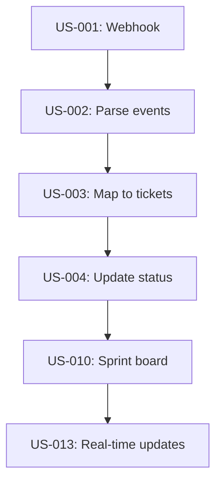

# Backlog Prioritization Guide

Techniques for ordering, prioritizing, and validating a product backlog.

---

## Technique 1: MoSCoW Prioritization

### Distribution Targets

| Priority | Target % of Total Points | Meaning |
|----------|-------------------------|---------|
| Must Have | ~60% | Project fails without these |
| Should Have | ~20% | Important, painful to omit |
| Could Have | ~20% | Nice to have, time permitting |
| Won't Have | 0% (documented) | Explicitly deferred |

### Warning Thresholds

| Condition | Warning |
|-----------|---------|
| Must Have > 70% | Risk: not enough room for Should/Could — scope may be too ambitious |
| Must Have < 40% | Risk: project may lack enough critical features for MVP viability |
| Should Have = 0% | Risk: no growth path beyond MVP |
| Could Have = 0% | Acceptable for tightly constrained projects |

### Priority Decision Questions

| Question | If YES | If NO |
|----------|--------|-------|
| "Does the product work without this?" | Should/Could | Must Have |
| "Would users pay for this alone?" | Must/Should | Could |
| "Is there a workaround?" | Should/Could | Must Have |
| "Did a stakeholder specifically request this?" | Should/Must | Could |
| "Does this reduce a HIGH risk?" | Must Have | Should/Could |

---

## Technique 2: Story Point Calibration

### Reference Story Method

Pick 3 stories as calibration anchors:

1. **Small reference** (2 pts): A story everyone agrees is simple
   - Example: "Change a button label" or "Add a filter dropdown"
2. **Medium reference** (5 pts): A story with moderate complexity
   - Example: "Display a Kanban board with ticket cards"
3. **Large reference** (8 pts): A story at the upper bound of one sprint
   - Example: "Implement OAuth login flow"

Then estimate other stories relative to these anchors:
- "Is this simpler or harder than the 5-point reference?"
- "Is this closer to 2 or closer to 8?"

### Common Estimation Pitfalls

| Pitfall | Problem | Fix |
|---------|---------|-----|
| Estimating hours | Points measure complexity, not time | Compare to reference stories |
| Anchor bias | First estimate influences all others | Estimate independently, then compare |
| Confidence = certainty | Uncertain stories get low estimates | Uncertain = higher estimate (risk buffer) |
| Ignoring dependencies | Story seems small but blocked by 3 others | Include dependency overhead in estimate |

---

## Technique 3: Dependency-Aware Ordering

### Rules

1. **Hard rule**: A dependency MUST be ranked higher (earlier) than its dependent
2. **Soft rule**: Stories in the same dependency chain should be adjacent when possible
3. **No circular dependencies**: If A depends on B and B depends on A, refactor the stories

### Ordering Algorithm

```
1. Identify all stories with no dependencies → these can be ranked first
2. For each priority level (Must Have, Should Have, Could Have):
   a. Order stories without dependencies by value (highest first)
   b. Insert dependent stories immediately after their dependency
   c. If a story has multiple dependencies, place after the latest one
3. Generate dependency graph to verify no circular references
```

### Dependency Visualization

Use Mermaid for dependency graphs:



Critical path = longest chain. This determines minimum timeline.

---

## Technique 4: MVP Boundary Definition

### What Goes in MVP

MVP = All Must Have stories. The MVP must:
- Deliver the core value proposition (from charter vision)
- Be usable by at least one Primary persona
- Meet minimum quality attributes (performance, security)
- Be deployable and testable end-to-end

### MVP Validation Checklist

- [ ] All Must Have stories are included
- [ ] All dependencies of Must Have stories are included (even if Should Have)
- [ ] At least one Primary persona can complete their primary workflow
- [ ] NFR stories for Must Have quality attributes are included
- [ ] Spike stories are completed before MVP features that depend on them

### MVP Boundary Marker

In the prioritized backlog, insert a clear boundary:

```
| Rank | ID | ... | Release |
| 15   | US-015 | ... | MVP |
| ---  | --- MVP BOUNDARY --- | | |
| 16   | US-016 | ... | R2 |
```

---

## Technique 5: Release Grouping

### Standard Release Structure

| Release | Contains | Goal |
|---------|----------|------|
| MVP (R1) | All Must Have stories | Core value, minimum viable product |
| R2 | Should Have stories | Enhanced experience, competitive features |
| R3 | Could Have stories | Nice-to-have, market differentiation |

### Release Planning Calculation

```
Stories per release:      Count stories in each release
Points per release:       Sum story points in each release
Velocity (points/sprint): Estimated from team size and history
Sprints per release:      Points / Velocity (round up)
Calendar time:            Sprints × sprint length
```

### Example

```
MVP: 15 stories, 55 points, velocity 15 pts/sprint → 4 sprints (8 weeks)
R2:  8 stories, 25 points → 2 sprints (4 weeks)
R3:  5 stories, 16 points → 2 sprints (4 weeks)
Total: 28 stories, 96 points → 8 sprints (16 weeks)
```

---

## Technique 6: Capacity Validation

### Velocity Estimation (No History)

When the team has no velocity history, use industry heuristics:

| Team Size | Estimated Velocity | Basis |
|-----------|-------------------|-------|
| 2 developers | 10-15 pts/sprint | Conservative for new team |
| 4 developers | 20-30 pts/sprint | Standard assumption |
| 6 developers | 30-40 pts/sprint | Diminishing returns |

### Capacity Check

```
Must Have points:        {total}
Available sprints:       {from charter timeline}
Required velocity:       Must Have points / Available sprints
Estimated velocity:      {from team size heuristic}

If required > estimated:
  → FLAG: "Must Have scope exceeds estimated capacity by {X}%"
  → Suggest: reduce Must Have scope, extend timeline, or add resources
```

### Red Flags

| Condition | Severity | Action |
|-----------|----------|--------|
| Required velocity > 1.5x estimated | Critical | Scope must be reduced |
| Required velocity > 1.2x estimated | High | Flag risk, consider reduction |
| Required velocity > estimated | Medium | Note risk, monitor after Sprint 1 |
| Required velocity <= estimated | OK | Proceed with buffer |
