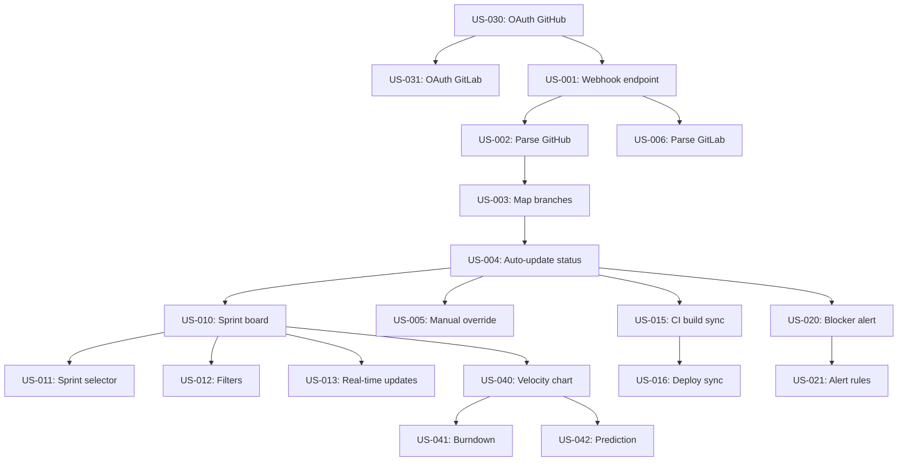

# Product Backlog: TaskFlow

> **Project**: TaskFlow
> **Version**: 1.0
> **Date Created**: 2026-04-06
> **Last Updated**: 2026-04-06
> **Status**: Draft
> **Author**: AI-Generated
> **Source**: Derived from `userstories-final.md` and `epics-final.md`

---

## 1. Backlog Summary

| Metric | Value |
|--------|-------|
| Total stories | 27 |
| Must Have | 15 stories, 55 points |
| Should Have | 8 stories, 25 points |
| Could Have | 4 stories, 16 points |
| Won't Have (deferred) | 0 stories |
| Total Estimated Points | 96 |
| Estimated Velocity | 20 points/sprint |
| Estimated Sprints (MVP) | 3 |
| Estimated Sprints (All) | 5 |

---

## 2. MoSCoW Distribution

| Priority | Stories | Points | % of Total | Target |
|----------|---------|--------|------------|--------|
| Must Have | 15 | 55 | 57% | ~60% |
| Should Have | 8 | 25 | 26% | ~20% |
| Could Have | 4 | 16 | 17% | ~20% |
| Won't Have | 0 | — | — | — |

Distribution is within acceptable range. Must Have at 57% is close to the 60% target. ✅

---

## 3. Prioritized Backlog

| Rank | ID | Epic | Title | Priority | Points | Dependencies | Release | Confidence |
|------|----|------|-------|----------|--------|-------------|---------|------------|
| 1 | US-026 | EPIC-001 | [SPIKE] Validate webhook payload data | Must Have | 3 | — | MVP | 🔶 ASSUMED |
| 2 | US-027 | EPIC-001 | [SPIKE] Survey branch naming conventions | Must Have | 2 | — | MVP | 🔶 ASSUMED |
| 3 | US-030 | EPIC-006 | Set up OAuth authentication (GitHub) | Must Have | 5 | — | MVP | 🔶 ASSUMED |
| 4 | US-031 | EPIC-006 | Set up OAuth authentication (GitLab) | Must Have | 3 | US-030 | MVP | 🔶 ASSUMED |
| 5 | US-025 | EPIC-006 | [NFR] Dashboard performance target | Must Have | 3 | — | MVP | 🔶 ASSUMED |
| 6 | US-001 | EPIC-001 | Configure webhook endpoint | Must Have | 3 | US-030 | MVP | ✅ CONFIRMED |
| 7 | US-002 | EPIC-001 | Parse GitHub push events | Must Have | 3 | US-001 | MVP | ✅ CONFIRMED |
| 8 | US-006 | EPIC-001 | Parse GitLab push events | Must Have | 3 | US-001 | MVP | ✅ CONFIRMED |
| 9 | US-003 | EPIC-001 | Map branch names to tickets | Must Have | 5 | US-002 | MVP | 🔶 ASSUMED |
| 10 | US-004 | EPIC-001 | Auto-update ticket status from Git events | Must Have | 5 | US-003 | MVP | 🔶 ASSUMED |
| 11 | US-010 | EPIC-002 | View sprint board | Must Have | 5 | US-004 | MVP | ✅ CONFIRMED |
| 12 | US-011 | EPIC-002 | Switch between sprints | Must Have | 2 | US-010 | MVP | ✅ CONFIRMED |
| 13 | US-013 | EPIC-002 | Real-time board updates | Must Have | 5 | US-010 | MVP | 🔶 ASSUMED |
| 14 | US-032 | EPIC-006 | [NFR] TLS encryption and data security | Must Have | 3 | — | MVP | 🔶 ASSUMED |
| 15 | US-033 | EPIC-006 | [NFR] System availability monitoring | Must Have | 5 | — | MVP | 🔶 ASSUMED |
| --- | --- | **MVP BOUNDARY** | --- | --- | --- | --- | --- | --- |
| 16 | US-005 | EPIC-001 | Manually override ticket status mapping | Should Have | 3 | US-004 | R2 | 🔶 ASSUMED |
| 17 | US-012 | EPIC-002 | Filter board by assignee and status | Should Have | 3 | US-010 | R2 | 🔶 ASSUMED |
| 18 | US-020 | EPIC-004 | Receive blocker alert for stale tickets | Should Have | 3 | US-004 | R2 | ✅ CONFIRMED |
| 19 | US-021 | EPIC-004 | Configure alert rules | Should Have | 5 | US-020 | R2 | 🔶 ASSUMED |
| 20 | US-015 | EPIC-003 | Sync CI build status to tickets | Should Have | 5 | US-004 | R2 | 🔶 ASSUMED |
| 21 | US-016 | EPIC-003 | Sync deploy status to tickets | Should Have | 3 | US-015 | R2 | 🔶 ASSUMED |
| 22 | US-022 | EPIC-004 | Daily sprint digest notification | Should Have | 3 | US-010 | R2 | 🔶 ASSUMED |
| 23 | US-023 | EPIC-004 | PR review request notification | Should Have | 2 | US-004 | R2 | 🔶 ASSUMED |
| 24 | US-040 | EPIC-005 | Velocity chart | Could Have | 5 | US-010 | R3 | 🔶 ASSUMED |
| 25 | US-041 | EPIC-005 | Burndown chart | Could Have | 5 | US-010 | R3 | 🔶 ASSUMED |
| 26 | US-042 | EPIC-005 | Sprint completion prediction | Could Have | 5 | US-040 | R3 | ❓ UNCLEAR |
| 27 | US-043 | EPIC-005 | Historical sprint comparison | Could Have | 3 | US-040 | R3 | 🔶 ASSUMED |

---

## 4. Dependency Graph

**Critical path**: US-030 -> US-001 -> US-002 -> US-003 -> US-004 -> US-010 -> US-013 (7 stories, 29 points)

---

## 5. Release Grouping

### Release 1: MVP

| Epic | Stories | Points | Target Sprints |
|------|---------|--------|---------------|
| EPIC-001 | US-026, US-027, US-001, US-002, US-006, US-003, US-004 | 24 | Sprint 1-2 |
| EPIC-002 | US-010, US-011, US-013 | 12 | Sprint 2-3 |
| EPIC-006 | US-030, US-031, US-025, US-032, US-033 | 19 | Sprint 1-3 |

**Total**: 15 stories, 55 points, ~3 sprints (6 weeks)

### Release 2: Enhanced

| Epic | Stories | Points | Target Sprints |
|------|---------|--------|---------------|
| EPIC-001 | US-005 | 3 | Sprint 4 |
| EPIC-002 | US-012 | 3 | Sprint 4 |
| EPIC-003 | US-015, US-016 | 8 | Sprint 4 |
| EPIC-004 | US-020, US-021, US-022, US-023 | 13 | Sprint 4-5 |

**Total**: 8 stories, 25 points (~2 sprints, 4 weeks, cumulative: 10 weeks)

### Release 3: Analytics

| Epic | Stories | Points | Target Sprints |
|------|---------|--------|---------------|
| EPIC-005 | US-040, US-041, US-042, US-043 | 18 | Sprint 6-7 |

**Total**: 4 stories, 18 points (~1 sprint, 2 weeks, cumulative: 12 weeks)

---

## 6. Velocity Assumptions

| Assumption | Value | Confidence |
|------------|-------|------------|
| Sprint length | 2 weeks | ✅ CONFIRMED — Source: charter team structure |
| Team size | 4 developers | ✅ CONFIRMED — Source: charter Section 7 |
| Estimated velocity | 20 points/sprint | 🔶 ASSUMED — Reasoning: 4 devs × ~5 pts/dev/sprint (conservative for new team) |
| Velocity basis | Industry heuristic for new team | 🔶 ASSUMED |

### Capacity Check

| Metric | Value |
|--------|-------|
| Must Have points | 55 |
| Available sprints (Q3 2026 deadline, ~5 months) | 10 sprints |
| Required velocity for MVP | 55/3 = ~19 pts/sprint |
| Estimated velocity | 20 pts/sprint |
| Status | ✅ OK — MVP fits comfortably. Buffer for all releases within timeline. |

Charter constraint CON-001 (launch by end Q3 2026) allows ~10 sprints. MVP needs 3 sprints, leaving 7 sprints of buffer for R2, R3, and refinement. ✅

---

## Q&A Log

### Pending

#### Q-001 (related: Velocity Assumptions)
- **Impact**: MEDIUM
- **Question**: Does the team have any velocity history from prior projects? If so, what was the average velocity?
- **Context**: Current velocity estimate (20 pts/sprint) is based on industry heuristic. Actual velocity data would improve capacity planning accuracy.
- **Answer**:
- **Status**: Pending

#### Q-002 (related: US-042, Release 3)
- **Impact**: LOW
- **Question**: Should US-042 (Sprint completion prediction) remain in the backlog as Could Have, or should it be moved to Won't Have for v1?
- **Context**: This story depends on historical data that won't be available until several sprints of usage. Scope document marked SCP-005.3 as UNCLEAR. Keeping it in Could Have sets expectations.
- **Answer**:
- **Status**: Pending

---

## Readiness Assessment

| Metric | Value |
|--------|-------|
| Total items | 27 |
| ✅ CONFIRMED | 6 (22%) |
| 🔶 ASSUMED | 20 (74%) |
| ❓ UNCLEAR | 1 (4%) |
| Q&A Pending | 2 (HIGH: 0, MEDIUM: 1, LOW: 1) |
| Q&A Answered | 0 |

**Verdict**: ⚠️ Partially Ready

**Reasoning**: All stories are accounted for, dependencies are respected, MVP boundary is clear, and capacity check passes. However, confidence is inherited from stories — most are ASSUMED because detailed acceptance criteria and branch naming conventions haven't been validated yet. The backlog ordering and release grouping are sound. No blocking issues for proceeding to traceability.

---

## Approval

| Role | Name | Date | Status |
|------|------|------|--------|
| Product Owner | [TBD] | | ☐ Pending |
| Scrum Master | [TBD] | | ☐ Pending |
