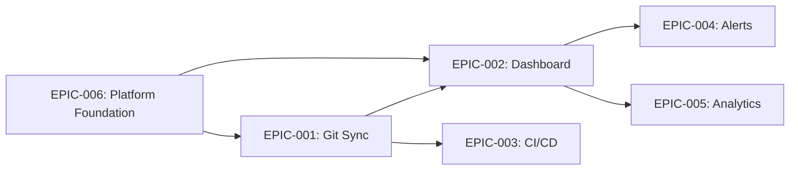

# Epics: TaskFlow

> **Project**: TaskFlow
> **Version**: 1.0
> **Date Created**: 2026-04-06
> **Last Updated**: 2026-04-06
> **Status**: Draft
> **Author**: AI-Generated
> **Source**: Derived from `charter-final.md` and `scope-final.md`

---

## 1. Epic Overview

| ID | Title | Objective | Features | Priority | Est. Stories | Est. Points | Confidence |
|----|-------|-----------|----------|----------|-------------|-------------|------------|
| EPIC-001 | Real-Time Git Sync | Obj 1: Eliminate manual updates | SCP-001 (.1-.5) | Must Have | 6 | 24 | ✅ CONFIRMED |
| EPIC-002 | Sprint Visibility Dashboard | Obj 1 + Obj 2 | SCP-002 (.1-.4) | Must Have | 5 | 21 | ✅ CONFIRMED |
| EPIC-003 | CI/CD Pipeline Integration | Obj 1: Eliminate manual updates | SCP-003 (.1-.2) | Should Have | 3 | 11 | 🔶 ASSUMED |
| EPIC-004 | Intelligent Alerts & Notifications | Obj 2: Improve predictability | SCP-004 | Should Have | 4 | 13 | ✅ CONFIRMED |
| EPIC-005 | Sprint Analytics & Predictions | Obj 2: Improve predictability | SCP-005 (.1-.3) | Could Have | 4 | 16 | 🔶 ASSUMED |
| EPIC-006 | Platform Foundation | Supports all objectives | INT-005, QA-001, QA-002, QA-004 | Must Have | 5 | 18 | 🔶 ASSUMED |

---

## 2. Epic Details

### EPIC-001: Real-Time Git Sync

| Field | Value |
|-------|-------|
| **ID** | EPIC-001 |
| **Title** | Real-Time Git Sync |
| **Objective** | Obj 1: Eliminate manual sprint status updates (KR 1.1: >80% tickets auto-updated, KR 1.2: SM time < 5 min/day) |
| **Description** | Enable TaskFlow to automatically detect Git activity (commits, PRs, branch operations) from GitHub and GitLab, match events to sprint tickets via branch naming conventions, and update ticket status in real-time. This is the core differentiator — the "auto-sync" that eliminates manual status updates. |
| **Scope Features** | SCP-001 (Git Integration), SCP-001.1 (Webhook receiver), SCP-001.2 (Event parser), SCP-001.3 (Ticket mapper), SCP-001.4 (Status updater), SCP-001.5 (Manual override) |
| **Personas** | Dev Dana (Primary — pushes code, PRs auto-update tickets), SM Sam (Secondary — views auto-updated status) |
| **Success Criteria** | >80% of sprint tickets have status auto-updated from Git events by Month 3 post-launch |
| **Priority** | Must Have |
| **Estimated Stories** | 6 |
| **Estimated Points** | 24 |
| **Dependencies** | EPIC-006 (Platform Foundation — needs auth before Git integration) |
| **Tags** | — |
| **Confidence** | ✅ CONFIRMED — Source: charter Obj 1, scope SCP-001 confirmed |

### EPIC-002: Sprint Visibility Dashboard

| Field | Value |
|-------|-------|
| **ID** | EPIC-002 |
| **Title** | Sprint Visibility Dashboard |
| **Objective** | Obj 1: Eliminate manual updates + Obj 2: Improve sprint predictability |
| **Description** | Provide a real-time Kanban-style board showing sprint ticket status derived from Git activity. Scrum masters can see sprint health at a glance without chasing developers for updates. Supports filtering, searching, and switching between sprints. |
| **Scope Features** | SCP-002 (Sprint Dashboard), SCP-002.1 (Board view), SCP-002.2 (Real-time updates), SCP-002.3 (Filter and search), SCP-002.4 (Sprint selector) |
| **Personas** | SM Sam (Primary — monitors sprint health daily), Dev Dana (Secondary — views own tickets), TL Tara (Secondary — views team overview) |
| **Success Criteria** | SM time spent on status chasing reduced from 30 min/day to < 5 min/day by Month 3 |
| **Priority** | Must Have |
| **Estimated Stories** | 5 |
| **Estimated Points** | 21 |
| **Dependencies** | EPIC-001 (Git Sync — dashboard needs Git data to display) |
| **Tags** | — |
| **Confidence** | ✅ CONFIRMED — Source: charter Obj 1 + Obj 2, scope SCP-002 confirmed |

### EPIC-003: CI/CD Pipeline Integration

| Field | Value |
|-------|-------|
| **ID** | EPIC-003 |
| **Title** | CI/CD Pipeline Integration |
| **Objective** | Obj 1: Eliminate manual updates (extend auto-sync to include build/deploy status) |
| **Description** | Sync CI/CD pipeline status (build pass/fail, deployment stage) to sprint tickets. Gives tech leads visibility into build health alongside sprint progress without switching between tools. |
| **Scope Features** | SCP-003 (CI/CD Integration), SCP-003.1 (Build status sync), SCP-003.2 (Deploy status sync) |
| **Personas** | TL Tara (Primary — tracks build health), Dev Dana (Secondary — sees build status on own tickets) |
| **Success Criteria** | Build/deploy status visible on sprint tickets within 30 seconds of pipeline event |
| **Priority** | Should Have |
| **Estimated Stories** | 3 |
| **Estimated Points** | 11 |
| **Dependencies** | EPIC-001 (Git Sync — CI/CD events correlate with Git events) |
| **Tags** | — |
| **Confidence** | 🔶 ASSUMED — Reasoning: charter lists CI/CD as "Should Have", scope confirms sub-features. Q&A ref: Q-001 |

### EPIC-004: Intelligent Alerts & Notifications

| Field | Value |
|-------|-------|
| **ID** | EPIC-004 |
| **Title** | Intelligent Alerts & Notifications |
| **Objective** | Obj 2: Improve sprint predictability (proactive blocker detection) |
| **Description** | Push alerts for sprint blockers, stale tickets, and daily sprint digests. Scrum masters get proactive notifications instead of manually scanning the board. Supports configurable alert rules and multiple notification channels. |
| **Scope Features** | SCP-004 (Alerts & Notifications) |
| **Personas** | SM Sam (Primary — receives blocker alerts, daily digests), Dev Dana (Secondary — receives PR review requests), TL Tara (Secondary — receives build failure alerts) |
| **Success Criteria** | Blockers identified within 4 hours of occurrence (vs. next standup meeting) |
| **Priority** | Should Have |
| **Estimated Stories** | 4 |
| **Estimated Points** | 13 |
| **Dependencies** | EPIC-002 (Dashboard — alerts reference dashboard ticket data) |
| **Tags** | — |
| **Confidence** | ✅ CONFIRMED — Source: charter SCP-004 confirmed, scope persona scenarios reference alerts |

### EPIC-005: Sprint Analytics & Predictions

| Field | Value |
|-------|-------|
| **ID** | EPIC-005 |
| **Title** | Sprint Analytics & Predictions |
| **Objective** | Obj 2: Improve sprint predictability (KR 2.1: 40% -> 75% commitment accuracy) |
| **Description** | Provide velocity charts, burndown charts, and sprint completion predictions. Enables data-driven sprint planning and retrospectives. Prediction engine uses historical sprint data to forecast completion probability. |
| **Scope Features** | SCP-005 (Sprint Analytics), SCP-005.1 (Velocity chart), SCP-005.2 (Burndown chart), SCP-005.3 (Prediction engine) |
| **Personas** | SM Sam (Primary — velocity, burndown for retros), TL Tara (Secondary — capacity planning) |
| **Success Criteria** | Sprint commitment accuracy improves from 40% to 75% by Month 6 |
| **Priority** | Could Have |
| **Estimated Stories** | 4 |
| **Estimated Points** | 16 |
| **Dependencies** | EPIC-002 (Dashboard — analytics built on sprint data) |
| **Tags** | — |
| **Confidence** | 🔶 ASSUMED — Reasoning: prediction engine (SCP-005.3) marked UNCLEAR in scope, may need historical data not available at launch. Q&A ref: Q-002 |

### EPIC-006: Platform Foundation [CROSS-CUTTING]

| Field | Value |
|-------|-------|
| **ID** | EPIC-006 |
| **Title** | Platform Foundation [CROSS-CUTTING] |
| **Objective** | Supports all objectives — foundational capabilities required by all epics |
| **Description** | Core platform capabilities needed before feature development: user authentication via OAuth (GitHub/GitLab), application security (TLS, data encryption), performance infrastructure (target < 2s load time), and system availability (99.5% uptime target). |
| **Scope Features** | INT-005 (OAuth Provider), QA-001 (Performance), QA-002 (Availability), QA-004 (Security) |
| **Personas** | All personas (authentication, security, performance affect everyone) |
| **Success Criteria** | Platform meets QA-001 (< 2s load), QA-002 (99.5% uptime), QA-004 (OAuth, TLS, encryption) |
| **Priority** | Must Have |
| **Estimated Stories** | 5 |
| **Estimated Points** | 18 |
| **Dependencies** | None (foundation — other epics depend on this) |
| **Tags** | [CROSS-CUTTING] |
| **Confidence** | 🔶 ASSUMED — Reasoning: inferred from scope quality attributes and integrations. Not explicitly an "epic" in charter. Q&A ref: Q-003 |

---

## 3. Feature-to-Epic Map

| Feature (SCP-xxx) | Description | Epic | Notes |
|-------------------|-------------|------|-------|
| SCP-001 | Git Integration | EPIC-001 | All sub-features (.1-.5) included |
| SCP-001.1 | Webhook receiver | EPIC-001 | — |
| SCP-001.2 | Event parser | EPIC-001 | — |
| SCP-001.3 | Ticket mapper | EPIC-001 | — |
| SCP-001.4 | Status updater | EPIC-001 | — |
| SCP-001.5 | Manual override | EPIC-001 | — |
| SCP-002 | Sprint Dashboard | EPIC-002 | All sub-features (.1-.4) included |
| SCP-002.1 | Board view | EPIC-002 | — |
| SCP-002.2 | Real-time updates | EPIC-002 | — |
| SCP-002.3 | Filter and search | EPIC-002 | — |
| SCP-002.4 | Sprint selector | EPIC-002 | — |
| SCP-003 | CI/CD Integration | EPIC-003 | — |
| SCP-003.1 | Build status sync | EPIC-003 | — |
| SCP-003.2 | Deploy status sync | EPIC-003 | — |
| SCP-004 | Alerts & Notifications | EPIC-004 | Decomposition into sub-features deferred to userstory skill |
| SCP-005 | Sprint Analytics | EPIC-005 | — |
| SCP-005.1 | Velocity chart | EPIC-005 | — |
| SCP-005.2 | Burndown chart | EPIC-005 | — |
| SCP-005.3 | Prediction engine | EPIC-005 | UNCLEAR — may defer to v2 |
| INT-005 | OAuth Provider | EPIC-006 | Cross-cutting: authentication |
| QA-001 | Performance | EPIC-006 | Cross-cutting: < 2s dashboard load |
| QA-002 | Availability | EPIC-006 | Cross-cutting: 99.5% uptime |
| QA-004 | Security | EPIC-006 | Cross-cutting: OAuth, TLS, encryption |

---

## 4. Epic Dependency Map

**Critical Path**: EPIC-006 -> EPIC-001 -> EPIC-002 -> EPIC-005

---

## Q&A Log

### Pending

#### Q-001 (related: EPIC-003)
- **Impact**: MEDIUM
- **Question**: Should CI/CD integration be limited to GitHub Actions and GitLab CI, or should it support other CI systems (Jenkins, CircleCI)?
- **Context**: Supporting more CI systems increases scope significantly. The charter constraint CON-003 mandates GitHub and GitLab support but doesn't specify CI/CD systems beyond those platforms' built-in tools.
- **Answer**:
- **Status**: Pending

#### Q-002 (related: EPIC-005, SCP-005.3)
- **Impact**: MEDIUM
- **Question**: Should the ML-based prediction engine (SCP-005.3) be included in the initial epic scope, or deferred to a future release?
- **Context**: Scope document marked SCP-005.3 as UNCLEAR. ML prediction requires historical data that won't exist at launch. Including it in the epic sets an expectation for story creation.
- **Answer**:
- **Status**: Pending

#### Q-003 (related: EPIC-006)
- **Impact**: LOW
- **Question**: Is a separate Platform Foundation epic the right way to handle cross-cutting concerns, or should auth/security/performance stories be distributed into feature epics?
- **Context**: A dedicated cross-cutting epic keeps infrastructure concerns visible but may feel disconnected from feature delivery. Distributing into feature epics hides infrastructure work.
- **Answer**:
- **Status**: Pending

---

## Readiness Assessment

| Metric | Value |
|--------|-------|
| Total items | 29 |
| ✅ CONFIRMED | 16 (55%) |
| 🔶 ASSUMED | 12 (41%) |
| ❓ UNCLEAR | 1 (3%) |
| Q&A Pending | 3 (HIGH: 0, MEDIUM: 2, LOW: 1) |
| Q&A Answered | 0 |

**Verdict**: ⚠️ Partially Ready

**Reasoning**: All charter objectives have corresponding epics and all scope features are assigned. Core epics (EPIC-001, EPIC-002, EPIC-004) are CONFIRMED from charter/scope. Platform Foundation and analytics epics are ASSUMED — need user validation before story creation. No HIGH-impact Q&A items, so userstory creation can begin for CONFIRMED epics while ASSUMED epics are refined.

---

## Approval

| Role | Name | Date | Status |
|------|------|------|--------|
| Product Owner | [TBD] | | ☐ Pending |
| Scrum Master | [TBD] | | ☐ Pending |
