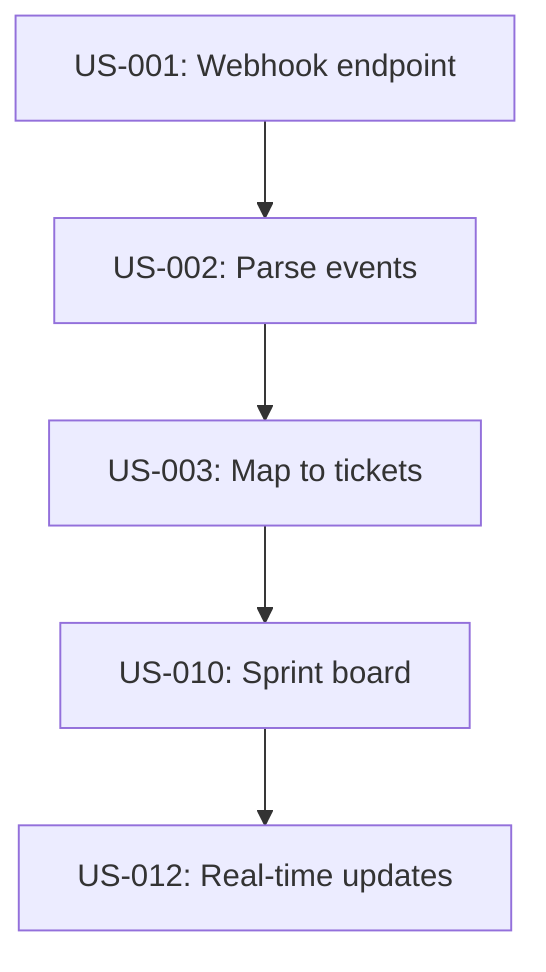

# Product Backlog Template

Standard format for organizing and prioritizing the product backlog.

---

## Backlog Summary

```markdown
| Metric | Value |
|--------|-------|
| Total stories | {N} |
| Must Have | {N} stories, {X} points |
| Should Have | {N} stories, {X} points |
| Could Have | {N} stories, {X} points |
| Won't Have (deferred) | {N} stories |
| Total Estimated Points | {X} |
| Estimated Velocity | {Y} points/sprint |
| Estimated Sprints (Must Have) | {Z} |
| Estimated Sprints (All) | {W} |
```

---

## MoSCoW Distribution

```markdown
| Priority | Stories | Points | % of Total Points | Target |
|----------|---------|--------|-------------------|--------|
| Must Have | {N} | {X} | {pct}% | ~60% |
| Should Have | {N} | {X} | {pct}% | ~20% |
| Could Have | {N} | {X} | {pct}% | ~20% |
| Won't Have | {N} | — | — | — |
```

Flag if Must Have exceeds 70% of total points — risk of not delivering Should/Could Have items.

---

## Prioritized Backlog

```markdown
| Rank | ID | Epic | Title | Priority | Points | Dependencies | Release | Confidence |
|------|----|------|-------|----------|--------|-------------|---------|------------|
| 1 | US-{NNN} | EPIC-{NNN} | {title} | Must Have | {pts} | — | MVP | {marker} |
| 2 | US-{NNN} | EPIC-{NNN} | {title} | Must Have | {pts} | US-001 | MVP | {marker} |
| ... | | | | | | | | |
| --- MVP BOUNDARY --- | | | | | | | | |
| {N} | US-{NNN} | EPIC-{NNN} | {title} | Should Have | {pts} | — | R2 | {marker} |
```

---

## Dependency Graph



---

## Release Grouping

```markdown
### Release 1: MVP
| Epic | Stories | Points | Target Sprint |
|------|---------|--------|---------------|
| EPIC-001 | US-001..US-005 | {X} | Sprint 1-3 |
| EPIC-002 | US-010..US-013 | {X} | Sprint 2-4 |

**Total**: {N} stories, {X} points, {Y} sprints

### Release 2: Enhanced
| Epic | Stories | Points | Target Sprint |
| EPIC-003 | US-015..US-017 | {X} | Sprint 5-6 |
```

---

## Velocity Assumptions

```markdown
| Assumption | Value | Confidence |
|------------|-------|------------|
| Sprint length | {2 weeks} | {marker} |
| Team size | {N developers} | {marker} |
| Estimated velocity | {X points/sprint} | {marker} |
| Velocity basis | {how estimated — team history, industry average, guess} | {marker} |
```

---

## Rules

- Every story from userstories-final.md must appear in the backlog
- Backlog must be ordered (rank 1 = highest priority)
- Must Have stories ranked above Should Have (within dependency constraints)
- Dependencies respected in ordering (dependency before dependent)
- MVP boundary explicitly marked
- MoSCoW distribution should approximate 60/20/20
- Total Must Have points validated against velocity (flag if exceeds capacity)
