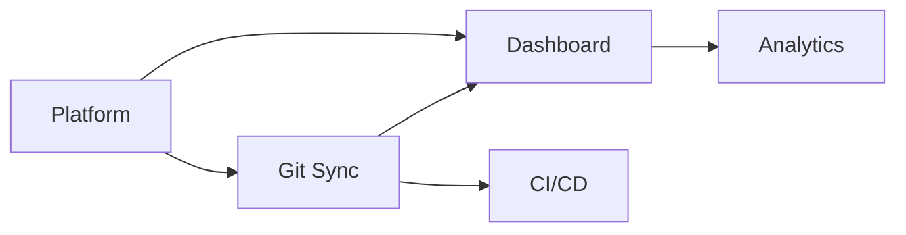

# Epic Template

Standard format for defining epics during requirements definition.

---

## Epic Card

```markdown
### EPIC-{NNN}: {Title}

| Field | Value |
|-------|-------|
| **ID** | EPIC-{NNN} |
| **Title** | {concise, descriptive name} |
| **Objective** | {charter objective this supports — e.g., "Obj 1: Eliminate manual status updates"} |
| **Description** | {2-3 sentences describing the theme and its value} |
| **Scope Features** | {comma-separated SCP-xxx IDs from scope} |
| **Personas** | {who benefits — e.g., "Dev Dana (Primary), SM Sam (Secondary)"} |
| **Success Criteria** | {measurable outcome — linked to charter OKRs} |
| **Priority** | Must Have / Should Have / Could Have |
| **Estimated Stories** | {expected number of user stories} |
| **Estimated Points** | {total story points, if known} |
| **Dependencies** | {other EPIC-xxx IDs this depends on, or "None"} |
| **Tags** | {optional: [CROSS-CUTTING], [SPIKE], etc.} |
| **Confidence** | {✅ CONFIRMED / 🔶 ASSUMED / ❓ UNCLEAR} |
```

---

## Epic Overview Table

```markdown
| ID | Title | Objective | Features | Priority | Stories | Points | Confidence |
|----|-------|-----------|----------|----------|---------|--------|------------|
| EPIC-001 | {title} | {objective ref} | SCP-001 | Must Have | ~5 | ~21 | ✅ |
```

---

## Feature-to-Epic Map

Ensures every scope feature is assigned to exactly one epic.

```markdown
| Feature (SCP-xxx) | Description | Epic | Notes |
|-------------------|-------------|------|-------|
| SCP-001 | Git Integration | EPIC-001 | All sub-features included |
| SCP-002 | Sprint Dashboard | EPIC-002 | — |
```

---

## Epic Dependency Map



---

## Rules

- At least 3 epics per project (single-epic projects should use scope skill instead)
- 3-8 stories per epic is the ideal range
- Every scope feature appears in exactly one epic
- Cross-cutting concerns (auth, security, infra) get their own epic with `[CROSS-CUTTING]` tag
- Epic descriptions describe WHAT and WHY, never HOW (no tech decisions)
