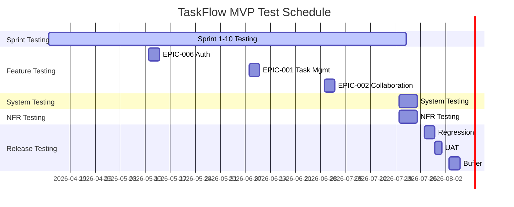

# Test Plan -- TaskFlow

**Version**: draft
**Date**: 2026-04-06
**Test Strategy Reference**: test-strategy-final.md
**Status**: Draft

---

## 1. Test Scope

### In Scope

| Release | Stories | Epics | Test Focus |
|---------|---------|-------|------------|
| MVP (R1) | US-001 through US-015 | EPIC-001 (Task Mgmt), EPIC-002 (Team Collaboration), EPIC-006 (Auth & Onboarding) | Full coverage -- happy path, negative, edge cases |
| R2 | US-016 through US-022 | EPIC-003 (Reporting & Analytics), EPIC-004 (Integrations) | Full coverage |
| R3 | US-023 through US-027 | EPIC-005 (Advanced Automation) | Full coverage |

### Out of Scope

| Item | Reason |
|------|--------|
| Auth0 internal authentication logic | Third-party service -- tested at integration boundary only |
| GitHub Actions CI provider internals | Third-party infrastructure -- trust vendor reliability |
| ML-based task prediction features | Deferred to R4, not in current backlog |
| Mobile native apps | Web-only for R1-R3, mobile deferred |

### Assumptions

- Auth0 login flow is tested at integration boundary (token exchange), not Auth0 internals &#x1f536; ASSUMED
- GitHub API sandbox provides sufficient rate limits for integration testing &#x1f536; ASSUMED
- Staging environment will mirror production topology &#x2705; CONFIRMED (per architecture-final.md)
- Synthetic test data is acceptable for all test phases &#x1f536; ASSUMED

---

## 2. Test Phases

### Phase 1: Sprint Testing (Continuous)

| Field | Value |
|-------|-------|
| **Scope** | Unit + integration tests for all new code each sprint |
| **Duration** | Throughout development -- Sprint 1 through Sprint 10 (MVP) |
| **Owner** | Development team (2 developers) |
| **Entry Criteria** | Story development started |
| **Exit Criteria** | Line coverage >= 80%, branch coverage >= 70%, CI green |

**Activities**:
1. Write unit tests alongside feature code (Jest for backend, Vitest for frontend)
2. Write integration tests for API endpoints (Supertest)
3. Run CI pipeline on every pull request
4. Code review includes test review

**Deliverables**:
- Sprint test report (coverage metrics, pass rate)

### Phase 2: Feature Testing (Per Epic Completion)

| Field | Value |
|-------|-------|
| **Scope** | Functional testing of completed epics -- all ACs verified |
| **Duration** | 2-3 days per epic (6 epics for MVP = ~15 days total, staggered) |
| **Owner** | QA Lead |
| **Entry Criteria** | Epic stories marked Dev Complete, unit tests passing, code review approved |
| **Exit Criteria** | All ACs verified, 100% critical tests pass, no open Critical/High bugs for epic |

**Activities**:
1. Execute functional test cases per acceptance criterion
2. Exploratory testing of feature workflows
3. Cross-browser testing (Chrome, Firefox, Safari)
4. Report and triage defects

**Deliverables**:
- Feature test report per epic

### Phase 3: System Testing (End of MVP)

| Field | Value |
|-------|-------|
| **Scope** | Full system in staging -- cross-epic flows, data integrity, error handling |
| **Duration** | 5 days &#x2705; CONFIRMED |
| **Owner** | QA Lead |
| **Entry Criteria** | All Must Have stories complete, staging deployed, test data seeded |
| **Exit Criteria** | 100% critical tests pass, 95% overall pass, no open Critical bugs, coverage >= 80% |

**Activities**:
1. Cross-component integration scenarios (e.g., create task -> assign to team member -> receive notification -> view in dashboard)
2. End-to-end workflow testing across epics
3. Data integrity verification (database constraints, cascade operations)
4. Error handling and recovery testing
5. Session management and concurrent user testing

**Deliverables**:
- System test report with coverage analysis

### Phase 4: NFR Testing (Parallel with System Testing)

| Field | Value |
|-------|-------|
| **Scope** | Performance (k6), security (OWASP ZAP), scalability |
| **Duration** | 5 days (runs in parallel with system testing on dedicated environment) &#x1f536; ASSUMED |
| **Owner** | QA Lead + DevOps engineer |
| **Entry Criteria** | Feature testing exit criteria met, performance environment provisioned |
| **Exit Criteria** | API response < 200ms p95, page load < 2s, 100 concurrent users supported, ZAP scan clean (no Critical/High) |

**Activities**:
1. Load testing: 100 concurrent users, sustained 30-minute runs (k6)
2. Stress testing: ramp to 200 users to find breaking point
3. Security scanning: OWASP ZAP automated scan + manual review of auth flows
4. Database query performance under load

**Deliverables**:
- NFR test report (performance benchmarks, security findings)

### Phase 5: Regression + UAT (Pre-Release)

| Field | Value |
|-------|-------|
| **Scope** | Full regression suite + stakeholder acceptance testing |
| **Duration** | 5 days (3 days regression + 2 days UAT) &#x1f536; ASSUMED |
| **Owner** | QA Lead (regression), Product Owner + 2 stakeholders (UAT) |
| **Entry Criteria** | System + NFR testing exit criteria met, UAT environment deployed, UAT scripts prepared |
| **Exit Criteria** | 100% critical regression pass, stakeholder sign-off obtained, feedback triaged |

**Activities**:
1. Execute full Playwright regression suite (automated)
2. Manual regression of complex workflows
3. UAT: stakeholders execute 10 critical user scenarios
4. Collect and triage stakeholder feedback
5. Final go/no-go recommendation

**Deliverables**:
- Regression test report
- UAT sign-off document
- Final test summary with go/no-go recommendation

---

## 3. Test Schedule

| Phase | Start | End | Duration | Dependencies | Owner |
|-------|-------|-----|----------|--------------|-------|
| Sprint Testing | 2026-04-13 | 2026-07-17 | 10 sprints (continuous) | Development started | Dev team |
| Feature Testing (EPIC-006) | 2026-05-11 | 2026-05-13 | 3 days | EPIC-006 Dev Complete | QA Lead |
| Feature Testing (EPIC-001) | 2026-06-08 | 2026-06-10 | 3 days | EPIC-001 Dev Complete | QA Lead |
| Feature Testing (EPIC-002) | 2026-06-29 | 2026-07-01 | 3 days | EPIC-002 Dev Complete | QA Lead |
| System Testing | 2026-07-20 | 2026-07-24 | 5 days | All feature testing complete | QA Lead |
| NFR Testing | 2026-07-20 | 2026-07-24 | 5 days | Feature testing complete, perf env ready | QA + DevOps |
| Regression | 2026-07-27 | 2026-07-29 | 3 days | System + NFR exit criteria met | QA Lead |
| UAT | 2026-07-30 | 2026-07-31 | 2 days | Regression pass | Stakeholders |
| **Buffer** | 2026-08-03 | 2026-08-05 | **3 days** | -- | -- |

**Total test phase duration** (excluding sprint testing): 30 days
**Buffer**: 3 days (10% of total) &#x2705; CONFIRMED

---

## 4. Resource Allocation

| Role | Person/Team | Allocation | Phases | Skills Required |
|------|------------|------------|--------|-----------------|
| Developer 1 | Dev team | 30% testing | Sprint Testing, Feature Testing support | Node.js, Jest, React, Vitest |
| Developer 2 | Dev team | 30% testing | Sprint Testing, Feature Testing support | Node.js, Jest, PostgreSQL |
| QA Lead | QA team | 100% | Feature, System, NFR, Regression, UAT coordination | Playwright, k6, OWASP ZAP, API testing |
| DevOps Engineer | Platform team | 40% during NFR, 20% otherwise | Environment setup, NFR Testing, CI maintenance | AWS, Docker, GitHub Actions, k6 |

### Tool Licenses

| Tool | Licenses Needed | Cost | Procurement Status |
|------|----------------|------|--------------------|
| Playwright | Unlimited (OSS) | $0 | Available &#x2705; CONFIRMED |
| k6 Cloud | 1 team license | $200/mo for 2 months | Needed &#x1f536; ASSUMED |
| OWASP ZAP | Unlimited (OSS) | $0 | Available &#x2705; CONFIRMED |
| Datadog APM | 1 (existing) | $0 (existing contract) | Available &#x2705; CONFIRMED |
| Jest | Unlimited (OSS) | $0 | Available &#x2705; CONFIRMED |
| Vitest | Unlimited (OSS) | $0 | Available &#x2705; CONFIRMED |

---

## 5. Entry/Exit Criteria

### Entry Criteria

| ID | Phase | Criterion | Verification |
|----|-------|-----------|--------------|
| ENTRY-01 | Feature Testing | Epic stories marked Dev Complete | JIRA/board status check |
| ENTRY-02 | Feature Testing | Unit tests passing (CI green) | CI pipeline dashboard |
| ENTRY-03 | Feature Testing | Code review approved | PR approval status |
| ENTRY-04 | System Testing | All Must Have stories Dev Complete | Backlog review -- 15/15 stories done |
| ENTRY-05 | System Testing | Staging environment deployed and verified | Deployment health check endpoint |
| ENTRY-06 | System Testing | Test data seeded | Data verification script passes |
| ENTRY-07 | NFR Testing | Performance environment provisioned | Infra health check |
| ENTRY-08 | NFR Testing | Baseline metrics captured | Datadog dashboard populated |
| ENTRY-09 | UAT | System + NFR exit criteria met | Test reports reviewed and approved |
| ENTRY-10 | UAT | UAT environment deployed with production-like data | Environment verification checklist |

### Exit Criteria

| ID | Phase | Criterion | Metric | Target | DoD Ref |
|----|-------|-----------|--------|--------|---------|
| EXIT-01 | Sprint Testing | Code coverage | Line coverage | >= 80% | DOD-03 |
| EXIT-02 | Sprint Testing | Code coverage | Branch coverage | >= 70% | DOD-03 |
| EXIT-03 | Sprint Testing | CI pipeline | Pass rate | 100% green | DOD-01 |
| EXIT-04 | Feature Testing | AC verification | Critical AC pass rate | 100% | DOD-04 |
| EXIT-05 | Feature Testing | Bug status | Open Critical/High bugs | 0 for epic | DOD-05 |
| EXIT-06 | System Testing | System tests | Overall pass rate | >= 95% | DOD-04 |
| EXIT-07 | System Testing | Critical bugs | Open Critical count | 0 | DOD-05 |
| EXIT-08 | NFR Testing | API response time | p95 latency | < 200ms | DOD-06 |
| EXIT-09 | NFR Testing | Page load time | p95 load time | < 2s | DOD-06 |
| EXIT-10 | NFR Testing | Concurrent users | Supported users | >= 100 | DOD-06 |
| EXIT-11 | NFR Testing | Security scan | Critical/High findings | 0 | DOD-06 |
| EXIT-12 | Regression + UAT | Regression suite | Critical test pass rate | 100% | DOD-04 |
| EXIT-13 | Regression + UAT | Stakeholder sign-off | Sign-off obtained | Yes | DOD-07 |

---

## 6. Environment Plan

| Environment | Owner | Ready By | Infrastructure | Data |
|-------------|-------|----------|----------------|------|
| Local dev | Developers | Day 1 &#x2705; CONFIRMED | Developer machines, Docker Compose (PostgreSQL, Redis) | Seed scripts with fixtures |
| CI (GitHub Actions) | DevOps | Sprint 1 &#x2705; CONFIRMED | GitHub-hosted runners, ephemeral PostgreSQL container | Auto-generated per test run |
| Staging (AWS) | DevOps | Sprint 3 &#x1f536; ASSUMED | AWS ECS + RDS PostgreSQL + ElastiCache Redis | Production-like synthetic data (500 users, 5000 tasks) |
| Performance (AWS) | DevOps | Sprint 7 &#x1f536; ASSUMED | Dedicated AWS ECS (production-equivalent sizing) + RDS | Production-scale synthetic (10K users, 100K tasks) |
| UAT | DevOps | Sprint 9 &#x1f536; ASSUMED | Same as staging (separate instance) | Curated UAT dataset with realistic scenarios |

### Service Dependencies

| Dependency | Approach | Owner |
|-----------|----------|-------|
| Auth0 | Sandbox tenant for staging/UAT, mocked in CI | DevOps |
| GitHub API | Recorded responses (VCR) in CI, sandbox in staging | Dev team |
| SendGrid (email) | Sandbox mode in staging, mocked in CI | DevOps |
| AWS S3 (file storage) | LocalStack in CI, real S3 in staging | DevOps |

---

## 7. Test Deliverables

| Deliverable | Format | Frequency | Audience |
|-------------|--------|-----------|----------|
| Sprint test report | Markdown summary in sprint retro | Per sprint (bi-weekly) | Scrum team |
| Feature test report | Detailed markdown per epic | Per epic completion | QA Lead, Tech Lead |
| System test report | Comprehensive results + coverage | End of system testing | Project team |
| NFR test report | Performance benchmarks + security findings | End of NFR testing | Tech Lead, DevOps, Stakeholders |
| Final test summary | Go/no-go recommendation document | Pre-release | Stakeholders, PM |
| Coverage report | Jest/Vitest HTML report | Per sprint | Dev team |
| Defect report | GitHub Issues export | Weekly during test phases | Project team |

---

## 8. Test Risks & Mitigations

| ID | Risk | Impact | Likelihood | Mitigation | Owner |
|----|------|--------|------------|------------|-------|
| TR-001 | Staging environment not ready by Sprint 3 | High -- delays system testing | Medium | Fallback to Docker Compose multi-container setup for integration testing; escalate to DevOps lead by Sprint 2 | DevOps |
| TR-002 | Production-like test data not available | Medium -- reduces test confidence | Medium | Generate synthetic data using factory scripts; seed 500 users + 5000 tasks with realistic distributions | QA Lead |
| TR-003 | QA Lead unavailable (illness, departure) | High -- blocks feature/system testing | Low | Cross-train Developer 1 on Playwright and testing processes; maintain test runbooks | QA Lead, Dev 1 |
| TR-004 | Performance environment cost exceeds budget | Medium -- may skip performance testing | Low | Time-box performance testing to 2-week window; use k6 OSS instead of Cloud if budget constrained | DevOps, PM |
| TR-005 | GitHub API rate limits in test environment | Low -- flaky integration tests | Medium | Use recorded responses (VCR pattern) for CI; reserve sandbox rate limit for staging only | Dev team |

---

## 9. Defect Management

### Severity Definitions

| Severity | Definition | Example | Fix SLA |
|----------|-----------|---------|---------|
| Critical | System unusable or data corruption | Login completely broken for all users; tasks deleted without user action; security breach exposing user data | 4 hours |
| High | Major feature broken, painful workaround | Cannot create tasks (core feature); team invitations fail; dashboard shows wrong data | 24 hours |
| Medium | Feature degraded, easy workaround | Task sorting doesn't persist after page reload; notification delay > 5 minutes; filter combination produces wrong results | Current sprint |
| Low | Cosmetic or minor issue | Typo in error message; button alignment off by 2px; tooltip shows on wrong side | Backlog (next sprint or later) |

### Priority vs Severity

Priority is determined during triage based on severity, user frequency, business impact, and workaround availability:
- A Critical severity bug in the admin panel (used by 1 person) may be High priority (not immediate)
- A Low severity typo on the login page (seen by every user) may be Medium priority

### Triage Process

- **During active test phases (system, NFR, regression)**: Daily 15-minute bug triage standup at 9:30 AM
- **During sprints**: Part of daily standup -- review new bugs, assign to sprint if High/Critical
- **Pre-release**: Daily triage until zero open Critical/High bugs
- **Triage participants**: QA Lead, Tech Lead, affected developer

**Workflow**:
1. Bug reported -> Status: **Open** (reporter assigns initial severity)
2. Triage meeting -> Confirm severity, assign priority and sprint -> Status: **Triaged**
3. Developer picks up -> Status: **In Progress**
4. Fix implemented + unit test added -> Status: **Fixed** (triggers regression)
5. QA verifies fix in staging -> Status: **Verified** (or **Reopened** with notes)
6. Deployed to production -> Status: **Closed**

### Regression Policy

Regression testing is triggered when:
- Any Critical or High severity bug is fixed (targeted regression of affected area)
- More than 3 Medium severity bugs are fixed in one sprint (broader regression)
- A fix touches shared code (auth middleware, database models, utility functions)
- Pre-release: full Playwright regression suite regardless of fix count

---

## 10. Q&A Log

| ID | Question | Priority | Source | Answer | Status |
|----|----------|----------|--------|--------|--------|
| Q-01 | Who are the UAT participants? Product Owner confirmed, but need 2 additional stakeholders identified | HIGH | Phase 5 Entry Criteria | Pending -- PM to confirm by Sprint 5 | Open |
| Q-02 | What volume of test data is needed for performance testing? 10K users assumed but not confirmed | MED | Environment Plan | 10K users + 100K tasks assumed based on 12-month growth projection | Open |
| Q-03 | Can system testing and NFR testing run in parallel on separate environments? | MED | Test Schedule | Assumed yes -- requires dedicated performance environment | Open |

---

## 11. Readiness Assessment

### Confidence Summary

| Level | Count | Percentage |
|-------|-------|------------|
| &#x2705; CONFIRMED | 14 | 40% |
| &#x1f536; ASSUMED | 17 | 49% |
| &#x2753; UNCLEAR | 4 | 11% |

### Verdict: Partially Ready

The test plan covers all required phases and provides a workable schedule. However, 49% of planning decisions are based on assumptions that need stakeholder confirmation. Key gaps:
- UAT participant list not confirmed (Q-01)
- Performance environment sizing assumed (Q-02)
- Staging readiness date assumed at Sprint 3 (needs DevOps confirmation)
- k6 Cloud license procurement not started

### Recommendations

1. **Confirm UAT participants** with PM by Sprint 5 to ensure availability during UAT phase
2. **Confirm staging environment timeline** with DevOps to validate Sprint 3 readiness
3. **Procure k6 Cloud license** or confirm k6 OSS is sufficient for load testing needs
4. **Review exit criteria** with Tech Lead to ensure alignment with project quality expectations
5. **Resolve Q-01 through Q-03** before system testing begins

---

## 12. Approval

| Role | Name | Decision | Date |
|------|------|----------|------|
| QA Lead | | Pending | |
| Technical Lead | | Pending | |
| Project Manager | | Pending | |
