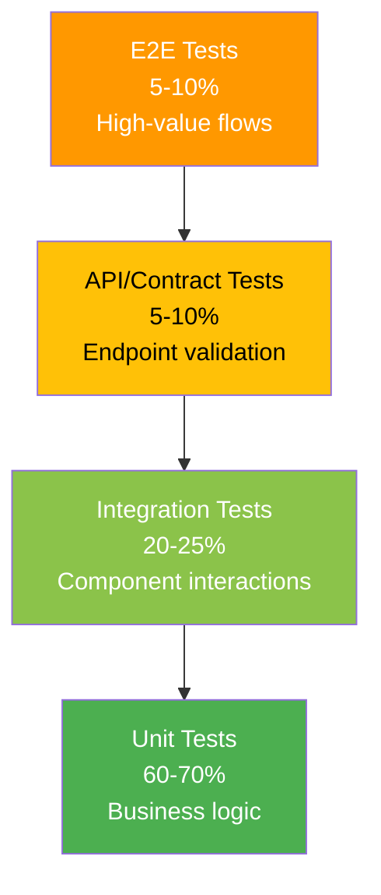

# Test Strategy Template

Standard format for defining the overall testing approach.

---

## Strategy Structure

```markdown
### Test Level: {Level Name}

| Field | Value |
|-------|-------|
| **Scope** | {what this level tests} |
| **Tools** | {testing frameworks/tools} |
| **Responsibility** | {who writes/maintains these tests} |
| **Automation** | Yes / Partial / Manual |
| **Coverage Target** | {percentage or metric} |
| **Runs In** | {CI stage / manual trigger / schedule} |

**Includes**:
- {type of test 1}
- {type of test 2}

**Excludes**:
- {what this level does NOT test}
```

---

## Test Pyramid Diagram



---

## Tool Selection Table

```markdown
| Purpose | Tool | Version | License | Justification |
|---------|------|---------|---------|---------------|
| Unit testing | {tool} | {ver} | {license} | {why chosen} |
| Integration testing | {tool} | {ver} | {license} | {why chosen} |
| API testing | {tool} | {ver} | {license} | {why chosen} |
| E2E testing | {tool} | {ver} | {license} | {why chosen} |
| Mocking/stubbing | {tool} | {ver} | {license} | {why chosen} |
| Code coverage | {tool} | {ver} | {license} | {why chosen} |
| Performance testing | {tool} | {ver} | {license} | {why chosen} |
| Security testing | {tool} | {ver} | {license} | {why chosen} |
```

---

## Coverage Target Table

```markdown
| Metric | Target | Measurement Tool | Enforcement |
|--------|--------|-----------------|-------------|
| Line coverage |  | {tool} | CI gate / advisory |
| AC coverage |  | Manual tracking | Review gate |
```

---

## Rules

- Test strategy MUST cover all test pyramid levels
- Tool selection MUST be compatible with tech stack (from tech-stack-final.md)
- Coverage targets MUST be measurable and enforced
- NFR testing approach MUST address all quality attributes (QA-xxx)
- Test environment requirements MUST be specified
