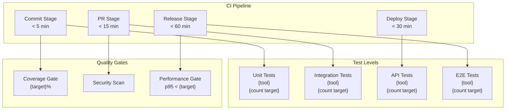

# Test Strategy Output Template

This template defines the expected structure for test strategy documents. Replace `{placeholders}` with actual content. Every decision item must carry a confidence marker.

---

```markdown
# Test Strategy — {Project Name}

**Version**: draft | v{N}
**Date**: {YYYY-MM-DD}
**Status**: Draft | Under Review | Approved
**Input Sources**: {list of input files used}

---

## 1. Test Approach Overview

{2-3 paragraphs describing:
- Testing philosophy (automation-first, shift-left, quality ownership)
- Test pyramid commitment (more unit tests, fewer E2E tests)
- Shift-left practices (testing early, testing often, developer-owned tests)
- Overall automation target and rationale}

**Key Decisions**:

| # | Decision | Choice | Rationale | Confidence |
|---|----------|--------|-----------|------------|
| 1 | Test framework | {tool} | {why} | {✅/🔶/❓} |
| 2 | Automation target |  line, {%} branch | {✅/🔶/❓} |
| **CI Stage** | {when it runs in pipeline} | {✅/🔶/❓} |
| **Responsibility** | {who writes these tests} | {✅/🔶/❓} |
| **Test Count Target** | {60-70% of total tests} | {✅/🔶/❓} |

**Includes**: {list what types of unit tests are written}
**Excludes**: {list what unit tests do NOT cover}

### 2.2 Integration Testing

| Field | Value | Confidence |
|-------|-------|------------|
| **Scope** | {what is tested at this level} | {✅/🔶/❓} |
| **Framework** | {tool + version} | {✅/🔶/❓} |
| **Dependencies** | {real vs mock — list each} | {✅/🔶/❓} |
| **Coverage Target** | {scenario coverage %} | {✅/🔶/❓} |
| **CI Stage** | {when it runs in pipeline} | {✅/🔶/❓} |
| **Responsibility** | {who writes these tests} | {✅/🔶/❓} |
| **Test Count Target** | {20-25% of total tests} | {✅/🔶/❓} |

**Includes**: {list what integration tests cover}
**Excludes**: {list what integration tests do NOT cover}

### 2.3 API Testing

| Field | Value | Confidence |
|-------|-------|------------|
| **Scope** | {what is tested at this level} | {✅/🔶/❓} |
| **Framework** | {tool + version} | {✅/🔶/❓} |
| **Spec Source** | {api-final.md or OpenAPI spec} | {✅/🔶/❓} |
| **Coverage Target** | {endpoint coverage %} | {✅/🔶/❓} |
| **CI Stage** | {when it runs in pipeline} | {✅/🔶/❓} |
| **Responsibility** | {who writes these tests} | {✅/🔶/❓} |
| **Test Count Target** | {5-10% of total tests} | {✅/🔶/❓} |

**Includes**: {list what API tests cover}
**Excludes**: {list what API tests do NOT cover}

### 2.4 E2E Testing

| Field | Value | Confidence |
|-------|-------|------------|
| **Scope** | {critical user journeys only — list them} | {✅/🔶/❓} |
| **Framework** | {tool + version} | {✅/🔶/❓} |
| **Browser/Platform** | {which browsers/platforms} | {✅/🔶/❓} |
| **Coverage Target** | {N critical flows} | {✅/🔶/❓} |
| **CI Stage** | {when it runs in pipeline} | {✅/🔶/❓} |
| **Responsibility** | {who writes these tests} | {✅/🔶/❓} |
| **Test Count Target** | {5-10% of total tests} | {✅/🔶/❓} |
| **Max Suite Duration** | {target minutes} | {✅/🔶/❓} |

**Critical Flows**:
1. {flow description}
2. {flow description}
3. {flow description}

---

## 3. Test Architecture



---

## 4. Tool Selection

| # | Purpose | Tool | Version | License | Rationale | Confidence |
|---|---------|------|---------|---------|-----------|------------|
| 1 | {purpose} | {tool} | {ver} | {license} | {why selected} | {✅/🔶/❓} |
| 2 | {purpose} | {tool} | {ver} | {license} | {why selected} | {✅/🔶/❓} |
| ... | ... | ... | ... | ... | ... | ... |

---

## 5. Test Environment Strategy

| Environment | Purpose | Infrastructure | Data Approach | External Services | Confidence |
|-------------|---------|---------------|---------------|-------------------|------------|
| Local | {purpose} | {infra details} | {data approach} | {mock/real per service} | {✅/🔶/❓} |
| CI | {purpose} | {infra details} | {data approach} | {mock/real per service} | {✅/🔶/❓} |
| Staging | {purpose} | {infra details} | {data approach} | {mock/real per service} | {✅/🔶/❓} |
| Performance | {purpose} | {infra details} | {data approach} | {mock/real per service} | {✅/🔶/❓} |

---

## 6. NFR Testing Approach

| QA ID | Attribute | Test Type | Tool | Target Metric | Acceptance Criteria | Confidence |
|-------|-----------|-----------|------|---------------|---------------------|------------|
| QA-001 | {attr} | {type} | {tool} | {metric + number} | {pass/fail criteria} | {✅/🔶/❓} |
| QA-002 | {attr} | {type} | {tool} | {metric + number} | {pass/fail criteria} | {✅/🔶/❓} |
| ... | ... | ... | ... | ... | ... | ... |

---

## 7. Risk-Based Test Prioritization

| Risk ID | Risk Description | Severity | Test Priority | Test Approach | Coverage Level | Confidence |
|---------|-----------------|----------|--------------|---------------|----------------|------------|
| RISK-001 | {risk} | {H/M/L} | {P1/P2/P3} | {how to test} | {full/happy+error/happy-only} | {✅/🔶/❓} |
| RISK-002 | {risk} | {H/M/L} | {P1/P2/P3} | {how to test} | {full/happy+error/happy-only} | {✅/🔶/❓} |
| ... | ... | ... | ... | ... | ... | ... |

---

## 8. Coverage Targets

| # | Metric | Target | Tool | Enforcement | Ratchet | Confidence |
|---|--------|--------|------|-------------|---------|------------|
| 1 | Line coverage |  | {tool} | {CI gate / advisory} | {Yes/No} | {✅/🔶/❓} |
| 3 | Must Have AC coverage |  | {manual/tool} | {review gate} | — | {✅/🔶/❓} |
| 5 | Critical risk coverage | {%} | {manual/tool} | {review gate} | — | {✅/🔶/❓} |

**CI Pipeline Stage Map**:

| Stage | Tests Run | Gate Type | Max Duration |
|-------|-----------|-----------|-------------|
| Commit | {tests} | {hard/soft} | {minutes} |
| PR | {tests} | {hard/soft} | {minutes} |
| Deploy | {tests} | {hard/soft} | {minutes} |
| Release | {tests} | {hard/soft} | {minutes} |

---

## 9. Test Data Strategy

| Aspect | Approach | Tools | Details | Confidence |
|--------|----------|-------|---------|------------|
| Creation | {fixtures/factories/seeds} | {tool names} | {details} | {✅/🔶/❓} |
| Isolation | {per-test/per-suite/shared} | {mechanism} | {details} | {✅/🔶/❓} |
| Cleanup | {teardown/rollback/truncate} | {mechanism} | {details} | {✅/🔶/❓} |
| Sensitive data | {masking/synthetic/anonymized} | {tool names} | {details} | {✅/🔶/❓} |

---

## 10. Q&A Log

| # | Question | Context | Priority | Answer | Status |
|---|----------|---------|----------|--------|--------|
| 1 | {question} | {why it matters} | {HIGH/MED/LOW} | {answer or pending} | {OPEN/RESOLVED} |
| ... | ... | ... | ... | ... | ... |

---

## 11. Readiness Assessment

### Confidence Summary

| Level | Count | Items |
|-------|-------|-------|
| ✅ CONFIRMED | {N} | {list} |
| 🔶 ASSUMED | {N} | {list} |
| ❓ UNCLEAR | {N} | {list} |

### Verdict: {READY / PARTIALLY READY / NOT READY}

{Justification for verdict. Conditions to reach READY.}

---

## 12. Approval

| Role | Name | Decision | Date |
|------|------|----------|------|
| QA Lead | | Pending | |
| Technical Lead | | Pending | |
| Project Manager | | Pending | |
```
