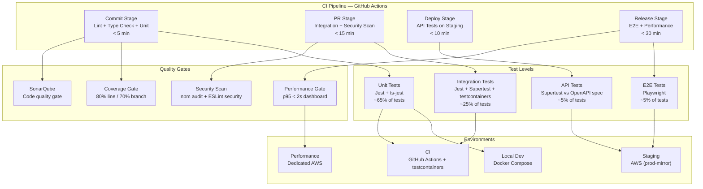

# Test Strategy — TaskFlow

**Version**: draft
**Date**: 2026-04-06
**Status**: Draft
**Input Sources**: tech-stack-final.md, architecture-final.md, userstories-final.md, scope-final.md, risk-register-final.md, api-final.md, database-final.md

---

## 1. Test Approach Overview

TaskFlow adopts an automation-first, shift-left testing strategy grounded in the test pyramid model. The team commits to writing more unit tests than any other type, with integration tests covering component boundaries, API tests validating contract compliance, and a small number of E2E tests guarding critical user journeys. Testing is a shared responsibility: developers own unit and integration tests, while QA engineers own API contract validation and E2E flows.

The shift-left approach means tests are written alongside production code, not after. Unit tests run on every commit, integration tests gate every PR, and the full suite runs before any release. Test failures block merges — there is no "fix it later" path for broken tests.

The overall automation target is 92%. The remaining 8% covers exploratory testing (manual investigation of new features and edge cases) and visual regression review (human judgment on UI appearance). All automated tests produce machine-readable reports for CI integration.

**Key Decisions**:

| # | Decision | Choice | Rationale | Confidence |
|---|----------|--------|-----------|------------|
| 1 | Test framework | Jest 29.x | Native TypeScript support via ts-jest, strong NestJS/React ecosystem, single framework for unit + integration | ✅ CONFIRMED |
| 2 | Automation target | 92% | All levels automated except exploratory and visual regression | 🔶 ASSUMED |
| 3 | Coverage enforcement | CI gate with ratchet | Prevents coverage regression, gradual improvement over time | 🔶 ASSUMED |
| 4 | E2E framework | Playwright 1.x | Cross-browser support, reliable selectors, TypeScript-native, fast execution | ✅ CONFIRMED |

---

## 2. Test Levels

### 2.1 Unit Testing

| Field | Value | Confidence |
|-------|-------|------------|
| **Scope** | NestJS services, utility functions, React components, hooks, state logic | ✅ CONFIRMED |
| **Framework** | Jest 29.x with ts-jest | ✅ CONFIRMED |
| **Mocking** | jest.mock for modules, jest-mock-extended for typed mocks, Prisma mock for DB layer | ✅ CONFIRMED |
| **Coverage Target** | 80% line, 70% branch | 🔶 ASSUMED |
| **CI Stage** | Commit stage (every push) | ✅ CONFIRMED |
| **Responsibility** | Developers (code author writes tests) | ✅ CONFIRMED |
| **Test Count Target** | ~65% of total tests | 🔶 ASSUMED |

**Includes**: NestJS service methods, utility/helper functions, data transformation logic, validation rules, React component rendering (React Testing Library), custom hooks, Redux/Zustand state logic, error handling paths.

**Excludes**: Database queries (integration level), API routing (API level), full-page workflows (E2E level), third-party library internals.

### 2.2 Integration Testing

| Field | Value | Confidence |
|-------|-------|------------|
| **Scope** | NestJS API routes with real PostgreSQL and Redis, service interactions, webhook pipeline | ✅ CONFIRMED |
| **Framework** | Jest 29.x + Supertest + testcontainers | ✅ CONFIRMED |
| **Dependencies** | Real: PostgreSQL (testcontainer), Redis (testcontainer). Mock: GitHub API, external webhooks | ✅ CONFIRMED |
| **Coverage Target** | 100% of critical service interactions | 🔶 ASSUMED |
| **CI Stage** | PR stage (on pull request) | ✅ CONFIRMED |
| **Responsibility** | Developers | ✅ CONFIRMED |
| **Test Count Target** | ~25% of total tests | 🔶 ASSUMED |

**Includes**: CRUD operations through NestJS controllers to PostgreSQL, cache read/write with Redis, webhook reception and processing pipeline, authentication middleware with JWT validation, WebSocket connection and message delivery, Prisma query behavior with real database.

**Excludes**: UI rendering, third-party API behavior (mocked), performance under load (performance tests).

### 2.3 API Testing

| Field | Value | Confidence |
|-------|-------|------------|
| **Scope** | All REST endpoints defined in api-final.md, contract compliance | ✅ CONFIRMED |
| **Framework** | Jest 29.x + Supertest against running NestJS server | ✅ CONFIRMED |
| **Spec Source** | api-final.md (OpenAPI 3.0 spec) | ✅ CONFIRMED |
| **Coverage Target** | 100% of endpoints, all status codes per endpoint | 🔶 ASSUMED |
| **CI Stage** | Deploy stage (after staging deployment) | 🔶 ASSUMED |
| **Responsibility** | QA engineer + developers | 🔶 ASSUMED |
| **Test Count Target** | ~5% of total tests | 🔶 ASSUMED |

**Includes**: Response schema validation against OpenAPI spec, HTTP status codes (200, 201, 400, 401, 403, 404, 422, 500), authentication enforcement (valid JWT, expired JWT, missing JWT), authorization checks (role-based access per endpoint), pagination parameters (page, limit, cursor), error response format consistency, rate limiting headers.

**Excludes**: Business logic (unit level), database state verification (integration level), UI-driven flows (E2E level).

### 2.4 E2E Testing

| Field | Value | Confidence |
|-------|-------|------------|
| **Scope** | 3 critical user journeys only | ✅ CONFIRMED |
| **Framework** | Playwright 1.x | ✅ CONFIRMED |
| **Browser/Platform** | Chromium (primary), Firefox (secondary) | 🔶 ASSUMED |
| **Coverage Target** | 3 critical flows, happy path + primary error path | 🔶 ASSUMED |
| **CI Stage** | Release stage (before production release) | ✅ CONFIRMED |
| **Responsibility** | QA engineer | ✅ CONFIRMED |
| **Test Count Target** | ~5% of total tests | 🔶 ASSUMED |
| **Max Suite Duration** | < 5 minutes | 🔶 ASSUMED |

**Critical Flows**:
1. **Login to Dashboard**: User authenticates via Auth0 -> redirected to dashboard -> sees project list -> selects project -> views board with columns and tasks
2. **Git Webhook to Board Update**: GitHub push event received -> webhook processed -> commit linked to task -> task status updated -> board reflects change in real time via WebSocket
3. **Alert Configuration**: User navigates to settings -> configures alert threshold -> triggers test condition -> receives notification -> acknowledges alert

---

## 3. Test Architecture

---

## 4. Tool Selection

| # | Purpose | Tool | Version | License | Rationale | Confidence |
|---|---------|------|---------|---------|-----------|------------|
| 1 | Unit + Integration framework | Jest | 29.x | MIT | Standard for TypeScript/NestJS/React, single framework reduces context switching | ✅ CONFIRMED |
| 2 | TypeScript compilation | ts-jest | 29.x | MIT | Seamless TypeScript support for Jest without separate build step | ✅ CONFIRMED |
| 3 | HTTP assertion | Supertest | 6.x | MIT | Fluent API for testing NestJS HTTP endpoints, works with Jest | ✅ CONFIRMED |
| 4 | E2E browser testing | Playwright | 1.x | Apache 2.0 | Cross-browser, TypeScript-native, reliable auto-wait, fast execution | ✅ CONFIRMED |
| 5 | React component testing | React Testing Library | 14.x | MIT | Tests user behavior not implementation, aligns with React best practices | ✅ CONFIRMED |
| 6 | Typed mocking | jest-mock-extended | 3.x | MIT | Type-safe mocks for TypeScript interfaces, reduces mock maintenance | 🔶 ASSUMED |
| 7 | Container management | testcontainers | 10.x | MIT | Ephemeral PostgreSQL + Redis containers for integration tests, CI-compatible | ✅ CONFIRMED |
| 8 | Code coverage | Istanbul (c8) | — | BSD | Industry standard for JS/TS coverage, Jest built-in integration | ✅ CONFIRMED |
| 9 | Performance testing | k6 | 0.50+ | AGPL-3.0 | Scriptable in JS, CI-friendly CLI output, cloud option for distributed tests | 🔶 ASSUMED |
| 10 | Security DAST | OWASP ZAP | 2.x | Apache 2.0 | Open-source, automated scanning, CI integration via Docker, OWASP standard | 🔶 ASSUMED |
| 11 | Security SAST | ESLint security plugin | 2.x | MIT | Catches common security issues in CI, zero additional tooling | ✅ CONFIRMED |
| 12 | Static analysis | SonarQube (Community) | 10.x | LGPL | Code quality gate, tech debt tracking, duplications, complexity metrics | 🔶 ASSUMED |

---

## 5. Test Environment Strategy

| Environment | Purpose | Infrastructure | Data Approach | External Services | Confidence |
|-------------|---------|---------------|---------------|-------------------|------------|
| Local | Fast developer feedback, TDD cycle | Docker Compose: PostgreSQL 15 + Redis 7, Node.js 20 | `.env.test`, Prisma seed scripts, in-memory for unit tests | Mocked: GitHub API (nock), Auth0 (JWT stub), email (mock) | ✅ CONFIRMED |
| CI | Automated verification on every push/PR | GitHub Actions runners, testcontainers for PostgreSQL + Redis, ephemeral | Fresh database per run, Prisma migrations + seed, parallel test shards (3x) | Mocked: all external APIs, Auth0 (JWT stub) | ✅ CONFIRMED |
| Staging | Production-like validation, manual QA | AWS: ECS (same as prod), RDS PostgreSQL, ElastiCache Redis | Seeded test data (50 projects, 500 tasks), reset weekly | Real: Auth0 dev tenant, GitHub sandbox app. Mock: payment (if any) | 🔶 ASSUMED |
| Performance | Dedicated load/stress testing | AWS: ECS (production-scale instances), RDS (same class as prod), ElastiCache | Production-representative volume (1000 projects, 50K tasks), synthetic users | Mocked: GitHub API (controlled response time), Auth0 (stub) | 🔶 ASSUMED |

---

## 6. NFR Testing Approach

| QA ID | Attribute | Test Type | Tool | Target Metric | Acceptance Criteria | Confidence |
|-------|-----------|-----------|------|---------------|---------------------|------------|
| QA-001 | Performance | Load test | k6 | p95 response time for dashboard load | p95 < 2s with 50 concurrent users | 🔶 ASSUMED |
| QA-001 | Performance | Stress test | k6 | Breaking point | System degrades gracefully beyond 200 concurrent users, no data loss | 🔶 ASSUMED |
| QA-002 | Availability | Health check + failover | Custom script + AWS | Uptime percentage | 99.5% uptime over 30 days, health endpoint < 200ms | 🔶 ASSUMED |
| QA-002 | Availability | Graceful shutdown | Jest integration test | Zero dropped requests | In-flight requests complete during shutdown, new requests rejected with 503 | ✅ CONFIRMED |
| QA-003 | Scalability | Horizontal scale test | k6 + AWS auto-scaling | Throughput scales linearly | 2x instances = ~1.8x throughput (90% efficiency) | 🔶 ASSUMED |
| QA-003 | Scalability | Connection pool test | k6 | DB connection saturation | No connection errors at 50 teams x 20 users | 🔶 ASSUMED |
| QA-004 | Security | DAST scan | OWASP ZAP | OWASP Top 10 | Zero high/critical findings | 🔶 ASSUMED |
| QA-004 | Security | Dependency scan | npm audit + Snyk | Known CVEs | Zero high/critical CVEs in production dependencies | ✅ CONFIRMED |
| QA-004 | Security | Auth testing | Jest + Supertest | JWT + RBAC enforcement | All endpoints enforce auth, role checks pass/fail correctly | ✅ CONFIRMED |
| QA-005 | Usability | Manual exploratory testing | — (manual) | Heuristic evaluation | No critical usability issues found by 2 independent testers | ❓ UNCLEAR |
| QA-005 | Usability | Visual regression | Playwright screenshots | Pixel diff | < 0.1% pixel difference from baseline [FUTURE — not for MVP] | ❓ UNCLEAR |
| QA-006 | Maintainability | Static analysis | SonarQube | Code quality gate | Zero critical issues, tech debt ratio < 5%, no duplications > 10 lines | 🔶 ASSUMED |
| QA-006 | Maintainability | Lint enforcement | ESLint strict + TypeScript strict | Zero lint errors | All rules pass in CI, no eslint-disable without justification | ✅ CONFIRMED |

---

## 7. Risk-Based Test Prioritization

| Risk ID | Risk Description | Severity | Test Priority | Test Approach | Coverage Level | Confidence |
|---------|-----------------|----------|--------------|---------------|----------------|------------|
| RISK-001 | Webhook delivery unreliability — GitHub webhooks may be dropped, delayed, or delivered out of order | High | P1 | Integration test with retry simulation: test idempotent processing, out-of-order delivery, duplicate webhook, webhook signature validation | Full (happy + error + edge) | ✅ CONFIRMED |
| RISK-002 | Real-time sync failure — WebSocket connections drop, board state becomes stale | High | P1 | E2E test: disconnect/reconnect, verify state reconciliation. Integration test: WebSocket message ordering, connection pool limits | Full (happy + error + edge) | 🔶 ASSUMED |
| RISK-003 | Auth token expiry during session — user loses access mid-workflow | Medium | P2 | Integration test: expired JWT handling, token refresh flow, concurrent requests with expiring token | Happy + error paths | 🔶 ASSUMED |
| RISK-004 | Database migration failure — Prisma migration fails in production, data corruption | High | P1 | CI test: run migrations up + down on production-like schema, verify data integrity assertions, backup/restore test | Full (happy + error + edge) | 🔶 ASSUMED |

---

## 8. Coverage Targets

| # | Metric | Target | Tool | Enforcement | Ratchet | Confidence |
|---|--------|--------|------|-------------|---------|------------|
| 1 | Line coverage | 80% | Istanbul (Jest built-in) | CI gate — PR fails below threshold | Yes — new code must not decrease | 🔶 ASSUMED |
| 2 | Branch coverage | 70% | Istanbul (Jest built-in) | CI gate — PR fails below threshold | Yes — new code must not decrease | 🔶 ASSUMED |
| 3 | Must Have AC coverage | 100% | Manual tracking in test plan | Review gate — release blocked | — | 🔶 ASSUMED |
| 4 | Should Have AC coverage | 80% | Manual tracking in test plan | Review gate — advisory | — | 🔶 ASSUMED |
| 5 | Critical/High risk coverage | 90% | Manual tracking in risk matrix | Review gate — release blocked | — | 🔶 ASSUMED |

**CI Pipeline Stage Map**:

| Stage | Tests Run | Gate Type | Max Duration |
|-------|-----------|-----------|-------------|
| Commit | Unit tests, lint, type check, coverage check | Hard (blocks merge) | 5 min |
| PR | Integration tests, security scan (npm audit + ESLint security), SonarQube | Hard (blocks merge) | 15 min |
| Deploy (staging) | API contract tests against staging | Hard (blocks promotion) | 10 min |
| Release | E2E suite (Playwright), performance baseline (k6), OWASP ZAP scan | Hard (blocks release) | 30 min |

---

## 9. Test Data Strategy

| Aspect | Approach | Tools | Details | Confidence |
|--------|----------|-------|---------|------------|
| Creation | Prisma seed scripts + factory functions | Prisma, faker.js | Seed scripts create baseline data (users, projects, tasks). Factory functions generate per-test data with randomized attributes via faker.js. Shared fixtures for common entities (admin user, default project). | ✅ CONFIRMED |
| Isolation | Transaction rollback per integration test | Jest + Prisma | Each integration test runs inside a database transaction that rolls back on teardown. No test depends on another test's data. E2E tests use dedicated seed data per suite. | ✅ CONFIRMED |
| Cleanup | Automatic rollback + post-suite truncate | Jest afterEach/afterAll hooks | Integration: transaction rollback in afterEach. E2E: truncate all tables in afterAll, re-seed. CI: ephemeral containers destroyed after pipeline. | ✅ CONFIRMED |
| Sensitive data | Synthetic generation only — no production PII | faker.js | All test data is synthetically generated. No production data copies. Email addresses use @example.com domain. Passwords are randomly generated. API keys use test-prefixed tokens. | ✅ CONFIRMED |

---

## 10. Q&A Log

| # | Question | Context | Priority | Answer | Status |
|---|----------|---------|----------|--------|--------|
| 1 | Should we adopt snapshot testing for React components? | Snapshot tests catch unintended UI changes but can be noisy and lead to blind updates. Team has not used them before. | MED | 🔶 ASSUMED: Start without snapshots. Use React Testing Library for behavior testing. Re-evaluate after 2 sprints if UI regressions become frequent. | OPEN |
| 2 | Should we implement consumer-driven contract testing (Pact)? | TaskFlow currently has no external API consumers, but may add mobile app in future. Contract testing adds setup cost. | LOW | 🔶 ASSUMED: Not needed for MVP. Add when first external consumer is identified. API tests against OpenAPI spec provide sufficient contract validation for now. | OPEN |
| 3 | What is the budget for a dedicated performance test environment? | Performance environment mirrors production, which has cost implications. Running only for performance test windows reduces cost. | HIGH | ❓ UNCLEAR: Need stakeholder input on budget. Proposed approach: spin up performance environment on-demand (pre-release only), estimated 2-4 hours per release cycle. Approximate cost TBD. | OPEN |

---

## 11. Readiness Assessment

### Confidence Summary

| Level | Count | Items |
|-------|-------|-------|
| ✅ CONFIRMED | 14 | Test framework (Jest), E2E framework (Playwright), unit test scope, integration test scope, API test scope, integration dependencies (real vs mock), CI stage assignments, Supertest, React Testing Library, testcontainers, Istanbul, ESLint security, test data strategy (all 4 aspects), graceful shutdown test |
| 🔶 ASSUMED | 12 | Automation target (92%), coverage enforcement (CI gate + ratchet), line coverage (80%), branch coverage (70%), test count distribution, API test CI stage, E2E browsers, max E2E duration, k6 for performance, OWASP ZAP, SonarQube, staging/performance environment details |
| ❓ UNCLEAR | 2 | Usability testing approach, performance environment budget |

### Verdict: PARTIALLY READY

The test strategy has strong foundations — the core test pyramid, tool selections, and test data approach are confirmed by the tech stack and architecture inputs. Key assumptions around coverage targets and NFR thresholds need stakeholder validation. Two items remain unclear: the usability testing approach (manual vs automated visual regression) and the performance environment budget. These should be resolved before finalizing.

**To reach READY**:
1. Confirm coverage targets (80% line / 70% branch) with tech lead
2. Resolve performance environment budget with stakeholders
3. Decide on usability testing approach (exploratory only vs visual regression tooling)
4. Validate NFR acceptance criteria thresholds with product owner

---

## 12. Approval

| Role | Name | Decision | Date |
|------|------|----------|------|
| QA Lead | | Pending | |
| Technical Lead | | Pending | |
| Project Manager | | Pending | |
